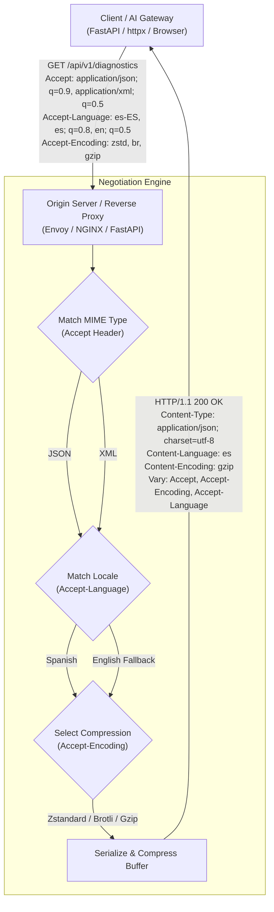
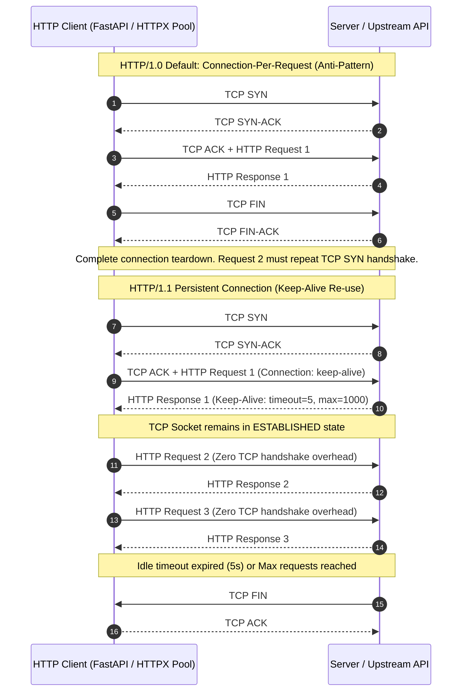
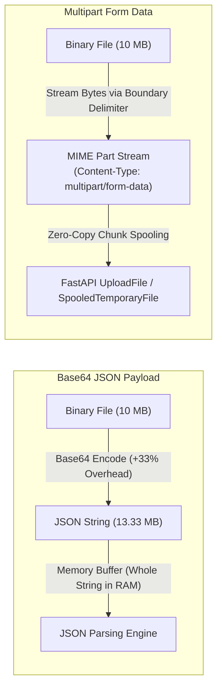
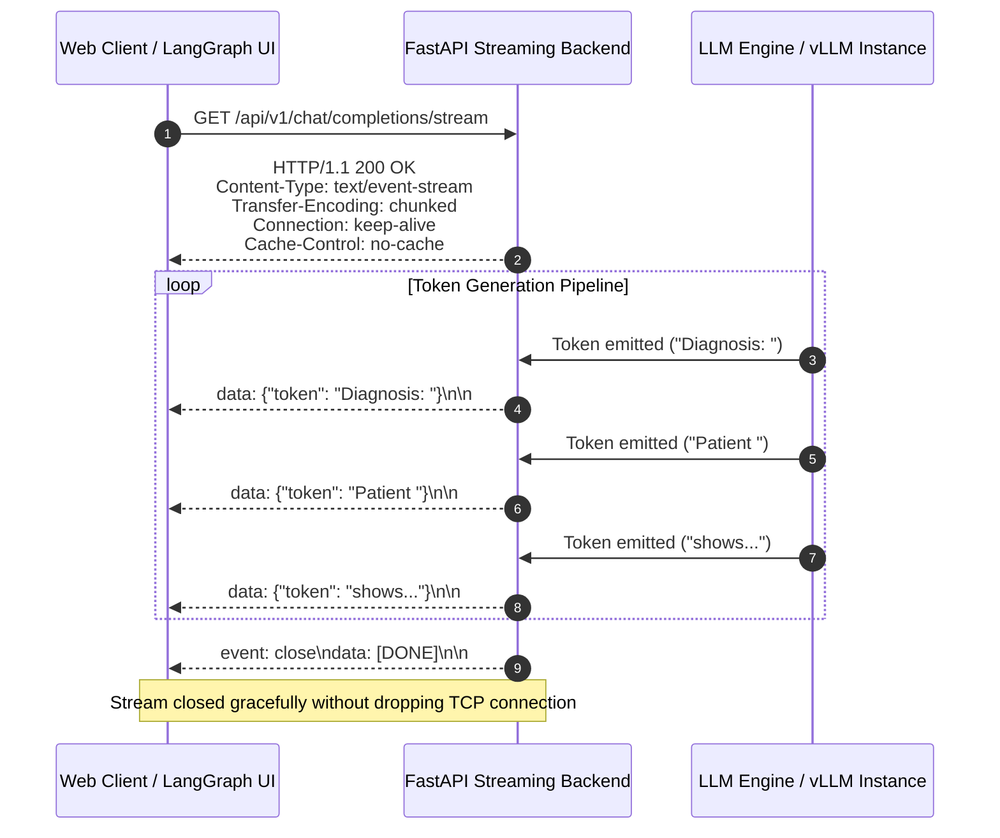
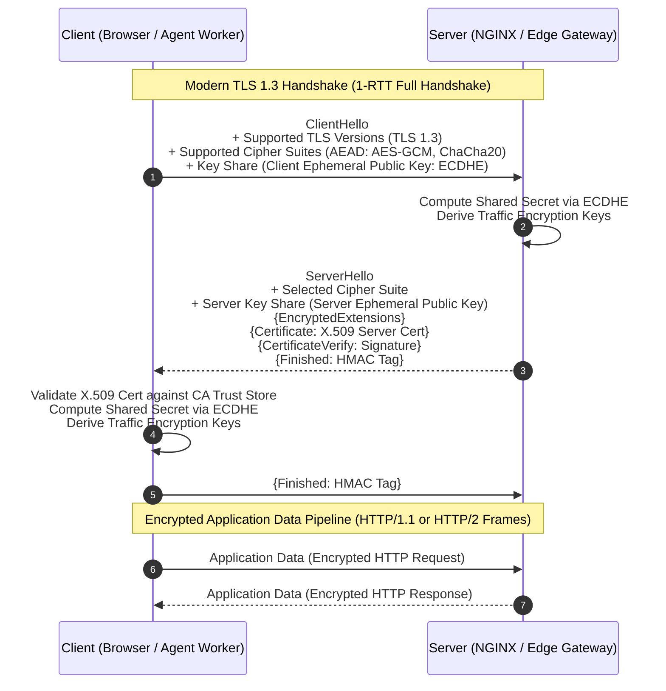

# Production Backend Architecture: Content Negotiation, Connection Lifecycles, Payload Streaming & Transport Security

---

### Multi-Dimensional Content Negotiation & Wire Compression

Content negotiation is the HTTP standard mechanism ([RFC 9110 §12](https://www.rfc-editor.org/rfc/rfc9110.html#section-12)) allowing clients and servers to dynamically agree on data representation, encoding, and localization over the same URI resource.



#### 1. The Three Negotiation Dimensions
1. **Media Type (MIME) Negotiation (`Accept` $\rightarrow$ `Content-Type`)**:
   - The client advertises acceptable media formats with quality weights (e.g., `Accept: application/json, text/xml;q=0.8`).
   - Allows unified endpoints to serve structured JSON to APIs, Protobuf/MessagePack to internal RPC workers, and XML to legacy healthcare systems (e.g., HL7/FHIR XML payloads).
2. **Language / Localization Negotiation (`Accept-Language` $\rightarrow$ `Content-Language`)**:
   - Client specifies language tags with fallback preferences (e.g., `Accept-Language: es-MX, es;q=0.9, en;q=0.7`).
   - Server resolves localized error codes, clinical response templates, or LLM system prompt defaults.
3. **Encoding & Compression Negotiation (`Accept-Encoding` $\rightarrow$ `Content-Encoding`)**:
   - Client advertises decompression algorithms: `gzip`, `deflate`, `br` (Brotli), `zstd` (Zstandard).
   - Server applies wire compression to serialize payload buffers, significantly reducing egress bandwidth and network transfer time.

#### 2. Wire Compression Trade-offs & Production Metrics
- **Payload Compression Benchmark (Transcript Test Case)**:
  $$\text{Uncompressed Payload: } 26\,\text{MB} \xrightarrow{\text{gzip (Level 6)}} \text{Compressed Payload: } 3.8\,\text{MB} \quad (\approx 85.4\% \text{ wire reduction})$$
- **Compression Algorithm Matrix**:

| Algorithm | Compression Ratio | Compression Speed | Decompression Speed | Optimal Backend AI Use Case |
| :--- | :--- | :--- | :--- | :--- |
| **Gzip (DEFLATE)** | Moderate ($\approx 70\text{--}85\%$) | Moderate | High | Universal API standard, legacy clients, cross-CDN edge caches |
| **Brotli (`br`)** | High ($\approx 80\text{--}90\%$) | Slow (levels 9–11) | Very High | Static assets, immutable vector metadata dumps, OpenAPI schemas |
| **Zstandard (`zstd`)** | High ($\approx 80\text{--}88\%$) | Ultra-Fast | Ultra-Fast | Microservice-to-microservice RPC, Celery payloads, RAG chunk transfers |

> [!IMPORTANT]
> **The `Vary` Header Mandate**: Whenever a response varies based on client request headers, the server **must** emit `Vary: Accept, Accept-Encoding, Accept-Language`. Without `Vary`, intermediate CDNs or shared reverse proxy caches (Redis/Cloudflare) will serve a cached Gzip or Spanish JSON response to subsequent clients requesting uncompressed XML or English data.

---

### TCP Socket Lifecycles & HTTP Connection Pooling

Establishing a raw TCP connection requires an explicit 3-Way Handshake ($1.5 \times \text{RTT}$) followed by TCP Slow-Start (`cwnd` ramp-up) and TLS handshakes.



#### 1. HTTP/1.0 vs HTTP/1.1 Connection Mechanics
- **HTTP/1.0 Ephemeral Connections**:
  - Default behavior: Closed immediately after response transmission (`Connection: close`).
  - Severe performance bottlenecks: Port exhaustion (`TIME_WAIT` socket buildup on Linux kernels), high latency from continuous handshakes, and resetting TCP Congestion Window (`cwnd`) to initial values on every request.
- **HTTP/1.1 Persistent Connections (`keep-alive`)**:
  - Default behavior: Sockets remain open across request-response cycles.
  - Connection control headers:
    ```http
    Connection: keep-alive
    Keep-Alive: timeout=5, max=1000
    ```
    - `timeout=5`: Server keeps the idle socket open for 5 seconds waiting for subsequent requests before emitting `FIN`.
    - `max=1000`: Maximum sequential requests allowed over a single persistent TCP socket before graceful closure.

#### 2. Connection Pooling Architecture for AI Backends
In FastAPI/Python microservices interacting with Vector Databases (Qdrant, Milvus), Redis, or LLM inference engines (vLLM, Ollama), reusing persistent connections via `httpx.AsyncClient(limits=httpx.Limits(max_keepalive_connections=50, max_connections=200))` is critical to prevent TCP socket starvation under concurrent RAG evaluation workloads.

---

### High-Throughput Ingestion: Multipart Form Data vs Base64 JSON

When ingesting large unstructured payloads (clinical audio recordings, high-resolution pathology images, PDF documents for RAG indexing), selecting the correct wire protocol prevents memory exhaustion and network bloat.



#### 1. Multipart MIME Parsing Mechanics
A `multipart/form-data` request sends multiple distinct fields (text metadata and binary file chunks) separated by an arbitrary boundary token defined in the `Content-Type` header:

```http
POST /api/v1/documents/upload HTTP/1.1
Host: api.neural-ai.internal
Content-Type: multipart/form-data; boundary=---------------------------974767299852498929531610575
Content-Length: 10485920

-----------------------------974767299852498929531610575
Content-Disposition: form-data; name="document_type"

clinical_trial_report
-----------------------------974767299852498929531610575
Content-Disposition: form-data; name="file"; filename="patient_mri_scan.dcm"
Content-Type: application/dicom

<RAW BINARY BYTE STREAM (No Base64 Inflation)>
-----------------------------974767299852498929531610575--
```

#### 2. Architecture Comparison: Multipart Streaming vs Base64 JSON

| Metric / Dimension | `multipart/form-data` | Base64 in JSON Body |
| :--- | :--- | :--- |
| **Payload Wire Size** | Raw binary ($1\times$ size) + negligible boundary overhead | **$1.33\times$ size (+33.3% byte expansion)** due to 6-bit encoding |
| **Memory Allocation** | Streamable chunk-by-chunk directly to disk or S3/MinIO | Entire Base64 string buffered in RAM before JSON parsing |
| **CPU Deserialization** | Zero conversion; direct byte copying | CPU-bound decoding passes (`base64.b64decode`) |
| **Streaming Capability** | Yes (FastAPI `UploadFile` / async byte generators) | Difficult; requires custom streaming JSON parser (e.g. `ijson`) |

---

### Real-Time Streaming: Chunked Transfer Encoding & Server-Sent Events (SSE)

For generative AI applications, agent workflows, and large report exports, generating the full payload before responding introduces unacceptable Time-To-First-Byte (TTFB) latency. HTTP provides persistent unidirection streaming via Chunked Transfer Encoding and Server-Sent Events.



#### 1. Wire Headers for HTTP Event Streaming
- `Content-Type: text/event-stream`: Instructs client parsers (e.g., `EventSource` in browsers or `httpx` async iterators) to process data as discrete SSE frames.
- `Transfer-Encoding: chunked`: In HTTP/1.1, omits the `Content-Length` header (which cannot be known in advance) and transfers data as a series of length-prefixed hex chunks.
- `Cache-Control: no-cache, no-transform`: Prevents intermediate proxies, reverse proxies (NGINX buffering `proxy_buffering off`), and browsers from buffering chunks.

#### 2. SSE Frame Protocol Structure
```http
event: node_execution_update
id: step-04
data: {"node": "retrieve_vector_context", "status": "completed", "latency_ms": 42}

data: {"token": "The", "logprob": -0.012}

event: done
data: [DONE]

```
*(Note: Each SSE message block is terminated by double newline characters `\n\n`)*.

---

### Transport Security: Cryptographic Handshakes (SSL $\rightarrow$ TLS 1.3)

HTTPS is the cryptographic encapsulation of HTTP over Transport Layer Security (TLS). The legacy SSL protocols (SSL 2.0, SSL 3.0) are completely broken due to structural cryptographic flaws (POODLE, BEAST, padding oracle attacks). Production systems strictly mandate **TLS 1.2** and **TLS 1.3**.



#### 1. Core Cryptographic Pillars of TLS
1. **Authentication (PKI & X.509 Certificates)**:
   - Server presents an X.509 certificate signed by a trusted Certificate Authority (CA).
   - Prevents Man-in-the-Middle (MitM) attacks by verifying server identity using public-key cryptography (RSA or ECDSA signatures).
2. **Confidentiality (Symmetric Encryption)**:
   - Ephemeral key exchange (ECDHE - Elliptic Curve Diffie-Hellman Ephemeral) establishes symmetric session keys.
   - Bulk wire data is encrypted using high-throughput Authenticated Encryption with Associated Data (AEAD) ciphers (e.g., `AES-256-GCM` or `ChaCha20-Poly1305`).
3. **Integrity & Authenticity (AEAD Auth Tags / HMAC)**:
   - Every encrypted record includes an authentication tag ensuring payloads cannot be tampered with or replayed in transit.
4. **Forward Secrecy (PFS)**:
   - Because ephemeral keys (`ECDHE`) are discarded after session termination, compromising the server's long-term private key in the future cannot decrypt past recorded network traffic.

#### 2. TLS 1.2 vs TLS 1.3 Performance Comparison

| Metric / Parameter | TLS 1.2 | TLS 1.3 |
| :--- | :--- | :--- |
| **Initial Handshake Latency** | **2-RTT** (ClientHello $\rightarrow$ ServerHello $\rightarrow$ KeyExchange $\rightarrow$ Finished) | **1-RTT** (Key shares bundled in ClientHello) |
| **Session Resumption** | 1-RTT (Session Tickets / Session IDs) | **0-RTT (Early Data)** via Pre-Shared Keys (PSK) |
| **Vulnerable Primitives** | Retained legacy RSA key exchange, CBC ciphers, RC4, MD5/SHA-1 | **Eliminated all static/insecure ciphers**; strictly mandates AEAD + ECDHE |
| **Handshake Encryption** | Plaintext certificate transmission (identifiable SNI/cert) | **Certificate and metadata encrypted** immediately after ServerHello |

---

### Production Implementation Reference: FastAPI Streaming & Content Negotiation

```python
"""
Production-grade FastAPI implementation demonstrating:
1. Content negotiation (JSON vs Event Stream).
2. SSE streaming for LLM inference tokens.
3. Keep-alive persistent connection management.
"""

import asyncio
from typing import AsyncGenerator
from fastapi import FastAPI, Request, status
from fastapi.responses import JSONResponse, StreamingResponse

app = FastAPI(title="AI Diagnostic Inference Gateway")


async def generate_diagnostic_stream(prompt: str) -> AsyncGenerator[str, None]:
    """Simulates token-by-token generation from an LLM inference engine."""
    tokens = ["Diagnostic", " Analysis:", " Patient", " exhibits", " normal", " vital", " parameters."]
    for token in tokens:
        await asyncio.sleep(0.05)  # Simulate token generation latency
        # SSE standard format: data: <payload>\n\n
        yield f"data: {{\"token\": \"{token}\"}}\n\n"
    
    # Emit stream completion event
    yield "event: close\ndata: [DONE]\n\n"


@app.get("/api/v1/diagnostics/stream")
async def stream_diagnostics(request: Request, prompt: str = "run_eval"):
    accept_header = request.headers.get("accept", "")
    
    # 1. Content Negotiation: Check if client accepts text/event-stream
    if "text/event-stream" in accept_header:
        return StreamingResponse(
            generate_diagnostic_stream(prompt),
            media_type="text/event-stream",
            headers={
                "Cache-Control": "no-cache, no-transform",
                "Connection": "keep-alive",
                "X-Accel-Buffering": "no",  # Disable NGINX buffering
            },
        )
    
    # Fallback to standard atomic JSON response
    return JSONResponse(
        content={"result": "Diagnostic Analysis: Patient exhibits normal vital parameters."},
        headers={"Vary": "Accept, Accept-Encoding"},
        status_code=status.HTTP_200_OK,
    )
```

---

### Key Backend Engineering Takeaways & Cheat Sheet

1. **Content Negotiation**: Always set `Vary: Accept, Accept-Encoding, Accept-Language` on dynamically negotiated responses to avoid poisoned reverse-proxy caches.
2. **Wire Compression**: Leverage `gzip` or `zstd` on JSON responses over $\approx 1\,\text{KB}$. Benchmark showed an $85.4\%$ reduction from $26\,\text{MB} \rightarrow 3.8\,\text{MB}$, saving massive egress costs and client TTFB.
3. **Keep-Alive**: Persistent connections are default in HTTP/1.1. Maintain upstream connection pools in HTTP clients (`httpx`, `aiohttp`) to eliminate the 3-Way TCP handshake penalty on high-frequency API calls.
4. **Multipart vs Base64**: Never serialize large binary assets inside JSON payloads (which adds a $33\%$ Base64 byte overhead). Use `multipart/form-data` with streaming boundaries.
5. **SSE Streaming**: Use `Content-Type: text/event-stream` with chunked transfer encoding for LLM generation and Agent trace visualization.
6. **TLS Architecture**: Mandate TLS 1.3 at API gateways to cut handshake latency from 2-RTT to 1-RTT while securing forward secrecy via ephemeral ECDHE.
