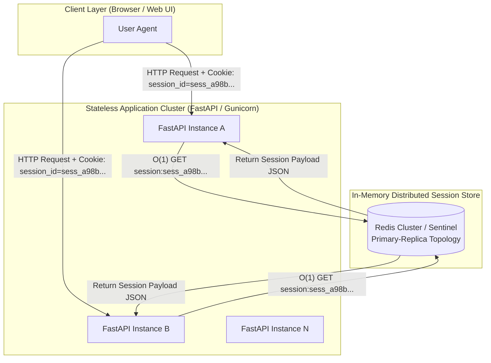
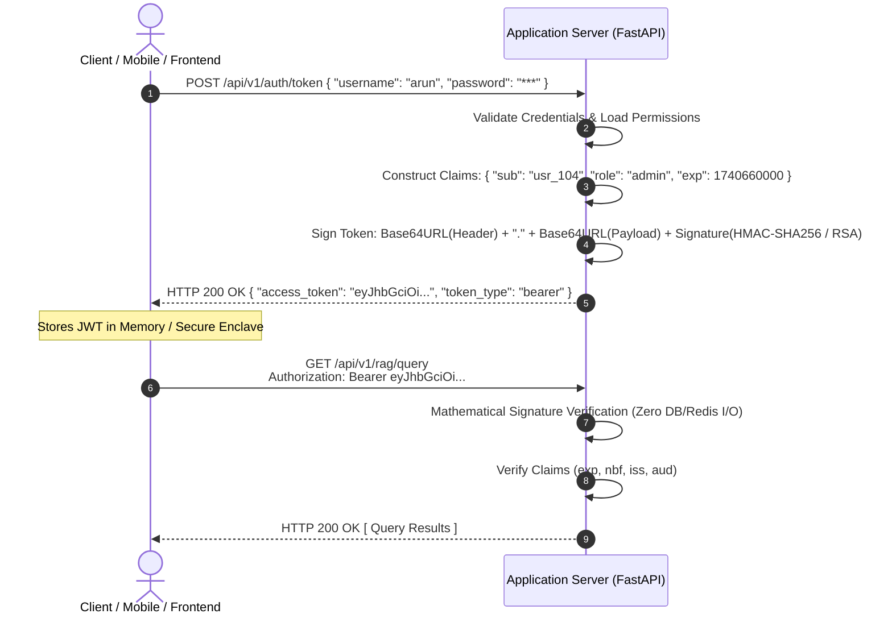
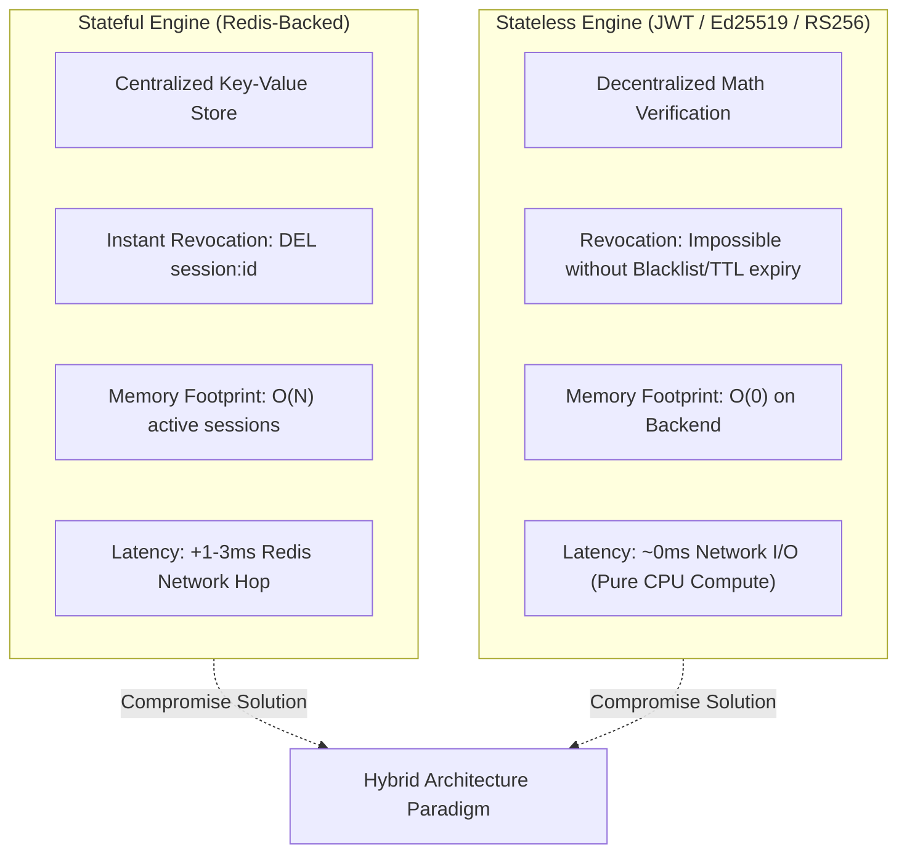
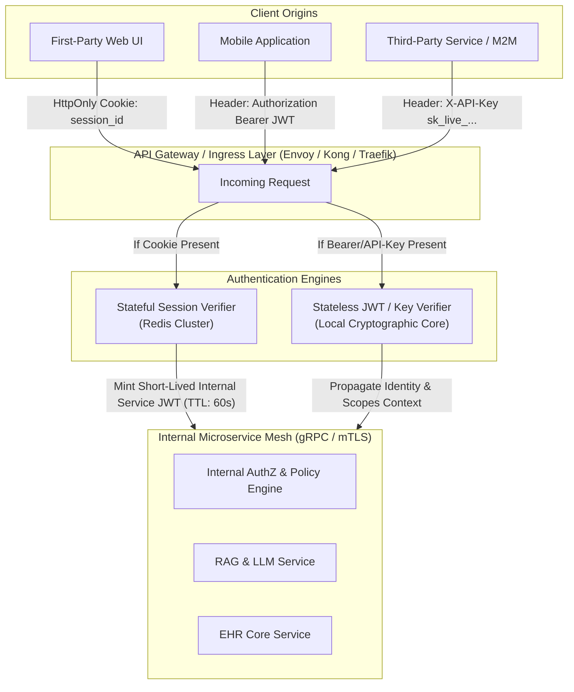
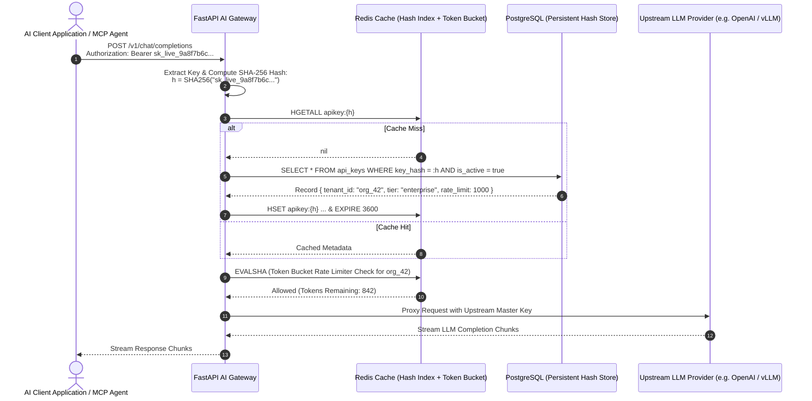
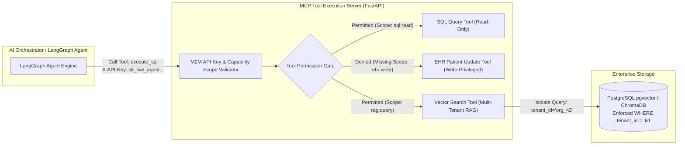

# 08. Authentication and Authorization for Backend Engineers — Part 3

---

### Automated Token Transport & Cookie Mechanics (`Set-Cookie` Directives & Browser Contracts)

In modern web architectures, transport automation eliminates the need for client-side application code to manually store, retrieve, and append identity credentials on every outbound HTTP request.

```mermaid
sequenceDiagram
    autonumber
    actor Browser as Browser Client
    participant Server as Backend Server (FastAPI)
    participant Redis as Session Cache (Redis)

    Browser->>Server: POST /api/v1/auth/login { "email": "arun@ai.internal", "password": "***" }
    Server->>Server: Verify Password Hash (Argon2id)
    Server->>Redis: SETEX session:sess_9f8a7c... 86400 {"user_id": 104, "role": "ai_admin"}
    Server-->>Browser: HTTP 200 OK<br/>Set-Cookie: session_id=sess_9f8a7c...; HttpOnly; Secure; SameSite=Lax; Path=/; Max-Age=86400

    Note over Browser: Browser automatically persists cookie in isolated, encrypted cookie jar

    Browser->>Server: GET /api/v1/models/deployments<br/>Cookie: session_id=sess_9f8a7c...
    Server->>Redis: GET session:sess_9f8a7c...
    Redis-->>Server: {"user_id": 104, "role": "ai_admin"}
    Server-->>Browser: HTTP 200 OK [ Model Deployment Metadata ]
```

#### The `Set-Cookie` Response Header Directives

When the server authenticates a client, it emits a `Set-Cookie` response header containing policy directives that instruct the browser's networking engine on how to handle the token lifecycle:

$$\text{Set-Cookie: } \langle\text{name}\rangle=\langle\text{value}\rangle\ [;\ \text{Expires}=\langle\text{date}\rangle]\ [;\ \text{Max-Age}=\langle\text{seconds}\rangle]\ [;\ \text{Domain}=\langle\text{domain}\rangle]\ [;\ \text{Path}=\langle\text{path}\rangle]\ [;\ \text{Secure}]\ [;\ \text{HttpOnly}]\ [;\ \text{SameSite}=\text{Strict}|\text{Lax}|\text{None}]$$

| Cookie Directive | Operational Mechanism | Threat Model Mitigated |
| :--- | :--- | :--- |
| **`HttpOnly`** | Instructs the browser engine to block all client-side JavaScript access (`document.cookie` returns empty for this token). | **Cross-Site Scripting (XSS) Token Exfiltration:** Even if an attacker executes arbitrary script in the DOM, the identity token cannot be stolen via JS. |
| **`Secure`** | Enforces that the cookie is transmitted **strictly over TLS-encrypted connections (`https://`)**, never over plaintext `http://` (except on `localhost`). | **Man-in-the-Middle (MitM) Eavesdropping:** Prevents token interception across unencrypted network segments. |
| **`SameSite=Lax`** | Allows cookies to be sent with top-level navigations (safe `GET` clicks from external sites), but withholds cookies on cross-origin `POST`, `PUT`, `DELETE` sub-requests. | **Cross-Site Request Forgery (CSRF):** Standard protection balance between usability and cross-origin attack mitigation. |
| **`SameSite=Strict`** | Completely restricts cookie transmission to same-site origins only. Outbound links from external domains will not transmit the cookie on the first request. | **CSRF & Cross-Site Leaks:** Maximum isolation for highly sensitive administration panels or financial/clinical consoles. |
| **`Max-Age` / `Expires`** | Explicit delta seconds or absolute timestamp governing browser-side expiration and cache eviction. | **Stale Token Accumulation:** Ensures deterministic client-side cleanup matching server-side session lifetimes. |

> [!IMPORTANT]
> Non-browser clients (such as mobile applications, terminal daemons, CLI tools, and machine-to-machine microservices) do **not** possess automatic cookie engines. They require explicit header management (`Authorization: Bearer <token>` or custom headers).

---

### Stateful Authentication Architecture (Redis In-Memory Session Management)

Stateful authentication delegates identity persistence to a centralized, high-throughput server-side store (typically **Redis** or a relational database). The client holds only an opaque reference token (the **Session ID**).



#### 1. End-to-End Operational Lifecycle:
1. **Authentication Ingress:** Client submits credentials (`email`, `password`) via `POST /login`.
2. **Verification & Hashing:** Server verifies the submitted password against the stored password hash (e.g., Argon2id).
3. **Session ID Generation:** Server generates a cryptographically secure random string with minimum 128 bits of entropy:
   ```python
   import secrets
   session_id = secrets.token_urlsafe(32)  # Generates 256 bits of CSPRNG entropy
   ```
4. **Serialization & Redis Storage:** Server bundles user metadata, role mappings, and device fingerprints into a JSON/MessagePack payload and writes to Redis with an explicit Time-To-Live (TTL):
   ```redis
   SETEX session:sess_8f3d1e4c... 86400 "{\"user_id\": 104, \"role\": \"physician\", \"mfa_passed\": true}"
   ```
5. **Cookie Attachment:** Server returns an `HTTP 200` with `Set-Cookie: session_id=sess_8f3d1e4c...; HttpOnly; Secure; SameSite=Lax`.
6. **Subsequent Lookup:** On every inbound request, the middleware intercepts the cookie, issues an $\mathcal{O}(1)$ `GET session:<session_id>` to Redis, and attaches the resolved `RequestContext` to the request pipeline.

#### 2. Technical Strengths & Operational Bottlenecks:

```mermaid
mindmap
  root((Stateful Sessions))
    Core Advantages
      Instant Revocation
        DEL session:id executes in O(1)
        Zero delay propagation
      Multi-Device Management
        User Session Set user_sessions:uid
        Kill all sessions on password reset
      Real-Time State Mutation
        Immediate role privilege escalation/demotion
        Dynamic feature-flag attachment
      Granular Auditing
        Active user tracking
        Concurrent session concurrency limits
    Operational Bottlenecks
      Memory Scaling
        O(N) RAM footprint
        1M active sessions * 1KB ~ 1GB RAM
      Network Overhead
        1-3ms network RTT hop per HTTP request
      Cluster Complexity
        Redis Sentinel failover
        Multi-region replication lag
```

---

### Stateless Authentication Architecture (Cryptographically Signed JWT Topology)

Stateless authentication eliminates the centralized session lookup. The identity token (**JSON Web Token / JWT**) is self-contained: it encapsulates the identity claims, permissions, and cryptographic signatures within its own encoded string.



#### 1. Mathematical Anatomy of a JSON Web Token:

$$\text{JWT} = \underbrace{\text{Base64URL}(\text{Header})}_{\text{Algorithm \& Token Type}} \;.\; \underbrace{\text{Base64URL}(\text{Payload})}_{\text{Claims: Subject, Role, Expiration}} \;.\; \underbrace{\text{Signature}}_{\text{Cryptographic Proof of Authenticity}}$$

$$\text{Signature} = \text{HMAC\_SHA256}\Big(\text{Base64URL}(H) + \text{"."} + \text{Base64URL}(P),\ \text{SecretKey}\Big)$$

$$\text{Or for Asymmetric Signatures (RS256):}$$

$$\text{Signature} = \text{Sign}_{\text{PrivateKey}}\Big(\text{SHA256}\big(\text{Base64URL}(H) + \text{"."} + \text{Base64URL}(P)\big)\Big)$$

#### 2. The Token Revocation Paradox:
Because signature validation is purely mathematical and decoupled from a persistent data store:
* **The Vulnerability:** Once a JWT is issued, it is **immutable and universally valid** across all backend nodes until its `exp` (expiration) timestamp elapses.
* **Failure Scenarios:** If an access token is compromised, a user is banned, permissions are downgraded, or a password is changed, the compromised token remains fully functional.
* **The Architectural Dilemma:** Attempting to implement immediate token revocation requires introducing a **Revocation Blacklist / Denylist in Redis** (`SETEX revoked:jwt_id <remaining_ttl> 1`), which **destroys the stateless property** and re-introduces the $\mathcal{O}(1)$ cache lookup bottleneck.

---

### Architectural Trade-Off Matrix: Stateful vs. Stateless Authentication



| Architectural Dimension | Stateful Sessions (Redis Store) | Stateless Tokens (Signed JWT) |
| :--- | :--- | :--- |
| **Verification Latency** | $\sim 1\text{--}3\text{ ms}$ (network RTT to Redis cache cluster) | $\sim 0.05\text{--}0.2\text{ ms}$ (pure local CPU cryptographic signature check) |
| **Server Storage Footprint** | $\mathcal{O}(N)$ linear memory growth with concurrent active sessions | $\mathcal{O}(1)$ constant memory (zero server-side session state) |
| **Instant Token Revocation** | **Trivial & Immediate:** `DEL session:<id>` purges access instantly | **Complex:** Requires short TTLs, token rotation, or a distributed Redis blacklist |
| **Horizontal Scalability** | Requires distributed Redis scaling, Sentinel/Cluster replication, connection pooling | **Infinite horizontal scaling:** Replicas verify tokens independently with pre-shared keys |
| **Network Payload Overhead** | Minimal ($\sim 32\text{--}64\text{ bytes}$ opaque cookie string) | High ($\sim 500\text{--}2000\text{ bytes}$ encoded JSON string in HTTP headers) |
| **Data Synchronization** | Single source of truth; user attribute updates reflect immediately | Stale claims risk; user role changes require waiting for token expiry or re-issuance |
| **Ideal Operational Domain** | First-party interactive Web Applications, monoliths, strict compliance portals | Mobile Apps, Microservice Inter-Process Communication (IPC), Public APIs |

---

### The Hybrid Architectural Paradigm in Distributed Systems

To balance the absolute security control of stateful sessions with the decoupled scalability of stateless tokens, modern enterprise architectures implement a **Hybrid Authentication Model**.



#### Architectural Strategy:
1. **Edge/Browser Clients:** Use **Stateful Sessions** via `HttpOnly`, `Secure`, `SameSite=Lax` cookies backed by Redis. This allows security operators to immediately kill sessions, enforce single-device logins, or terminate compromised web accounts.
2. **Internal Microservice Propagation:** The API Gateway converts the validated stateful session into a **short-lived, internally-signed JWT (e.g., TTL = 60 seconds)** that propagates identity, tenant boundaries, and scopes down through internal gRPC/HTTP microservices without hammering Redis on every microservice hop.
3. **Public APIs & Machine Clients:** Use **API Keys** with server-side caching and cryptographic hash indexing.

---

### Machine-to-Machine (M2M) Authentication & API Key Infrastructure

Machine-to-Machine (M2M) communication operates without interactive human interfaces (no UI login forms, no browser redirects, no MFA prompts). Autonomous background daemons, scheduled tasks, and AI agent pipelines require deterministic, programmatic credentials: **API Keys**.



#### 1. API Key Cryptographic Design & Storage Security

> [!CAUTION]
> **Never store API keys in plaintext.** An unauthorized database dump or log leak will compromise all client integrations. Treat API keys with the exact same cryptographic rigor as user passwords.

1. **High Entropy Generation:**
   Keys must be generated using cryptographically secure pseudo-random number generators (CSPRNG).
2. **Key Prefixing & Structure:**
   Keys should include identifiable prefixes to facilitate automated credential scanning (e.g., GitHub secret scanning, TruffleHog):
   $$\text{API Key Format: } \underbrace{\text{sk\_live\_}}_{\text{Prefix / Routing Hint}}\;\underbrace{\text{org42\_}}_{\text{Tenant Hint}}\;\underbrace{\text{7b8c9d0e1f2a3b4c5d6e7f8a9b0c1d2e}}_{\text{256-bit CSPRNG Random Payload}}$$
3. **One-Way Cryptographic Hashing at Rest:**
   Store only the cryptographic hash ($\text{SHA-256}$ or $\text{BLAKE3}$) in the database. When the developer generates the key in the console, **display the raw key exactly once**.
   $$\text{Stored Record: } \{\text{id}: \text{"key\_01"}, \ \text{key\_hash}: \text{SHA256}(\text{raw\_key}), \ \text{key\_prefix}: \text{"sk\_live\_org42\_7b8c"}, \ \text{scopes}: [\dots]\}$$

#### 2. Production-Grade FastAPI Implementation: API Key Validation & Scoped Auth

```python
import hashlib
import hmac
import secrets
from fastapi import FastAPI, Depends, HTTPException, Security, status
from fastapi.security import HTTPBearer, HTTPAuthorizationCredentials
import redis.asyncio as aioredis
from pydantic import BaseModel
from typing import Optional, List

app = FastAPI(title="AI Gateway & MCP Auth Subsystem")
security = HTTPBearer()

# Async Redis Connection Pool
redis_client = aioredis.Redis(host="localhost", port=6379, db=0, decode_responses=True)

class APIKeyPrincipal(BaseModel):
    key_id: str
    tenant_id: str
    tier: str
    allowed_models: List[str]
    rate_limit_rpm: int

async def get_current_m2m_principal(
    credentials: HTTPAuthorizationCredentials = Security(security)
) -> APIKeyPrincipal:
    raw_key = credentials.credentials
    
    # Prefix validation
    if not raw_key.startswith("sk_live_"):
        raise HTTPException(
            status_code=status.HTTP_401_UNAUTHORIZED,
            detail="Malformed or invalid API Key scheme."
        )
    
    # Compute deterministic SHA-256 digest
    key_hash = hashlib.sha256(raw_key.encode("utf-8")).hexdigest()
    cache_key = f"apikey_meta:{key_hash}"
    
    # 1. Fast Path: In-Memory Redis Lookup
    cached_meta = await redis_client.hgetall(cache_key)
    
    if not cached_meta:
        # 2. Slow Path: Database lookup (Mocked for architecture demonstration)
        # DB Query: SELECT * FROM api_keys WHERE hash = :key_hash AND is_revoked = false;
        # If not found -> raise 401
        raise HTTPException(
            status_code=status.HTTP_401_UNAUTHORIZED,
            detail="Invalid, revoked, or expired API Key."
        )
    
    # 3. Rate-Limiting & Quota Validation (Atomic Redis Token Bucket)
    rate_limit_key = f"rate_limit:{cached_meta['tenant_id']}"
    current_requests = await redis_client.incr(rate_limit_key)
    if current_requests == 1:
        await redis_client.expire(rate_limit_key, 60) # 1-minute window
        
    if current_requests > int(cached_meta["rate_limit_rpm"]):
        raise HTTPException(
            status_code=status.HTTP_429_TOO_MANY_REQUESTS,
            detail="Tenant rate limit exceeded for the current window."
        )
        
    return APIKeyPrincipal(
        key_id=cached_meta["key_id"],
        tenant_id=cached_meta["tenant_id"],
        tier=cached_meta["tier"],
        allowed_models=cached_meta["allowed_models"].split(","),
        rate_limit_rpm=int(cached_meta["rate_limit_rpm"])
    )

@app.post("/v1/chat/completions")
async def execute_llm_inference(
    model: str,
    prompt: str,
    principal: APIKeyPrincipal = Depends(get_current_m2m_principal)
):
    # Enforce Fine-Grained Model Access Control
    if model not in principal.allowed_models:
        raise HTTPException(
            status_code=status.HTTP_403_FORBIDDEN,
            detail=f"Tenant tier '{principal.tier}' is unauthorized to access model '{model}'."
        )
        
    return {
        "status": "success",
        "tenant_id": principal.tenant_id,
        "executed_model": model,
        "response": f"Inference completed for prompt on {model}"
    }
```

---

### AI Systems & Agentic Infrastructure Applications (LLM Gateways, MCP & RAG)

Authentication in modern AI architectures extends beyond web sessions into high-concurrency **AI Gateways**, **Model Context Protocol (MCP)** tool execution, and multi-tenant **RAG retrieval isolation**.



#### 1. Model Context Protocol (MCP) Tool Authorization:
When autonomous AI agents invoke MCP tools (e.g., query clinical databases, run bash scripts, or trigger webhooks), each tool call must carry an authenticated M2M credential. The MCP server validates:
* **Caller Identity:** Is this request originating from an approved LangGraph agent runner?
* **Capability Scope:** Does the agent's key possess `tools:ehr:read` vs. `tools:ehr:write`?
* **Execution Budget:** Has the agent exceeded its maximum allocated inference or tool-call quota for this turn?

#### 2. Multi-Tenant RAG Isolation:
In Retrieval-Augmented Generation (RAG) pipelines, leaking vector embeddings across tenant boundaries represents a critical data breach.
* During API Key / Bearer Token validation, the backend resolves the principal's `tenant_id`.
* The `tenant_id` is injected directly into the vector database query filter:
  ```python
  results = vector_db.similarity_search(
      query_embedding=query_vec,
      k=5,
      filter={"tenant_id": {"$eq": principal.tenant_id}}
  )
  ```

---

### Ingress to Delegated Authorization: Foundations of OAuth 2.0 & OIDC

First-party authentication handles direct credential exchange between a user and their application server. However, modern distributed architectures require **Delegated Authorization** — allowing third-party applications or autonomous services to act on behalf of a user without ever handling the user's primary credentials.

$$\text{Direct First-Party Auth} \longrightarrow \text{Shared Knowledge / Password or API Key}$$
$$\text{Delegated Authorization (OAuth 2.0)} \longrightarrow \text{Capability-Bound Access Tokens via Independent Identity Provider (IdP)}$$

OAuth 2.0 decouples the **Resource Owner (User)**, **Client Application (Agent/UI)**, **Authorization Server (Auth0/Okta/Keycloak)**, and **Resource Server (FastAPI API)**, establishing the framework for federated identity, token exchange, and enterprise single sign-on (SSO).
