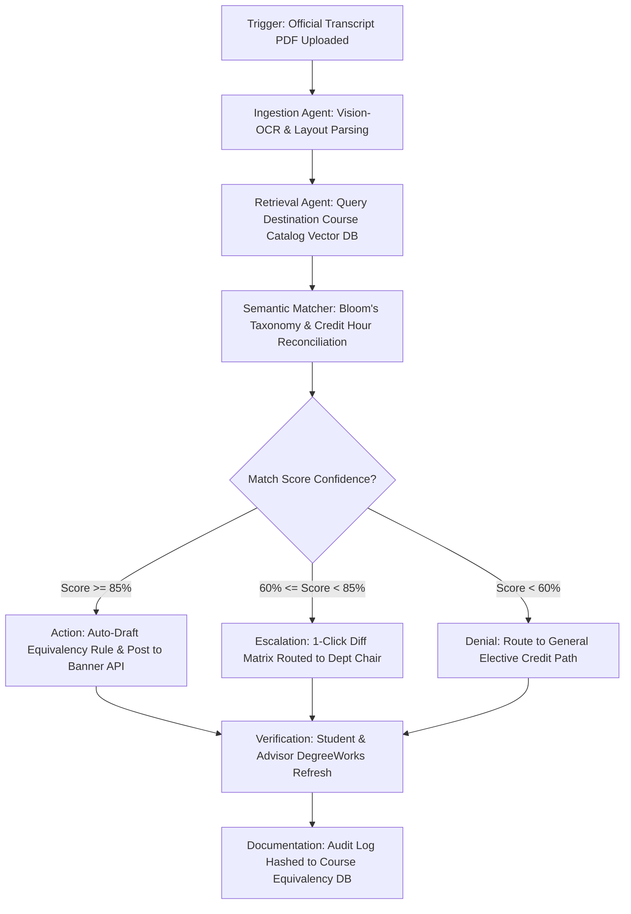
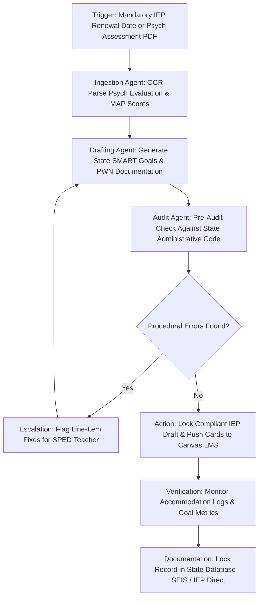
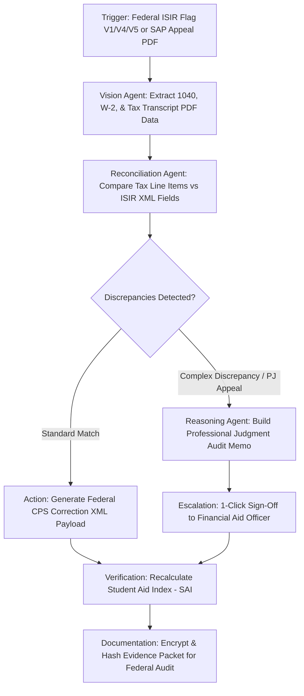
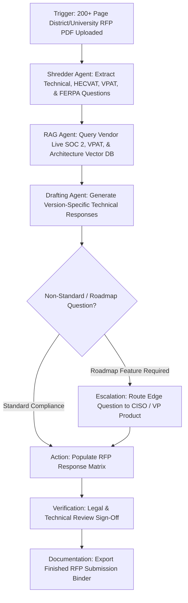
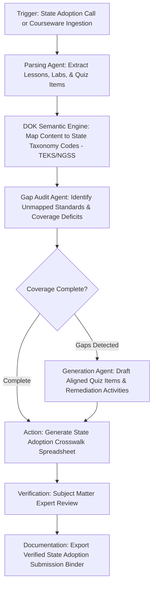
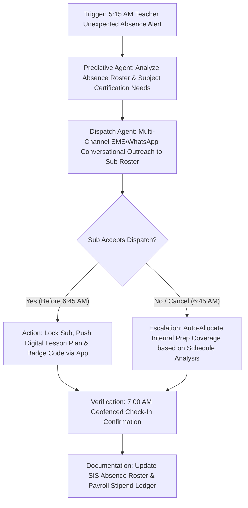
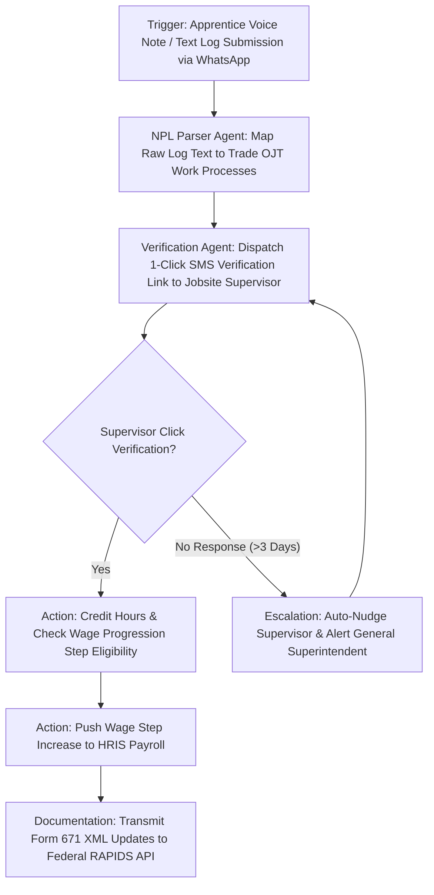
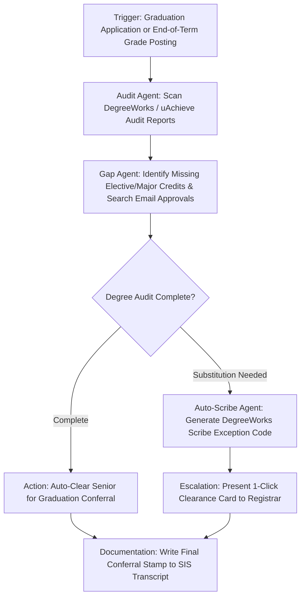
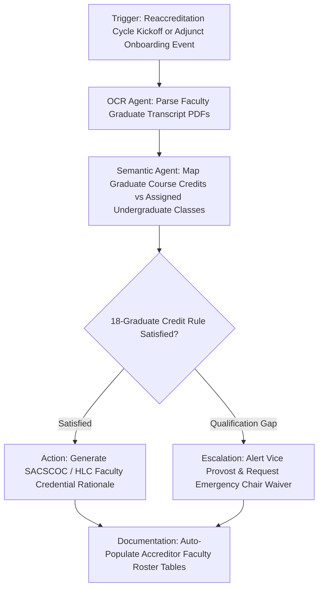

# Part 4: Top 10 Deep-Dive Workflow State Machines & System Designs

> **Target Audience:** Lead System Architects, Software Engineers, and Product Managers  
> **Document Purpose:** Granular workflow state machines (*Trigger $\rightarrow$ Investigation $\rightarrow$ Decision $\rightarrow$ Action $\rightarrow$ Verification $\rightarrow$ Escalation $\rightarrow$ Documentation*), ROI models, technical integration requirements, and GTM strategies for the top 10 ranked opportunities.

---

## 1. Higher Ed Transfer Credit & Articulation Evaluation Agent

### Workflow State Machine Architecture


* **Target Buyer:** Vice President of Enrollment Management / Registrar.
* **Financial ROI Model:** A 10,000-student university receives 2,000 transfer applications/year. 35% evaluation delay drop-off = 700 lost applicants. Recovering just 50 transfer students at $15,000 tuition = **$750,000 top-line tuition recovery**.
* **Integration Requirements:** Direct REST/Webhooks to Ellucian Ethos / Banner SIS API, Workday Student API, CourseDog, and DegreeWorks Scribe tables.
* **GTM & Pricing:** **$14,500 Micro-Purchase Setup** + $2,000/month per campus. 30-day close via P-Card.

---

## 2. K-12 Special Education (IEP/504) Compliance & Audit Agent

### Workflow State Machine Architecture


* **Target Buyer:** District Director of Special Education / Assistant Superintendent.
* **Financial ROI Model:** Frees 5–10 teacher hrs/week ($2.2M district labor spend). Prevents 2 Due Process hearings/yr ($23,827 avg legal settlement + $50k private placement = **$100k+ direct litigation savings**).
* **Integration Requirements:** Read/Write API to SEIS (CA), IEP Direct / Frontline, PowerSchool Special Education, and Canvas LMS gradebooks.
* **GTM & Pricing:** **$12,500 District Setup** + $1,500/month per school building. Funded via Federal IDEA Title Part B funds.

---

## 3. Financial Aid ISIR & Verification Exception Agent

### Workflow State Machine Architecture


* **Target Buyer:** Director of Financial Aid / VP Enrollment Management.
* **Financial ROI Model:** Eliminates 80% of verification manual labor ($250k–$670k spend per campus). Stops "verification melt" (retaining 40 students = **$600k+ tuition**).
* **Integration Requirements:** Ellucian Banner FA API, PowerFAIDS, Oracle PeopleSoft Campus Solutions, and Federal CPS/FSA submission pipelines.
* **GTM & Pricing:** **$14,800 Implementation Fee** + $2,500/month recurring subscription.

---

## 4. Enterprise EdTech Sales RFP Response Orchestrator

### Workflow State Machine Architecture


* **Target Buyer:** VP Sales Operations / Proposal Manager / CISO at EdTech Vendors.
* **Financial ROI Model:** Reduces RFP response turnaround from 3 weeks to 2 days. Enables submitting 3x more bids, closing $500k–$10M+ additional enterprise contracts annually.
* **Integration Requirements:** Integrates with Google Drive, Notion, Slack, Jira, and procurement portals (Bonfire, Jaggaer).
* **GTM & Pricing:** **$15,000 Setup** + $3,000/month SaaS (or $2,500 per completed RFP project). Fast 14–30 day sales cycle via corporate credit card.

---

## 5. EdTech Course Content & State Standards Alignment Agent

### Workflow State Machine Architecture


* **Target Buyer:** Chief Content Officer / VP Product at EdTech Publishers.
* **Financial ROI Model:** Saves 20,000–40,000 hours/year ($1.5M–$5M spend). Prevents rejection from state adoption lists ($50M–$100M state market access).
* **Integration Requirements:** Ingests Common Cartridge (1.2/1.3), QTI quiz packages, PDF textbooks, and exports state-specific XML/Excel adoption sheets.
* **GTM & Pricing:** **$25,000 per curriculum mapping project** or $5,000/month subscription.

---

## 6. Substitute Teacher Emergency Morning Dispatch Agent

### Workflow State Machine Architecture


* **Target Buyer:** Assistant Superintendent of HR / District CTO.
* **Financial ROI Model:** Eliminates $300k–$700k/yr in third-party sub agency markups and prep coverage stipends. Increases sub fill rates from 58% to 88%+.
* **Integration Requirements:** Twilio / WhatsApp Business API, Frontline Absence Management API, PowerSchool SIS, Google Classroom.
* **GTM & Pricing:** **$10,000 Setup** + $1,200/month per school building.

---

## 7. Apprenticeship & Vocational Training Logbook (RAPIDS) Agent

### Workflow State Machine Architecture


* **Target Buyer:** Apprenticeship Director / JATC Training Coordinator.
* **Financial ROI Model:** Saves 7,500+ hours/year per 500 apprentices ($300k–$800k labor). Protects US Department of Labor legal registration and WIOA grants.
* **Integration Requirements:** WhatsApp API, US Department of Labor RAPIDS API, ADP / Workday Payroll.
* **GTM & Pricing:** **$12,000 Setup** + $3/apprentice/month. Direct JATC purchasing.

---

## 8. CEU / CME Accreditation & Provider Agent

### Workflow State Machine Architecture
```mermaid
graph TD
    A[Trigger: Course Completion Event or Reporting Period Window] --> B[Auditor Agent: Parse Syllabi & Attendance against State Board Rules]
    B --> C[Verification Agent: Lookup State License Number via State Board API]
    C --> D{License Valid & Credits Math Correct?}
    D -- "Valid" --> E[Action: Generate Cryptographic Certificate & Post Payload to Portal]
    D -- "Invalid License / Data Missing" --> F[Escalation: Conversational Agent Emails Learner for License Fix]
    F --> C
    E --> G[Verification: Reconcile Portal Receipt (ACCME PARS / CE Broker)]
    G --> H[Documentation: Archive Compliance Packet for 7-Year Audit Cycle]
```

* **Target Buyer:** Director of Continuing Education / CME Compliance Manager.
* **Financial ROI Model:** Eliminates $50k–$275k/yr in compliance labor. Protects accredited provider status (preventing business shut-down).
* **Integration Requirements:** ACCME PARS API, CE Broker API, NASBA CPE Audit Service API, Canvas LMS, Docebo.
* **GTM & Pricing:** **$14,000 Setup** + $1,800/month recurring retainer.

---

## 9. Higher Ed Degree Audit & Graduation Clearance Agent

### Workflow State Machine Architecture


* **Target Buyer:** University Registrar / Vice Provost Academic Affairs.
* **Financial ROI Model:** Saves 3,600–6,500 hours/year ($220k–$450k labor). Protects state performance funding metrics by eliminating last-minute graduation denials.
* **Integration Requirements:** Ellucian DegreeWorks (Scribe engine), uAchieve, Banner SIS, Workday Student.
* **GTM & Pricing:** **$15,000 Setup** + $2,500/month per campus.

---

## 10. Higher Ed Faculty Credential & Accreditation Roster Agent

### Workflow State Machine Architecture


* **Target Buyer:** Director of Institutional Effectiveness / Vice Provost of Faculty Affairs.
* **Financial ROI Model:** Saves 2,000–8,000 hours per accreditation cycle ($250k–$1M labor spend). Prevents regional accreditation public sanctions.
* **Integration Requirements:** Interfolio, Watermark Faculty Success, Banner HR, Canvas LMS.
* **GTM & Pricing:** **$14,500 Setup** + $1,500/month subscription.

---
*Created for Antigravity Systems Research. End of Top 10 Deep Dives.*
