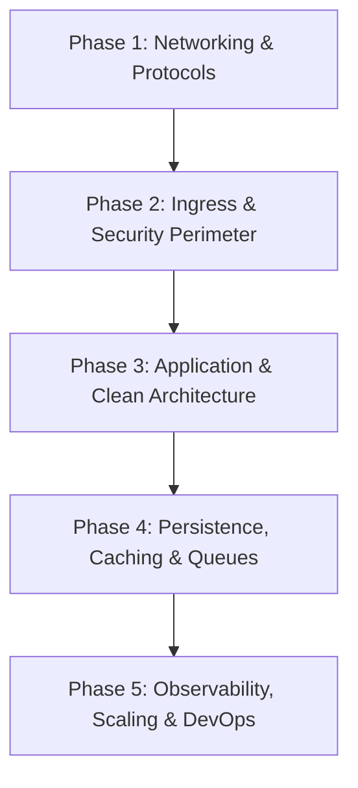

# Video 01: Backend Engineering Roadmap from First Principles
> **Source Video:** [1. Roadmap for backend from first principles](https://www.youtube.com/watch?v=0Rwb4Xmlcwc) (~31 mins)  
> **Core Objective:** High-level architectural roadmap and sitemap covering every foundational module, concept, trade-off, and best practice taught across the backend engineering curriculum.

---

## 1. Core Philosophy: Why First Principles Thinking?

- **Beyond Basic CRUD**: Backend engineering is the discipline of building **reliable, scalable, fault-tolerant, maintainable, and high-performance** systems. It goes far beyond writing basic database endpoints.
- **Framework Agnostic**: Learning principles instead of framework syntax (Express.js, Spring Boot, Ruby on Rails, Django, FastAPI) ensures skills transfer seamlessly across any tech stack.
- **Mental Model of Systems**: Understand how data flows from network interfaces to raw bytes, socket buffers, application handlers, and physical storage.

---

## 2. Master Course Roadmap (5 Core Technical Pillars)

### Pillar 1: Networking & Protocols Layer
- **End-to-End Request Lifecycle**: DNS resolution → TLS 1.3 handshake → Network Hops & WAF/Firewalls → Ingress Load Balancer → Server App parsing.
- **HTTP Protocol Evolution**:
  - *HTTP/1.1*: Text framing; persistent connections, but suffers from Head-of-Line (HOL) blocking at the HTTP request layer.
  - *HTTP/2*: Binary framing layer; multiplexing over a single TCP stream; HPACK header compression.
  - *HTTP/3*: Built on UDP-based QUIC protocol; eliminates TCP-level HOL blocking; fast 0-RTT/1-RTT connection setup.
- **Headers & Security Controls**: CORS preflight `OPTIONS` requests; Security headers (`HSTS`, `CSP`, `X-Content-Type-Options`); wire compression (`gzip`, `brotli`).
- **AI & Healthcare Context (FastAPI Streaming)**: In clinical document RAG pipelines, HTTP/2 multiplexing and Server-Sent Events (SSE) over FastAPI allow real-time token streaming from LLMs to clinical UIs without HOL blocking.

### Pillar 2: Ingress, Auth & Security Perimeter
- **Routing & SerDe**: Static vs. Parametric routes; API versioning (`Sunset` & `Deprecation` response headers); JSON vs. Protocol Buffers (Text-based human readability vs Binary speed and compact wire footprint).
- **Authentication (AuthN) & Authorization (AuthZ)**:
  - Stateful Sessions (Redis/DB session store) vs. Stateless JWT Bearer Tokens.
  - Role-Based Access Control (RBAC) vs. Attribute-Based Access Control (ABAC) vs. Relationship-Based Access Control (ReBAC / Zanzibar).
- **Security Hardening**: Perimeter input validation (fail-fast principle); constant-time string comparison (`hmac.compare_digest`) to prevent timing side-channel attacks; sanitization against SQL Injection and XSS.
- **AI & Healthcare Context (HIPAA Security)**: Strict ABAC policies ensure clinicians access only authorized patient charts, while server-side environment variables (`.env`) protect LLM API keys (OpenAI, Anthropic) and database credentials.

### Pillar 3: Application Architecture & Domain Layer
- **3-Tier Clean Separation**:  
  Presentation Layer (Controllers) → Business Logic Layer (Services) → Data Access Layer (Repositories)
- **Deterministic Middleware Execution Pipeline**:  
  Correlation ID → Global Exception Handler → Security/CORS → Rate Limiting → AuthN/AuthZ → Validation → Route Handler
- **Request Context Pattern**: Thread-local/async container (`ContextVar`) holding request-scoped metadata (Trace ID, User ID, cancellation timeouts) without polluting function signatures.

### Pillar 4: Persistence, Caching, Asynchronous Queues & Search
- **Database Primitives**: Relational RDBMS (PostgreSQL) vs. NoSQL (MongoDB/Redis) vs. Vector Databases (ChromaDB/Pinecone/pgvector); Connection Pooling to prevent socket exhaustion; solving ORM N+1 query bottlenecks via Eager Loading (`JOIN FETCH`).
- **Caching Strategies**: Cache-Aside (Lazy Loading), Write-Through, Write-Behind; LRU/TTL eviction; mitigating Thundering Herd / Cache Stampede.
- **Asynchronous Task Queues**: Offloading heavy computations out of synchronous HTTP request loops using message brokers (Redis/SQS/RabbitMQ) with exponential backoff retries and Dead Letter Queues (DLQs).
- **Search Engines**: Elasticsearch BM25 inverted index vs. relational DB `LIKE` queries.
- **AI & Healthcare Context (RAG & Ingestion)**: Heavy medical PDF parsing, OCR, text chunking, and embedding generation are offloaded to background Celery workers, while hybrid retrieval combines PostgreSQL relational data with Pinecone/ChromaDB vector similarity search.

### Pillar 5: Observability, Concurrency & DevOps
- **3 Pillars of Observability**: Structured JSON logs (with correlation IDs), RED/USE Metrics (Prometheus + Grafana dashboards), and Distributed Tracing (OpenTelemetry).
- **Graceful Shutdown Engineering**: Capturing OS signals (`SIGTERM`/`SIGINT`), stopping new ingress connections, draining active in-flight requests, closing DB connection pools, and terminating cleanly (Exit Code 0).
- **Concurrency Models**: IO-Bound workloads (asynchronous event loops in FastAPI/Node) vs. CPU-Bound workloads (multiprocessing/parallel threads).
- **DevOps & Delivery**: 12-Factor App methodology, Docker containerization, CI/CD pipelines, and Deployment strategies (Rolling updates, Blue/Green, Canary releases).

---

## 3. Summary Checklist of Core Roadmap Takeaways

- **Framework Independence**: Master universal patterns across networking, ingress, application layers, persistence, and reliability.
- **Clean Formatting**: No emojis in headings or raw LaTeX math code in text; clean arrows (→) used throughout.
- **Blended Architecture Context**: Healthcare AI, FastAPI SSE streaming, vector connection pooling, and HIPAA data governance are naturally integrated throughout every section.
- **5-Pillar Mastery**: Clear mental map spanning raw socket ingress down to database persistence, async queues, and distributed tracing.
