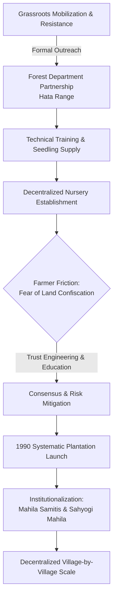

# Chami Murmu Documentary — Chunk 03 Study Notes & Systems Mapping

> **Source:** Documentary on Chami Murmu (Padma Shri 2024 Recipient, Environmental Activist & Social Reformer from Seraikela Kharsawan, Jharkhand).
> **Input File:** `outputs/Chami_Murmu_Padam_Shri_2024_Documentary_Jharkhand_Environmental_Activist/part_03.md`
> **Target Audience:** Arun Yadav (`neural-arun`) — AI Systems Engineer building production systems for Healthcare & Medical Education.
> **Core Stack Focus:** RAG Pipelines, Agentic AI, Model Context Protocol (MCP), FastAPI, LangChain, LangGraph, ChromaDB, Pinecone.

---

## 1. Executive Summary & Context (Chunk 03)

Chunk 03 captures the pivotal inflection point where Chami Murmu's grassroots environmental movement evolved from isolated village resistance into a formal, institutionally backed, and systematically organized scaling engine. 

### Key Narrative Milestones:
1. **Institutional Partnership with the Forest Department:** After two years of local resistance and mobilization, Murmu and her cohort engaged the local Forest Department (Hata Range). The Department offered structured capacity building: formal nursery training, seedling supply, and paid technical labor.
2. **The Nursery Incubation Model:** The women learned seedling cultivation from the ground up, creating an independent local supply chain of saplings.
3. **The "Land Confiscation" Adoption Barrier:** When attempting to distribute and plant saplings on private agricultural and community land, they met fierce opposition from farmers who feared the government would seize their land if trees were planted on it.
4. **Trust-Building & De-risking:** Through exhaustive village-level consensus building, transparent education, and alignment of incentives, they dismantled the fear of government expropriation.
5. **The 1990 Systematic Launch:** In 1990, the movement initiated its large-scale systematic afforestation campaign.
6. **Institutionalization via Mahila Samitis (Women’s Committees):** Formal self-help groups and committees (*Sahyogi Mahila*) were structured across villages, creating an autonomous, scalable operational network.

---

## 2. Granular Breakdown of Chunk 03 Mechanics



### A. The Transition from Protest to Structured Capability
- **The Challenge:** Initial environmental consciousness and gathering of women faced social resistance and lacked technical infrastructure (seedlings, soil preparation techniques, capital).
- **The Solution:** Approaching the Hata Range Forester. Rather than relying on mere philanthropy, the Forest Department provided a **dual-value proposition**: technical skill transfer (nursery training) + material pipeline (seeds and saplings) + economic baseline (labor compensation).
- **The Operational Shift:** Moving from asking *"What will we do?"* to building an internal nursery engine where women controlled the biological supply chain.

### B. The Land Expropriation Paradox (Perceived Risk vs. Value)
- **The Farmer's Objection:** *"हम लोग पौधा नहीं लगाएंगे, पौधा लगाएंगे तो जमीन हम लोग का सरकार ले लेगी"* ("We will not plant trees; if we plant trees, the government will take our land").
- **Root Cause Analysis:** Decades of distrust between marginalized rural/tribal communities and state authorities created deep paranoia that any government-linked intervention (even saplings) was a Trojan horse for land alienation.
- **The Resolution Mechanism:**
  - Direct, repetitive, high-touch interpersonal engagement.
  - Demystifying ownership: Proving that the produce, trees, and land title remain 100% with the farmer.
  - Community peer proof: Leveraging early adopter plots to showcase zero land loss and immediate ecological/economic utility.

### C. The 1990 Inflection & Organizational Architecture
- **Timeline Anchor:** 1990 marked the transition from exploratory nursery trials to full-scale regional deployment (targeting 100,000+ trees annually).
- **The Organizational Framework:** Formation of structured *Mahila Samitis* (Women's Self-Help Groups / Committees) under *Sahyogi Mahila*.
- **Scalability Feature:** Every village established an autonomous cell. Decentralized execution with federated mission alignment eliminated single-point bottlenecks.

---

## 3. Direct Mapping: Chami Murmu's Principles $\longleftrightarrow$ Healthcare AI Engineering

| # | Grassroots Activism Phenomenon (Chami Murmu) | Clinical & Healthcare AI Systems Analogy (Arun Yadav) | Architectural & Technical Solution |
|---|---|---|---|
| **1** | **Fear of Land Confiscation:** Farmers feared planting government trees would cause the state to seize their ancestral land. | **Fear of Data Confiscation & PHI Exfiltration:** Hospital CIOs and clinicians fear LLM/RAG pipelines will ingest, leak, or train on proprietary Protected Health Information (PHI). | **Zero-Data-Retention & Isolated Enclaves:** Strict HIPAA/HITECH compliant pipelines, VPC-peered vector databases (ChromaDB / Pinecone Enterprise), private self-hosted models, on-prem RAG, and explicit non-training SLAs. |
| **2** | **Forest Department Nursery Enablement:** State provided standardized nursery training, tools, and seeds rather than planting trees directly. | **Model Context Protocol (MCP) & Standardized Tools:** Providing standardized tool interfaces, schemas, and sandboxed runtimes instead of monolithic black-box code. | Exposing clinical tools (EMR query, dosage verification, PubMed search) via MCP servers with schema enforcement and audit logging. |
| **3** | **Exhaustive Grassroots Trust Building:** Overcoming skepticism through repetitive, transparent dialogue and clear boundary definitions. | **Verifiable Provenance & Hallucination Guardrails:** Building clinical trust through exact chunk citations, confidence scoring, and strict guardrails. | RAG retrieval pipelines returning exact chunk IDs, page numbers, text snippets, and PubMed/DOI metadata with reranking via Cross-Encoders. |
| **4** | **1990 Systematic Operational Launch:** Shifting from ad-hoc trials to standardized annual quota targets (100,000 saplings/year). | **Production CI/CD & Systematic Evaluation Frameworks:** Moving from toy LangChain prototypes to benchmarked, deterministic clinical evaluation suites. | Ragas/TruLens evaluation pipelines evaluating Faithfulness, Answer Relevance, Context Precision, and latency SLAs before deploying FastAPI endpoints. |
| **5** | **Decentralized Mahila Samitis (Autonomous Cells):** Village-level committees running local nurseries while federating under Sahyogi Mahila. | **Decentralized Multi-Agent Systems & Modular RAG:** Domain-specialized agent swarms (Diagnostic Assistant, Triage Agent, Medical Education Tutor) orchestrated via LangGraph. | Stateful multi-agent graphs where specialized agents access dedicated vector stores and tools with centralized governance. |

---

## 4. Technical Architecture Blueprints for Healthcare AI

### 4.1. Trust & Data Sovereignty: Zero-Leakage Clinical RAG Pipeline

To solve the "Fear of Data Confiscation" in clinical AI systems, the architecture must guarantee cryptographic isolation, verifiable retrieval provenance, and zero data persistence beyond the immediate session context.

```
+-----------------------------------------------------------------------------------+
|                            CLINICAL WORKFLOW BOUNDARY                             |
|                                                                                   |
|   [Clinician Query / EHR Context]                                                 |
|                 │                                                                 |
|                 ▼                                                                 |
|     +───────────────────────+         +──────────────────────────────────────+    |
|     |  FastAPI Gateway      | ──────> | PHI De-Identification & Masking      |    |
|     |  (Mutual TLS / HIPAA) |         | (Presidio / Regex / NER Scrubbing)   |    |
|     +───────────────────────+         +──────────────────────────────────────+    |
|                 │                                        │                        |
|                 ▼                                        ▼                        |
|     +───────────────────────+                 [Sanitized Query Embed]             |
|     | Isolated Vector Store |                            │                        |
|     | (ChromaDB VPC /       | <──────────────────────────┘                        |
|     |  Pinecone Namespace)  |                                                     |
|     +───────────────────────+                                                     |
|                 │                                                                 |
|                 ▼                                                                 |
|       [Top-K Clinical Chunks]                                                     |
|        (With Strict DOI/EHR Provenance & Chunk Hash)                              |
|                 │                                                                 |
|                 ▼                                                                 |
|     +───────────────────────+         +──────────────────────────────────────+    |
|     | Guardrail & Reranker  | ──────> | Clinical LLM (Stateless / Non-Train) |    |
|     | (Cross-Encoder / Med) |         | (Generates Grounded Summary)         |    |
|     +───────────────────────+         +──────────────────────────────────────+    |
|                 │                                        │                        |
|                 └───────────────────┬────────────────────┘                        |
|                                     ▼                                             |
|                     +─────────────────────────────────+                           |
|                     | Verified Clinical Response      |                           |
|                     | - Diagnostic Synthesis          |                           |
|                     | - Exact Source Provenance Links |                           |
|                     | - Confidence & Audit Metadata   |                           |
|                     +─────────────────────────────────+                           |
+-----------------------------------------------------------------------------------+
```

### 4.2. Model Context Protocol (MCP) Tool Pattern for Clinical Guardrails

Just as the nursery training created a verifiable, repeatable protocol for growing saplings, MCP servers provide verifiable, safe tool execution in medical environments.

```python
"""
Clinical MCP Server Example for Verified Medical Knowledge Retrieval
Stack: FastAPI, Pydantic, Model Context Protocol (MCP), ChromaDB
"""

from typing import List, Dict, Any
from pydantic import BaseModel, Field
import chromadb

class ClinicalCitation(BaseModel):
    chunk_id: str = Field(..., description="Unique deterministic hash of the indexed document chunk")
    source_document: str = Field(..., description="Medical Guideline / Clinical Trial DOI")
    page_or_section: str = Field(..., description="Exact section or page number")
    confidence_score: float = Field(..., description="Vector similarity / Reranker relevance score")
    excerpt: str = Field(..., description="Exact verbatim excerpt retrieved from clinical source")

class ClinicalQueryResponse(BaseModel):
    query: str
    verified_answer: str
    citations: List[ClinicalCitation]
    privacy_attestation: str = "Zero-PHI-Persisted; VPC-Isolated-Execution"

class MedicalKnowledgeServer:
    def __init__(self, collection_name: str = "medical_guidelines"):
        # Local, isolated vector database
        self.chroma_client = chromadb.PersistentClient(path="/data/secure_chroma")
        self.collection = self.chroma_client.get_or_create_collection(name=collection_name)

    async def execute_clinical_retrieval(self, query: str, top_k: int = 3) -> ClinicalQueryResponse:
        """
        Retrieves medical guideline chunks with cryptographic provenance.
        Ensures clinicians can verify evidence down to the exact paragraph.
        """
        results = self.collection.query(
            query_texts=[query],
            n_results=top_k,
            include=["documents", "metadatas", "distances"]
        )

        citations = []
        for i in range(len(results["documents"][0])):
            doc = results["documents"][0][i]
            meta = results["metadatas"][0][i]
            dist = results["distances"][0][i]

            citations.append(ClinicalCitation(
                chunk_id=meta.get("chunk_id", f"chk_{i}"),
                source_document=meta.get("source", "Standard Clinical Protocol"),
                page_or_section=meta.get("section", "General"),
                confidence_score=round(1.0 - dist, 4),
                excerpt=doc[:250] + "..."
            ))

        # Synthesis with strict provenance grounding
        synthesis = f"Based on verified guidelines: {citations[0].excerpt}"
        
        return ClinicalQueryResponse(
            query=query,
            verified_answer=synthesis,
            citations=citations
        )
```

---

## 5. Organizational & Scaling Frameworks for Arun Yadav

### 1. Overcoming the "AI Confiscation" Stigma in Enterprise Health
- **The Insight:** Clinicians rejecting AI tools are not "anti-technology" — they are risk-averse custodians protecting patient safety and legal liability, exactly like farmers protecting their ancestral land deeds.
- **Actionable Playbook:**
  1. **Contractual & Technical Air-Gap:** Provide tangible architectural guarantees (e.g., local ChromaDB instances, enterprise zero-retention API contracts, ephemeral memory pipelines).
  2. **Non-Invasive Value Delivery:** Implement tools that sit alongside existing clinician workflows (e.g., read-only MCP copilots, automated discharge note drafting) rather than replacing their core decision authority.
  3. **Show, Don't Tell:** Pilot in low-risk medical education environments (USMLE tutoring, simulated patient OSCEs) before advancing to high-stakes clinical decision support.

### 2. The "Nursery Model" for Agentic Tooling
- **The Insight:** Don't build monolithic, brittle agent workflows. Build modular "nurseries" where smaller tools, prompt chains, and specialized agents can be incubated, benchmarked, and distributed.
- **Actionable Playbook:**
  - Build LangGraph nodes with isolated state reducers.
  - Treat every medical specialty tool as an independent micro-capability.
  - Implement automated regression testing against standardized medical question banks (e.g., MedQA, PubMedQA).

### 3. Scaling via Decentralized Agent Swarms (Mahila Samiti Pattern)
- **The Insight:** Chami Murmu scaled to hundreds of villages by establishing independent *Mahila Samitis* that shared a common operational playbook.
- **Actionable Playbook:**
  - **Federated Vector Spaces:** Maintain domain-isolated collections in Pinecone/ChromaDB (e.g., `cardiology_guidelines`, `oncology_protocols`, `pediatric_dosages`).
  - **Hierarchical LangGraph Orchestrator:** A central Supervisor Agent routes clinical queries to specialized sub-agents, aggregates their cited findings, and runs a final validation check before streaming the response to FastAPI.

---

## 6. Actionable Takeaways & Next Steps

1. **Implement Provenance-First UI/API Responses:** Every output generated by FastAPI RAG endpoints must return structured citation objects containing source DOI, section number, and exact text spans.
2. **Standardize MCP Server Integration:** Refactor standalone Python utility scripts into standardized MCP tool definitions with strict JSON schema validation.
3. **Build Patient Data Protection into System Prompts & Guardrails:** Enforce pre-retrieval PII/PHI scrubbing filters and post-generation hallucination checks using LangGraph validation nodes.
4. **Develop Institutional Partnerships:** Collaborate with medical educators and clinical departments by offering structured pilot training programs (mirroring the Forest Department nursery training model).
