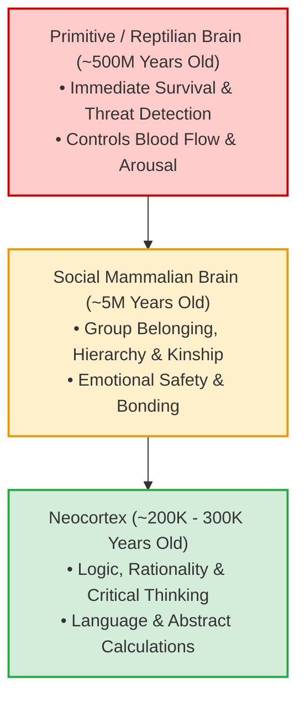
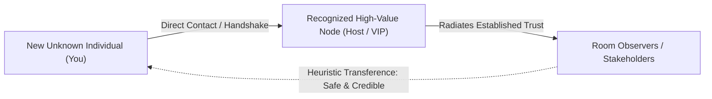
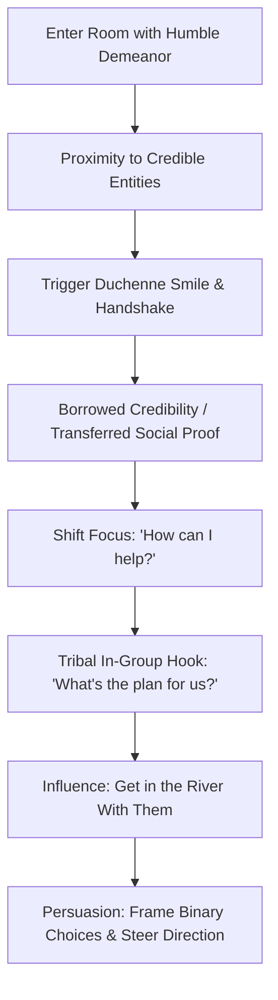
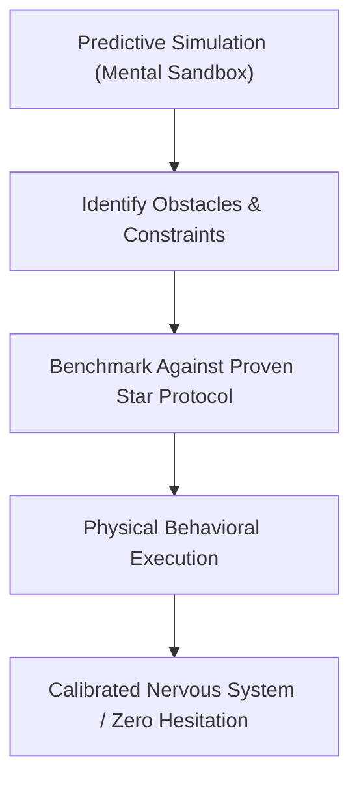
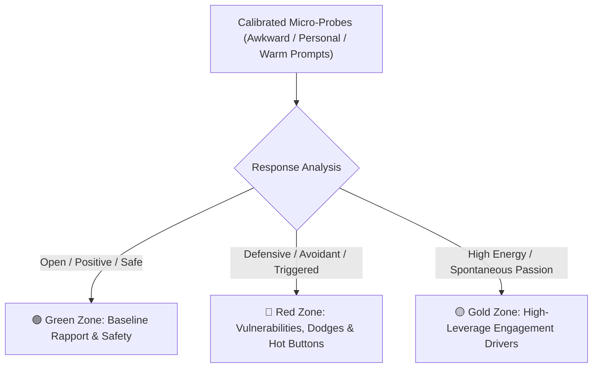
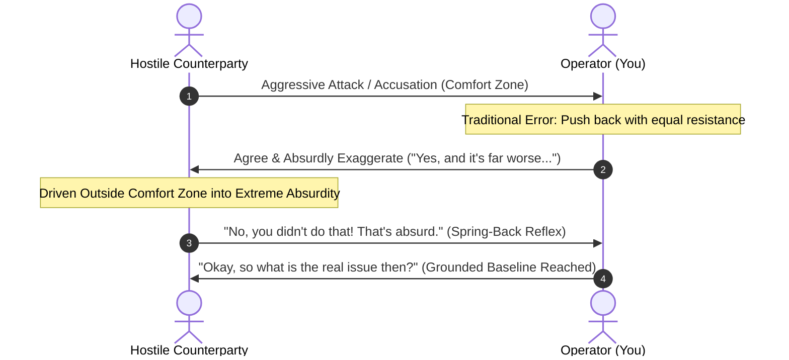
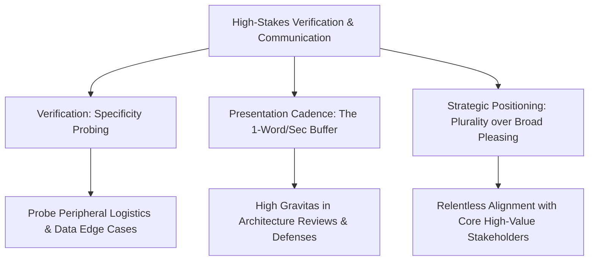

# Executive Study Notes: Human Behavior, Body Language & Earning Respect
**Source:** Mark Bowden on *Figuring Out with Raj Shamani* (Part 01)  
**Target Profile:** Arun Yadav (AI Systems Builder, Trust Engineering, High-Stakes Verification & Communication)

---

## 1. Executive Summary & Core Thesis

Trust, credibility, and authority are not mystical traits—they are **evolutionary predictive computations** executed in milliseconds by the primitive human brain. 

When entering any room, negotiating, or presenting high-stakes technical/clinical systems, your primary objective is to **satisfy the observer's instinctual prediction engine**. Humans instinctively evaluate whether future interactions with you will result in **Reward (Value Addition)** or **Risk (Resource Depletion/Harm)**. The single fastest way to secure trust and command respect is **predictability and spatial ownership**.

---

## 2. The Predictive Brain & The Mechanics of Trust

### A. Evolutionary Threat Calculus
- **Biological Default:** The primitive brain scans for survival risks before evaluating competence or intelligence.
- **The Core Calculation:** 
  $$\text{Trust} = P(\text{Positive Future Outcomes}) \quad \text{vs.} \quad P(\text{Resource Stripping / Harm})$$
- When an individual's behavior is unreadable or inconsistent, the observer’s brain cannot model the future state accurately. 
- **The Risk-Mitigation Default:** In the absence of clear predictability, the brain **defaults to worst-case assumptions** (negative bias), triggering internal discomfort, tension, and defensive barriers—regardless of how brilliant or generous the person actually is.

### B. Predictability as the Foundation of Authority
- **Predictable Behaviors:** Symmetrical posture, rhythmic head nods, completed gestures, steady gaze, and linear motion.
- **Unpredictable Behaviors (Trust Killers):** Fidgeting, incomplete or truncated motions, erratic pacing, jerky eye shifts, and visible ambivalence.
- **Trust vs. Liking:** 
  - *Predictability guarantees Trust & Credibility immediately.*
  - *Liking (Affinity)* is secondary and contextual. You can establish absolute credibility and command compliance even before rapport or personal affinity is developed.

```
[Observer's Primitive Brain] ──► Scans incoming visual telemetry
       │
       ├──► Predictable / Symmetrical / Linear ──► Safety Verified ──► High Trust & Credibility
       │
       └──► Unpredictable / Fidgety / Hesitant  ──► Threat / Ambiguity ──► Defensive Friction / Skepticism
```

---

## 3. The Room Entry & Presence Protocol

Most individuals enter social and high-stakes business environments in a state of internal cognitive load (self-judgment, impostor syndrome, social anxiety), resulting in **micro-hesitations and broken behavioral loops** (e.g., stopping abruptly, shuffling feet, backing up, indecisive navigation).

### Tactical Execution Framework: *The 4-Step Vector Rule*
When walking into any boardroom, stage, client meeting, or networking space:

1. **Make a Choice:** Select an explicit objective or destination vector before crossing the threshold (e.g., walking directly toward a specific stakeholder, lectern, or seating zone).
2. **Make it Bigger:** Expand posture and commit to clear, open steps rather than timid, cramped strides.
3. **Keep it Tidy:** Eliminate micro-movements, nervous twitches, pocket-checking, or jittery adjustments.
4. **Keep Going (Maintain Linear Momentum):** Move steadily forward along your vector. 
   - *Cognitive Impact on Room:* Observers track the clear trajectory: *"They are moving forward -> They are moving with purpose -> I can predict their path -> Safe / Competent / High Authority."*

---

## 4. Key Behavioral & Spatial Heuristics (Previewed Principles)

### 1. Show More (Hand Visibility as Verification Telemetry)
- **Principle:** Keep hands consistently visible within the observer's line of sight.
- **Biochemical Trigger:** Concealed hands trigger primitive threat detection (ancient fear of hidden weapons or deception). Open, visible hands signal transparency, emotional stability, and non-aggression.
- **Application:** Keep gestures above desk/table level during meetings and negotiations.

### 2. Maximize vs. Minimize (Territory Ownership)
- **Principle:** High-status individuals claim and command their physical space; low-status/insecure individuals shrink their footprint.
- **Tactical Example:** Placing objects (e.g., mug, notebook, laptop) deliberately outward to demarcate a wider territorial boundary.
- **Perception:** Expanding territory forces expansive, relaxed movement, projecting calm authority. Minimizing territory triggers observers to predict low competence and lack of leadership capacity.

### 3. Universal Micro-Expressions
- Hardwired emotions that flash involuntarily on the human face: **Anger, Surprise, Fear, Disgust, Pleasure/Joy, Sadness, Contempt**.
- Critical for verifying whether spoken stakeholder feedback matches instinctual emotional reaction.

### 4. Power Framing & Balance Disruption (Trump Handshake Dynamics)
- **Mechanic:** The aggressive pull-in / leverage shift.
- **Strategic Intent:** Physically pulling the counterpart off-balance forces their autonomic nervous system into sudden instability, establishing a visceral "Dominant vs. Submissive / Winner vs. Loser" frame before verbal negotiation begins.

---

## 5. Trust Engineering & System Architecture Parallels
*Connecting behavioral mechanics to AI system design and high-stakes communication:*

| Human Behavioral Principle | AI / Trust Engineering Parallel | System Design Takeaway |
| :--- | :--- | :--- |
| **Predictability = Trust** | Deterministic pipelines, clear latency bounds, consistent structured outputs | In high-stakes verification (e.g., clinical AI), stochastic erraticism destroys user adoption faster than lack of raw capability. |
| **Hand Visibility (Show More)** | Chain-of-Thought transparency, citation grounding, audit trails | Provide explicit provenance. Opaque black-boxes trigger cognitive threat/skepticism. |
| **Linear Vector Momentum** | Low-friction user workflows, clear feedback loops, zero cognitive stalls | Prevent user disorientation by maintaining clear next-step trajectories throughout complex reasoning apps. |
| **Territory Maximization** | Confident UI real-estate, clear domain authority in AI persona | Systems that express hesitation or over-apologetic boilerplate lose stakeholder confidence. |

---

## 6. Actionable Behavioral Protocol for High-Stakes Interactions

- [ ] **Pre-Entry Alignment:** Define the physical path and anchor point before entering the room.
- [ ] **Eliminate Behavioral Jitter:** Suppress restless foot-tapping, ring-spinning, face-touching, and mid-motion hesitation.
- [ ] **Maintain Symmetrical Anchoring:** Symmetrical posture communicates stability, groundedness, and emotional equilibrium.
- [ ] **Expose the Hands:** Keep hands visible, relaxed, and above table height during all key discussions.
- [ ] **Own the Perimeter:** Set notebook, devices, and materials deliberately to claim territory without encroaching invasively.
# Executive Study Notes: Human Behavior & Non-Verbal Trust Mechanics
**Source:** Mark Bowden Masterclass (Episode FO549 with Raj Shamani) — **Part 02**  
**Focus:** The Predictive Brain, The Hands Paradox, Evolutionary Overrides, and The "Show More" Protocol  
**Target Profile:** Arun Yadav (AI Systems Builder | Trust Engineering | High-Stakes Stakeholder Alignment)

---

## 1. Executive Summary

Part 02 uncovers the biological mechanism of human trust: **the human brain is fundamentally a prediction engine that manages uncertainty**. Because we cannot know the future, the brain evaluates real-time non-verbal data to forecast whether an interaction presents risk or benefit. 

When presented with **insufficient visual data**, the brain's survival algorithm triggers a **default to negative (distrust/threat)**. Bowden demonstrates this through the striking **"Hands Paradox"**: a listener will instinctively trust an unqualified amateur with visible, open hands over a seasoned 30-year expert whose hands are hidden beneath a table. High technical competence and hard work will always be overridden if non-verbal trust signals are neglected.

```
+-------------------------------------------------------------------------------+
|                             THE TRUST TRUTH                                   |
|                                                                               |
|   "If somebody has the simple communication skills of trust and credibility,  |
|    they will override your hard work. They will come and take your client and |
|    take your business because they are a better communicator."                |
|                                                  — Mark Bowden                |
+-------------------------------------------------------------------------------+
```

---

## 2. Etymological & Conceptual Foundations

Understanding the linguistic roots reveals the subconscious cognitive expectations humans hold during high-stakes communication:

| Term | Latin Root | Literal Meaning | Psychological Meaning |
| :--- | :--- | :--- | :--- |
| **Credibility** | *Credo* | "I believe" | The degree to which others can predict and believe your future actions. |
| **Confidence** | *Con-fides* | "With trust / faith" (*fides* = fidelity) | Walking alongside a positive, predictable future with another person. |
| **Manipulation** | *Manus* | "Hand" | Literally altering or adjusting physical reality using one's hands. |

> [!NOTE]
> **Predictability Trumps Ambiguity:** Even if a person is unpleasant or negative, if their behavior is predictable, your brain still experiences a form of trust (*"I know exactly what you are going to do and how to handle/avoid you"*). The absolute worst state for human rapport is **unpredictable ambiguity**.

---

## 3. Cognitive & Evolutionary Architecture

The brain processes trust through three evolutionary layers with strict hierarchical power over perception:



### The Limbic Override Mechanism
* **Oxygen / Gating Control:** The primitive and mammalian brains physically gate resources and oxygen to the neocortex.
* **The Override:** When survival instincts detect ambiguity or hidden hands, the primitive brain flags a threat and overrides logical evaluation.
* **The "Hair-Trigger" Effect:** Instinct is not a binary toggle switch; it is a hypersensitive hair-trigger. Subtle non-verbal cues (e.g., hiding hands below a table) trigger disproportionate subconscious resistance.
* **Reality Bias:** The instinctual brain cannot differentiate between a calculated simulation and reality. Even if the neocortex knows someone is running a roleplay or test, the instinct responds to physical cues as absolute truth.

---

## 4. The Core Algorithm: The Brain as a Prediction Engine

```
+---------------------------------------------------------------------------+
|                          THE BRAIN'S DEFAULT ALGORITHM                    |
|                                                                           |
|          INSUFFICIENT DATA   ===>   DEFAULT TO NEGATIVE / RISK            |
+---------------------------------------------------------------------------+
```

1. **The Investor Metaphor:** Like an investor managing portfolio uncertainty, the brain scans the present moment to forecast the future:
   * *Is this person predictable?*
   * *Is this encounter beneficial or risky?*
2. **The Resolution Matrix:**
   * **Predictable + Negative:** Brain registers certainty $\rightarrow$ *Action: Eliminate / avoid / disengage cleanly.*
   * **Predictable + Positive:** Brain registers safety $\rightarrow$ *Action: Retain / listen / collaborate.*
   * **Insufficient Data (Ambiguous):** Brain assumes threat $\rightarrow$ *Action: Heightened anxiety / defensive skepticism.*

---

## 5. The "Hands Paradox" Experiment

Bowden performed a live comparison to demonstrate how visual hand signals completely override verbal logic:

```
===================================================================================
                               THE EXPERIMENT
===================================================================================

SCENARIO A: Hidden Hands (Beneath Table / Out of Frame)
  Verbal Pitch: "I am an expert. 30 years experience. On time, on budget,
                 guaranteed profit. You can trust me."
  Biological Reaction: Distrust, unease, skepticism, instinctual friction.

SCENARIO B: Open Visible Hands (Palms Visible, In Frame)
  Verbal Pitch: "I am totally new. No experience, no education. I will make costly
                 mistakes. You might lose money. But you can trust me."
  Biological Reaction: Immediate subconscious rapport, perception of honesty & safety.
===================================================================================
```

### Why Hands Dictate Trust:
1. **Tool of Physical Manipulation:** Evolutionarily, hominid hands manipulate the environment—they craft tools, throw rocks, wield weapons, or administer care.
2. **Weapons Check:** The primitive brain scans: *"Are their hands holding tools or weapons that can harm me?"*
3. **Data Completeness:** Visible hands provide the missing data the brain requires to complete its safety prediction model.

---

## 6. The Meritocracy Fallacy (Engineering & High-Achiever Trap)

High performers, engineers, and domain experts often fall into the **Meritocracy Trap**:
* **The Assumption:** *"My technical excellence, past track record, and superior logic will speak for themselves."*
* **The Reality:** A competitor with inferior domain expertise who uses open non-verbal signaling (visible hands, predictable movement) will win the client, funding, or executive buy-in over a brilliant expert who speaks with hands hidden beneath the desk or off-camera.

> [!WARNING]
> **Technical Competence Is Insufficient:** Logic only enters after the mammalian brain approves safety. If you fail the primitive safety check, your client's neocortex will rationalize reasons to reject your pitch or system proposal.

---

## 7. Execution Protocols & Tactical Rules

### Rule #1: "Show More" (Maximize Visual Bandwidth)
* Never hide your hands beneath a table, in pockets, or below the camera frame during high-stakes communication.
* Provide an abundance of visual predictability so the other party's brain never enters the "insufficient data" heuristic.

### Behavioral Checklist for High-Stakes Alignment

| Context | Action Protocol | Mistake to Avoid |
| :--- | :--- | :--- |
| **Video Calls (Remote Demos / Client Pitches)** | Frame camera from chest/navel up. Ensure hands and palms are constantly visible in the lower third. | Framing head-only close-up where hands operate invisibly below the screen. |
| **In-Person Stakeholder Meetings** | Place forearms and open palms on or just above the conference table. Rest hands comfortably in the Truth Plane. | Dropping hands into lap under the desk or folding arms tightly against the torso. |
| **Explaining Complex / Unpopular Decisions** | Pair transparent messaging with wide, open-palm gestures to prevent defensiveness. | Delivering technical warnings with rigid, concealed posture (triggers suspicion). |

---

## 8. Trust Engineering Synthesis (AI & High-Stakes Systems)

| Human Non-Verbal Mechanics | AI System & Architecture Analog |
| :--- | :--- |
| **"When insufficient data, default to negative."** | **Zero-Shot Blackbox Models:** When an AI model fails to provide intermediate reasoning traces (lack of transparency/data), users and clinicians default to distrusting its diagnostic output. |
| **"Predictable + Negative > Ambiguous"** | **Explicit Failure Modes:** An AI system that predictably states *"I am uncertain (Confidence: 32%) and cannot answer"* builds more systemic trust than a model that ambiguously hallucinates with high confidence. |
| **The "Show More" Protocol** | **Glass-Box System Observability:** Providing step-by-step verification, source citation links, and transparent latency telemetry satisfies the user's need for predictive data. |
# Executive Study Notes: Human Behavior & Non-Verbal Dominance (Part 03)
**Source:** Mark Bowden on *Figuring Out with Raj Shamani* (FO549)  
**Topic:** Open vs. Closed Posture, Spatial Dynamics, Territorial Maximization, and Status Proximity  
**Curated For:** Arun Yadav (AI Systems Builder, High-Stakes Communication, Trust Engineering)

---

## Executive Summary & Core Mental Models

In high-stakes interactions (boardrooms, client pitches, clinical AI presentations), trust is not granted solely by intellectual competence—it is calculated instantly by evolutionary threat-detection algorithms running in the observer's limbic system. 

Part 03 establishes three foundational behavioral mechanics:
1. **The Principle of "Show More" (Open vs. Closed):** Transparency reduces uncertainty. Open body language exposes vulnerable anatomy, signaling zero hostile intent and high security.
2. **The Principle of "Maximize vs. Minimize":** Dominance, competence, and reliability correlate with the legitimate ownership of physical space. Minimization signals anxiety, hiding, and predictive failure.
3. **The Law of High-Value Proximity:** Status and credibility propagate across social networks through physical proximity and direct interaction with high-value nodes.

```
┌────────────────────────────────────────────────────────────────────────────┐
│                    THE TRIAD OF NON-VERBAL CREDIBILITY                     │
├──────────────────────┬──────────────────────┬──────────────────────────────┤
│      SHOW MORE       │       MAXIMIZE       │      VALUE PROXIMITY         │
│  (Open vs. Closed)   │ (Territory Ownership)│     (Status Borrowing)       │
├──────────────────────┼──────────────────────┼──────────────────────────────┤
│ Reduces threat       │ Claims legitimate    │ Leverages existing trust     │
│ ambiguity; signals   │ space; projects      │ networks; bypasses cold-room │
│ high confidence.     │ agency & future ROI. │ skepticism.                  │
└──────────────────────┴──────────────────────┴──────────────────────────────┘
```

---

## 1. Principle 1: "Show More" (The Mechanics of Open Body Language)

### The Core Axiom: No Bad Behavior, Only Outcomes
> *"There is no bad behavior. There are just results that you wanted or didn't want."* — Mark Bowden

* Crossing arms, hunching, or covering the face are not intrinsically "wrong"; they are defensive reactions or energy-conserving states.
* **The High-Stakes Reality:** When your goal is to win trust, buy-in, and authority, closed posture loses the probability bet. Open posture wins the trust bet every time.

### Why "Show More" Wins Trust
* **Evolutionary Threat Processing:** The primitive brain operates on visual confirmation. If your hands, chest, neck, or torso are hidden, the observer's subconscious registers missing telemetry as a potential concealed threat.
* **Positive Framing (Active Intentionality):** Do not mentally focus on *"not being closed"*. Direct your conscious attention to **"being open"**.
* **The Fireplace Analogy:**
  * Cold night, roaring hearth $\rightarrow$ You naturally open your chest, torso, and limbs to absorb maximum heat.
  * Fire dies out $\rightarrow$ You instinctively curl inward to conserve core warmth.
  * In social dynamics, open behavior projects that the environment is safe, abundant, and welcoming.

---

## 2. The Cultural Physics of Space & Frame Calibration

Physical expansiveness must be calibrated against the socio-historical and demographic constraints of the environment ("The Frame").

| Dimension | Expansive / Low-Constraint Cultures (e.g., North America, USA) | Compact / High-Constraint Cultures (e.g., Japan, Island Nations) |
| :--- | :--- | :--- |
| **Geographic Context** | Massive landmass, vast physical territory. | Small island/landmass, dense population, historical invasion vulnerability. |
| **Social Structure** | Individual space abundance; low risk of accidental encroachment. | Dense co-existence requiring rigid etiquette, hierarchy, and micro-governance. |
| **Normative Gestures** | Wide arm spans, expansive movements, relaxed territorial claims. | Compact, tightly contained gestures close to the torso. |
| **Violation Reaction** | Expected and rewarded as confidence. | Perceived as aggressive, disruptive, uncalibrated, or erratic (*"Whoa, what's wrong with you?"*). |

> [!IMPORTANT]
> **Engineering Frame Control:** Always calibrate your gesture bounding box to the physical and cultural frame. In video calls, ensure your gestures remain within camera view. In cross-cultural negotiations, adapt your gesture radius to avoid triggering boundary alarm.

---

## 3. Principle 2: "Maximize Rather Than Minimize" (Territory Mastery)

### The Psychology of Minimization
When an expert minimizes their physical footprint (pulling elbows tight, hunching against the table edge, keeping cups close to the chest):
* **Observer's Predictive Mechanism:** The observer's brain automatically calculates: *"The future will not be good with this person because they do not own their space or project self-worth."*
* **The Trust Paradox:** Two professionals with identical resumes, credentials, and technical depth will receive wildly different trust valuations based entirely on whether they maximize or minimize their physical territory.

```
[ Minimizing Posture ] ──► Signals Fear / Incompetence ──► Subconscious Unease & Distrust
[ Maximizing Posture ] ──► Signals Ownership / Stability ──► Subconscious Safety & Buy-In
```

---

## 4. Tactical Seated Setup: The Desk & Table Protocol

Mark Bowden outlines a repeatable, mechanical protocol for dominating a seated meeting (boardrooms, client negotiations, panel interviews).

```
                      [ MEETING TABLE / DESK ]
    ─────────────────────────────────────────────────────────────
    [Other Person's Territory]   │  [Your Legitimate Territory]
      (Smartphone / Notebook)    │
                                 │       [Water Mug / Object]
                                 │       (Locked-Out Arm's Length)
                                 │              ▲
                                 │              │
                                 │        [Gesture Zone]
                                 │        (Expansive Arcs)
                                 │              │
                                 │              ▼
    ─────────────────────────────┴───────────────────────────────
                                    ◄─── 1 Handspan Gap ───►
                                         [YOUR TORSO]
```

### Step-by-Step Execution Protocol:
1. **The Torso Gap (One Handspan Rule):**
   * Never shove your stomach or chest against the edge of the table.
   * Position your chair exactly **one handspan away** from the table edge.
   * *Rationale:* Creates an open physical pocket for breathing, gestural freedom, and upright posture without crowding your diaphragm.

2. **The Anchor Point (Locked-Out Arm Object Placement):**
   * Take your personal item (water glass, coffee mug, notebook) and place it on the table at **full locked-out arm's length** on your side.
   * *Rationale:* Visually stakes out your legitimate territorial boundary without crossing into the other person's zone.

3. **Dynamic Motion Maximization:**
   * When drinking water or reaching for your notes, execute a full, smooth, wide motor arc out to the perimeter and back.
   * *Rationale:* Demonstrates total comfort across your entire territorial zone, projecting physical mastery and authority.

4. **Territorial Boundary Respect:**
   * Notice the other party's territorial markers (smartphones, laptops, pens).
   * **Never** reach into, hover above, or wave hands near their markers—encroaching triggers instant distraction and defensive friction.

---

## 5. Principle 3: Status Transference via Proximity to Value

### The Mechanics of "Borrowed Trust"
In unfamiliar territory (entering a room where you are unknown, high-stakes networking, industry summits):
* **Status Gravity:** Every room has recognized high-value nodes (the host, key executive, industry leader, keynote speaker).
* **The Proximity Vector:** Walk directly toward the highest-perceived-value entity in the room and initiate respectful, confident physical and verbal contact (e.g., handshake, warm greeting).
* **The Social Perception Shift:** Observers who do not know you will witness you interacting seamlessly with the established center of trust. The brain uses heuristic shortcutting: *"He is aligned with the trusted node, therefore he is safe and high-status."*



---

## 6. Synthesis: Applications for AI Systems Engineering & High-Stakes Leadership

| Behavioral Principle | AI / Systems Engineering Analogy | High-Stakes Leadership Execution |
| :--- | :--- | :--- |
| **Show More** | **Transparent Telemetry & Explainability:** Black-box models trigger user distrust; open, observable reasoning traces build systemic trust. | In client/stakeholder demos, expose clear thinking, open hands, and visible structural models rather than guarded explanations. |
| **Maximize Territory** | **Resource Allocation & Throughput Ownership:** An AI agent that owns its compute and memory budget without deadlock or starvation operates predictably. | Own your workspace and presentation area; adopt a structured 1-handspan gap and arm's-length anchor to command room presence. |
| **Value Proximity** | **Graph Centrality & Node Affinity:** A newly added entity in a knowledge graph inherits relevance when linked to high-centrality authority nodes. | In enterprise sales or leadership meetings, align physically and conversational-wise with the primary decision-maker early. |

---

## Key Tactical Takeaways (Quick Checklist)

- [ ] **Adopt the "Show More" Mindset:** Never focus on suppressing closed behaviors; focus proactively on radiating openness.
- [ ] **Set the 1-Handspan Table Gap:** Always maintain space between your torso and the table for gestural freedom and commanding posture.
- [ ] **Stake Your Boundary:** Place drinks/notebooks at full arm's length to claim your operational zone without encroaching on others.
- [ ] **Respect Markers:** Never hover over or intrude on a counterparty's smartphone or personal boundary items.
- [ ] **Attach to High-Value Nodes:** When entering high-stakes rooms, establish immediate, natural contact with the most trusted entity to borrow credibility.
# Summary Part 04: Borrowed Credibility, Tribal Integration, and The Influence-Persuasion Dynamic

> **Source Material:** *Human Behaviour Expert: How to Read People & Command Respect* — Mark Bowden with Raj Shamani  
> **Target Focus:** High-Stakes Communication, Trust Architecture, Behavioral Mechanics, Leadership & Influence

---

## 1. Executive Summary & Core Mechanics

Part 04 focuses on social dynamics, entering unfamiliar environments, borrowing credibility through non-verbal contagion, rapidly assimilating into groups, and the precise behavioral distinction between **Influence** (pacing/aligning) and **Persuasion** (steering/moving).



---

## 2. Deep Behavioral Frameworks & Principles

### A. Effortless Value & The Humble Entrance
* **The Dynamic:** When an individual of genuine competence or status enters an environment humbly without ostentatious display, their perceived value increases exponentially.
* **Psychological Mechanism:** Observers interpret non-arrogant, quiet confidence as **effortless value**—the individual does not need to expend energy signaling status because their baseline value is self-evident.

---

### B. Proximity, Borrowed Credibility & The Duchenne Protocol
When entering a room as an unknown or lower-status participant, attempting to convince 500 individuals individually is inefficient. The high-leverage strategy is **Value by Association / Borrowed Credibility**.

```
[Observer Field] ── sees ──> [You] ── proximate & smiling with ──> [High-Credibility Node]
                                              │
                                              ▼
                             [Trust Transferred via Social Proof]
```

#### The Biomechanical Mechanics:
1. **Physical Proximity:** Move physically close to established, highly credible figures in the room.
2. **The Duchenne Smile:**
   * **Anatomy:** Sides of the mouth turn upward, eyes narrow, crow’s feet wrinkles form at outer corners.
   * **Evolutionary Meaning:** Universally signals across all cultures that *"something is good / safe now."*
3. **The Contagion Trigger:**
   * Sustaining a Duchenne smile during greeting/handshake activates mirror neuron responses, compelling the high-status contact to smile back genuinely.
   * Observers witness mutual warmth, touch, and positive facial validation.
4. **Trust Infusion:** Downstream observers immediately infer high value and safety by association—provided there is no pre-existing distrust.

---

### C. The Psychological Antidote to Imposter Syndrome
* **The Universal Reality:** Feeling like *"I shouldn't be here, they are going to find me out"* occurs across all career stages. Bowden asserts: **If you do not periodically feel out of your depth, you are not pushing yourself or playing hard enough.**
* **The Mental Shift (Ego-State to Service-State):**
  * *Self-Conscious Loop (Destructive):* Over-monitoring internal deficits (*"Do I know enough? Are they judging me?"*).
  * *Service-Oriented Loop (Constructive):* **"I am just here to help. Who needs help right now?"**
* **Execution:**
  1. Identify low-hanging fruit (familiar or approachable individuals).
  2. Approach with the explicit intent to provide unreciprocated, non-transactional value.
  3. Offer value freely; social capital and status reflection follow organically.

---

### D. Tribal Integration Protocol: *"What's the Plan for Us?"*
When entering a semi-familiar group or social circle, standard small talk fails to cement belonging. Raj Shamani’s question—deconstructed by Bowden—serves as an elite behavioral hook:

$$\text{"What's the plan for us tonight / what are we doing together?"}$$

#### Why This Works Mechanically:
1. **In-Group Linguistic Priming:** The words *"us"* and *"we"* bypass out-group skepticism and prime the subconscious mind to treat you as a co-member of the tribe.
2. **Eliciting Value Hierarchies:** Forces the group to reveal their priority hierarchy (what they consider most valuable or urgent).
3. **Validating Group Agency:** Acknowledges their authority and invites them to direct the agenda.
4. **The Golden Rule of Entry:** **Never challenge the group’s initial plan upon entry.** Challenging early immediately brands you as an out-group antagonist.

---

### E. The Classical Influence vs. Persuasion Architecture

Bowden breaks down the etymological and operational difference between two often conflated concepts:

```
================================================================================
INFLUENCE (Latin: 'Influere' — In the river with)
Pacing | Flowing with the current | Empathy | Affirmation | Zero Resistance
                                  │
                                  ▼
PERSUASION (Latin: 'Persuadere' — To move hard / urge)
Steering | Strategic Choice Framing | Nudging toward higher-value outcomes
================================================================================
```

| Dimension | **Influence** (*Influere*) | **Persuasion** (*Persuadere*) |
| :--- | :--- | :--- |
| **Etymology** | "To flow into / be in the river with" | "To urge / move forcefully" |
| **Objective** | Establish psychological rapport & alignment | Alter trajectory & decision-making |
| **Stance** | Non-combative, empathetic, validating | Comparative, structured, choice-architected |
| **Body Language** | Open, affirmative gestures, nodding | Deliberate, clear directional framing |
| **Language Pattern** | *"Fantastic, I see why you want that, great idea"* | *"Between Route A (treacherous) & Route B (safe), what do you prefer?"* |
| **Core Rule** | **Acceptance does not equal full agreement**; it equals validation of their perspective. | Never persuade before establishing deep influence/flow. |

#### Tactical Step-by-Step Steering Process:
1. **Enter the River (Influence):** Get into their current. Validate their direction completely (*"Let's go that way; I see why that's appealing"*).
2. **Deepen Empathy:** Inquire about their rationale (*"What do you like most about this approach?"*).
3. **Reach the Fork in the River (Persuasion):** Present a structured, slightly binary choice:
   * *Option A:* Describe the current risky/suboptimal path neutrally while highlighting hidden hazards.
   * *Option B:* Present the optimized, high-value alternative.
4. **Preserve Autonomy:** Ask: *"Which way do you think we should go?"* Allow them to own the decision to pivot.

---

## 3. High-Stakes Systems & Leadership Applications

For AI Systems Builders, Product Engineers, and Clinical/Technical Leaders (e.g., Arun Yadav):

### 1. Architectural Trust Delegation (Borrowed Credibility as OAuth / Cryptographic Signing)
* In distributed systems, downstream services do not authenticate every credential from scratch; they verify signatures from trusted authority nodes.
* In enterprise negotiations or technical consensus building, gain initial alignment with a trusted domain expert (e.g., Chief Medical Officer or Principal Architect). Their visual and verbal endorsement inoculates you against initial stakeholder friction.

### 2. Prompt & Dialogue Flow Alignment (Influence before Assertion)
* When architecting clinical reasoning tutors or conversational AI agents, an agent must **never abruptly refute user input** (which triggers user rejection and cognitive defensiveness).
* **System Design Rule:** Implement a two-phase dialogue turn:
  1. *Acknowledge & Validate Context (Influence/Pacing):* Validate the user's premise.
  2. *Refactor & Guide via Scaffolding (Persuasion/Steering):* Present comparative differential reasoning to allow the user/clinician to converge on the correct conclusion.

### 3. De-Escalating Stakeholder Resistance
* If a client or stakeholder proposes an architecture with severe latency/scalability flaws, **do not attack the plan immediately**.
* *Protocol:* Validate their strategic business goal (*"Great direction—prioritizing fast time-to-market makes total sense"*). Once in the river with them, architect the decision matrix (*"Between keeping existing sync processing with potential bottlenecks vs. an async worker queue for 10x throughput, how do you want to handle peak load?"*).

---

## 4. Key Takeaways & Actionable Execution Checklist

- [ ] **Humble High-Value Posture:** Avoid over-compensating; allow understated presence and calm demeanor to signal effortless value.
- [ ] **Deploy the Duchenne Smile:** Pair eye-wrinkling genuine warmth with handshakes when greeting credible stakeholders in public view.
- [ ] **Override Imposter Syndrome:** Shift internal cognitive load from *"How do I look?"* to *"What practical problem can I solve for someone in this room right now?"*
- [ ] **Use Tribal In-Group Hooks:** Use *"What's our plan?"* to uncover group hierarchies and signal immediate belonging without friction.
- [ ] **Execute Influence Before Persuasion:** Always flow in their river (affirm and validate) before offering directional choice architecture.
# Study Notes: Human Behavior & Persuasion Mastery — Part 05
**Speaker:** Mark Bowden (Human Behavior & Body Language Expert) | **Host:** Raj Shamani  
**Context:** AI Systems Engineering, High-Stakes Stakeholder Communication & Trust Architecture (Arun Yadav)

---

## Executive Summary

Part 05 explores the tactical mechanics of **Influence vs. Persuasion**, the foundational rule of **problem-centric selling**, the non-verbal dynamics of the **investigative buyer posture**, and a deep philosophical/etymological deconstruction of **manipulation and language**. Bowden demonstrates that true persuasion can only occur *after* influence is established by stepping into the other person's reality ("the river") and articulating their problem with greater precision than they can themselves.

---

## 1. The Influence-to-Persuasion Pipeline: Stepping into the River

```
┌─────────────────────────────────────────────────────────────┐
│ 1. INFLUENCE (Pre-requisite)                                 │
│    • Stepping into their "River" (Accepting their reality) │
│    • Open palm body language + Affirmative verbal signals   │
└──────────────────────────────┬──────────────────────────────┘
                               │
                               ▼
┌─────────────────────────────────────────────────────────────┐
│ 2. THE PERMISSION HOOK                                      │
│    • "Would you be open to another perspective/option?"     │
│    • Secures micro-commitment ("Yeah")                      │
└──────────────────────────────┬──────────────────────────────┘
                               │
                               ▼
┌─────────────────────────────────────────────────────────────┐
│ 3. PERSUASION (Collaborative Steering)                      │
│    • "What about this? What do you see as the benefit?"     │
│    • Client articulates the value proposition themselves    │
└─────────────────────────────────────────────────────────────┘
```

### Core Principles
- **Influence Precedes Persuasion**: You cannot steer someone's course until you have joined them in their current reality. Trying to persuade without first establishing influence triggers immediate psychological resistance.
- **Non-Verbal Acceptance**: Use open palm gestures at naval/belly height, receptive facial expressions, and open posture to signal psychological safety and lack of threat.
- **Verbal Validation**: Reinforce their premise with genuine affirming vocabulary (*"Yes"*, *"Good"*, *"All right"*, *"Lovely"*).
- **The Socratic Steering Question**:
  - Step 1: *"Would you be open to another [option/perspective]?"* (High-probability affirmative response).
  - Step 2: *"Okay, well, what about this... and what do you see as the biggest benefit of that?"*
  - **Key Insight**: When the stakeholder articulates the benefit in their own words, they own the conclusion—eliminating buyer friction and skepticism.

---

## 2. The Golden Rule of High-Stakes Selling: Problem Articulation over Solution Pitching

> **"The best way to sell to anyone is to describe their problem better than they are even thinking about it."**  
> — Mark Bowden & Raj Shamani

### The Mechanics of Trust Through Diagnosis
- **Why Prospects Haven't Bought Yet**: It is rarely because solutions don't exist in the market; it is because the prospect lacks the clarity to structure, define, and isolate their exact problem.
- **Diagnostic Authority**: When you articulate a client's latent pain points, system bottlenecks, or operational frictions with surgical precision:
  1. You instantly earn implicit, unshakeable trust.
  2. You prove deep domain empathy without bragging.
  3. The necessary solution becomes self-evident and obvious.

---

## 3. Behavioral Dynamics: The "Hammering Salesperson" vs. The "Investigative Buyer"

### The Failed Archetype: The Solution-Hammering Seller
- **Behavior & Body Language**: Aggressive, in-your-face, arrogant posture, "Mr. Know-it-all", lecturing rather than listening.
- **Fatal Error**: Ignores the problem diagnostic; immediately hammers the prospect with product features and solutions.
- **The Result**: Triggers evolutionary defense mechanisms. Even if a deal closes under pressure, it results in immediate buyer's remorse, returns, or cancelled contracts the next day.

### The Winning Pattern: Mirroring the Buyer's Investigative Posture

| Dimension | The "Hammering" Salesperson (Anti-Pattern) | The Collaborative Consultant (Winning Pattern) |
| :--- | :--- | :--- |
| **Mindset** | "I have the answer and I must push it." | "Let's investigate the bottleneck together." |
| **Posture** | Dominant, imposing, rigid, leaning inward aggressively. | Relaxed, leaning forward with curiosity, slightly puzzled/focused. |
| **Gestures** | Directing, pointing, forceful closed gestures. | Open palms, exploratory hands, inviting gestures. |
| **Pacing & Tone** | Fast, loud, unyielding pitch. | Gentle, soft, deliberate, diagnostic inquiry. |
| **Language Pattern** | *"Look at what my product does for you."* | *"So, what's it like? Tell me about it... Is it a little bit like this?"* |
| **Closing Transition** | *"Sign here / Buy now."* | *"Do you want to follow me and have a look at what might work?"* |

### Tactical Scripting for Co-Investigation:
1. **Explore**: *"So, what's it like day-to-day? Tell me more about that."*
2. **Refine & Reframe**: *"Okay, interesting. What if we described the issue like this? Is it also causing a bit of friction over here?"*
3. **The Soft Invitation**: *"Do you want to follow me and just have a look at what might work about this?"*

---

## 4. Deconstructing Manipulation vs. Influence: The Philosophy of Language

### Etymological Origin of "Manipulation"
- Rooted in the Latin ***manus*** (hand) and ***manipulare*** (to handle, operate, or shape skillfully with the hands).
- Originally a neutral descriptor for skilled craftsmanship and handling of physical materials.

### The Mythological Metaphor of Thoth (The Primate God of Language)
- In Ancient Egyptian mythology, **Thoth** (god of language, wisdom, and writing) was represented as a baboon/gibbon.
- **Symbolic Rationale**: The gibbon was the creature with hands most similar to humans that could physically manipulate the material world. Ancient thinkers understood that **human language is the mental equivalent of hands**—an abstract tool designed to reshape perceptions, mental states, and external reality.

```
       PHYSICAL WORLD                     COGNITIVE WORLD
   [ Hands / Manual Craft ]             [ Words / Language ]
              │                                  │
              ▼                                  ▼
Physical manipulation of matter       Abstract manipulation of minds
```

### Language as Reality Abstraction
- The physical universe consists of unfathomable complexity (particles spinning at extreme speeds across astronomical space).
- To collaborate and survive, humans collapse infinite complexity into symbolic abstractions (*"mug"*, *"table"*, *"server"*, *"pipeline"*).
- **Communication is inherently an act of manipulation**: You are intentionally abstracting reality to trigger a specific recognition and state in another human's brain.

### Moral Valence & The Communicator's Compass
- **Manipulation is amoral** in itself; it is simply the mechanism by which minds interact.
- **The Moral Responsibility**:
  - The valence (*good* vs. *bad*) is determined by your **intent**, **outcome**, and **alignment with your moral compass**.
  - **The Perceptual Hazard**: An abstraction or solution that is *good* within your internal world can be experienced as *bad/harmful* in the client's world if you fail to understand their context.
  - **Executive Imperative**: Mastery requires doing the hard, complex work of deeply understanding the other person's worldview to prevent accidental harm and ensure intentional, ethical alignment.

---

## 5. Trust Engineering & AI Systems Builder Connections (For Arun Yadav)

### 1. Diagnostic Framing in Clinical AI & Medical Education Tutors
- **Clinical Alignment**: When pitching AI-driven diagnostic ecosystems or RAG pipelines to clinicians, never lead with LangGraph architecture or vector search metrics. Instead, describe their clinical documentation fatigue, diagnostic context loss, and latency friction better than they can articulate it. When the problem is crisply diagnosed, the AI solution is adopted effortlessly.
- **AI Tutor Design (Socratic Prompt Engineering)**: An effective medical AI tutor must avoid "solution-hammering" (giving immediate answers). Instead, it must adopt the **investigative buyer posture**—guiding medical students through gentle probing questions (*"What if we looked at the symptom cluster from this angle? What do you see as the primary risk?"*).

### 2. Prompt Engineering as "Thoth Manipulation"
- Prompting an LLM is the purest computational manifestation of Thoth's principle: manipulating token probability spaces via structured abstraction to steer complex latent representations toward high-accuracy clinical outputs.

### 3. Stakeholder Trust & Low-Friction Adoption
- When interfacing with enterprise clients or medical directors, avoid the "tech-bro know-it-all" persona. Lean forward with relaxed, curious posture, co-investigate their legacy pipeline failures, and use invitation-based transitions (*"Would you be open to seeing how a verification layer resolves this latency drop?"*).

---

## 6. Actionable Behavioral Protocols

```
┌────────────────────────────────────────────────────────────────────────┐
│               EXECUTIVE BEHAVIORAL PROTOCOL (PART 05)                  │
├────────────────────────────────────────────────────────────────────────┤
│ 1. Join the River First:                                              │
│    • Never counter or pitch before establishing acceptance.            │
│    • Display open palms and use affirmative micro-confirmations.       │
│                                                                        │
│ 2. Articulate the Pain Point at 10x Clarity:                          │
│    • Spend 80% of consultative time diagnosing the exact bottleneck.  │
│    • If they feel completely understood, the sale/agreement is done.   │
│                                                                        │
│ 3. Adopt the Curious Co-Investigator Posture:                          │
│    • Lean forward slightly, relax shoulders, tilt head with curiosity. │
│    • Avoid aggressive solution-dumping; investigate together.          │
│                                                                        │
│ 4. Pull Instead of Push:                                               │
│    • Use permission-based transition language:                         │
│      "Would you be open to exploring what might work here?"            │
│                                                                        │
│ 5. Exercise Conscious Linguistic Stewardship:                          │
│    • Recognize all language is abstraction/manipulation.               │
│    • Ensure your abstractions serve the genuine benefit of the user.  │
└────────────────────────────────────────────────────────────────────────┘
```

---

## Bridge to Part 06:
*The chunk concludes with Raj asking about Mark Bowden's foundational framework: The **Four Evolutionary Boxes** into which human brains subconsciously categorize every person within milliseconds before a single word is spoken.*
# Human Behavior & Body Language Masterclass: Part 06
**Speaker:** Mark Bowden | **Host:** Raj Shamani  
**Focus:** The 4 Evolutionary Categories, The Truth vs. Passion vs. Grotesque Gesture Planes, and Spatial Narrative Choreography

---

## 1. Executive Summary & Core Thesis

Human perception operates on a 500-million-year-old evolutionary operating system designed for rapid survival assessment. Before an individual utters a single word, an audience or stakeholder subconsciously categorizes them into one of **four primal boxes** (Friend, Enemy, Mate, or Indifferent). 

Because modern humans encounter billions of stimuli and people, the brain's default baseline is **Indifference**. Exceptional communicators, leaders, and technical founders cannot rely on intellectual merit alone ("build it and they will come"). They must **engineer non-verbal cues on purpose** to break indifference and land in the **Friend / High-Value Resource** category.

By mastering Bowden’s **Gesture Plane Architecture** (**Truth Plane**, **Passion Plane**, and **Grotesque Plane**), a speaker can literally instruct the audience's nervous system on how to feel about facts, vision, skepticism, and execution.

---

## 2. The Primal Categorization Matrix: The 4 Evolutionary Boxes

Upon entering a room, stepping onto a stage, or appearing on video/podcast, the listener's primitive brain instantly calculates predictive survival math:

```
                      ┌────────────────────────────────────────┐
                      │    Visual Stimulus / Persona Input     │
                      └───────────────────┬────────────────────┘
                                          │
                  ┌───────────────────────┴───────────────────────┐
                  ▼                                               ▼
     ┌─────────────────────────┐                     ┌─────────────────────────┐
     │   1. FRIEND / ALLY      │                     │   2. ENEMY / THREAT     │
     │  "Will spending time    │                     │  "Will this person take │
     │   leave me in surplus?  │                     │   resources or put me   │
     │   Will I profit?"       │                     │   in deficit?"          │
     └─────────────────────────┘                     └─────────────────────────┘
                  │                                               │
                  ├───────────────────────┬───────────────────────┤
                  ▼                                               ▼
     ┌─────────────────────────┐                     ┌─────────────────────────┐
     │   3. POTENTIAL MATE     │                     │ 4. INDIFFERENT (DEFAULT)│
     │  "Genetic code / mutual │                     │  "Who cares? Irrelevant.│
     │   benefit to lineage?"  │                     │   Zero cognitive spend."│
     └─────────────────────────┘                     └─────────────────────────┘
```

### Key Behavioral Insights:
1. **The Indifference Bias:** 
   - With 8.7+ billion people on Earth, the human brain must aggressively filter incoming data to conserve cognitive energy.
   - Viewers check out within **15 seconds** of a video or presentation if the speaker fails to trigger an immediate survival/benefit signal.
   - Strangers on the street walk past each other in continuous indifference.
2. **The "Intellectual Trap" (The "Build It and They Will Come" Fallacy):**
   - Believing *"I am smart, competent, and well-intentioned, so people will naturally listen"* is a dangerous gamble.
   - High performers deliberately project non-verbal indicators of benefit and low risk to guarantee placement in the **Friend/Beneficial** category.

---

## 3. The Biological Architecture of Trust: The Truth Plane

```
                          ┌──────────────────────────┐
                          │   Chest / Passion Plane  │  -> Excitement, High HR
                          ├──────────────────────────┤
                          │    Navel / Truth Plane   │  -> Calming, Grounded, Safety
                          ├──────────────────────────┤
                          │  Below Waist / Grotesque │  -> Suspicious, Covert, Doubt
                          └──────────────────────────┘
```

### 1. Navel Height + Open Palms + Symmetry
* **Biomechanical Reality:** The abdomen/navel is the most vulnerable anatomical zone on the human body (soft tissue, major organs, zero skeletal rib-cage armor).
* **Evolutionary Trigger:** Gesturing with **open palms at exact navel height** exposes this vulnerable area. The observer's primitive brain registers:
  * No weapons or concealed tools.
  * The speaker does not perceive any predators in the room.
  * The speaker is not a predator.
  * **Conclusion:** This is a safe, low-risk environment.
* **Symmetry:** Symmetrical gestures project stability, predictability, and emotional control.

### 2. The Risk Inversion Phenomenon
* **Case Study (High Risk vs. Low Risk Pitching):**
  * **Scenario A (High-Risk Ask + Low-Risk Non-Verbals):** Speaker pitches a speculative 10x investment, but stands tall, takes up space, and uses open, symmetrical palms at navel height.  
    $\rightarrow$ *Result:* The audience feels biologically safe despite the high mathematical risk.
  * **Scenario B (Low-Risk Ask + High-Risk Non-Verbals):** Speaker asks for a tiny \$10 to turn into \$12, but uses asymmetrical, covert gestures, hides one hand, and leans suspiciously close to the table.  
    $\rightarrow$ *Result:* The audience hesitates and feels distrustful despite negligible mathematical risk.
* **Core Rule:** **Non-verbal threat signaling overrides numerical/logical risk.**

---

## 4. The 3 Gesture Planes Framework

| Gesture Plane | Physical Location | Biological & Physiological Mechanism | Psychological Impact on Audience |
| :--- | :--- | :--- | :--- |
| **Passion Plane** | Chest / Heart Height | Hands elevated require the heart to pump blood against gravity. Signals elevated heart rate & respiration. | Triggers mirror neurons; listener's heart rate & breathing increase. Inspires excitement, ambition, and emotional buy-in. |
| **Truth Plane** | Navel / Abdomen Height | Exposes vulnerable abdominal area with open, symmetrical palms. | Calming, grounding, rational, highly trusted. Audience perceives facts as authentic, stable, and low-risk. |
| **Grotesque Plane** | Below Waist / Hanging at Sides / Pockets | Etymology: From medieval Latin *grottesco* (the grotto/caves/darkness). Palms hidden, covert posture. | Suspicion, doubt, low energy, skepticism. Listeners naturally dismiss or mistrust information delivered here. |

---

## 5. Tactical Protocol: Spatial Narrative Choreography

Bowden demonstrates how to choreograph a 4-beat narrative across gesture planes to program the audience's emotional interpretation of information:

### The \$5M to \$20M Corporate Pitch Blueprint

```
  [BEAT 1: Grounded Reality]       [BEAT 2: Vision & Ambition]
      Truth Plane (Navel)             Passion Plane (Chest)
  "Last year we made $5M profit.     "This year we are going for $20M.
   A fantastic foundation."           It is an extraordinary target."
            │                                      │
            ▼                                      ▼
     [Audience: Trust & Calm]          [Audience: Elevated HR & Hype]
            │                                      │
            └───────────────────┬──────────────────┘
                                │
                                ▼
                   [BEAT 3: Isolating Skepticism]
                     Grotesque Plane (Below Waist)
                   "There are critics outside this room
                    who claim it cannot be done..."
                                │
                                ▼
                  [Audience: Dismissive of Naysayers]
                                │
                                ▼
                   [BEAT 4: Certainty & Closure]
                      Truth Plane (Navel / Symmetrical)
                   "...but we are executing those numbers,
                    and we are doing it right now."
                                │
                                ▼
                   [Audience: Total Agreement & Buy-In]
```

### The Failure Mode of the Untrained Speaker:
Untrained communicators deliver all four beats within a single flat plane, or invert them (e.g., pitching \$20M in the grotesque plane, or dismissing critics at chest level). This causes cognitive dissonance, eroding trust and reducing the pitch to noise.

---

## 6. Applications for AI Systems Builders & Technical Leaders (Arun Yadav Context)

### 1. High-Stakes Architecture & Healthcare Demos
* **Baseline Validation (Truth Plane):** When reviewing clinical accuracy metrics, RAG benchmark verifications, or patient safety guardrails, anchor hands at **navel height** with open palms. This establishes verifiable credibility and clinical safety.
* **Transformative Vision (Passion Plane):** When demonstrating agentic autonomy, ecosystem scalability, or future-state medical education paradigms, elevate hands cleanly to **chest height** to drive stakeholder excitement and investor conviction.
* **Handling Technical Limitations & Legacy Pushback (Grotesque Plane):** When addressing legacy skepticism, outdated EHR hurdles, or unoptimized baseline pipelines, gesture downward toward the **grotesque plane**. This spatially separates your production-grade architecture from the flaws of past approaches.

### 2. Client & Stakeholder Trust Engineering
* In executive reviews, never hide hands beneath tables or slump into asymmetrical leans.
* Keep gestures **tidy, intentional, and symmetrical**. Indecisive micro-movements read as cognitive strain or insecurity.

---

## 7. Actionable Execution Checklist

1. **Defeat Indifference in the First 15 Seconds:**
   - Stand or sit tall, claim your physical space.
   - Immediately display open palms at navel height.
2. **Anchor Truth at the Navel:**
   - Deliver core financial, architectural, or factual baselines at abdominal height.
3. **Elevate to Ignite Passion:**
   - Transition to chest height for the core value proposition, future milestones, or visionary asks.
4. **Banish Objections to the Grotesque Plane:**
   - Frame external doubts, competition, or failed alternatives downward and away from your body.
5. **Close in the Truth Plane:**
   - Return to symmetrical navel-height gestures for the final call to action or timeline commitment.
# Study Notes: Behavioral Analysis, Trust Mechanics, Regulators, and Stress Incompatibility

> **Source:** *Human Behaviour Expert: How to Read People & Command Respect* — Mark Bowden (Interviewed by Raj Shamani)  
> **Module / Segment:** Part 07  
> **Target Focus:** High-Stakes Communication, Trust Engineering, Behavioral Mechanics, Executive Presence

---

## Executive Summary

Part 07 examines the real-time operationalization of non-verbal influence, rapport engineering, and stress physiology. Mark Bowden deconstructs the exact behavioral dynamics that occurred between himself and the host prior to and during the interview. 

Key insights include:
1. **Trust Engineering in Low-Information Environments:** How gesture planes (Truth $\rightarrow$ Passion $\rightarrow$ Grotesque $\rightarrow$ Truth) establish credibility when hard audit data is unavailable (e.g., early-stage angel investing).
2. **The "Custody of Value" Rapport Ritual:** The profound psychological impact of handling a counterpart's personal belongings (the "Bag Ritual") and frictionless hospitality.
3. **Conversational Regulators (Moderators):** Subtle behavioral cues used to manage conversational flow, grant floor time, and signal transitions without breaking momentum.
4. **Stress Indicators (Adapters & Minimization):** The subconscious reflexes triggered by vulnerability or criticism (adjusting clothes, shrinking/protecting vital zones).
5. **The Physical Incompatibility Override:** Using deliberate, mutually exclusive motor states (navel-height open palms) to physically preempt self-pacification under pressure.
6. **Anticipatory Stress Preparation:** Mapping scheduled high-stakes events to prevent autonomic stress leakage before entering the arena.

---

## 1. Trust Architecture in High-Stakes Uncertainty

### The Angel Investor Paradox: Credibility Without Audited Truth
In early-stage pitches, technical proposals, or novel business paradigms, listeners rarely have audited verification or historical data at the exact moment of delivery:
* **The Reality Gap:** Decision-makers rely on heuristics and visceral instinct to evaluate risk, competence, and intent.
* **The Non-Verbal Anchor:** When factual verification is pending, gesture architecture determines whether spoken words feel trustworthy or suspicious.

```
       [Truth Plane: Navel]  ---> Baseline Facts / Calm Truth
               │
               ▼
      [Passion Plane: Chest] ---> Vision / Drive / Excitement
               │
               ▼
    [Grotesque Plane: Overhead] -> Grand Ambition / Market Scale
               │
               ▼
       [Truth Plane: Navel]  ---> Grounding / Reliability / Commitment
```

* **Tactical Execution:** Taking the audience on a deliberate "ride" through these gesture planes allows a speaker to project immense ambition without losing perceived groundedness, provided they reliably anchor back to the **Truth Plane** (navel height).

---

## 2. Frictionless Onboarding: Deconstructing Micro-Rapport

Mark highlights several subtle behavioral protocols executed by skilled hosts and leaders during initial contact:

### A. Frictionless Welcoming of Early Arrivals
* **The Vulnerability of Early Arrival:** When a guest or counterpart arrives early (e.g., 20 minutes prior), they experience immediate social vulnerability (fearing they are an inconvenience or disruption).
* **The Behavioral Rule:** Immediately invite them in with warmth; never make them feel awkward or state that they are prematurely interrupting. Eliminate social friction at the threshold.

### B. The "Bag Ritual" (Micro-Vulnerability & Custody of Value)
* **The Action:** The host personally takes and stores the guest's bag rather than delegating it to staff.
* **The Psychological Mechanism:**
  * A bag contains identity, legal credentials (passports), critical technology, and private possessions.
  * Offering to take custody is an implicit statement: *"I will personally protect and care for what is vital to you."*
  * Accepting the offer is an implicit surrender of vulnerability: *"I trust you with my essential assets."*
* **Impact:** A high-leverage trust bond formed within seconds through humility and service leadership.

### C. Resource Offering & Cultural Calibration
* **Offering Resources:** Offering water, tea, or coffee establishes host generosity and security.
* **Calibrated Re-Offering:** Asking once may trigger automated polite refusals (social conditioning). Asking a second or third time gently tests whether the refusal is authentic or cultural politeness, establishing mutual alignment before business begins.

---

## 3. Conversational Regulators ("Moderators")

**Moderators (Regulators)** are non-verbal traffic signals that govern conversational turn-taking, pacing, and emotional safety without verbal interruption.

| Regulator Cue | Mechanical Execution | Subconscious Message to Counterpart |
| :--- | :--- | :--- |
| **Floor-Granting Posture** | Hands held stationary, open, or resting at mid-level while leaning attentively. | *"You have the floor; keep speaking; I am fully engaged."* |
| **Unhurried Transition Cue** | Subtly glancing at a notepad or device without abrupt head-snaps or tension. | *"A transition is coming whenever you finish your thought; no rush."* |
| **Flustered / Rushing Cue (Failure Mode)** | Fidgeting with notes, rapid pen clicking, leaning away, checking watches. | *"Hurry up; your time is running out; I am losing control of the schedule."* |

> **Key Rule:** High-status moderation is **unhurried and gentle**. It prevents the speaker from feeling rushed while retaining full executive control over the interaction.

---

## 4. Stress Physiology: Adapters, Minimization, & Physical Overrides

```
                    ┌───────────────────────────────┐
                    │   Vulnerability / Criticism   │
                    └───────────────┬───────────────┘
                                    │
                    ┌───────────────▼───────────────┐
                    │    Autonomic Stress Surge     │
                    └───────┬───────────────┬───────┘
                            │               │
            ┌───────────────▼─────┐   ┌─────▼──────────────┐
            │      Adapters       │   │    Minimization    │
            │ (Preening, Clothing │   │ (Shielding vitals, │
            │    Adjustments)     │   │   Tucking neck/gut)│
            └───────────────┬─────┘   └─────┬──────────────┘
                            │               │
                            └───────┬───────┘
                                    │
                    ┌───────────────▼───────────────┐
                    │   THE INCOMPATIBILITY FIX     │
                    │ Navel-Height Open Palm Posture│
                    │  (Physiologically Locks Out   │
                    │   Self-Soothing & Shrinking)  │
                    └───────────────────────────────┘
```

### A. Adapters (Self-Pacifying Behaviors)
* **Definition:** Unconscious motor behaviors aimed at dissipating anxiety, self-soothing, or compensating for felt inadequacy.
* **Example:** Tugging at a blazer collar, adjusting lapels, smoothing clothes, touching neck/face.
* **Psychological State:** Triggered when stepping into negative or vulnerable frames (e.g., asking for criticism, anticipating failure, entering a high-stakes room).
* **Signal:** *"I am not adequate / I feel exposed / I need to protect myself."*

### B. Minimization (Defensive Shrinking)
* **Definition:** Contracting the physical frame to protect delicate anatomical zones (throat, solar plexus, groin).
* **Signal:** Subconscious plea: *"Do not attack me; I am harmless/vulnerable."*

### C. The Principle of Physical Incompatibility
You cannot perform an adapter or minimize if your motor system is committed to an incompatible posture:
* **The Antidote:** **Open-palm gestures at navel height (Truth Plane).**
* **Biomechanical Reality:** It is physically impossible to tuck into fetal minimization or engage in preening/fidgeting while holding symmetrical, open-palmed gestures at belly-button level.
* **Execution:** Consciously lock in open-palm navel posture *the moment* pressure rises.

### D. The Anticipatory Pre-Mortem Protocol
People claim stress behaviors "catch them by surprise," but high-stakes interactions are rarely spontaneous:
1. **Identify the Diary Event:** Most stressful events (board reviews, investor pitches, client escalations) are scheduled days or weeks in advance.
2. **Pre-condition the Baseline:** Knowing the exact timestamp allows proactive priming.
3. **Trigger Recognition:** Before entering the meeting, rehearse the conscious cue: *"I will feel the urge to adapt and minimize; I will deploy the Truth Plane open palms immediately upon speaking."*

---

## 5. Engineering & High-Stakes Leadership Translation

For AI architects, engineering leaders, and high-stakes technical communicators:

### 1. The Principle of Mutually Exclusive States (Defensive Guardrails)
* *Human Communication:* Mitigate adapter leakages by forcing the motor system into an open-palm Truth Plane posture.
* *System Design Analogy:* Enforce structural constraints that make invalid failure states structurally impossible to enter (e.g., compile-time type safety, immutable runtime verification, deterministic sandbox fences).

### 2. The "Custody of Value" Stakeholder Protocol
* When stakeholders or clients present critical, sensitive problems (their "bag"), personally acknowledging and taking responsibility for their highest-value constraints builds unbreakable trust far faster than delegating or deflecting.

### 3. Frictionless Onboarding in System & Human Interfaces
* When users or partners enter a workflow under stress or outside standard parameters (e.g., early integration, unexpected load), remove threshold friction entirely instead of generating error boundaries or administrative pushback.

---

## Tactical Summary Checklist

- [ ] **Establish Truth Plane Baseline:** Anchor early and core claims at navel height before elevating to passion or scale.
- [ ] **Eliminate Threshold Friction:** Welcome early arrivals immediately without making them feel intrusive.
- [ ] **Deploy Custody of Value:** Personally handle high-stakes items, concerns, or introductions for key counterparts.
- [ ] **Utilize Gentle Moderators:** Use still, open hand positions to give counterparts confidence to speak freely.
- [ ] **Enforce Biomechanical Overrides:** Replace clothing-adjustment adapters and minimization with wide, open-palm navel-height gestures during stressful inquiries.
- [ ] **Pre-Mortem Scheduled Stress:** Map diary-scheduled high-stakes meetings in advance and pre-set physiological baselines.
# Executive Study Notes: Human Behavior & High-Stakes Presence (Part 08)
**Source:** Mark Bowden on *Figuring Out with Raj Shamani* (FO549)  
**Target Profile:** Arun Yadav (AI Systems Builder | Trust Engineering, High-Stakes Technical Leadership & Client Communication)

---

## 1. Executive Summary & Core Thesis

High-stakes environments (enterprise executive pitches, medical board reviews, high-pressure live system demos) trigger primal evolutionary survival mechanisms. When facing high-power stakeholders, the instinctual brain classifies power as a predatory threat, defaulting to involuntary submission, physical shrinking, freeze, or cornered hostility.

To command respect and engineer trust as an authoritative peer, you cannot rely on intellectual self-talk in the moment. Instead, you must deploy **Early Behavioral Priming (Embodied Cognition)** and **Observable Emulation (The North Star Model)**. By physically adopting safety and authority postures (open-palm gestures at navel height) hours before an engagement, you prime the subconscious nervous system to operate from a baseline of calm, low-risk authority.

```
┌────────────────────────────────────────────────────────────────────────┐
│                      THE BEHAVIORAL PRIMING LOOP                       │
└────────────────────────────────────────────────────────────────────────┘
  [Early Navel-Height Open Palms] ──► [Biofeedback to Survival Brain]
                                                │
                                                ▼
  [Calm Peer Authority / Asset]  ◄── [Suppresses Primal Predator Response]
```

---

## 2. Early Behavioral Priming: The Navel-Height Protocol

### The Intellectual vs. Instinctual Clash
* **The Cognitive Trap:** You may have successfully delivered high-stakes presentations or complex AI architectures hundreds of times. Intellectually, you know: *"This is just another stakeholder meeting."*
* **The Instinctual Reality:** The primitive mammalian brain does **not** process mathematics, scale, or statistical history. It interprets unknown future magnitude as an existential threat: *"This one is bigger; we don't know the future; protect yourself."*
* **The Rule:** You cannot intellectually reason your way out of an active fight-or-flight cascade once it triggers. You must prevent the trigger via **Early Physical Priming**.

### The Morning-Of Protocol
1. **Target Identification:** Identify the exact date, time, and stakeholder profile in advance.
2. **Pre-Event Initialization (Waking Moment):** From the moment you wake up on the day of the event, deliberately start using **open-palm gestures at navel height (The Truth Plane)**.
3. **The Neuro-Biological Feedback Loop:**
   * Open palms at navel height signal:
     $$\text{Visual Exposure of Vital Organs} \implies \text{No Weapon / No Threat} \implies \text{Safety}$$
   * The subconscious loop feeds back: *"There are no predators in this room. I am not a predator. This is a low-risk environment for me."*
4. **Eliminate Reactive Scrambling:** Do not wait until stepping into the boardroom or executive meeting to adjust body language. Enter the environment with the physiological state already initialized.

---

## 3. The "Accept & Influence" (Get in the River) Framework

When encountering unexpected friction, hostile questioning, or abrupt shifts during high-stakes client communication:

| Reactive / Instinctual Impulse | Strategic Behavioral Stance ("Get in the River") |
| :--- | :--- |
| Pushing back, resisting, or defensiveness | **Acceptance:** *"Accept. Accept. Accept. I am here."* |
| Attempting to flee, evade, or go timid | **Alignment:** *"Oh good, we're going that way, are we? Great."* |
| Creating an adversarial dynamic | **Influence:** Enter the current with the stakeholder to steer direction from within. |

> **Key Takeaway:** Flowing with stakeholder energy (*"getting in the river"*) reduces friction and allows you to subtly redirect technical decisions, architectural choices, and project scope without triggering executive resistance.

---

## 4. The Evolutionary Biology of Status Submission

### Why Confident Professionals Shrink Before Power
When individuals encounter high-status entities (CEOs, institutional leaders, elite investors), the primitive survival brain equates **Power** with **Predatory Capacity** (the ability to strip resources or inflict harm).

```
   High Status / Power Detected
                │
                ▼
   Perceived as Potential Predator
                │
                ▼
┌────────────────────────────────────────────────────────┐
│     THE 6 STAGES OF THE PRIMAL THREAT ESCALATION       │
├────────────────────────────────────────────────────────┤
│ 1. FREEZE                  Lowest-cost avoidance       │
│ 2. SHRINK                  Reduce target footprint     │
│ 3. APPEASE                 Eliminate conflict signals  │
│ 4. RESOURCE GUARD & FLEE   Clutch items / back away    │
│ 5. CORNERED AGGRESSION     Irrational violent lashing  │
│ 6. PLAY DEAD               Absenteeism & burnout       │
└────────────────────────────────────────────────────────┘
```

### The 6 Stages of Threat Response Progression

1. **Stage 1: Freeze (Zero-Cost Avoidance):**
   * *Mechanism:* Lowest metabolic cost to survive. Complete stillness hoping the predator passes without noticing.
2. **Stage 2: Shrink (Target Footprint Reduction):**
   * *Mechanism:* If noticed, compress physical posture (hunched shoulders, caved chest). The subconscious logic: *"Look like a small meal so the predator seeks bigger prey."*
3. **Stage 3: Appeasement & Submissive Disarmament:**
   * *Mechanism:* Complete removal of assertiveness. Avoid eye contact, nod excessively, eliminate threat signals to deter attack.
4. **Stage 4: Resource Guarding & Flight Preparation:**
   * *Mechanism:* Backing away toward furniture or walls; pulling personal resources (laptops, notes, bags) close to the chest to prepare for emergency evacuation.
5. **Stage 5: Cornered Animal Aggression (Fight):**
   * *Mechanism:* If shrinking and retreat fail and pressure continues, the individual suddenly snaps into disproportionate hostility or bitter aggression. When cornered, rational risk evaluation collapses entirely.
6. **Stage 6: Play Dead / Tonic Immobility (Modern Corporate Translation):**
   * *Mechanism:* In professional environments, playing dead manifests as **taking frequent sick days, sudden absenteeism, mental paralysis, disengagement, and ghosting**.

### The Status Recovery Imperative
* **Cultural Lowering vs. Permanent Subservience:** Cultural deference (e.g., bowing or respectful nodding) is standard, but you **must rise back up**.
* **The Asset Rule:** If you stay physically or psychologically lowered, a high-status stakeholder cannot perceive you as a valuable peer, strategic partner, or trustworthy engineering asset.

---

## 5. The "North Star" Emulation Model & Deconstructing "Fake It Till You Make It"

### Raj's Case Study: Podcasting Anxiety Breakdown
* **The Failure Mode:** When interviewing elite guests, Raj previously experienced a collapse in energy, becoming meek, deferential, and unnatural on camera.
* **The Solution Protocol:**
  1. **Isolate Behavioral Mechanics:** Instead of trying to mimic a personality, isolate specific observable traits (rhythm of speech, calm posture, precise pauses, assertiveness balance, strategic silence).
  2. **Mental Rehearsal (2–3 Days):** Visualize oneself executing those exact physical and verbal mechanics repeatedly.
  3. **Neurological Integration:** External behavioral rehearsal transitions into authentic, default baseline presence.

### The North Star Mental Model
* **Ancient Navigation Metaphor:** Sailors in dark, uncertain seas navigated by constant, bright stars.
* **Behavioral Emulation:** When navigating high-stakes ambiguity, pick a "Star" (a high-performance communicator) and emulate **external, observable mechanics**—spatial command, vocal cadence, physical grounding, and pause management.

### Deconstructing the "Fake It Till You Make It" Fallacy
* Critics often dismiss behavioral modeling as "inauthentic" or "faking it."
* **Mark Bowden’s Refutation:** *All human behavioral state transitions operate through physical pretense first.*
* **The Sleep Analogy:**
  > When you want to fall asleep, you cannot simply command your subconscious brain to "be asleep." You **pretend** to be asleep first: you lie down, close your eyes, still your muscles, and regulate your breathing. By adopting the physical behavior of sleep, the biological and neurological state naturally follows.
* **Embodied Cognition Principle:** **Action shapes physiology, which shapes psychology.** Physical mechanics precede internal conviction.

---

## 6. Practical Systems & Trust Engineering Application (For Arun Yadav)

### High-Stakes Client Communication & Architecture Reviews
```
┌────────────────────────────────────────────────────────────────────────┐
│              ARUN'S HIGH-STAKES STAKEHOLDER PROTOCOL                   │
└────────────────────────────────────────────────────────────────────────┘
  1. PRE-EVENT PRIMING     Initialize Truth Plane (navel height) on waking
  2. EXECUTIVE DEMO POSTURE Ground posture; open chest; peer-level eye line
  3. HANDLING SCRUTINY      "Accept & Influence" (enter the river, don't resist)
  4. VERIFIABLE AUTHORITY   Deliver structured proof without apologetic tone
```

1. **System Initialization (Cache Warming for Physiology):**
   * Before critical enterprise client reviews, healthcare AI demos, or regulatory presentations, warm up the physical state hours in advance with navel-height, open-palm gestures.
2. **Preventing the Submissive Vendor Trap:**
   * Never remain in a shrunken, deferential posture during enterprise architecture audits. Acknowledge stakeholder status briefly, then immediately return to an erect, open, authoritative posture to project peer-level engineering authority.
3. **Handling High-Pressure Scrutiny (Avoiding the Cornered Animal Response):**
   * If an executive or medical specialist challenges AI reliability or hallucination guardrails, execute the **"Accept & Influence"** protocol:
     * *Non-verbal:* Maintain open palms at the Truth Plane.
     * *Verbal:* *"Accept. That is a critical verification edge case. Let's look exactly at how our execution traces handle this."* (Get in the river to guide the conversation).
4. **Emulating High-Stakes Technical Leaders:**
   * Build a catalog of observable communication mechanics from top technical executives: deliberate pacing, zero filler words, stillness under adversarial questioning, and authoritative silence before delivering architecture answers.

---

## 7. Actionable Key Takeaways & Review Checklist

- [ ] **Start Behaviors Early:** Initialize open-palm gestures at navel height on the morning of any high-stakes interaction to prime the brain into a low-risk, predator-free state.
- [ ] **Never Remain Lowered:** Transition immediately from cultural respect into upright, peer-level authority so stakeholders view you as a high-value asset.
- [ ] **Recognize Threat Progression:** Watch out for early freeze/shrink responses in yourself and team members; prevent escalation to cornered aggression or withdrawal.
- [ ] **Get in the River:** Neutralize stakeholder pushback by accepting and flowing with their direction before asserting architectural influence.
- [ ] **Emulate Observable Mechanics:** Adopt the external physical habits of elite communicators—the internal mindset and authentic confidence will follow naturally.
# Executive Study Notes: Human Behavior, Non-Verbal Intelligence & High-Stakes Influence (Part 09)
**Source:** *Human Behaviour Expert: How to Read People & Command Respect* — Mark Bowden with Raj Shamani  
**Context & Relevance:** Trust Engineering, High-Stakes Stakeholder Alignment, Systemic Friction Reduction & Negotiation Protocols (Tailored for Arun Yadav)

---

## 1. Mental Simulation & Predictive Behavioral Modeling

### The Cognitive Mechanism of "Faking It First"
Human execution is fundamentally preceded by predictive mental simulation. Whether performing a routine task (e.g., walking to the kitchen to make tea) or entering a high-stakes executive interview:
- **Internal Predictive Modeling:** The brain simulates trajectories, identifies physical/psychological barriers, and tests mitigation pathways before execution occurs.
- **Top-Tier Performance Calibration ("Model the Star"):**
  - When facing unprecedented difficulty or elite stakes, do not rely on naive internal speculation.
  - Identify an empirical benchmark (a "Star" performer) and rigorously adopt and practice their specific behavioral protocols.
  - Real-world behavioral mechanics often contradict naive intuitions; physical modeling forces the brain past synthetic fear barriers.



---

## 2. High-Stakes Authority vs. Frictionless Leadership

### The French President (Emmanuel Macron) Case Study: Elimination of Threat Dynamics
In conventional hierarchy dynamics, leaders and their entourages weaponize aura and bureaucratic friction to induce subordinate anxiety and analysis paralysis (e.g., participants obsessing over protocol mistakes like handshake form rather than substantive engagement).

### Tactical Friction Reduction Protocol
* **Room-Wide Baseline Equalization:** Before engaging the primary counterparty, the leader greeted, shook hands with, and thanked all ~20 support staff (including backstage camera technicians).
* **Psychological Inversion:** By projecting extreme accessibility (*"Go ahead, bash me up"* posture), the leader dismantled the room's defensive posture.
* **Trust Engineering Implication:** In high-stakes system deployments (e.g., clinical AI, enterprise rollouts), reducing systemic intimidation and human friction builds immediate psychological safety, empowering counterparties to surface ground truths rather than masked compliance.

| Dimension | Conventional Power Posturing | Frictionless High-Trust Leadership |
| :--- | :--- | :--- |
| **Pre-Meeting Atmosphere** | High tension, rigid hierarchy, guarded speech | Relaxed, open, demystified authority |
| **Team Interaction** | Focuses solely on the highest-ranking VIP | Validates and connects with all operational nodes |
| **Counterparty Mindset** | Analysis paralysis, threat-avoidance | Fluid, exploratory, candid dialogue |
| **Vulnerability Signal** | Defensiveness, ego preservation | *"Go ahead, challenge me"* confidence |

---

## 3. Pre-Conversation Calibration: The Zone Mapping Framework

In the initial 5–10 minutes of interaction, top operators do not engage in idle small talk; they conduct **Active Behavioral Probing** to map the counterparty's psychological architecture.



### The Three Operational Zones
1. **🟢 Green Zone (Safe Harbor):** Comfortable, low-friction topics where rapport flows naturally and defensiveness is zero.
2. **🔴 Red Zone (High-Stakes / Friction Hotspots):** Topics previously ignored, diplomatically avoided, or emotionally charged.
   - *Strategic Use:* Do not blindly avoid the Red Zone. Map it precisely so you know *when* and *how* to navigate into it with precision.
3. **🟡 Gold Zone (High-Value Passion):** Subject matter that triggers high intrinsic energy, engagement, and expansive commentary.

### Accusation vs. Emotional Inversion Protocol
When steering a counterparty into sensitive/Red Zone territory:
* **The Error (Accusation):** *"You did X..."* $\rightarrow$ Triggers immediate cognitive barricades, ego defense, and counter-attacks.
* **The Master Technique (Emotional Inquiry):** *"How did you feel around that?"* $\rightarrow$ Invites internal introspection, disarms defensiveness, and leads directly to vulnerability and confession.

> [!IMPORTANT]
> **"In The River" Influence Principle:**  
> If you cannot enter the current of the counterparty's existing emotional and cognitive flow, you cannot steer or influence them. Persuasion requires synchronizing with their flow state before directing the channel.

---

## 4. Disarming Hostile Arguments: The "Make It Worse" Escalation Protocol

### The Paradox of Argumentation
When someone attacks or aggressively disputes, they are operating **within their psychological comfort zone**. Direct pushback or defensive resistance provides them with equal resistance to push against, sustaining the conflict cycle.



### Tactical Execution Steps:
1. **Agree Immediately:** Do not block or deflect. Validate their premise instantly.
2. **"Yes, And..." Escalation:** Amplify their accusation beyond reality (*"Yes, and it's much worse than that. I also did X, Y, and Z..."*).
3. **Overwhelm the Comfort Zone:** Exaggerate the premise to an unsustainable extreme until the counterparty feels absurd defending the scale.
4. **Trigger the Spring-Back Reflex:** The opponent will reflexively moderate their stance to restore balance (*"Wait, no, you didn't do all that"*).
5. **Re-anchor to Objective Truth:** Pivot immediately: *"Okay, then what did I actually do? Let's solve that."*

---

## 5. Neurobiology of Conflict: Calcium Depletion & Cognitive Refractory Limits

### Neurological Dynamics of Peak Emotional Discharge
* **Not Just Electricity:** The brain is an electrochemical organ reliant on calcium ion ($Ca^{2+}$) dynamics at presynaptic terminals to trigger neurotransmitter release and neuronal action potentials.
* **The Calcium Exhaustion Threshold:**
  - High-intensity anger and argumentative arousal require rapid, massive neuronal firing.
  - Neurochemically, sustained peak rage has a hard biological ceiling of approximately **10 minutes**.
  - Rapid escalation forces maximal calcium flux across synaptic switches, completely depleting readily available transmitter stores.
* **The Post-Spike Refractory Window:**
  - Once the emotional burst burns through its neurochemical fuel, the nervous system enters an obligatory refractory recovery period.
  - The counterparty is physically incapable of sustaining the fight.
  - **Tactical Window:** Allow the brief silence following rapid escalation, then transition directly to low-arousal problem solving: *"So what was the core issue here?"*

---

## 6. Trust Engineering & System Architecture Takeaways

For an AI Systems Builder and Technical Leader:

1. **Pre-Flight Simulations for High-Stakes Interactions:** Just as complex LLM/RAG pipelines require end-to-end sandbox evaluation before production deployment, high-stakes stakeholder negotiations require pre-simulation against benchmark "Star" behavior patterns.
2. **De-Escalation through Radical Concurrence:** In product roadmaps, stakeholder resistance, or clinical validation disputes, never meet friction with defensive resistance. Mirror, validate, extrapolate edge-case implications ("Make it worse" into absurdity), and allow the counterparty to re-center on rational constraints.
3. **Zone Mapping in Enterprise Requirements:** In early discovery meetings, intentionally test low-friction (Green), hidden tension/blocker (Red), and strategic vision (Gold) zones to accurately architect client alignment before proposing architectural decisions.
# Study Notes — Part 10: The Authenticity Myth, Temporal Affective States, & The Power of the "Genuine Fake"
**Source:** *Human Behaviour Expert: How to Read People & Command Respect* — Mark Bowden (FO549 with Raj Shamani)  
**Curated For:** Arun Yadav (AI Systems Builder, High-Stakes Verification, Trust Engineering)

---

## 1. Temporal Dynamics of Affective States: Emotions vs. Moods vs. Affective Disorders

Understanding human behavioral state transitions requires precise temporal segmentation. Mark Bowden defines three distinct psychological/neurochemical tiers:

```
[ Emotion ] (0 – 10 mins)  ──►  [ Mood ] (Hours – 2-3 Days)  ──►  [ Affective Disorder ] (> 3 Days / Chronic)
Heightened chemical surge       Sustained baseline tone          Entrenched neurochemical pathway
```

| Tier | Duration | Neurochemical & Behavioral Characteristics | Critical Diagnostic / Calibration Rule |
| :--- | :--- | :--- | :--- |
| **Emotion** | Peak lasts $\le$ **10 minutes** (often seconds to minutes) | Acute physiological/hormonal surge (adrenaline, cortisol, sudden amygdala trigger). Rapid onset and natural dissipation. | Do not attempt rational debate during peak emotion; allow the 10-minute neurochemical half-life to clear. |
| **Mood** | **Hours up to 2–3 days** | Sub-acute, diffuse emotional state coloring perceptions and evaluations. Difficult to sustain without reinforcement. | If an individual displays irritability or hostility across 24–48 hours, it is a mood state rather than an active situational response. |
| **Affective Disorder** | **> 3 days to chronic** | Deeply grooved neurological/chemical pathways (e.g., clinical depression, chronic anxiety, dysregulation). | **Fallacy Warning:** Labeling someone as "chronically angry/aggressive" is often a misattribution; it is typically an underlying affective disorder (e.g., depression) manifesting as hostility. |

---

## 2. Deconstructing the "Authenticity" Myth

Popular leadership dogma (including frequent citations of Harvard leadership studies) posits that "authenticity" is the primary driver of trust and charismatic influence. Bowden exposes "authenticity" as an unquantifiable, logically flawed, and frequently weaponized concept.

### A. The "Default Setting" Fallacy
* **The Claim:** Authenticity is operating from your raw "default setting."
* **The Reality:** Your "default" is merely an accumulated composite of conditioning—parental programming, cultural dogma, past trauma, peer conditioning, and consumed media. There is no single "pure" unconditioned default.

### B. Multi-Role Architecture (Contextual Personas)
Human beings operate via specialized contextual sub-systems:
1. **Professional / Public Self** (e.g., Podcaster Raj, AI Systems Architect Arun)
2. **Team / Leadership Self** (e.g., Executive, Project Lead, Orchestrator)
3. **Personal / Intimate Self** (e.g., Friends and Family)

> **Key Takeaway:** Withholding your intimate or unfiltered self in a professional or public arena is **not inauthentic**—it is proper contextual calibration and boundary control.

### C. The Weaponization of "Authenticity"
* **Mechanism of Social Manipulation:** When someone dislikes another person's boundaries, strategic framing, or deliberate communication style, they often say: *"You're not being authentic with me."*
* **Psychological Function:** Calling someone "inauthentic" is a moralized weapon used to inflict social shame and force compliance, masking what is fundamentally just a **subjective personal preference** or an unearned entitlement to total access.
* **The Risk of 100% Unfiltered Exposure:** Displaying total, unfiltered internal states in high-stakes environments is reckless and counter-productive. Strategic curation protects outcomes and stakeholder trust.

---

## 3. The Philosophy of the "Genuine Fake" (Form, Function, & Spirit)

Bowden reframes the moral binary between "real" and "fake," demonstrating that constructed, deliberate execution can produce authentic value, trust, and emotional impact.

### A. The Rolex Analogy: Value in Elicited States
* A counterfeit luxury watch provides the wearer with the identical psychological state, status signal, and aesthetic satisfaction as an original, even if the manufacturer considers it illegitimate.
* **Core Principle:** Human perception responds to the **elicited internal state and utility**, not an abstract pedigree of "purity."

### B. The Picasso & Damien Hirst Case Studies
1. **Picasso's Verification:** When asked to identify forged paintings in a gallery, Picasso pointed to a piece painted by a forger and declared it a "Picasso." His rationale: *He didn't physically paint it, but it embodied the exact spirit, form, and artistic intent.*
2. **Damien Hirst's Spot Paintings:** Hirst openly employs studio assistants who paint his famous spot canvases with far greater mechanical precision than he could achieve. When an assistant asked him to paint one for her to sell, he replied: *"You paint it—yours are the best. I'll sign it."*

### C. Etymology & The Mechanics of the "Genuine Fake"
* **Root Origins:**
  * *Genus* = The origin, nature, or fundamental category.
  * *Genie / Genius* = The underlying spirit, essence, and living energy.
* **The Distinction:**
  * **Lifeless Fake:** A superficial copy operating in a vacuum, devoid of purpose, competence, or emotional resonance.
  * **Genuine Fake:** A deliberately constructed behavior, system, or persona that fully channels the intended *spirit*, rigor, and outcome required for the objective.

```
Constructed / Calibrated Execution ──► Channels True Spirit & Purpose (Genie) ──► Delivers Real Trust & High-Stakes Impact
```

---

## 4. Systems & Trust Engineering Applications (For Arun Yadav)

| Behavioral / Persuasion Concept | Systems Engineering & AI Analogy | High-Stakes Execution Rule |
| :--- | :--- | :--- |
| **10-Minute Emotion Decay** | Rate-limiting & circuit breakers in real-time streaming architectures. | When a stakeholder or client experiences an emotional spike (panic, frustration), enforce a 10-minute cooling buffer before presenting technical counter-arguments. |
| **Persona Modularity** | Microservices & role-based access control (RBAC) in multi-agent workflows. | Never feel guilty for deploying a calibrated executive/technical persona. Contextual boundaries are necessary system constraints, not deceit. |
| **The "Genuine Fake" in AI Interfaces** | Synthetic persona generation, clinical reasoning LLM UI, simulated empathetic feedback in AI tutors. | An AI system's interface is mathematically an artificial construct ("fake"), but when engineered with rigorous safety, precision, and alignment ("spirit/genie"), it establishes genuine, verifiable human trust. |
| **Rejection of "Unfiltered Authenticity"** | Unsanitized prompt/output streams vs. Guardrailed verification pipelines. | Raw, unconstrained outputs degrade reliability. Highly calibrated, deliberate, and engineered communication creates superior trust and institutional safety. |

---

## 5. Summary Checklist & Actionable Rules

- [x] **Recognize Affective Timeframes:** Emotion $\le 10$ mins; Mood = Hours to 3 days; Affective Disorder = $>3$ days.
- [x] **Neutralize "Authenticity" Shaming:** Identify when "authenticity" is being invoked as a control tactic to breach boundaries or enforce personal preferences.
- [x] **Master Intentional Performance:** Focus on delivering the *spirit* (*genie*) of competence, calm, and authority rather than worrying about whether deliberate body language is "natural" or "fake."
- [x] **Deploy Calibrated Personas:** Tailor communication channels specifically to the stakeholder matrix (Executive, Engineering, Clinical, Public) without compromising operational integrity.
# Study Notes: Human Behaviour & Deception Mechanics (Part 11)
**Speaker:** Mark Bowden | **Host:** Raj Shamani  
**Focus:** The Social Function of Deception, Cognitive Load, Baseline vs. Deviation Lie Detection, and Interrogation Dynamics  
**Target Profile:** Arun Yadav (AI Systems Builder, High-Stakes Communication, Trust Engineering)

---

## Executive Summary & Core Thesis

1. **The Picasso Paradox ("A fake, but genuine"):** "Fake" and deliberate performance are not inherently negative; they are instruments of communication and social opportunity. The moral valence depends on outcome, intent, and mutual value.
2. **Lying as a Social Fabric Mechanism:** Polite exaggerations and minor fabrications serve as social lubricants that reduce friction, foster relationships, and maintain group cohesion.
3. **The Non-Verbal Deception Reality:** There is **no single gesture, micro-expression, or facial cue** that uniquely signals a lie. Non-verbal communication reflects **comfort vs. stress (cognitive load)**.
4. **The Baseline-Deviation Framework:** Effective truth verification requires establishing a normative baseline of relaxed behavior and systematically probing to detect cognitive strain, tonal variance, defensive overcompensation, and non-verbal pacifying gestures.

---

## 1. The Philosophy of "Fake" & The Societal Function of Deception

```
[Deliberate Performance / "Fake"] ──► Expands Opportunities & Narrative Engagement
                                 ├──► Used for Mutual Benefit / Storytelling ──► Strengthens Social Bonds
                                 └──► Used Maliciously / Group Harm ──────────► Expulsion & Ostracization
```

### The Picasso Principle
* *"It's a fake, but it's genuine."* (Picasso)
* Abstract moralizing labels ("manipulation is evil", "fake is bad") miss the operational reality: every polished presentation, narrative storytelling, or polite interaction is a structured performance.
* **The Two Ends of the Confidence Trick:** Every persuasion dynamic requires the active participation and resonance of the counterpart. If the performance delivers genuine value, connection, or entertainment, it succeeds.

### Lying as an Essential Social Skill
* **Social Lubricant:** The ability to tell and accept polite lies/exaggerations is foundational to societal stability.
* **Friction Elimination:** Calling out every trivial factual distortion (e.g., challenging a friend who says "100" when it was "57") destroys social cohesion. Group survival relies on selectively letting exaggerations pass.
* **Group Regulation Protocol:** 
  * *Tolerated/Rewarded:* Narrative embellishments that entertain, harmonize, or protect dignity.
  * *Penalized:* Lies that exploit, divide, or harm the group result in immediate loss of status, forced apology, or exile.

---

## 2. The Science of Lie Detection: Comfort vs. Stress

> [!IMPORTANT]
> **No Pinocchio Effect Exists:** There is no single universal tell (e.g., nose touching, looking left, blinking rate) that unequivocally indicates lying. 

### Core Mechanics
* Non-verbal signals reflect internal **Comfort vs. Discomfort (Stress/Arousal)**.
* Lying imposes significant **Cognitive Load** on the brain:
  1. Fabricating a plausible alternative timeline.
  2. Suppressing the known truth.
  3. Monitoring the listener for suspicion.
  4. Regulating one's own behavioral output.
* Because of this cognitive strain, stress leaks out through **deviations from baseline** and **pacifying behaviors**.

---

## 3. The 4-Phase Live Deception Experiment (Tactical Breakdown)

Mark Bowden demonstrates the live interrogation and behavioral readout with host Raj Shamani across four controlled phases:

```
┌─────────────────┐     ┌──────────────────┐     ┌──────────────────┐     ┌──────────────────┐
│  1. BASELINE    │ ──► │  2. UNREHEARSED  │ ──► │  3. REHEARSED    │ ──► │  4. DEEP PROBE   │
│  (True State)   │     │     (Cognitive)  │     │     (Incongruent)│     │     (Aggression) │
└─────────────────┘     └──────────────────┘     └──────────────────┘     └──────────────────┘
```

### Phase 1: Establishing the Baseline (Ground Truth)
* **Prompt:** *"Tell me one true thing: How did you get here today?"*
* **Response:** *"Just walking from my hotel."*
* **Observed Baseline:** Relaxed facial musculature, natural pacing, open posture, congruent vocal cadence, zero pacifiers.

### Phase 2: The Unrehearsed Lie (Raw Cognitive Load)
* **Prompt:** *"Make up a story on the spot about what you're doing this evening."*
* **Response:** *"I will drive to New Jersey and go to an adventure park."*
* **Observed Stress Indicators:**
  * **Self-Soothers / Pacifiers:** Unconscious touching/rubbing of body parts to discharge neurological stress.
  * **Micro-Frowns / Tension:** Brow furrows signalling internal struggle ("this is going badly").
  * **Eye Blocking:** Closing eyes or prolonged blinking—an evolutionary visual shielding mechanism used when processing overwhelming cognitive demands.

### Phase 3: The Rehearsed Lie & Emotional Incongruence
* **Prompt:** Rehearse a fabricated plan in advance (flying from JFK at 7:10 PM to LA to record a podcast with Simon Sinek).
* **Mark’s Probing Tactic:** Asking rapid mixed questions—interleaving neutral facts with genuine emotional probes.
* **The Tell — Tonal and Muscular Incongruence:**
  * When asked about Simon Sinek: Voice instantly **softened**, posture relaxed, authentic warmth emerged (*"I love him, been a fan since childhood"* — a genuine emotional anchor).
  * When re-asked the airport name (*"Which airport again?"*): Abrupt **hardening of tonality**, defensive snapped answer (*"JFK!"*), tight facial muscles.
  * **Principle:** Fabricated facts require vigilance; genuine emotions trigger relaxation. The rapid contrast between the two exposes the fabrication.

### Phase 4: Granular Probing & Overcompensation
* **Prompt:** Probing granular execution details (route to airport, ticket appearance, bag check protocol).
* **The Deception Response:**
  * **Micro-Aggression:** Irritation, slight shoulder shoving, subtle disgust micro-expressions.
  * **Defensive Friction:** Responding with irritation to innocent verification (*"Why are you getting angry? I'm just asking about the ticket."* -> *"I'm not angry at all, that's just what you do!"*).
  * **Subconscious Overcompensation:** Physical pushing away or aggressive assertion to protect the fragile mental fabrication under cross-examination.

---

## 4. Tactical Interrogation & Discovery Protocol

For executive leaders, founders, and high-stakes evaluators:

| Interrogation Step | Execution Rule | Psychological Mechanism |
| :--- | :--- | :--- |
| **1. Establish Baseline** | Ask non-threatening, verifiable calibration questions. | Captures baseline pitch, breathing, posture, eye movement, and rhythm. |
| **2. Introduce Cognitive Load** | Ask unstructured or non-linear questions about the narrative. | Overloads working memory; forces suppression and spontaneous generation. |
| **3. Alternate Anchors** | Interleave verifiable emotional truths with suspicious factual nodes. | Creates sharp contrast between authentic physiological relaxation and fabricated tension. |
| **4. Probe Operational Granularity** | Ask mundane, visual, tactile procedural questions (e.g., *"What did the ticket look like?"*). | Rehearsed lies cover high-level narrative; low-level procedural details require real-time fabrication. |
| **5. Monitor Overcompensation** | Watch for disproportionate annoyance, defensiveness, shoulder twitches, or pacifiers. | Subject perceives threat to the fabricated construct and weaponizes irritability to halt probing. |

---

## 5. Trust Engineering & Systems Architecture Parallels

*(Tailored for Arun Yadav — AI Systems Builder & High-Stakes Verification)*

```
┌───────────────────────────────────────────────┐
│           ANOMALY DETECTION ANALOGY           │
├───────────────────────────────────────────────┤
│  Human Deception Detection                    │
│   • Establish normal baseline behavior        │
│   • Apply probe / stress input                │
│   • Measure delta & variance in latency/tone  │
├───────────────────────────────────────────────┤
│  AI / RAG Pipeline Verification               │
│   • Establish baseline distribution / prompt  │
│   • Inject perturbation / edge-case query     │
│   • Measure hallucination / variance drift    │
└───────────────────────────────────────────────┘
```

1. **Anomaly Detection vs. Static Pattern Matching:**
   * In human behavioral analysis, static rules ("looking up-left = lying") fail completely. You must run **differential analysis** (Baseline vs. Current State).
   * Similarly, in LLM validation, automated safety checks cannot rely on static keyword blacklists; they require dynamic deviation measurement against calibrated domain baselines.
2. **Cognitive Latency & Latent Stress:**
   * In humans, high cognitive load produces latency, eye-blocking, and tone hardening.
   * In agentic systems and multi-step reasoning models, excessive token latency, circuitous reasoning paths, or abrupt tone changes often indicate reasoning failure or hallucination compensation.
3. **The Utility of Social vs. Cryptographic Trust:**
   * *Low-Stakes / Social Interaction:* Relies on optimistic consensus and friction reduction (letting harmless exaggerations pass to maintain workflow momentum).
   * *High-Stakes / Clinical & Verification Systems:* Relies on continuous cross-examination, granular procedural audits, and zero-trust verification.
# Mark Bowden Masterclass: Study Notes (Part 12)
**Focus**: Deception Detection via Specificity, Universal Emotion Limit Points, Cultural Unbalancing, and Leadership Communication Cadences (Obama vs. Trump Archetypes)

---

## 1. Executive Summary & Core Mechanics

This session breaks down how non-verbal baseline shifts and cognitive overload reveal deception, explores the physiological limits of facial control, examines the psychological impact of cultural dislocation on world leaders, and contrasts two dominant behavioral archetypes in public leadership: the **Measured Statesman (Obama)** vs. the **Relatable Dominator/Showman (Trump)**.

---

## 2. Advanced Deception Detection: The Specificity & Peripheral Probing Framework

### The Cognitive Load Asymmetry
* **Truthful Recollection**: Episodic memory recalls events effortlessly with rich sensory context, realistic micro-details, and relaxed body language.
* **Fabricated Narratives**: Fabrications require high active working memory. When pushed beyond the planned script into peripheral details, the subject's baseline abruptly shifts (e.g., transitioning from calm/light to defensive, pushy, or aggressive).

### The "Around the Story in the Story" Protocol
To test veracity in high-stakes interviews, cross-examinations, or stakeholder vetting:
1. **Probe the Periphery**: Ask about journeys to the event, transitions, logistics, and atmospheric details (e.g., *"How did you get there?", "What happened right before that meeting?"*).
2. **Probe the Backstory & Motivations**: Ask why specific choices were made before the primary event occurred.
3. **Probe Future Expectations**: Ask what they anticipated would happen next at that exact moment.
4. **Iterative Specificity (The 3–4 Question Rule)**: By the 3rd or 4th consecutive layer of granular, peripheral questioning, a liar cannot maintain internal consistency without exhibiting overt stress or baseline shifts.

---

## 3. Micro-Expressions & The "Limit Point" of Emotional Control

### Universal Involuntary Flashes
* Regardless of elite training, poker-face discipline, or executive coaching, the **6–7 universal micro-expressions** (anger, fear, surprise, disgust, pleasure/joy, sadness, contempt) flash instantaneously across facial musculature.
* **Countermeasures vs. Limit Points**: Individuals can suppress or countermeasure micro-expressions under moderate conditions, but **everyone has a breaking point/limit point** where cognitive and physiological stress overwhelms conscious inhibition.

---

## 4. Environmental & Cultural Unbalancing (The Dislocation Effect)

### The Mechanics of "Alien" Dislocation
* **Culture Dictates Pacing and Protocol**: Culture dictates the speed of interaction, social hierarchy rules, and physical proximity expectations.
* **Unbalancing World Leaders**: When a leader enters an environment where the host refuses to accommodate their native cultural cadence (e.g., Western leaders visiting China or Japan), the leader's internal predictive models fail.
* **The "Infantization" Response**:
  * Stripped of familiar social scaffolding and control, even dominant leaders regress to childlike behaviors (tentative questioning, hesitation, reliance on handlers).
  * **System Vulnerability**: High reliance on third-party handlers/intermediaries introduces friction and strategic vulnerability.

---

## 5. Leadership Behavioral Archetypes: Obama vs. Trump

| Dimension | The Measured Statesman (Obama Archetype) | The Relatable Dominator / Showman (Trump Archetype) |
| :--- | :--- | :--- |
| **Pacing / Cadence** | Ultra-slow (~1 word per second), rhythmic, deliberate pauses. | Fast-paced, fluid, conversational, dynamic rhythm. |
| **Cognitive Buffer** | Allows thinking 2–3 steps ahead; speaks exclusively in polished soundbites. | Real-time improvisation, immediate stream-of-consciousness rapport. |
| **Information Density** | Low verbal density, high perceived intellectual weight ("Says little, sounds profound"). | Repetitive reinforcement of massive themes; makes concepts simple and larger-than-life. |
| **Perception Split** | Seen as authoritative/statesmanlike by supporters; seen as aloof/elitist by critics (~50/50 split). | Seen as authentic/viscerally relatable by supporters; seen as erratic/clownish by critics. |
| **Diplomatic Strategy** | Lower perceived aggression invites host cooperation and diplomatic accommodation. | High-dominance framing designed to disrupt host equilibrium. |

### The "Clown vs. Winner" Fallacy
* **Strategic Underestimation**: Dismissing a high-energy, repetitive communicator as a "clown" overlooks the deliberate mechanics of mass persuasion.
* **Consistency of Relatability**: Trump maintains absolute consistency in the behavioral cues that resonate with his core demographic, converting emotional alignment into unwavering loyalty.

---

## 6. Political Plurality & The First-Choice Customer Acquisition Rule

### The Math of Plurality
* In modern democratic systems (US, UK, Canada), leaders do not require a universal majority; they win elections through a focused **33%–40% plurality**.
* Trying to appease 100% of an audience is mathematically and behaviorally flawed.

### The "Customer for Life" Principle
* **Focus on the Undecided / First-Time Participant**: Persuasion efforts should not target entrenched opponents. Focus on converting uncommitted observers or first-time entrants.
* **Behavioral Imprinting**: Capturing someone's first decisive commitment creates strong cognitive bias and long-term brand loyalty (analogous to early customer acquisition in product ecosystems).

---

## 7. Strategic Implications for Arun Yadav (AI Systems Builder & Leadership)



1. **High-Stakes Technical Verification & Vendor/Model Auditing**:
   * When evaluating vendor claims or debugging technical failure modes, apply the *Peripheral Probing Protocol*. Don't ask direct verification questions; ask for adjacent telemetry, pipeline transitions, and upstream/downstream edge-case behaviors.
2. **Executive Gravitas via Cadence Modulation**:
   * During critical client presentations, board meetings, or technical defenses, drop delivery speed to ~1 word per second. This eliminates verbal fillers, builds gravitas, and provides cognitive bandwidth to formulate precise answers.
3. **Plurality & Alignment in System Adoption**:
   * When deploying AI tools in healthcare/clinical workflows, do not attempt to please every skeptic immediately. Secure the aggressive buy-in of the top 30–35% champion clinicians (the decisive plurality) to drive systemic adoption.
# Mark Bowden Masterclass — Part 13: Behavioral Dominance, Biomechanical Countermeasures & Strategic Contingency Design

---

## Executive Overview
In Part 13, Mark Bowden breaks down the mechanics of extreme behavioral consistency, the biomechanics and psychology of physical dominance maneuvers (specifically Donald Trump’s infamous yank-in handshake), and how elite leaders must train for high-stakes encounters through behavioral rehearsal and contingency choreographies. 

The core thesis: **High-stakes influence is not an improvisation; it is an engineered system of predictable patterns, physical leverage, biomechanical preparation, and targeted resource allocation.**

---

## 1. Brand Caricature & Cognitive Offloading: The Power of Consistency

### The Apprenticeship of Predictability
* **The Persona Engine:** Donald Trump spent multiple seasons on *The Apprentice* refining and executing a hyper-consistent persona. By showing up show after show playing the exact same character, he built massive recognizable equity.
* **The Caricature Effect:** In a lineup of 20+ conventional political candidates, extreme visual distinctiveness and caricature-like attributes make an individual instantly identifiable at a distance.
* **Relentless Invariance (Visual & Verbal Tokens):**
  * **Visual Invariants:** Same silhouette, suit cut, signature tie, hair styling, skin tone, and distinct physical gestures.
  * **Verbal Invariants:** Repetitive superlative vocabulary (*"the biggest"*, *"the greatest"*, *"tremendous"*).
* **The Cognitive Offloading Mechanism:**
  * When a persona is 100% predictable, the audience knows the exact phrase and cadence before it is uttered.
  * **Psychological Consequence:** The listener’s brain completes the thought internally before the speaker finishes. The audience does the cognitive processing on behalf of the speaker, cementing the message with minimal friction.

### Contrast Dynamics in Selection
* **Relative Positioning vs. Absolute Quality:** Elections, deals, and high-stakes selections are rarely decided on absolute merit; they are decided by contrast against the alternative.
* **The "I Am Not Them" Lever:** Status and victory are frequently achieved simply by framing the opponent as unacceptable, making oneself the only viable contrast.

---

## 2. Dominance Posturing & The Yank-In Handshake

### The Strategy & Psychological Mechanics
* **Objective:** Establish instant physical and psychological asymmetry by pulling the counterpart off-balance.
* **The Subtextual Frame:** 
  $$\text{"I am stable, massive, and the winner; you are off-balance, reactive, and the loser."}$$
* **Dominance by Demotion:** The mechanism relies on elevating status by proxy—demoting everyone else into a "loser" state so the dominant actor does not need to prove absolute competence to win.
* **The Vulnerability Behind Posturing:** Aggressive posturing often masks an aversion to genuine, symmetrical conflict. When a dominant actor encounters an unyielding, structured barrier they cannot easily bully, their default script collapses and they tend to adjust or back down.

### The Problem of Incomplete Cognitive Loops
* If you forcefully counter or embarrass a dominance-seeking actor, their brain enters an **incomplete loop** (Zeigarnik-style unresolved tension).
* **Risk:** Instead of focusing on business objectives or substantive negotiation, their cognitive bandwidth shifts entirely to finding an alternative vector to demote you and restore their perceived superiority.

```
[Dominance Attempt] ---> [Symmetrical Block / Interruption] 
                               |
        +----------------------+----------------------+
        |                                             |
        v                                             v
[Incomplete Cognitive Loop]               [Forced Respect / Adaptation]
- Counterpart seeks alternate demotion      - Counterpart shifts to transactional
- High friction in long-term deals            negotiation
```

---

## 3. Biomechanics & Biomechanical Pattern Interrupts

### The Physics of Physical Manipulation
* **Precondition for the "Pull":** The yank-in handshake relies entirely on the counterpart behaving as a **compliant, stationary, or yielding object**.
* **Vector Mechanics:** The aggressor uses sudden rotational and backward force on the forearm while maintaining a grounded base, leveraging the counterpart's relaxed arm to pull their center of mass forward.

### Countermeasure Protocols

| Technique | Biomechanical Mechanism | Psychological & Strategic Effect |
| :--- | :--- | :--- |
| **Straight-Arm Lock (Speed + Rigid Lever)** | Extend the arm firmly at speed, locking the elbow before grip engagement. | Eliminates the bend in the arm. Forces the aggressor to brace against your structural frame rather than pulling a hinge. |
| **Center Space Invasion ("Taking New Land")** | Step assertively into the aggressor's personal distance zone simultaneously with the grip. | Destroys the lever arm distance required to execute a pulling vector. Flips the spatial dynamic. |
| **Pattern Interrupt** | Execute a non-standard physical greeting or unyielding stance that defies the aggressor's expected script. | Breaks the automatic dominance script. Forces the aggressor out of autopilot into conscious, unscripted recalibration. |

> [!IMPORTANT]
> **The Zero-Surprise Rule:** If an adversary or counterpart has a documented behavioral pattern (e.g., pulling people off balance on camera), being caught off guard is a failure of preparation, not bad luck. Countermeasures must be pre-programmed and rehearsed.

---

## 4. High-Stakes Behavioral Choreography & Contingency Architecture

Elite communicators and world leaders do not rely on spontaneous reaction. High-stakes meetings require a systematic rehearsal framework analogous to mission-critical software verification.

```
1. PREDICT & MODEL
   ├── Video & historical data analysis of counterpart
   └── Physics / biomechanical / spatial layout mapping
          │
          ▼
2. DEFINE SYSTEM TARGET
   ├── Brand promise & performance parameters
   └── Non-negotiable baseline posture
          │
          ▼
3. MULTI-TIER DECISION TREE (CONTINGENCY PLANNING)
   ├── Primary Strategy (Option A: Best bet based on data)
   ├── Fallback 1 (Option B: Pattern interrupt if attacked)
   └── Fallback 2 (Option C: De-escalation & reframing)
          │
          ▼
4. BEHAVIORAL REHEARSAL & MOTOR VOCABULARY
   └── Drills until physical & verbal reactions are reflexive
```

### Core Execution Rules:
1. **Model the Territory:** Map the physical environment, camera angles, entry points, and likely behavioral vectors in advance.
2. **Decision Tree Depth:** Never enter an interaction with only one play. Define: *"If Action X happens, deploy Response Y. If Response Y triggers Reaction Z, shift to Branch W."*
3. **Internalized Motor Vocabulary:** Rehearse physical vocabulary (stance, eye contact, hand positioning, voice cadence) until execution occurs under stress without cognitive overhead.

---

## 5. Strategic Resource Allocation & Target Prioritization

### The Principle of Audience Asymmetry
* **Human Reality vs. Strategic Reality:** While all humans have equal intrinsic worth, in strategic communication **some people and sub-audiences are vastly more critical than others**.
* **The Dilution Trap:** Dispersing resources, body language, and messaging across everyone leads to an ambiguous, diluted signal that leaves no lasting impression.
* **The Tight Signal Rule:**
  1. Identify the core decision-maker or key audience segment.
  2. Direct the bulk of physical focus, vocal energy, and strategic framing toward that target.
  3. Keep the signal clear, clean, and repeated with high amplitude.

---

## 6. Real-World Case Study: G7 World Leader Preparation

### The Scenario
* **Context:** A bilateral first meeting between a major G7 world leader and Donald Trump.
* **The Strategic Threat:** Trump sought to publicly display foreign leaders as subordinate and reliant on US power by visually destabilizing them on international television during the opening handshake.
* **The Preparation Protocol Deployed by Mark Bowden:**
  1. **Video Telemetry:** Reviewed footage of Trump’s past greetings with other foreign dignitaries.
  2. **Biomechanical Breakdown:** Dissected the physical levers, force vectors, and posture dynamics that caused previous leaders to stumble.
  3. **Physical Simulation:** Drilled the leader in maintaining center of gravity, locking structural joints, and stepping into the interaction to neutralize the pulling vector.
  4. **Outcome:** Neutralized the visual dominance play on the world stage, preserving the leader’s authority and national standing without initiating overt verbal conflict.

---

## 7. Direct Parallels for AI Systems Builders & Trust Engineers

| Human Behavior Concept (Mark Bowden) | AI Systems & Trust Engineering Parallel (Arun Yadav) |
| :--- | :--- |
| **Relentless Persona Consistency** | **Deterministic Token Generation & Stable Agent Personas:** Reducing user cognitive friction by maintaining strict, reliable formatting and predictable agent behavior. |
| **Cognitive Offloading** | **Zero-Friction UX & Anticipatory Context:** Structuring agent outputs so the user immediately anticipates and validates the next step without mental strain. |
| **Pattern Interrupts for Script Breakage** | **Guardrail Interventions & Anomaly Trapping:** Breaking out of rogue generation loops or adversarial prompt injection by asserting hard deterministic stops. |
| **Zero-Surprise Contingency Trees** | **Agentic Fallback Pipelines & Circuit Breakers:** Designing multi-tier fallback pipelines (Primary LLM $\rightarrow$ Secondary Verification $\rightarrow$ Human-in-the-Loop) so systems never fail gracefully without a rehearsed branch. |
| **Targeted Resource Allocation** | **Compute & Attention Budgeting:** Allocating high inference compute and verification budgets strictly to high-stakes decision points rather than dispersing tokens evenly across trivial tasks. |
# Study Notes: Human Behaviour & Body Language Mastery (Part 14)
**Speaker:** Mark Bowden (Human Behaviour & Body Language Expert)  
**Host:** Raj Shamani (Figuring Out #549)  
**Target Audience / Context:** Arun Yadav — High-Stakes Communication, Trust Engineering, Behavioral Systems & AI Architecture

---

## Executive Overview

This segment explores three high-impact behavioral frameworks spanning physical dominance neutralization, dynamic negotiation baselining, and frictionless interpersonal engagement:

1. **Neutralizing Dominance Traps (The Anti-Yank Handshake Protocol):** How to exploit physics, acceleration, and pattern interruption to flip predatory physical dominance displays (e.g., Trump-style pull handshakes) into defensive resets.
2. **The Gravitational Baseline Framework for Negotiations:** How to detect when an adversary has internally conceded or lost conviction by using strategic sacrifices to calibrate their "optimism baseline" against the universal physics of gravity (buoyancy vs. gravitational collapse).
3. **The "Fact of the Matter" Engagement Protocol:** Eliminating conversational friction, manipulation, and fantasy during cold outreach/approaches by anchoring strictly to verifiable situational truth and value alignment.

---

## 1. Countering Dominance Displays: The Anti-Yank Handshake Protocol

### The Mechanics of the Predatory Pull
* **The Exploit:** Aggressive negotiators or leaders (e.g., Donald Trump’s signature power handshake) rely on a specific two-stage physical dependency:
  1. The target must be **stationary** so the aggressor has leverage.
  2. The target must pull back reactively, creating a **to-and-fro tug-of-war** that emphasizes the aggressor’s physical and psychological control.
* **Vulnerability:** The aggressor’s script relies entirely on expected deceleration, tentative elbow flexion, and stationary resistance from the counterpart.

```
[Target Approaches] ──► [Decelerates / Halts] ──► [Elbow Flexed] ──► [Aggressor Pulls/Yanks] ──► [Tug-of-War Dominance]
```

---

### The Tactical Counter-Execution Protocol
To dismantle the aggressor's script, Bowden engineered a counter-protocol based on **momentum injection, kinematic stiffness, and pattern interruption**:

| Phase | Action | Behavioral / Physical Mechanics |
| :--- | :--- | :--- |
| **1. Environmental Control** | Choose exit door / approach vector | Pre-select the vehicle exit side to maximize distance and line-of-sight runway. |
| **2. Velocity Generation** | Accelerated approach stride | Walk at the absolute maximum speed before breaking into a run. Accelerate over time ($a > 0$) rather than decelerating. |
| **3. Kinematic Lockout** | Rigid, extended arm | Lock the elbow joint completely straight. Eliminate any angle or tentativeness. |
| **4. Force Perception Shift** | Impending collision dynamics | The aggressor perceives sudden incoming acceleration with a rigid lever. |
| **5. Forced Bracing Reset** | Instinctive defensive brace | The aggressor's nervous system detects risk of falling over; they are forced to brace their core/legs defensively, killing their offensive pull. |

```
[Max Runway Exit] ──► [Accelerating Walking Speed] ──► [Locked Straight Arm] ──► [Incoming Momentum] ──► [Aggressor Forced to Brace]
```

### Risk Engineering & Asymmetric Payoff
* **Control Retention:** If both execute properly, the encounter resolves with mutual physical balance where the aggressor’s dominance script is completely nullified.
* **Failure Mode Framing:** If the aggressor fails to brace and stumbles, the social perception automatically frames the aggressor as frail, unsteady, or uncoordinated ("the guy collapsed / couldn't handle it"). You retain psychological and narrative control.

---

## 2. Dynamic Behavioral Baselining in High-Stakes Negotiation

### The Zero-Baseline Dilemma
* **Problem:** In first-time negotiations, you lack a historical baseline to know whether the counterparty has internally surrendered, given up on their price targets, or lost conviction.
* **Core Insight:** You cannot detect **pessimism/defeat** without first knowing what their **optimism/buoyancy** looks like.

---

### The Strategic Sacrifice (Probe Injection)
* **Principle:** In order to read the counterparty's internal state, you must deliberately inject a stimulus that induces optimism.
* **The Rule of Sacrifice:** A true negotiator must be willing to give up a minor concession early. 
  > *"You're going to have to sacrifice something in order to find out something to win something bigger. If you're not prepared to sacrifice, you're not a negotiator."*
* **The Function:** The sacrifice serves as a calibrated probe to observe their physical response to perceived winning.

```
[Inject Strategic Concession] ──► [Trigger Optimism State] ──► [Record Physical Baseline] ──► [Apply Stress / Observe Collapse]
```

---

### The Universal Physical Baseline: The Fight Against Gravity
Across all cultures, geographies, and demographics, every human shares an identical physical constraint: **the constant fight against gravity**.

```
┌────────────────────────────────────────────────────────────────────────┐
│                        THE GRAVITATIONAL CONTINUUM                     │
├──────────────────────────────────┬─────────────────────────────────────┤
│      OPTIMISM / HIGH AGENCY      │    PESSIMISM / INTERNAL SURRENDER   │
├──────────────────────────────────┼─────────────────────────────────────┤
│ • Effortless fight against gravity│ • Insufficient energy to fight gravity│
│ • Physical "Buoyancy" (lifting)  │ • Gravitational Collapse (slumping) │
│ • Elevated chest, shoulders, neck│ • Dropping elbows, heavy posture    │
│ • High kinetic entropy & forward │ • Lethargic, downward physical pull │
│   momentum                       │                                     │
└──────────────────────────────────┴─────────────────────────────────────┘
```

---

### Multi-Modal Signal Extraction: Auditory & Structural Cues
When negotiators attempt to maintain a poker face ("dead pan" or forced smile), **the body leaks the truth through gravitational collapse**:

1. **Face-Body Dissociation:** The facial expression may remain composed or neutral, but spinal and limb posture collapses under gravity when confidence drops.
2. **Auditory Table Drops:**
   * Watch for items worn on wrists or hands (watches, bracelets, rings).
   * As conviction wanes or a weak argument ends, the negotiator's forearms/wrists physically drop onto the table surface.
   * Listen for the distinct micro-sound of jewelry or forearms impacting the table.
3. **Buoyancy Decay Tracking:**
   * Measure how long buoyancy is maintained after receiving a concession.
   * Apply incremental friction/demands to identify their exact threshold of gravitational collapse.

---

## 3. Frictionless Cold Engagement: "The Fact of the Matter" Framework

When initiating communication with strangers (networking, social settings, cold outreach):

```
┌────────────────────────────────────────────────────────┐
│               THE "FACT OF THE MATTER" MODEL           │
├────────────────────────────────────────────────────────┤
│  1. Identity / Context:   "Here is who I am."          │
│  2. Grounded Reality:     "Here is what's happening."  │
│  3. Intent / Objective:   "Here is what I'm looking for│
│  4. Open Discovery Query: "What about you?"            │
└────────────────────────────────────────────────────────┘
```

### Contrast: Fantasy vs. Grounded Fact

| Dimension | Manipulative / Fantasy Approach | "Fact of the Matter" Approach |
| :--- | :--- | :--- |
| **Premise** | Pre-scripted lines, false pretenses, pick-up routines | Concrete, verifiable situational truth |
| **Cognitive Load** | High (must maintain an artificial frame) | Zero (rooted in immediate physical/contextual reality) |
| **Friction / Anxiety**| Fear of rejection / frame break | High clarity; zero emotional friction |
| **Outcome Filter** | Obscures actual compatibility | Instantly surfaces shared values and mutual interest |

### Execution Mechanics
* **Example:** *"I'm Mark. I'm staying in New York tonight and I'm looking for exceptional food experiences. What about you / what do you recommend around here?"*
* **Low-Cost Value Alignment:**
  * If they decline or show disinterest: You instantly learn there is no value alignment on that vector with zero sunk cost or awkwardness.
  * If they engage: You have established a clean, authentic foundation upon which deeper rapport can be engineered.

---

## 4. Synthesis for Systems Architecture & Trust Engineering

| Behavioral Principle | AI / Systems Engineering Parallel | High-Stakes Leadership Execution |
| :--- | :--- | :--- |
| **Kinematic Pattern Interruption** | Rate-limiting / circuit breakers that disrupt hostile traffic spikes before system state degrades. | Disrupting hostile interruptions or power plays by changing velocity and physical firmness rather than reacting defensively. |
| **Probe Injection (Sacrifice)** | Active diagnostic probing (sending synthetic canary payloads to measure downstream system telemetry). | Offering small early concessions in negotiations to map counterparties' true utility functions and conviction limits. |
| **Gravitational Dissociation** | Multi-modal telemetry verification (relying on hardware-level metrics rather than superficial API response codes). | Looking past verbal rhetoric or facial masks; measuring core posture, structural buoyancy, and physical micro-drops. |
| **"Fact of the Matter" Protocol** | Idempotent, declarative interfaces with zero hidden state or side effects. | Direct, high-trust communication stating context, constraints, and objectives cleanly without manipulative framing. |
# Mark Bowden Masterclass: Part 15 — Zero-Threat Interaction, Ambiguity Management & The Cost of Mastery

## Executive Summary & Core Themes
In the concluding segment of the masterclass, Mark Bowden breaks down the mechanics of authentic, zero-threat human connection, debunks convoluted persuasion/pickup manuals, and shares deeply personal frameworks on managing anxiety, dealing with communication friction (dyslexia), the Jim Henson principle for execution under uncertainty, and the asymmetric trade-offs of hyper-specialization.

---

## 1. The "Fact-of-the-Matter" Cold Interaction Protocol (Zero-Threat Trust Engineering)

### A. The Objective-Fact Opening Mechanic
Instead of canned pickup lines, high-pressure pitches, or artificial rapport gimmicks, initiate cold interactions by stating simple, undeniable, low-threat facts about your current reality.

* **Formula:** `Identity + Current State + Open Neutral Query`
* **Verbatim Example:** *"Hi, I’m Mark. I’m here on my own. How about you?"*
* **Psychological Mechanism:**
  * **Zero Threat Perception:** When you state a plain truth without hidden intent, the other person's amygdala does not register deception, danger, or predatory tension.
  * **Low Cognitive Burden:** The interlocutor does not have to decode your subtext or calculate a defensive response.
  * **Clear Branching Logic:** They will either respond positively, provide context ("I'm with a friend"), or disengage.

### B. The Value Extraction Loop (Connecting via Shared Context)
When an interlocutor points to a third party or specific topic, use progressive questioning to extract their underlying values and preferences.

```
[Cold Approach] ──► "I'm here alone. How about you?"
                          │
                          ▼
[Context Pivot] ──► "I'm with my friend." ──► "What's she into?" ("She loves sushi")
                          │
                          ▼
[Bridged Entry] ──► "Your friend mentioned you love sushi. Where haven't you been that you'd like to go?"
                          │
                          ▼
[Value Extraction] ──► "Why that place? What made it so good?" (Reveals Core Values)
```

1. **Information Bridging:** Leverage social proof and shared context to bridge to the next conversation naturally without feeling intrusive.
2. **Forward-Looking Inquiries:** Rather than asking standard questions (*"Where have you been?"*), ask forward-looking aspirational questions (*"Where haven't you been that you'd love to try?"*).
3. **Value Extraction ("Why?"):** Digging into the *reasons* behind someone's preference uncovers their emotional drivers, standards, and criteria for quality.

---

## 2. The 4-Step Universal Social Request Protocol vs. Manufactured Complexity

### A. The Universal Social Protocol
Bowden emphasizes that human cooperation relies on radical simplicity, directness, and fast qualification.

| Step | Component | Execution |
| :--- | :--- | :--- |
| **1** | **Identity** | *"Here is who I am."* |
| **2** | **Context** | *"This is where I am right now."* |
| **3** | **Objective** | *"This is what I am trying to achieve."* |
| **4** | **Call to Collaboration** | *"Can you help with that? / Would you want to help?"* |

* **Binary Outcome Clarity:**
  * **If "No":** Instant disqualification. No wasted cycles, no resentment (*"Great, glad we got that over with"*).
  * **If "Yes":** Genuine, voluntary assistance and alignment without manipulation.

### B. Debunking "Manufactured Complexity" in Persuasion & PUA
* Many self-help, "game," and sales systems deliberately invent convoluted multi-step maneuvers (e.g., negging, status games, psychological tricks) primarily to create dependency and sell proprietary training programs.
* **First-Principles Reality:** Real human trust and social collaboration operate on clarity, situational transparency, and polite requests for mutual assistance.

---

## 3. Communication Interfaces, Friction, and Vulnerability

### A. The Dyslexia Bottleneck: Internal Signal vs. Interface Fidelity
* **The Powerless Moment:** Mark reflects on his dyslexia—conceiving high-value, novel, creative thoughts, but experiencing catastrophic signal degradation when attempting to encode them into written text, resulting in the recipient reading it as "nonsense."
* **Systems Engineering Parallel:**
  * In both human communication and AI system design (e.g., RAG pipelines, clinical decision support), **internal reasoning quality is meaningless if the output interface introduces unmanageable friction or encoding noise.**
  * High-stakes communication requires minimizing friction between internal logic and stakeholder-facing representation.

---

## 4. Managing High-Stakes Ambiguity: The Jim Henson Principle

### A. Navigating Anxiety in Complex Environments
* **The Source of Anxiety:** Entering high-stakes environments characterized by deep ambiguity, new personalities, complex stakes, and incomplete information ("the not knowing").
* **Reality Check:** Even world-class experts do not eliminate anxiety; they build operational frameworks to manage anxiety while executing within ambiguity.

### B. The Jim Henson Framework: *"Take What You've Got and Fly With It"*
* **Origin:** Jim Henson taking a discarded green sock and transforming it into Kermit the Frog—an iconic, beloved global character.
* **Core Philosophy:**
  * Do not wait for complete information, perfect tools, or flawless conditions.
  * Recognize the specific, unique asset or insight you currently possess—even if small or unconventional.
  * Commit 100% execution intensity to that single asset and drive it forward relentlessly.

---

## 5. The Asymmetric Cost of Elite Mastery & Team Architecture

### A. The Hyper-Specialization Trade-Off Matrix
True world-class mastery in a specific domain comes at a deliberate, non-negotiable cost:

| Dimension | World-Class Specialist (Niche Dominance) | High-Capacity Generalist |
| :--- | :--- | :--- |
| **Focus** | Singular dedication to one core domain/idea. | Broad bandwidth across multiple disciplines. |
| **Trade-Off** | High failure rate and incompetence in non-core areas. | Balanced competence across varied operational levels. |
| **Strategy** | Dominate a low-competition, high-depth niche. | Compete across broad, multi-disciplinary fields. |
| **Mindset** | Accept non-core incompetence without regret ("It is what it is"). | Strive for multi-faceted operational excellence. |

### B. Asymmetric Team Architecture & Cognitive Leverage
* **Compensatory Team Building:** Elite operators acknowledge their cognitive bottlenecks (e.g., detailed operational tracking, administrative memory) and deliberately surround themselves with specialists who excel where they fail.
* **Leadership Rule:** Never attempt to do everything yourself; build an ecosystem of high-trust operators whose native cognitive strengths directly offset your operational blind spots.

---

## Tactical Takeaways for AI Systems Builders & Technical Leaders (Arun Yadav)

1. **Zero-Threat Stakeholder Discovery:** When engaging cross-functional stakeholders, clients, or clinical partners, start with objective facts and transparent intentions (`Identity + State + Objective + Request`). Avoid hyper-engineered pitches.
2. **Optimize Output Interface Fidelity:** Ensure that complex technical reasoning (e.g., agentic workflows, clinical AI models) is encoded cleanly for end-users, preventing high-value logic from being dismissed due to presentation friction.
3. **Execute Under Ambiguity (Henson Principle):** When architecting novel AI systems with uncertain requirements, identify the core functional leverage point you currently have and build aggressively around it.
4. **Leverage Cognitive Asymmetry:** Focus engineering energy on your core domain of extreme competence; delegate and architect team workflows to handle complementary operational tasks.
