## Chapter 01: Introduction (00:00:00 - 00:02:00)

**Scope:** 4-hour end-to-end MCP (Model Context Protocol) masterclass - zero to production. Structured in 17 chapters for step-by-step progression from fundamentals to deployment.

### What This Course Covers

- **Problems solved by MCP servers** - why MCP is essential for modern AI developer workflows
- **MCP layers and MCP types** - conceptual architecture and classification of MCP servers
- **Transport comparison: stdio vs Streamable HTTP** - when to use each for local vs remote integration
- **Building MCP servers from scratch** - hands-on authoring with code labs
- **Integrating MCP servers in code** - direct programmatic consumption in apps and agents
- **MCP Inspector for debugging** - tooling to inspect, test, and trace server behavior
- **UVX and NPX-based MCP servers** - Python (UVX) and Node (NPX) distribution and execution models
- **Third-party MCP service providers** - leveraging existing ecosystem servers
- **MCP Hub** - building a hub to host and multiplex multiple MCP servers behind a unified interface
- **Production deployment** - deploying MCP servers so they are publicly consumable
- **Pedagogy:** hand-drawn doodles for complex concepts + hands-on labs with extensive code; all notes and code examples provided

### Why MCP Matters - Core Value Proposition

MCP standardizes how LLMs and AI agents access external context, tools, and data sources. Instead of bespoke integrations per tool, MCP provides a single open protocol for:

- **Tool exposure** -> models discover and invoke tools uniformly
- **Context augmentation** -> inject domain-specific knowledge at inference time
- **Composability** -> mix and match servers without rewriting agent logic

> **Context for AI Systems Engineering:** For Arun's stack, this replaces ad-hoc FastAPI endpoints and LangChain tool wrappers with a protocol-native layer. An agent built with LangGraph can call a ChromaDB/Pinecone vector-search MCP server, a clinical knowledge-base MCP server, and a Playwright automation MCP server through the same client interface - critical for healthcare systems where auditability and governance across data sources is non-negotiable.

### Course Architecture Preview

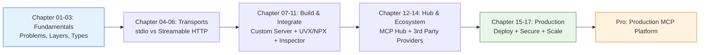

### How the Course is Structured for Builders

- **Chapter-based progression:** Each chapter builds on the previous - no jumping required. Designed for RAG and Agentic AI engineers who need to go from theory to hosted infrastructure.
- **Visual-first explanations:** Doodle-driven breakdowns of protocol layers, request lifecycles, and transport negotiation - particularly useful for reasoning about stateful vs stateless server design.
- **Code-heavy labs:** You will write servers, clients, and hub logic yourself rather than just configuring existing ones. Mirrors real FastAPI + LangChain/LangGraph development workflow.
- **Provided artifacts:** Notes and code samples accompany the video for reproducibility and extension into your own projects.

### Relevance to Healthcare and Medical Education Systems

- **Clinical data governance:** MCP's explicit tool contracts make it easier to enforce scoped access to EHR-derived or curriculum data - a server exposes only approved operations rather than raw DB access.
- **RAG pipeline integration:** A vector-store MCP server (ChromaDB for local prototype, Pinecone for managed scale) can be swapped without changing agent code, enabling A/B evaluation of retrieval quality for medical Q&A.
- **Agentic workflows:** LangGraph agents orchestrating multi-step clinical reasoning (retrieve guidelines -> query formulary -> draft note) benefit from MCP's standardized tool discovery vs custom glue code.
- **Deployment readiness:** The course's end goal - a deployed MCP Hub - directly maps to hosting internal MCP servers behind a FastAPI gateway with auth, logging, and NGINX reverse proxy, the pattern Arun uses for production healthcare AI services.

### Key Takeaways

- This is a **beginner-to-pro** track: assumes no prior MCP experience, ends with a deployable MCP Hub in production.
- Expect deep coverage of **both transports** (stdio for local dev, Streamable HTTP for remote/deployment) and **both ecosystems** (Python/UVX and Node/NPX).
- The course emphasizes **building and shipping**, not just consuming - you will author, debug with Inspector, aggregate in a hub, and deploy.
- For AI Systems Engineers, MCP is the abstraction that turns fragmented tool integrations into a reusable, governed platform layer.

### Preview: Minimal MCP Server Shape (Python)

> Establishes the mental model for upcoming hands-on chapters - a server declares tools/resources that any MCP client can discover.

```python
# Conceptual preview - full implementation in later chapters
# Python MCP server (run via uvx) - analogous to a FastAPI service
# but speaking MCP protocol instead of REST

from mcp.server.fastmcp import FastMCP

mcp = FastMCP("healthcare-knowledge-server")

@mcp.tool()
def search_guidelines(query: str) -> str:
    """Vector search over clinical guidelines (ChromaDB/Pinecone backend)."""
    # In production: query ChromaDB/Pinecone, return top-k chunks
    return f"Results for: {query}"

@mcp.resource("guidelines://cardiology/acs")
def acs_guideline() -> str:
    """Expose curated guideline as MCP resource."""
    return "ACS management protocol..."

if __name__ == "__main__":
    mcp.run()  # stdio by default; streamable HTTP for deployment
```

- **Mapping to Arun's stack:** `search_guidelines` mirrors a RAG retriever tool currently exposed via FastAPI - MCP wraps it as a discoverable agent tool. Transport switch (`stdio` -> `Streamable HTTP`) is the deployment pivot covered in the production chapters.

---
*Next: Chapter 02 - The Problem MCP Solves and Core Protocol Concepts*
# Chapter 02: Pre-Req and Agenda (00:02:00 - 00:06:00) | Part 02 of 17

## Overview
- Masterclass is end-to-end: from fundamentals to production-ready MCP deployment
- Goal is complete coverage so learner needs no external resources
- Positioned as beginner-friendly despite MCP being a new concept (emerged late last year)

## Prerequisites

- **Only basic Python required** - ability to write functions is sufficient
- No prior AI knowledge needed; MCP concepts taught from scratch
- Prior AI experience is a bonus but not a blocker
- For an AI Systems Engineer, this low barrier maps directly to onboarding clinical or ed-tech teams: a healthcare developer comfortable with Python can start building MCP tools for RAG pipelines or agent workflows without deep LLM theory

```python
# Prerequisite check - if you can write this, you are ready
def get_clinical_guideline(topic: str) -> str:
    """Example tool function - core skill needed for MCP server development"""
    guidelines = {"hypertension": "Check BP protocol v2.1"}
    return guidelines.get(topic, "Topic not found")

# No AI expertise needed - MCP wraps this function as a tool for agents
```

## Detailed Agenda

### Phase 1: Fundamentals (Foundation Building)
- **What is MCP and Why MCP** - motivation, advantages over pre-MCP approaches where integrations were already working but fragmented
- **MCP Layers** - architectural layers underpinning the protocol
- **MCP Types** - taxonomy of MCP variants
- Relevance for healthcare AI: understanding layers/types is critical for clinical governance - choosing the right abstraction for auditability when agents access EHR or medical knowledge bases

### Phase 2: Transport Layers
- **STDIO (Standard Input/Output) Transport** - local process-based communication, foundational pattern
- **Streamable HTTP Transport** - newer, now-recommended approach for remote/hosted servers
- Maps to FastAPI deployment thinking: STDIO is like local dev execution, Streamable HTTP is production API exposure - essential for scaling a medical-education agent from local prototype to hosted service

### Phase 3: Build and Integrate
- **Build Your Own MCP Server (Both Types)** - hands-on creation of STDIO and Streamable HTTP servers
- **Integrate MCP Servers Within Your Code** - client-side consumption in agentic workflows
- **Fetch Hosted MCP Servers via UVX and NPX** - leveraging community/hosted servers, described as the heart of MCP ecosystem
- Direct parallels: building custom MCP servers mirrors wrapping ChromaDB/Pinecone retrievers or LangChain/LangGraph tools as standardized endpoints; UVX/NPX consumption is analogous to pulling a hosted vector-search or Playwright automation server into a clinical agent without rebuilding

```python
# Conceptual preview - agenda leads to this pattern
# STDIO for local, Streamable HTTP for hosted
# FastAPI + MCP alignment for healthcare deployment

from fastapi import FastAPI
# Later in course: MCP server exposes tools like this via both transports
# Client fetches via stdio (local) or http (hosted/uvx/npx)
# mcp_client = MCPClient(transport="streamable_http", url="https://mcp.hospital.ai/mcp")
```

## Agenda Roadmap

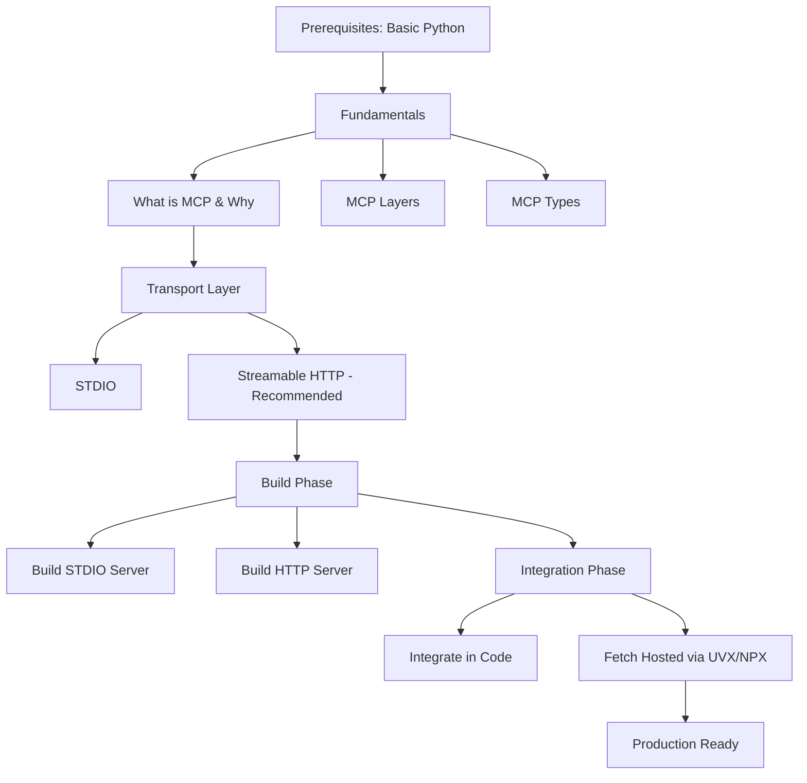

## Key Takeaways
- Entry threshold is intentionally low - Python functions are the only hard requirement
- Agenda is sequenced: theory (what/why/layers/types) -> transports (STDIO then HTTP) -> build -> integrate -> consume ecosystem
- Streamable HTTP is the forward-looking transport to prioritize for deployed healthcare RAG agents
- UVX/NPX ecosystem access is central - enables reuse of existing MCP servers rather than rebuilding clinical tooling from scratch
- Production-readiness is the end goal, not just demos - aligns with clinical governance needs for reliable, deployable AI systems
# Chapter 03: Why Do We Need MCPs? (00:06:00 - 00:18:32) | Part 03 of 17

## Overview
- MCP is very new (introduced by Anthropic, originally an internal solution, then renamed and widely adopted) - to understand its value you must understand what came before
- Before MCP, every service integration was bespoke custom code; MCP standardizes this
- Core question this chapter answers: what was the developer experience before MCP and why is it unsustainable, especially in the agentic AI era
- For healthcare AI systems, this maps directly to the fragility of point-to-point integrations with EHRs, vector DBs, and clinical tools

## Before MCP: The Custom Integration Model

- **Actor:** Developer (named Rahul in lecture) building a solution that consumes external services
- **Services:** Any hosted provider - database, data lake, search API, SaaS product. Lecture uses Oracle DB as canonical example, then Azure Synapse Analytics as second service
- **Interaction pattern:** Service exposes REST API endpoints; developer talks to service only via those APIs
  - Example Oracle endpoints: `oracle/v1/create`, `oracle/v1/query`, `oracle/v1/update`, `oracle/v1/delete`
  - Example Synapse endpoints: same CRUD-style set but entirely different host, auth, and payload contracts
- **Developer-side logic:** In Python (or any language, Python used as default for data domain), you write:
  - Connection/client creation with auth (JWT, user/password, basic auth, tokens)
  - Request functions per endpoint
  - Response parsing and error handling
  - This logic is fully custom per service and lives in your codebase

```python
# Before MCP: custom client per service - duplicated pattern

# Oracle client - one full implementation
import requests

def get_oracle_client():
    token = authenticate_oracle(jwt="...")  # JWT / basic auth / password
    return {"base_url": "https://api.oracle.com/oracle/v1", "token": token}

def oracle_create(payload):
    client = get_oracle_client()
    resp = requests.post(f"{client['base_url']}/create",
                         headers={"Authorization": f"Bearer {client['token']}"},
                         json=payload)
    return resp.json()  # custom parsing per endpoint

# Synapse client - entirely separate implementation, same boilerplate again
def get_synapse_client():
    token = authenticate_synapse(tenant_id="...", secret="...")
    return {"base_url": "https://synapse.azure.com/v1", "token": token}

def synapse_query(query: str):
    client = get_synapse_client()
    resp = requests.post(f"{client['base_url']}/query",
                         headers={"Authorization": f"Bearer {client['token']}"},
                         json={"query": query})
    return resp.json()

# Healthcare mapping: replace Oracle with EHR FHIR API
# and Synapse with ChromaDB/Pinecone retriever or pathology-report store
# -> same N x M duplication problem for every clinical tool
```

- **Key property:** APIs themselves are the source of truth and cannot be removed - they persist, but ownership and evolution sit with the provider, not the consumer

## Three Pain Points (Lecture's Core Framework)

### 1. API URL / Version Breakage
- Provider changes version path, e.g. `oracle/v1/create` -> `oracle/v2/create`
- Described as extremely common - every 1-3 years across virtually all service providers
- Impact is breaking: hardcoded URLs fail, requires manual discovery and code update
- Mitigation attempted: extract URL to variable, assign someone to monitor docs daily - fragile, operational overhead
- Healthcare/MCP mapping: FHIR API versioning (DSTU2 -> STU3 -> R4), hospital EHR upgrades, or Pinecone/ChromaDB hosted endpoint migrations all cause identical breakage if clients are hand-wired

### 2. API Logic / Response Schema Change
- Even if URL stays stable, internal implementation of the endpoint can change
- Response shape, metadata fields, error codes, or required request fields shift
- Developer must re-read documentation, adjust parsing logic, re-test
- Lecture notes this is less frequent than URL changes (providers avoid metadata churn) but still counts as a lag
- RAG relevance: if your retriever wraps a vector DB via raw HTTP, an embedding dimension change or metadata filter syntax change silently breaks retrieval quality - affects clinical citation accuracy and governance audit trails

### 3. Per-Service Connection Duplication (The Biggest Pain)
- Every new service requires a completely distinct connection code block
- Oracle connection logic cannot be reused for Synapse; auth flow, SDK, base URL, and headers all differ
- Adding a service means writing, testing, and maintaining an entire new integration layer
- Cost scales linearly with number of services: 2 services = 2 clients, 10 services = 10 clients, each with independent auth and error handling
- Playwright/LangChain parallel: wrapping a browser automation tool, a PubMed fetcher, and a ChromaDB retriever each demands its own client boilerplate without a standard

## Why This Breaks in the Agentic Era

- Agentic workflows need **20 to 50+ tools** (lecture cites 50-100 as realistic, 20 as minimum) wired into a single AI agent
- Under pre-MCP model, each tool = separate integration + ongoing monitoring for upstream changes
- Teams building agents cannot sustain operations cost: constant doc polling, version tracking, and per-tool code patches
- Low-code / no-code users are completely blocked - AI is meant for everyone, but custom client code is developer-only
- Clinical governance lens: a medical-education agent that needs EHR read, guideline search (RAG over ChromaDB/Pinecone), drug-interaction check, and Playwright-based evidence scraping would require 4-5 bespoke clients; scaling to a hospital system with 30+ data sources becomes unmaintainable and un-auditable

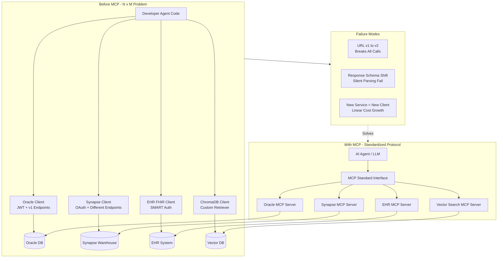

## The Solution: MCP (Model Context Protocol)

- **Origin:** Built by Anthropic (Claude team), then formalized and opened as MCP - now a de facto standard
- **Name is scarier than concept:** lecture intentionally defers formal definition to first establish the pain; solution is simple - a standardized protocol layer between agents and tools
- **What MCP does (preview before deep dive):**
  - Tools/services expose themselves via MCP servers with a common contract
  - Agents/clients consume any MCP server through one uniform interface - no per-service client rewrite
  - Shifts responsibility for versioning, auth negotiation, and schema stability to the server side
- **Not a replacement for APIs:** underlying APIs still exist; MCP wraps and normalizes them
- Lecture explicitly cautions: functions/custom clients still exist in many orgs and MCP is not overnight replacement - but it is becoming the standard, and near-future default
- FastAPI/LangGraph mapping: think of MCP as FastAPI for agent tools - just as FastAPI standardizes HTTP service exposure with Pydantic schemas, MCP standardizes how LangChain/LangGraph agents discover and call tools, whether that tool is a Pinecone semantic search, a SQL EHR query, or a Playwright web action

## Key Takeaways

- Pre-MCP integrations are brittle on three axes: URL versioning, response logic drift, and per-service client duplication
- The duplication axis is the dominant cost driver, especially fatal for agentic systems needing dozens of tools
- Manual mitigation (variable-ized URLs, human doc watchers) does not scale and violates clinical operational constraints around reliability and auditability
- MCP centralizes and standardizes tool exposure so agents need one protocol, not N custom clients
- For Arun Yadav's stack: adopting MCP means ChromaDB/Pinecone retrievers, LangChain tools, and FastAPI clinical services can each be published once as MCP servers and reused across every LangGraph agent without re-implementing auth and transport
- Next chapter will formalize MCP layers and mechanics building on this motivation
# Chapter 04: Paradigm of MCP (00:18:32 - 00:32:33) | Part 04 of 17

## Overview
- Core question: can service providers handle API changes so developers do not have to?
- Introduces the MCP Server as a protection wall in front of raw APIs, with provider-owned functions mapping 1:1 to API endpoints
- Solves three layered pain points: URL/version breakage, maintenance burden, and fragmented connection logic via a single standardized JSON config (USB-C port analogy)

## Before MCP vs With MCP — The Shift

### The Pain (Revisited from Ch 03)
- Developer Rahul writes custom wrapper logic per service (e.g., Oracle DB API + Synapse Analytics API)
- Each integration requires hand-coded connection, request handling, response parsing
- When provider changes API URL, version, or metadata, developer code breaks — provider will not notify or fix consumer code

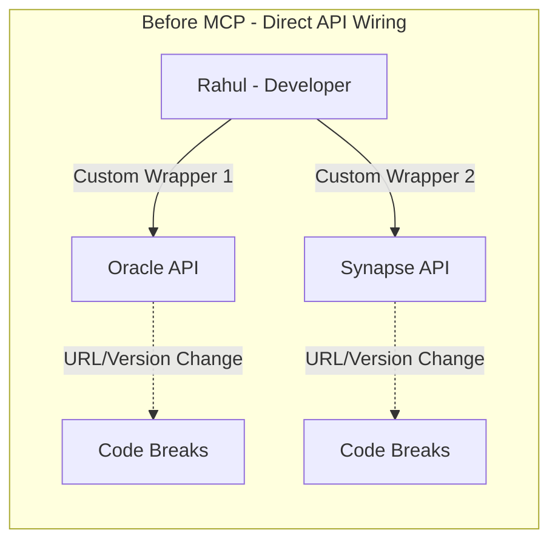

- For a healthcare AI Systems Engineer, this mirrors integrating directly against FHIR APIs, EHR endpoints, or a ChromaDB/Pinecone vector store — every schema or endpoint change forces RAG pipeline rewrites and re-validation in clinical workflows

### The MCP Server as Protection Wall
- Service provider (Oracle, Synapse, or any data owner) builds an MCP Server that sits in front of its APIs
- Inside the MCP Server, provider creates discrete functions for each API operation:

| MCP Function | Maps To |
|--------------|---------|
| create() | POST /records |
| query() | GET /records/{id} |
| update() | PUT /records/{id} |
| delete() | DELETE /records/{id} |
| insert() | POST /batch |

- Each function is a wrapper that internally calls the real API, gets the response, and returns it to the developer
- Developer no longer writes API-call logic — connects directly to the MCP Server functions instead

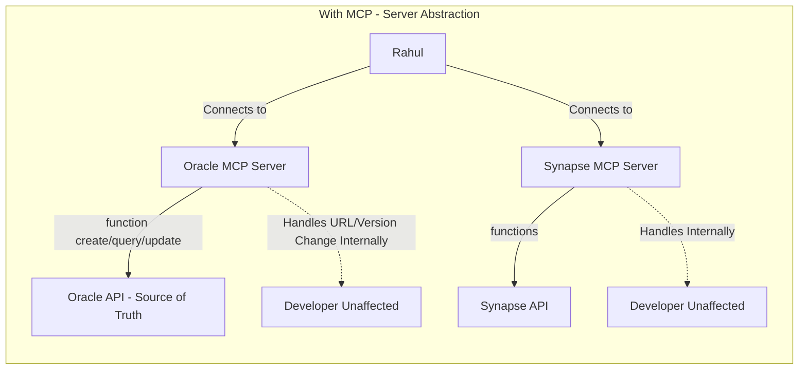

- APIs remain the source of truth — MCP does not replace them, it standardizes access to them
- Healthcare mapping: Think of an EHR provider or medical-guidelines service exposing a `search_guidelines()` or `get_patient_context()` MCP function — the hospital IT team updates FHIR endpoint routing inside the MCP Server, while your LangGraph agent or FastAPI RAG service continues calling the same function without redeployment

```python
# Before MCP: developer owns breakage-prone wrapper
import requests

def query_oracle_legacy(patient_id: str):
    # Breaks when Oracle changes /api/v1 -> /api/v2
    url = "https://oracle.example.com/api/v1/query"
    resp = requests.get(url, params={"id": patient_id})
    return resp.json()

# With MCP: developer calls provider-maintained function
# Provider updates internal URL mapping inside MCP Server
# mcp_oracle.query(patient_id="P-123")  -> always works
# No URL hardcoding, no manual migration on version bump

# Healthcare analog: vector store as MCP tool
# Before: direct ChromaDB client with collection name + embedding logic scattered
# With MCP: mcp_chromadb.query_medical_kb(query="hypertension guidelines")
```

## The Deeper Problem: Fragmented Connections

- Even with MCP Servers, Rahul still faces one connection per server — Oracle MCP uses one connection pattern, Synapse MCP another
- If every provider requires distinct connection logic, the integration burden returns at the connection layer
- This is the final pain point MCP was designed to eliminate entirely

## The USB-C Port — Standardized JSON Configuration

### Analogy
- Before USB-C: laptop needed different holes/cables for mouse, keyboard, webcam, headset — plus dongles/hubs to extend ports; manufacturers and users both paid complexity cost
- After USB-C: single standard port — plug any device with the same cable shape; extensible via hubs but base contract is uniform

### MCP Equivalent
- JSON configuration object acts as the universal USB-C port for MCP
- To connect a client to any MCP Server, developer declares only the server name and its config (typically URL + transport details) in JSON — no per-provider connection code

```json
{
  "mcpServers": {
    "oracle-db": {
      "command": "npx",
      "args": ["-y", "@oracle/mcp-server"],
      "env": { "ORACLE_URL": "https://oracle.example.com" }
    },
    "synapse-analytics": {
      "command": "npx",
      "args": ["-y", "@synapse/mcp-server"],
      "env": { "SYNAPSE_URL": "https://synapse.example.com" }
    }
  }
}
```

- Adding a third, fourth, or nth server means appending 2-3 lines to the same JSON — Python client treats all servers uniformly
- Unlimited plugs: unlike a laptop with 2-3 physical ports, the MCP client can host N servers through this config

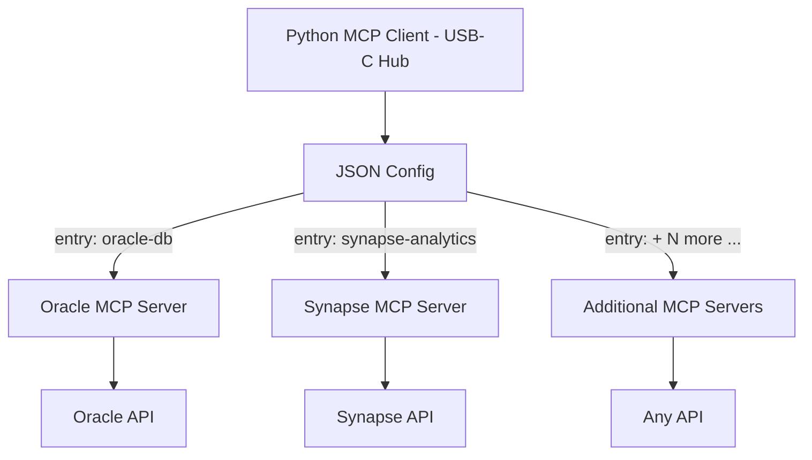

- For Arun's stack: this JSON-registry pattern is exactly how a FastAPI-hosted LangGraph agent can compose multiple clinical tools — one entry for `chromadb-medical-kb`, one for `pinecone-case-store`, one for `playwright-e2e-validator`, one for `fhir-ehr-server` — all discovered through the same client interface, swapped without code changes

```python
# FastAPI + MCP client - USB-C config pattern for healthcare agent
# config.json holds all MCP Servers; agent code stays unchanged when swapping providers

import json

# 1. Load single config
with open("mcp_config.json") as f:
    config = json.load(f)  # {"mcpServers": {"chromadb-medical-kb": {...}, "fhir-ehr": {...}}}

# 2. Client connects to all servers uniformly
# from mcp import Client
# client = Client(config)  # internal: iterates mcpServers, establishes each transport

# 3. Agent (LangChain/LangGraph) sees unified tool list
# tools = await client.list_tools()  # [query_medical_kb, get_patient_record, validate_ui]
# agent = create_react_agent(tools=tools)

# Adding a new hospital system = one JSON entry, zero agent rewrite
# Essential for clinical governance: auditable, declarative integration surface
```

## Self-Hosted vs Provider-Hosted MCP

- **Provider-hosted:** Oracle/Synapse (or Pinecone, GitHub, Google Maps) ships the MCP Server — developer only consumes via JSON config
- **Self-hosted / Organizational MCP:** Enterprise builds its own MCP Server wrapping internal APIs, data lakes, or clinical workflow services so every internal agent and team reuses the same tool contract
- Self-hosted pattern is dominant in the AI era for healthcare orgs: wrap internal EHR, LMS, or RAG retrieval logic as an org-wide MCP Server for auditability and reuse

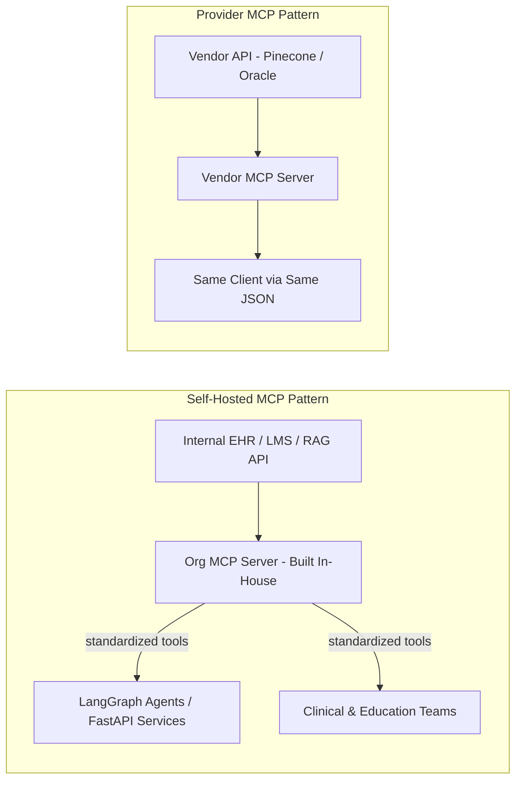

- Both patterns coexist — an AI Systems Engineer typically consumes vendor MCPs for commodity services and builds self-hosted MCPs for proprietary clinical logic
- Playwright as a case: a hosted Playwright MCP Server can be consumed for UI validation, or a self-hosted variant can wrap org-specific test harnesses

## What You Must Learn (Course Roadmap Anchor)

1.  **How to use existing MCPs** — connect via JSON config, discover and call tools
2.  **How to build your own MCP** — author functions/tools, expose them via MCP protocol (STDIO and Streamable HTTP)
3.  **How to deploy MCP Servers** — host for org or public consumption so agents can reach them in production

- Instructor emphasizes: mastering the why (this chapter) is prerequisite before diving into components, types, and hands-on builds in upcoming chapters
- Official spec reference flagged: `modelcontextprotocol.io` maintained by Anthropic — source of truth to follow alongside the course

## Key Takeaways

- MCP Server is a provider-owned abstraction wall: functions map 1:1 to APIs, provider absorbs URL/version churn, developer code stays stable
- Biggest power is not just the server but the **standardized connection** — a 2-3 line JSON entry (USB-C port) replaces bespoke connection logic per provider and scales to N servers
- APIs remain source of truth; MCP is an efficiency and governance layer, not a replacement
- Organizational MCPs are first-class: healthcare/education teams should plan to both consume vendor MCPs (ChromaDB, Pinecone, Playwright) and author self-hosted servers for internal FHIR/RAG/LangGraph tooling
- Next step after paradigm clarity: MCP components, types, and transport layers (STDIO vs Streamable HTTP) — foundational before building and deploying in FastAPI production contexts
# Summary: Chapter 05 - MCP Architecture (00:32:33 - 00:41:20)

## Overview
- MCP is an open-source standard (modelcontextprotocol.io) for connecting AI applications like Claude and ChatGPT to external systems - databases, files, local data sources, and services like Postgres, GitHub, Google Maps.
- Core idea: a standardized protocol sits between clients (AI apps/agents) and services, replacing bespoke per-API integrations.
- Chapter frames high-level docs overview and then dives into the 3-component architecture: MCP Host, MCP Client, MCP Server.

## What MCP Enables
- Personalized AI assistants: agent accesses Google Calendar, Notion, drive, EHR/knowledge bases with user context.
- Code generation agents like Claude Code can generate full web apps by calling tools via MCP.
- For Arun Yadav's stack: same pattern lets an Agentic AI tutor or clinical assistant call MedEd tools - RAG over ChromaDB/Pinecone, LangGraph workflows, Playwright for evaluation - through one uniform interface instead of N custom connectors.

## Why MCP Matters - 3 Stakeholder Benefits
- Developers: reduces development time and complexity; no manual handling of URL changes, API version bumps, or per-service client boilerplate.
- Applications / Agents: instant access to ecosystem of data sources, tools, and apps; composable and discovery-driven.
- End users: more capable, context-aware assistants with live data.
- Extra pain point highlighted: function renames break direct API integrations.
  - Before MCP: if provider renames `get_data` to `fetch_data`, calling code breaks and needs a redeploy.
  - With MCP: server publishes function list (create, update, query, etc.); client discovers at runtime, so renames propagate automatically without code changes. Demonstrated later in course via live client build.

## The 3-Component Architecture

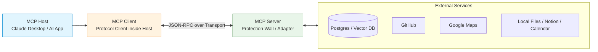

- **MCP Host**: The AI application that wants to use tools - e.g., Claude Desktop, ChatGPT, or a custom FastAPI + LangGraph agent. Host manages lifecycle, UX, and permissions; can hold multiple clients.
- **MCP Client**: Protocol-aware client inside the Host. One client per server connection. Handles handshake, capability negotiation, tool discovery, and JSON-RPC messaging.
- **MCP Server**: Lightweight adapter (the "protection wall") that sits in front of the real API/source of truth. Exposes standardized functions/tools, resources, and prompts. Built and maintained by service owner, so URL/version/function renames are handled server-side.
- Flow: Host -> Client discovers `tools/list` on connect -> presents tools to LLM -> LLM decides to call `tool/call` -> Client forwards to Server -> Server executes against real service -> result returns to LLM.

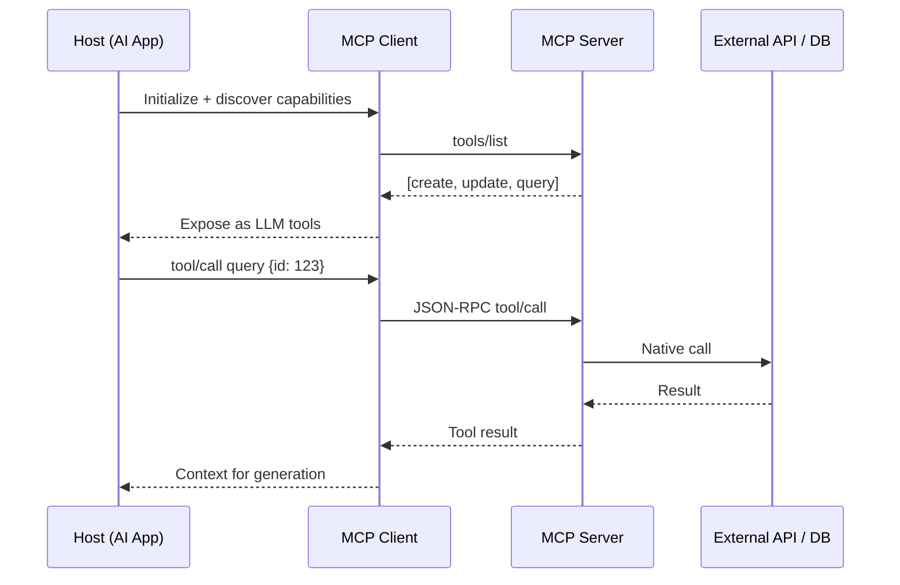

## Mental Model for Healthcare / MedEd Systems
- Think Host = your MedEd copilot app (FastAPI backend serving students/clinicians), Client = LangChain/LangGraph MCP client, Server = wrappers around ChromaDB (curriculum RAG), Pinecone (case bank), Postgres (FHIR-like records), or Playwright (autograde UI checks).
- Value for Arun: service teams own renames/versioning; your agent stays stable. Swap ChromaDB to Pinecone behind same MCP tool `semantic_search` without touching agent logic.
- Pattern aligns with RAG/Agentic AI best practice: tool abstraction over direct SDK calls, enabling evaluation and reuse.

## Minimal Code Sketch - Client Discovers Tools Dynamically

```python
# pip install mcp
import asyncio
from mcp import ClientSession, StdioServerParameters
from mcp.client.stdio import stdio_client

# Arun's MedEd agent connects to a Postgres/RAG MCP server
server_params = StdioServerParameters(
    command="python",
    args=["./mcp_servers/med_rag_server.py"],
    env=None
)

async def run():
    async with stdio_client(server_params) as (read, write):
        async with ClientSession(read, write) as session:
            await session.initialize()
            # No hardcoded function names - discover at runtime
            tools = await session.list_tools()
            print([t.name for t in tools.tools])  # e.g. ['create', 'update', 'query']

            # LLM would choose this; here we call directly
            result = await session.call_tool("query", arguments={"q": "management of DKA"})
            print(result.content)

asyncio.run(run())
```

- Note the rename resilience: if server renames `query` to `query_records`, next `list_tools()` returns new name automatically - no client redeploy, unlike `from sdk import query` hardcoding.
- Production variant replaces `stdio_client` with `streamablehttp_client` for scalable FastAPI deployment (covered in Ch. 06).

## Key Takeaways
- MCP standardizes how any AI app connects to any service via Host-Client-Server triad documented at modelcontextprotocol.io.
- Servers act as stable adapters; clients auto-discover tools, so breaking changes stay server-side.
- Architecture sets up next chapter on transports (stdio vs streamable HTTP) and why stdio dominates local dev while HTTP wins for deployed Agentic RAG services.
# Chapter 06: STDIO vs Streamable HTTP MCPs (00:41:20 - 00:49:13) | Part 06 of 17

## Overview
- Two transport options define how an MCP server communicates: STDIO and Streamable HTTP
- STDIO runs the entire MCP server locally as a child process via standard input/output
- Streamable HTTP exposes the MCP server as a remote HTTP endpoint supporting GET/POST, headers, and auth tokens
- Streamable HTTP is newer (introduced last year) and now the recommended choice for scalable, production agentic workflows
- STDIO was the original recommended transport, remains widely used in GitHub repos, and is still relevant for local and small-group use
- Instructor introduces two conceptual layers: transport layer (how client and server talk) and data layer (what is exchanged and how it is structured)
- Prerequisites to build MCP servers from next chapters: VS Code and Python 3.11 or 3.10+

## STDIO Transport - Local Process Model
- Execution model: download the MCP package and run it locally on your machine as a subprocess
- Communication via stdin/stdout between one client and one server instance
- Characteristics:
  - Simple to set up for personal prototypes and small-team tools
  - Limited to one client per local server process at a time
  - No built-in remote auth or multi-tenant scaling
- Historical context: very popular choice when MCP first launched and the only officially recommended option
- Healthcare/MedEd parallel for Arun Yadav: like a standalone clinical utility running on a single workstation - for example a local de-identification script, a pathology slide classifier, or a bedside quiz generator for med students that a single instructor runs locally without networking

## Streamable HTTP Transport - Scalable Remote Model
- Execution model: host the MCP server as a standard web service reachable over HTTP
- Client interacts via normal HTTP requests, sending auth tokens in headers or query parameters
- Characteristics:
  - Handles many concurrent clients and requests
  - Fits standard web-app patterns for authentication, authorization, and load balancing
  - Required when moving from a personal tool to a product used by many users
- Why it is gaining adoption:
  - Agentic AI workflows increasingly need shared, scalable services
  - Aligns with how FastAPI and other production APIs are already deployed
- Recommendation: use Streamable HTTP when building production applications intended for broad use
- Healthcare/MedEd parallel: like exposing a clinical decision-support tool as a secured hospital API - for example a drug-interaction checker or RAG over clinical guidelines behind an OAuth gateway, consumable by multiple wards, EHR integrations, or ed-tech frontends simultaneously

## Why Both Still Matter
- Most existing community MCP servers on GitHub are still STDIO-based because that was the standard at MCP inception
- Knowledge of both transports is mandatory to consume the ecosystem and to maintain backwards compatibility
- STDIO is not legacy in the deprecated sense - it remains appropriate for local dev, testing, single-user agents, and privacy-sensitive offline use
- Streamable HTTP is the forward path for hosted, multi-user, deployed systems
- Practical guidance from chapter: learn STDIO first to understand fundamentals and ecosystem, then adopt Streamable HTTP for production

## Two Architectural Layers of MCP

### 1. Transport Layer - How Client and Server Communicate
- Defines the communication channel
- Two variants map directly to the two server types:
  - STDIO transport: client talks to a local process via stdin/stdout
  - Streamable HTTP transport: client talks to a remote server via HTTP
- Determines deployment, scaling, and auth characteristics

### 2. Data Layer - What Is Exchanged
- Defines the payload structure, typically JSON
- Specifies what is being requested and returned: tools, prompts, resources, and other capabilities
- Handles schema definitions and contracts for what is shared between client and server
- Ensures consistent interpretation of tool inputs/outputs regardless of transport
- Healthcare/MedEd angle: the data layer is where clinical safety lives - Pydantic schemas for dosage, ICD codes, or guideline citations remain identical whether the transport is local STDIO or remote HTTP, enabling validation before any patient-facing output

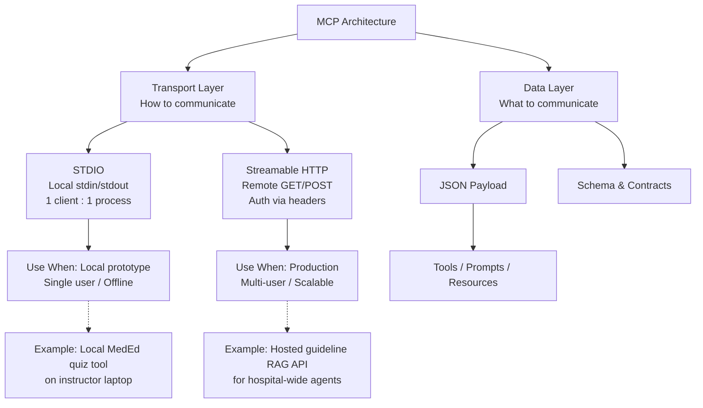

## Prerequisites Before Building MCP Servers
- Code editor: VS Code recommended, any editor works
- Python: 3.11 recommended as stable, 3.10 also acceptable, versions older than 3.10 not recommended (3.9 explicitly discouraged due to missing changes)
- No other heavy prerequisites - remaining frameworks and packages will be installed during the hands-on build sections
- All demos in upcoming chapters will cover both STDIO and Streamable HTTP implementations

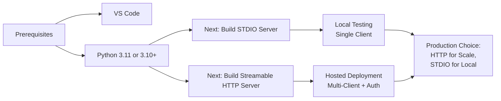

## Key Takeaways for AI Systems Engineering
- Choose transport by deployment context, not ideology: STDIO for local, fast iteration and privacy-sensitive single-user tools; Streamable HTTP for shared services
- For Arun Yadav portfolio: prototype a clinical extractor or MedEd tutor via STDIO on localhost, then promote the same tool logic to Streamable HTTP behind FastAPI with token-based auth for student cohorts or clinical teams
- Scaling pivot is explicit in course: one-client-per-process does not meet hospital or cohort scale; HTTP enables connection pooling, horizontal scaling, and centralized logging/auditing required for healthcare governance
- Data layer discipline is transport-agnostic: keep JSON schemas and Pydantic validation consistent so a tool validated locally can be deployed remotely without rewriting contracts
- Ecosystem fluency requires both: you will encounter STDIO servers in the wild and will deploy Streamable HTTP servers for new products - be fluent in each
# Chapter 07: Create STDIO MCP Server | 00:49:13 - 01:01:00 | Part 07/17

## Overview
- Hands-on build of first local MCP server using Python, `uv`, and `FastMCP`.
- As an AI Systems Engineer, Arun Yadav frames this as the foundational systems pattern: isolate environment, define tool contracts, choose transport (STDIO for local), then verify serve locally before exposing to any host or client.
- Covers project bootstrap from empty folder to running STDIO server with two tools (`fetch` and `process`), emphasizing environment hygiene and LLM-readable tool design.

## Setup: Isolated Environment with uv
- Create empty project folder (e.g., `MCP masterclass`) in VS Code via File > Open Folder.
- Industry standard: never build on global Python. Create a virtual environment first.
- Install `uv` - Rust-based Python package manager, significantly faster than `pip`:
  ```bash
  pip install uv        # macOS: pip3 install uv
  uv --version
  ```
- Initialize project (equivalent to `npm init`):
  ```bash
  uv init
  uv sync   # creates .venv and syncs pyproject.toml
  ```
- Adding dependencies the idiomatic way:
  ```bash
  uv add fastmcp
  # alternative兼容: uv pip install <package>
  ```
- `pyproject.toml` tracks dependencies automatically; `uv sync` reproduces the env deterministically.
- Systems lens for Arun Yadav: `uv` gives reproducible, fast env creation critical for shipping agentic systems across machines and CI. Version-lock `pyproject.toml` before sharing server with a team.

## Activating and Verifying the Environment
- VS Code may auto-activate `.venv` in a new terminal; if not, activate manually:
  ```bash
  # Windows
  .venv\Scripts\activate
  # macOS/Linux
  source .venv/bin/activate
  ```
- Verify isolation:
  ```bash
  pip list
  fastmcp --help   # or: python -m fastmcp --help
  ```
- Transcript note: instructor forgot to activate before `uv add`, but `uv` still installed into `.venv`. Verifies with `pip list` and `fastmcp` CLI responding `usage: fastmcp ...`.
- Systems takeaway: always confirm `which python` points to `.venv` before `run`. Global pollution is a common failure mode in local MCP development.

## Building the First STDIO Server with FastMCP

### Architecture
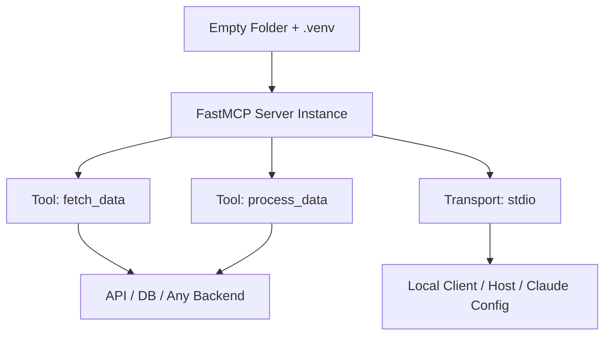

### Minimal Server Code
- Pattern mirrors `FastAPI`: import class, instantiate app, decorate functions, run with transport.

```python
# file: mcp_simple/first_mcp_server_stdio.py
from fastmcp import FastMCP

mcp = FastMCP("first-mcp-server")

@mcp.tool
def fetch_data() -> str:
    """Use this tool to fetch data from a source."""
    # Systems hook: replace with real API call, DB query, or internal service
    # e.g., requests.get("https://internal-api.company.com/data")
    data = "hello MCP"
    return data

@mcp.tool
def process_data() -> str:
    """Use this tool to process the fetched data."""
    # Add transformation / enrichment logic here
    return "data has been processed"

if __name__ == "__main__":
    mcp.run(transport="stdio")
```

- Key details from transcript:
  - Decorator: `@mcp.tool` converts any Python function into an MCP tool. Optional `name` param exists but instructor recommends keeping function name and tool name identical to avoid confusion.
  - Docstring is non-negotiable: LLMs use the docstring as the tool contract to decide when to call it. More detailed description = better agent routing.
  - Comments inside function indicate where to insert real backend logic (API, database).

### Why STDIO
- `transport="stdio"` means server runs locally via stdin/stdout. Server owner chooses transport; STDIO is for local development where client downloads and spawns the server as a subprocess.
- Contrasts with `sse` / `streamable-http` for remote deployment (covered later). For Arun Yadav's systems work, STDIO is the lowest-latency, Zero-network local loop for prototyping tool contracts before remote deployment.
- Boilerplate `if __name__ == "__main__":` is required entry point.

## Running and Verifying the Server
- Run inside activated `.venv`:
  ```bash
  python mcp_simple/first_mcp_server_stdio.py
  ```
- Expected output: FastMCP banner / CLI visual confirming server is up and running, waiting on stdio.
- At this point server is ready but needs a client/host + config to connect (next chapter). STDIO servers are not hit via HTTP; they are spawned by the host process.
- Troubleshooting mentioned: long file paths make run command verbose; keep project structure shallow during prototyping.

## Key Systems Principles for Arun Yadav
- Isolation first: `uv init` + `uv add` + `.venv` activation ensures reproducible builds across dev, staging, prod.
- Contract first: tool function + `@mcp.tool` + precise docstring is the API contract. Treat docstring as you would OpenAPI description.
- Transport as architecture decision: choose `stdio` for local, single-machine agents; choose SSE/HTTP for shared, deployed services. Decision impacts scaling and observability.
- Local verification loop: build -> `pip list` -> `fastmcp --help` -> `python ...` -> see server up, before wiring to Claude Desktop or any LLM host. This prevents coupling env errors with client config errors.
- Next step: create a client that spawns this STDIO server and lists/calls tools, validating end-to-end flow before deployment.

## TL;DR for Revision
- `uv init` -> `uv add fastmcp` -> `source .venv/bin/activate` -> verify with `fastmcp`.
- `FastMCP("name")` -> `@mcp.tool` + docstring -> `mcp.run(transport="stdio")`.
- STDIO = local subprocess transport; docstring = LLM tool selection context; verify server starts before adding client.
# Chapter 08: Create Python MCP Client (01:01:00 - 01:21:38) — Part 08/17

## Overview
- This chapter builds the first Python MCP client that connects to a stdio-based MCP server.
- Two approaches are presented: a raw, low-level approach for learning the internals, and a recommended production approach using LangChain.
- Focus in this chunk is the raw client: understanding every import, path, and async primitive before abstracting it away.

## Why Two Ways to Build a Client
- **Raw approach:** Not used in production, but essential to understand the behind-the-scenes flow — how a client discovers tools, reads schemas, and routes calls.
- **Recommended approach:** Simplified, opinionated framework (LangChain) that hides boilerplate for production-grade agentic systems.
- For Arun Yadav's stack, this maps directly to the AI Systems Engineer workflow: first instrument the protocol manually (MCP/FastAPI), then standardize on LangChain/LangGraph for maintainability in Healthcare/MedEd deployments.

## Prerequisites and Dependencies
- `fastmcp` is for building MCP servers; for the client you need the core `mcp` package.
- Install with:

```bash
uv add mcp
# verify in pyproject.toml / dependencies that mcp is present
```

- Required imports for the raw stdio client:

```python
import os
import asyncio
from mcp.client.stdio import stdio_client
from mcp import ClientSession, StdioServerParameters
```

## Dynamic Path Resolution for the Server Script
- Never hardcode the server path like `C:/mcp-masterclass/server.py` — it breaks across Mac/Linux/Windows and in containers.
- Use `os.path` to compute a portable absolute path relative to the client file:

```python
# Build path dynamically so it works on any OS / deployment target
mcp_server_script = os.path.join(
    os.path.dirname(os.path.abspath(__file__)),
    "first_mcp_server_stdio.py"  # your stdio server filename
)
print(mcp_server_script)  # sanity check the resolved path
```

- Pattern used: `os.path.abspath(__file__)` -> `os.path.dirname()` -> `os.path.join(dir, filename)`.
- In a Healthcare/MedEd system where MCP servers might live in a dedicated `mcp_servers/` directory alongside FastAPI services and RAG pipelines, this pattern lets you centralize servers and route clients to them without config drift between local dev and Linux deployment.

## Creating Stdio Server Parameters
- `StdioServerParameters` tells the client how to spawn the server subprocess.

```python
server_params = StdioServerParameters(
    command="python",
    args=[mcp_server_script],
    env={}  # no env vars needed for basic stdio; pass dict if required
)
```

- `command`: executable to run the server (`python` for `python server.py`).
- `args`: list containing the server script path (cast to string if needed).
- `env`: empty dict when no environment variables are required.
- This parameter object is reusable across clients — define once, reuse for every stdio connection.

## Async Architecture — Why Everything Is Async
- MCP stdio servers are asynchronous; clients must use `asyncio` and the `async`/`await` event-loop model.
- `async def` defines a coroutine; `await` yields control until the I/O operation completes instead of blocking the thread.
- `async with` is an asynchronous context manager — it ensures the stdio transport and session are opened and closed cleanly.

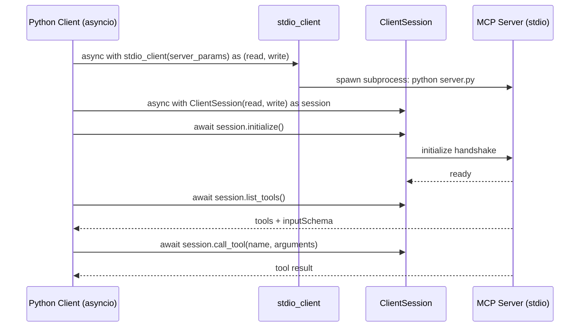

- FastMCP expects async functions only; if you write `def tool():` without `async`, it wraps it to async internally. Always author `async def` for tool handlers to avoid hidden thread-blocking — critical when your MCP tools wrap I/O-heavy operations like vector search (ChromaDB/Pinecone), EHR FHIR calls, or LLM inference.

## Full Raw Client — Wiring Transport, Session, and Tools

```python
import os
import asyncio
from mcp.client.stdio import stdio_client
from mcp import ClientSession, StdioServerParameters

# 1. Resolve server path portably
mcp_server_script = os.path.join(
    os.path.dirname(os.path.abspath(__file__)),
    "first_mcp_server_stdio.py"
)

# 2. Define how to launch the server
server_params = StdioServerParameters(
    command="python",
    args=[mcp_server_script],
    env={}
)

# 3. Async main — all MCP I/O happens here
async def main():
    # Outer context: stdio transport (read/write streams)
    async with stdio_client(server_params) as (read, write):
        # Inner context: MCP session over that transport
        async with ClientSession(read, write) as session:
            await session.initialize()
            print("Session initialized")

            # Discover tools exposed by the server
            tools = await session.list_tools()
            print(tools)
            # tools: meta, nextCursor, tools=[Tool(name, description, inputSchema)]

            # Call a tool with arguments (example: process)
            result = await session.call_tool("process", arguments={"path": "/data/notes.pdf"})
            print(result)

            # Call a no-arg tool (example: fetch)
            result2 = await session.call_tool("fetch", arguments={})
            print(result2)

if __name__ == "__main__":
    asyncio.run(main())
```

- Run with `python python_client.py` or `python -m python_client`.
- Expected console output after `list_tools()` includes `Available tools -> tools=[Tool(name='fetch', description='Use this tool to fetch data from a source', inputSchema=...), Tool(name='process', ...)]`.

## Tool Discovery — What list_tools() Returns
- `await session.list_tools()` returns a structured response:

```text
meta=None, nextCursor=None,
tools=[
  Tool(name='fetch', title=None, description='Use this tool to fetch data from a source', inputSchema={'additionalProperties': False, 'properties': {}, 'type': 'object'}),
  Tool(name='process', description='Process data at path', inputSchema={'properties': {'path': {'type': 'string'}}, 'required': ['path']})
]
```

- Key fields:
  - `name`: function identifier the agent will call.
  - `description`: auto-populated from the Python docstring under `@mcp.tool` — whatever you write as the function's docstring becomes the LLM-facing description.
  - `inputSchema`: JSON Schema describing arguments — `properties`, `type`, `required`, `additionalProperties`.
  - `title`: optional, None if not provided.
- Relevance for agentic workflows: the LLM does not just get function names; it gets names + natural language descriptions + typed JSON schemas. This lets a LangChain/LangGraph agent decide *which* tool to call, *what* arguments to supply, and *in what format* (JSON), without custom prompting.
- In Arun's MedEd context, a tool like `retrieve_guideline(disease: str)` would automatically expose `disease: string` in `inputSchema`, so an agent triaging clinical queries can ground tool selection in structured metadata rather than brittle prompt parsing.

## Docstring to Description — The @mcp.tool Decorator
- On the server side:

```python
from mcp.server.fastmcp import FastMCP
mcp = FastMCP("demo")

@mcp.tool
def fetch():
    """Use this tool to fetch data from a source"""
    return "data"

@mcp.tool
def process(path: str):
    """Process data at path"""
    return f"data has been processed at {path}"
```

- The decorator introspects the function signature and docstring and converts them into the MCP `Tool` metadata. Adding a typed parameter `path: str` automatically adds `properties: {path: {type: string}}` to `inputSchema`.
- This is why MCP is in demand: a single decorator produces everything an agentic workflow needs — no manual OpenAPI spec, no separate schema file.

## Calling Tools Programmatically
- Once the session is initialized, any exposed tool can be invoked:

```python
# No arguments
result = await session.call_tool("fetch", arguments={})

# With arguments — arguments must match inputSchema and are sent as JSON
result = await session.call_tool("process", arguments={"path": "/data/clinical_notes.pdf"})
print(result)
# -> "data has been processed at /data/clinical_notes.pdf"
```

- Whether the tool is called by a human, an automation pipeline, or an LLM agent, the path is identical: `session.call_tool(name, arguments)`. The client abstracts the JSON-RPC over stdio; no manual JSON handling is required.
- For Arun's RAG pipeline, this means the same `call_tool` path serves both unit tests (deterministic Python calls) and agentic orchestration (LangChain agent dynamically selecting `vector_search` vs `fetch_guideline`).

## Raw vs Recommended — Where LangChain Fits
- Raw client teaches the transport/session/initialize/list/call lifecycle — valuable for debugging, custom transports, and understanding why MCP tools need async.
- Production client (next section in the course, not detailed in this transcript chunk) uses LangChain's MCP adapters to reduce the entire flow to a few lines, handle retries, and plug directly into LangGraph state machines.
- Mental model for team adoption: prototype raw to validate schema and latency, then promote to LangChain MCP toolkit for deployment behind FastAPI, with observability and auth consistent with the rest of the stack.

## Common Pitfalls and Fixes
- Missing `mcp` dependency: `uv add mcp` if `ClientSession` import fails — `fastmcp` alone is not enough.
- Hardcoded paths: always use `os.path` dynamic resolution; fails silently on deployment otherwise.
- Forgetting `await` on `session.initialize()`, `list_tools()`, or `call_tool()`: raises coroutine-never-awaited errors.
- Forgetting `asyncio.run(main())` or `import asyncio`: the coroutine never executes.
- Using synchronous `def` for tools when they perform I/O: thread blocking under load; prefer `async def`.
- Passing `args` as a string instead of list: `args` expects `list[str]`.

## Key Takeaways
- Stdio client requires three pieces: `StdioServerParameters`, `stdio_client` transport, and `ClientSession`.
- `os.path` dynamic joins make the client portable across dev and deployment environments.
- `await session.initialize()` is mandatory before any tool discovery or invocation.
- `list_tools()` returns LLM-consumable metadata — the contract that enables autonomous tool selection.
- `call_tool()` is the unified invocation surface for humans, pipelines, and agents.
- For Arun Yadav's Healthcare/MedEd systems, this raw client is the foundation for wrapping clinical tools, vector stores, and FastAPI microservices as MCP tools that LangChain agents can orchestrate reliably.
# Chapter 09: Integrate MCP with Langchain (01:21:38 - 01:34:04) | Part 09 of 17

## Overview
- Focus is client-side consumption of MCP servers using LangChain instead of raw Python MCP SDK
- Introduces `langchain-mcp-adapters` package and its `MultiServerMCPClient` utility as the preferred way to connect to any MCP server
- Demonstrates end-to-end flow: install, configure JSON, instantiate client, call `get_tools()`, and verify tool conversion for LangChain agents
- For Arun Yadav as AI Systems Engineer, this is the bridge between isolated MCP tools and production LangChain/LangGraph agentic workflows in healthcare and medical education systems

## Why LangChain Client
- Raw Python client shown in previous chapters works, but requires manual handling
- LangChain ecosystem is where real agents are built, so MCP tools must be compatible with LangChain's tool abstraction
- Instructor emphasizes LangChain is not the focus of this course, only one function is borrowed, and recommends learning LangChain before LangGraph since LangGraph is built on top of LangChain
- References his dedicated LangChain and LangGraph full courses as up-to-date (post v1.0) resources, but this chapter needs no prior LangChain depth

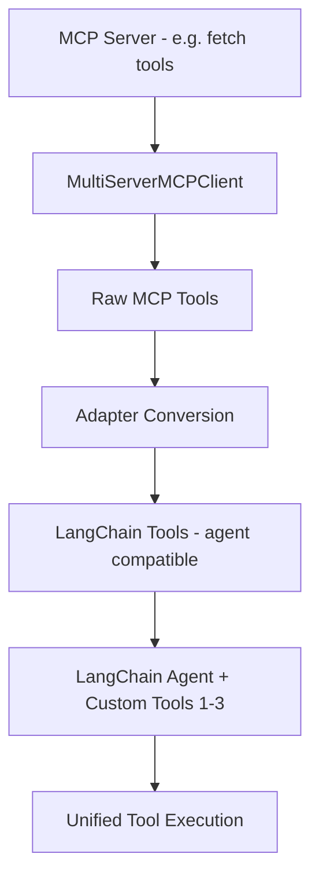

## Setup and Installation
- Base install `langchain` alone is insufficient for MCP integration
- Required adapter package must be added explicitly:
  - `uv add langchain-mcp-adapters` or `uv add mcp-adapters` variant as shown in demo
- Import path used:
  - `from langchain_mcp_adapters.client import MultiServerMCPClient`
- For an AI Systems Engineer, this mirrors `pip install` patterns for ChromaDB/Pinecone or FastAPI extensions where core library does not bundle protocol adapters by default
- Arun Yadav note: pin this adapter version in `pyproject.toml` / `uv.lock` to avoid drift between dev and hosted deployment

## Client Configuration JSON Structure
- Same conceptual JSON introduced in earlier MCP client chapters, now passed to `MultiServerMCPClient`
- Four required keys per server entry:

- **Server name** - arbitrary key, example `fetch` or `data_fetch_mcp` or `data_fetch_mcp_stdio` for clarity
- **transport** - `stdio` for local process communication (Streamable HTTP covered earlier as production alternative)
- **command** - Python executable that runs the server
  - Can be `python`, but in virtual environment dev setup should point to absolute `venv/Scripts/python.exe` path
  - Demo copies absolute path via right-click copy path on Windows
  - Handles Windows backslashes via raw string `R"..."` or double-escaped backslashes
- **args** - path to server file, example `chapter/mcp_create/mcp_server.py` or forced `mcp_forced` path

- Dev vs prod distinction highlighted:
  - Dev: absolute venv python path ensures correct interpreter and dependencies
  - Prod: no venv, dependencies installed directly in environment, so `python` command is fine

```python
# Pattern taught for Arun Yadav style service setup - LangChain MCP client
import asyncio
from langchain_mcp_adapters.client import MultiServerMCPClient

client = MultiServerMCPClient({
    "data_fetch_mcp": {
        "transport": "stdio",
        "command": R"C:\path\to\venv\Scripts\python.exe",
        "args": ["chapter/mcp_create/mcp_server.py"]
    }
})

async def main():
    tools = await client.get_tools()
    print("Available tools:", tools)

if __name__ == "__main__":
    asyncio.run(main())
```

## Building and Running the Client
- Define `async def main()` and wrap with `asyncio.run()`
- Instantiate `MultiServerMCPClient` with the config dict
- Call `await client.get_tools()` (shown in transcript as `client.get_tools()` / `list_tools` variant)
- Print and verify output, re-running after `clear` to confirm deterministic fetch
- Adapter handles all connection, stdio negotiation, and session management under the hood

## Core Insight: Tool Conversion for Agent Compatibility
- Both raw Python client and LangChain client fetch the same underlying MCP tools, for example `fetch` with description
- Difference is post-processing:
  - Raw client returns native MCP tool objects
  - `MultiServerMCPClient.get_tools()` fetches raw tools then converts each into LangChain `Tool` objects
- Why this matters:
  - LangChain agents expect tools decorated via `@tool` pattern
  - Arun Yadav typically builds custom tools (tool 1, tool 2, tool 3) for EHR search, guideline retrieval, or ChromaDB RAG
  - MCP-fetched tools must share the same interface as those custom tools to be combined in a single agent executor
  - Without conversion, two incompatible tool types would break agent routing

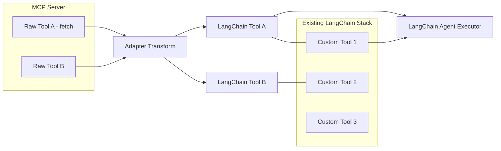

- Instructor analogy: developer has 3 LangChain tools and fetches 2 from MCP; adapter re-colors them into LangChain style so all 5 can run together
- Benefit for ecosystem: smooth conjunction of MCP providers and LangChain, reducing friction when building agents that consume external MCP servers
- Arun Yadav takeaway: this conversion is what enables a FastAPI-hosted LangGraph agent to expose a unified toolset that mixes internal vector DB retrievers and external MCP Playwright or filesystem servers without custom wrapping

## Comparison At A Glance
- **Raw Python client** - manual, demonstrates protocol, good for learning
- **LangChain client** - same fetch logic underneath, adds LangChain Tool conversion, ready for `create_agent` / `AgentExecutor` integration
- Tool name and description appear similar in logs, but types differ, LangChain variant is agent-ready
- Decision going forward in course: standardize on LangChain client for all subsequent agent builds

## Key Takeaways for Arun Yadav - AI Systems Engineer
- Standardize on `MultiServerMCPClient` for any RAG or agentic service that will eventually run under LangGraph or FastAPI, because it guarantees tool compatibility from day one
- Treat the config JSON as environment-specific, inject `command` and `args` via env variables, especially when moving from Windows `venv` path to Docker `python` in deployment
- Validate tool conversion early by logging `type(tool)` and `tool.name` after `get_tools()`, prevents runtime mismatches when merging MCP tools with internal `@tool` functions
- Catalog LangChain and LangGraph as sequential upskilling steps, LangChain first for tool and chain fundamentals, LangGraph next for stateful multi-agent clinical workflows
- For medical education agents, this pattern lets Arun Yadav mix local STDIO MCP servers during development with Streamable HTTP hosted servers in production without changing agent code, only the JSON transport block
# Chapter 10: Create Streamable HTTP MCP Server (01:34:04 - 01:42:44) | Part 10 of 17

## Overview
- Completes dynamic client hardening started in prior chapter, then pivots to Streamable HTTP transport for MCP servers
- Core message: building a Streamable HTTP server requires zero changes to tool logic - only transport declaration - decorators handle the rest
- Establishes local-hosted HTTP as the bridge to production deployment where clients call a URL instead of a local package
- For Arun Yadav AI Systems Engineer: this transport switch is the exact pattern for moving a healthcare RAG agent from local prototype (STDIO) to hosted service that clinical UIs can consume without local code

## Part A: Make LangChain Client Dynamic

- Hardcoded paths break across environments; dynamic resolution is production-grade
- Use `import os` and path manipulation to locate MCP server script relative to current file
- Virtual environment nuance: project has `.venv` at repo root, not inside chapter subfolder - requires traversing up two `dirname` levels before joining
- Construct Python executable path as `.venv/Scripts/python` (Windows) or `.venv/bin/python` and pass as command to client

```python
import os
from pathlib import Path

# Dynamic path resolution - both client and server at same level
current_file = Path(__file__).resolve()
# Need two dirname calls to reach repo root where .venv lives
project_root = current_file.parent.parent  # chapter folder -> root
venv_python = project_root / ".venv" / "Scripts" / "python.exe"  # or bin/python on Linux

# Instead of hardcoded paths
mcp_server_script = current_file.parent / "mcp_server.py"

# Client uses dynamic python + script path
# command = str(venv_python)
# args = [str(mcp_server_script)]
```

- Verification: run client - tools like `fetch` now discovered dynamically - confirms path logic works
- Note from chapter: in real production you often skip venv reliance (containerized / managed runtime), but dynamic paths remain best practice

```python
# Healthcare lens: same pattern for MedEd agent
# Avoids breakage when deploying to hospital staging vs local dev
import os
from pathlib import Path

def get_mcp_server_config():
    root = Path(__file__).resolve().parent.parent
    venv_python = root / ".venv" / "Scripts" / "python.exe"
    server_script = Path(__file__).parent / "clinical_mcp_server.py"
    return {"command": str(venv_python), "args": [str(server_script)]}
```

## Part B: Create Streamable HTTP MCP Server

### Zero-Code-Change Principle
- Existing MCP server code needs no modification to switch transports
- Only difference is how you declare you want to run it - decorators abstract transport handling
- File organization: create new folder for HTTP variant (e.g., `http_mcp/`) and new file `http_mcp.py`

### Transport Configuration
- Declare transport as `streamable_http` (not `stdio`)
- Set host and port: `host="0.0.0.0"` and `port=8050`
- Port 8080 is common for backends; 8050 chosen to avoid conflict - any free port works
- `0.0.0.0` binds to all interfaces locally; not a browsable domain itself, but serves on localhost

```python
# http_mcp.py - Streamable HTTP MCP Server
from mcp.server.fastmcp import FastMCP

# Same tool definitions as STDIO server - no logic change
mcp = FastMCP("healthcare-http-server")

@mcp.tool()
def search_guidelines(query: str) -> str:
    """Example clinical tool - reused unchanged from STDIO version"""
    return f"Guideline results for: {query}"

@mcp.tool()
def fetch_drug_info(drug: str) -> str:
    """Fetch formulary data - same function, new transport"""
    return f"Info for {drug}"

if __name__ == "__mcp__":
    pass

# Run configuration - transport declaration is the only delta
# Option A: via FastMCP settings
# mcp.run(transport="streamable_http", host="0.0.0.0", port=8050)

# Option B: CLI / decorator config depending on SDK version
# FastMCP(host="0.0.0.0", port=8050) with streamable_http transport
```

```python
# Equivalent minimal - what the chapter shows conceptually
from mcp.server.fastmcp import FastMCP

mcp = FastMCP("http-mcp", host="0.0.0.0", port=8050)

@mcp.tool()
def add(a: int, b: int) -> int:
    return a + b

# Transport declared at init/run - "streamable_http"
# mcp.run(transport="streamable_http")
```

### STDIO vs Streamable HTTP - Execution Model

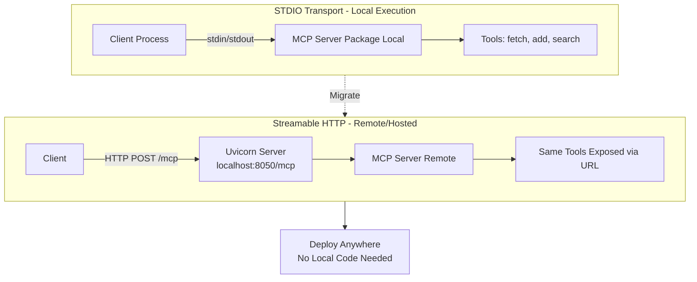

- STDIO: client executes server package locally via standard input/output - requires code on client machine
- Streamable HTTP: requests go to a URL over HTTP - server can run locally now, later on any domain after deployment
- Advantage: consumers do not need local code checkout; they call the hosted endpoint - critical for healthcare platform where frontend, agent orchestrator, and MCP servers scale independently

- For Arun's healthcare systems: this maps directly to exposing a ChromaDB/Pinecone-backed RAG retriever or a clinical guideline service as `https://mcp.hospital.ai/mcp` behind FastAPI + NGINX, enabling LangGraph agents to call it without bundling the vector DB locally

### Running and Verifying

- Execute via play button / `python http_mcp.py` - Uvicorn starts and logs `Uvicorn running on http://0.0.0.0:8050`
- Auto-exposes endpoint at `/mcp` -> full URL is `http://localhost:8050/mcp`
- Host nuance: `0.0.0.0` in logs is not a clickable domain - to verify locally, open browser and navigate to `http://localhost:8050/mcp`

```bash
# Server start
python http_mcp.py
# Logs: Uvicorn running on http://0.0.0.0:8050
# Endpoint: http://localhost:8050/mcp
```

- Browser test: visiting `http://localhost:8050` alone returns Not Found - must append `/mcp`
- Visiting `http://localhost:8050/mcp` in a regular browser returns JSON-RPC error:

```json
{
  "jsonrpc": "2.0",
  "id": null,
  "error": {
    "code": -32600,
    "message": "Client must accept text/event-stream"
  }
}
```

- This error is expected - browser sends `text/html`, but Streamable HTTP requires `Accept: text/event-stream` (Server-Sent Events)
- Confirms server is running correctly; it is not a web app with a UI, it is an MCP endpoint

### Why This Matters and What Comes Next

- MCP server is not a web application - do not expect a rendered page at the URL
- Proper inspection requires MCP Inspector tool - provides UI to discover tools, invoke them, and trace requests - introduced next in the course
- Transition sets up hosted development: same server will be deployed remotely so external clients can fetch via URL without local install

## Key Takeaways
- Dynamic client paths using `os`/`pathlib` with double `dirname` to reach `.venv` makes LangChain MCP clients environment-portable
- Streamable HTTP server needs no tool-code changes - only `transport="streamable_http"`, `host="0.0.0.0"`, `port=8050` declaration
- Uvicorn serves the MCP server at `localhost:8050/mcp` - verify via `localhost`, not `0.0.0.0`, and always include `/mcp` suffix
- Browser JSON-RPC error about `text/event-stream` is correct behavior, not a failure - signals SSE-based Streamable HTTP is active
- STDIO is local process I/O; Streamable HTTP is URL-based and enables deployment - choose STDIO for dev, Streamable HTTP for any hosted healthcare/MedEd agent
- Next step is MCP Inspector for proper tool testing, followed by remote deployment patterns directly applicable to FastAPI-hosted clinical AI services
# Chapter 11: MCP Inspector (01:42:44 - 01:55:07) | Part 11 of 17

## Overview
- Introduces MCP Inspector as the interactive developer tool for testing and debugging MCP servers without writing client code
- Covers the Node.js prerequisite for running the Inspector: installing Node, verifying `node`, `npm`, `npx`, and initializing `package.json`
- Demonstrates launching the Inspector via `npx @modelcontextprotocol/inspector`, connecting over Streamable HTTP to `http://localhost:8050/mcp`, and exercising tools through the browser UI
- For Arun Yadav as AI Systems Engineer, Inspector is the local validation gate before integrating any MCP server into FastAPI, LangChain/LangGraph, or a hosted MCP Hub

## What MCP Inspector Is
- Official interactive UI provided by the Model Context Protocol for inspecting local and production MCP servers
- Provides visual listing of resources, prompts, and tools exposed by a server
- Allows running tools directly from the UI with input parameters and inspecting JSON results
- For Arun Yadav, equivalent to Swagger UI for FastAPI or Playground for GraphQL but protocol-native for MCP: fast feedback loop before committing to agent wiring

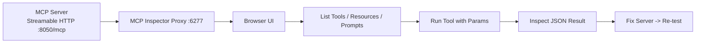

## Prerequisite: Node.js Runtime
- Inspector is distributed as a Node package, so Node.js is required regardless of Python stack
- Instructor framing: Node is a runtime similar to Python for executing JavaScript
- Installation:
  - Search `node download` -> nodejs.org -> choose Windows or Mac installer -> next/next/install
  - Restart terminal or machine if `node -v` is not recognized after install
- Verification commands taught in chapter:
  - `node -v` -> e.g. `v22.17.0` in demo (transcript shows `2022.17.0` typo)
  - `npm -v` -> npm ships with Node, package manager analogous to `pip`
  - `npx -v` -> runner for packages without global install
- Failure mode: if any of the three commands is missing, reinstall Node
- For Arun Yadav, this is a one-time environment setup comparable to ensuring `uv` / `python` is on PATH before any MCP or FastAPI work

## Node Project Setup Without Virtual Environments
- Node does not use Python-style `venv`; isolation is handled via `package.json`
- Instructor demo flow:
  - `npm init` -> interactive prompts for name, version, description, entry point, test command
  - Preferred shortcut: `npm init -y` -> accepts defaults from working directory, no prompts, saves time
  - Result: `package.json` created at project root containing dependencies and scripts
- `package.json` is the Node equivalent of `pyproject.toml` / virtual environment manifest
- Instructor explicitly states deep Node knowledge is not needed for this course; only one package will be used
- Arun Yadav note: treat `package.json` as the counterpart to `pyproject.toml` and `uv.lock` for reproducibility, commit it if Inspector is part of the repo tooling

## Installing and Launching MCP Inspector
- Package name: `@modelcontextprotocol/inspector`
- The chapter shows two equivalent paths: via `npm` documentation or direct `npx` invocation; instructor recommends `npx` to avoid global install
- Core command:

```bash
npx @modelcontextprotocol/inspector
```

- Behavior:
  - `npx` automatically fetches the package if not present, prints `Need to install the following packages ... ? y`
  - Starts a proxy server listening on `http://localhost:6277`
  - Prints `Proxy server listening on localhost:6277` and `Opening in browser`
  - Auto-opens the Inspector UI in the default browser
- Precondition stressed: MCP server must already be running before launching Inspector
  - Demo server running on `http://localhost:8050/mcp` with logs like `Uvicorn running on ...`
- For Arun Yadav as AI Systems Engineer, this mirrors `uv run fastapi dev` -> then opening `http://localhost:8000/docs`: server first, tooling second

## Connecting Inspector to the MCP Server
- Inspector does not auto-discover the server URL; user must configure transport and endpoint
- Two transport options shown in UI dropdown:
  - `STDIO` for local process-spawned servers
  - `Streamable HTTP` for HTTP servers (used in this chapter)
- Demo configuration:
  - Transport: `Streamable HTTP`
  - URL: `http://localhost:8050/mcp`
  - Action: click `Connect` -> status `Connected: FastMCP server`
- Once connected, Inspector is bound to that server instance; output in VS Code terminal confirms proxy forwarding
- Production relevance: same UI works for deployed servers by replacing `http://localhost:8050/mcp` with `https://<host>/mcp`
  - No code change needed, only URL swap, which is exactly the local-to-hosted pivot Arun Yadav needs for healthcare staging vs prod

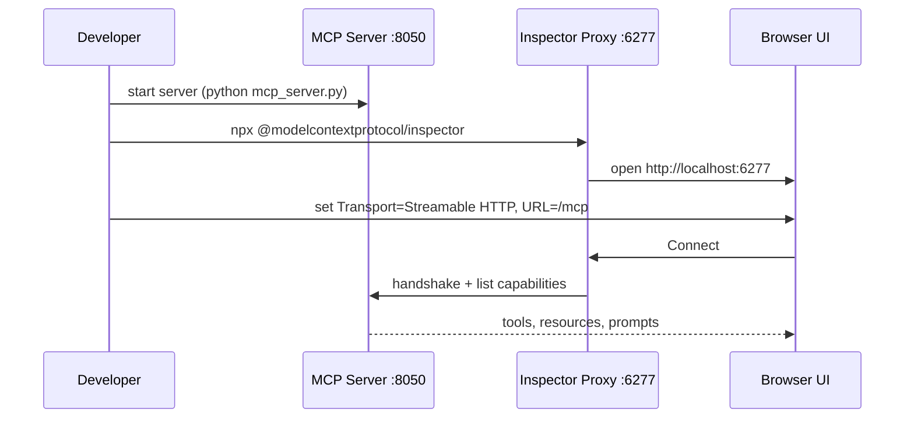

## Navigating the Inspector UI
- Three top-level sections reflect the MCP protocol primitives:
  - **Resources** -> none in demo, because no `mcp.resource()` was defined
  - **Prompts** -> none in demo, no `mcp.prompt()` defined
  - **Tools** -> two entries: `fetch` and `process`
- Listing tools:
  - Click `Tools` -> `List Tools` -> Inspector enumerates tool names, descriptions, and JSON schemas derived from Python function signatures
- Instructor commentary on prevalence:
  - Roughly 99.999% of real MCP servers expose only tools; prompts and resources exist but are secondary
  - Prompts are described as analogous to Claude Code skills (markdown prompt files) where a reusable prompt is hosted on the server rather than a callable function
  - Most teams handle prompt and resource logic inside the tool itself; creating separate prompts/resources is optional and low-demand
- Arun Yadav takeaway: for clinical RAG or medical education agents, standardize on tools first; add prompts only if a reusable system-prompt template needs server-side governance

## Running and Debugging Tools
- Flow for `process` tool with a parameter:
  - Select `process` -> UI renders input form with field `path` derived from function signature
  - Enter value e.g. `my path` or leave empty for parameterless tools
  - Click `Run Tool` -> Inspector sends `tools/call` request to server
  - Result pane shows `Tool result: Success` with returned JSON/dictionary payload
  - Scroll to inspect the exact dictionary returned by `return` in the Python server file
- Flow for parameterless tool (e.g. `fetch` variant in demo):
  - No input form rendered, directly `Run Tool` -> success payload visible
- Validation with Pydantic mentioned: server can integrate Pydantic for strict input/output schema validation, and Inspector will surface schema violations immediately
- Value proposition repeated: no client code needed to verify server correctness; iterate quickly on arguments and observe output
- For third-party or hosted MCP servers, same flow applies: paste the hosted URL, list tools, run with test inputs, verify before wiring into LangGraph

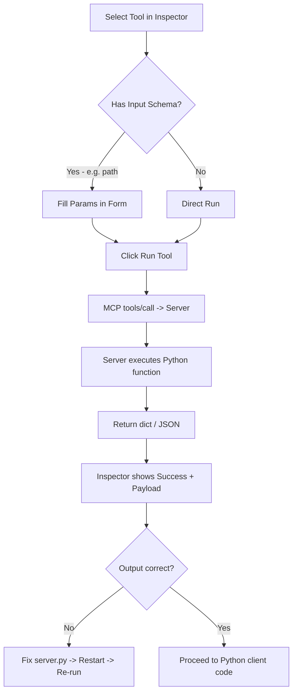

## Without-Client vs With-Client Testing
- Inspector covers the without-client path: UI-driven validation that the MCP server is running and returning correct data
- Instructor bridges to next step: as developers, the with-client path is still required where Python code programmatically discovers and calls tools via `MultiServerMCPClient` or raw MCP SDK
- Inspector is intentionally positioned as the pre-flight check before writing that integration code
- For Arun Yadav, this establishes a two-stage QA pattern:
  - Stage 1 local: Inspector on `localhost` for rapid iteration during FastAPI service development
  - Stage 2 integrated: Python LangChain client in `chapter/mcp_create/mcp_client.py` style, then CI and deployment checks against the hosted Streamable HTTP endpoint

## Practical Tips from the Chapter
- Use `npm init -y` over interactive `npm init` to avoid repetitive prompts
- Do not worry about `package.json` scripts or `index.js` entry point for this course; they are scaffolding only
- If Inspector shows empty Resources/Prompts, that is expected when only `@mcp.tool()` decorators are used
- If `Connect` fails, verify the MCP server process is still running and the URL path includes `/mcp`
- For Arun Yadav, add Inspector to the team runbook as the first debug step when any new MCP server for EHR, guideline, or vector-store access is authored

## Key Takeaways for Arun Yadav - AI Systems Engineer
- Adopt Inspector as the mandatory smoke test for every MCP server before it enters any FastAPI or LangGraph pipeline: if it does not list and run cleanly in Inspector, do not wire it to an agent
- Treat Node/npm/npx as lightweight tooling dependencies, not a stack shift; pin Inspector invocation to `npx @modelcontextprotocol/inspector` in onboarding docs so Python-focused teammates do not need Node expertise
- Standardize local transport to `Streamable HTTP` at `http://localhost:8050/mcp` during development and swap to `https://<prod-host>/mcp` in deployment, validating both endpoints with Inspector before releasing
- Design servers around tools first, keep prompts/resources for future governance needs, and enforce Pydantic schemas on tool I/O so Inspector surfaces contract violations early
- Capture Inspector success payloads as regression fixtures: the dictionary returned for `fetch` and `process` becomes the expected output for automated integration tests in CI

---
*Next: Chapter 12 - Building the Python MCP Client for Programmatic Tool Invocation*
# Chapter 12: Langchain Client For HTTP MCP Server (01:55:07 - 02:08:17) | Part 12 of 17

## Overview
- Builds on Chapter 09 LangChain client, now switching transport from `stdio` to `streamable HTTP` for hosted MCP servers
- Demonstrates the core MCP composability promise using USB-C port analogy - adding new servers is plug-and-play via JSON config without rewriting client logic
- Shows how to extend an existing `MultiServerMCPClient` with an additional HTTP server alongside existing stdio servers, resulting in 4 concurrent MCP servers
- For Arun Yadav as AI Systems Engineer, this is the production pivot where local dev servers and remote hosted servers coexist behind a single LangChain agent

## The USB-C Analogy - Why MCP Client is Powerful
- Instructor frames MCP as USB-C: standardized port where any compliant device plugs in instantly
- Value proposition: want another tool server, just add its entry to the client JSON, no code refactor
- LangChain client (`langchain-mcp-adapters`) is presented as the best approach for this because it normalizes all plugged-in servers into unified LangChain tools
- Arun Yadav angle: mirrors FastAPI microservice aggregation where new internal services (guideline retriever, formulary lookup, ChromaDB RAG) are onboarded by config, not by rewriting the agent orchestrator

## Prerequisites
- HTTP MCP server must already be running before creating or running the client
- Demo verifies server is running nicely on `http://localhost:8050` before touching client code
- Client file work is done by copying the existing `langchain client` file pattern established earlier, not writing from scratch

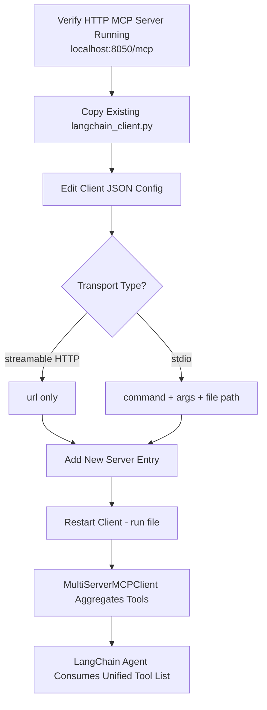

## Stdio vs Streamable HTTP - Config Difference

- **stdio config** - local execution model:
  - Requires `command` - python executable to spawn the server process
  - Requires `args` - path to the server Python file
  - Client actually launches the server as a child process
  - Needs `mcp_server` script / file on disk locally

- **Streamable HTTP config** - remote/hosted model:
  - No `command` needed - not executing locally
  - No `args` needed - no local file to point to
  - No `mcp_server` script reference at all
  - Only needs `transport` and `url`
  - Host URL contains full endpoint including `/mcp` suffix: `http://localhost:8050/mcp`

- For Arun Yadav, this decouples deployment: same agent code runs against local stdio servers in dev and remote HTTP servers in Docker / cloud without conditional logic, only config changes

## Step-by-Step - Adding an HTTP Server to LangChain Client

- Start from existing working client that already has stdio servers defined
- Instructor chooses to add, not replace: keep existing servers as-is and append one more entry to prove composability
- Optional cleanup: can rename tools / function names for clarity around HTTP handling, then restart server to ensure clean state
- Edit the `MultiServerMCPClient` JSON dict:
  - Add trailing comma after last existing server entry
  - Paste new server block with distinct key name, example `http_server` or `mcp_http_4th`
- New server entry structure:

```python
# Pattern for Arun Yadav style multi-transport client
from langchain_mcp_adapters.client import MultiServerMCPClient

client = MultiServerMCPClient({
    # Existing stdio servers kept intact
    "fetch_stdio": {
        "transport": "stdio",
        "command": "python",
        "args": ["chapter/mcp_servers/fetch_server.py"]
    },
    # New - 4th server via Streamable HTTP
    "custom_http_server": {
        "transport": "streamable_http",
        "url": "http://localhost:8050/mcp"
    }
})

# No other client code changes required
# tools = await client.get_tools() works across all 4 servers
```

- Key details stressed in demo:
  - Transport value must be `streamable_http` not `stdio`
  - URL key is literally `url`, not `host` or `endpoint`
  - Must include `/mcp` path segment at end of URL or connection fails
  - Localhost port `8050` is the server's exposed HTTP port from previous chapter setup

## Building and Running

- After editing JSON, re-run the client file directly
- Demo confirms client starts and aggregates tools from all servers including the new HTTP one
- Adapter handles heterogeneous transports internally: stdio subprocess negotiation plus HTTP streaming, same `get_tools()` call returns combined LangChain tool list
- Verifies that adding the 4th server required zero changes to tool invocation or agent executor logic beyond the JSON entry

```mermaid
flowchart LR
    subgraph STDIO["Local STDIO Servers"]
        S1[Server 1 - stdio]
        S2[Server 2 - stdio]
        S3[Server 3 - stdio]
    end
    subgraph HTTP["Hosted HTTP Server"]
        H1[Server 4 - streamable_http<br/>localhost:8050/mcp]
    end
    S1 --> C[MultiServerMCPClient]
    S2 --> C
    S3 --> C
    H1 --> C
    C --> T[Unified LangChain Tools<br/>get_tools]
    T --> A[Agent Executor]
```

## Core Insight for Production

- Single client abstraction hides transport heterogeneity from the agent
- This is what makes MCP behave like USB-C for AI systems: swapping or adding a ChromaDB RAG server, Playwright automation server, or healthcare guideline server is a config edit, not a code deploy
- Previous step of renaming tool functions to `tool` names with HTTP suffix is organizational, not required for functionality, but helps Arun Yadav trace which tools came from which transport during debugging

## Key Takeaways for Arun Yadav - AI Systems Engineer

- Standardize all forward builds on `MultiServerMCPClient` with mixed transports: keep `stdio` for fast local iteration, add `streamable_http` for shared or deployed services
- Treat `url` as an environment variable, inject `http://localhost:8050/mcp` in dev and `https://mcp.yourdomain.com/mcp` in production, same pattern as FastAPI service URLs
- Enforce `/mcp` suffix validation in config loader to avoid silent connection failures when onboarding new hosted MCP servers
- Log `len(await client.get_tools())` per transport after startup to confirm all 4 servers contributed tools, critical for observability in healthcare agents where missing guideline or formulary tools could degrade clinical answers
- Copy-and-extend workflow shown is intentional for reliability: duplicate a working `langchain_client.py` rather than templating from scratch to preserve working stdio entries while adding HTTP

---
*Next: Chapter 13 - MCP Hub and Multi-Server Orchestration (extends this multi-transport client pattern to hub-level aggregation)*
# Chapter 13: Using Community MCPs (02:08:17 - 02:23:08) | Part 13 of 17

## Overview
- Focus is on consuming third-party and community MCP servers instead of building everything from scratch
- Core argument: if a well-coded, well-tested open-source MCP already exists for a capability like web search, reuse it rather than reimplementing edge cases and maintenance
- Demonstrated end-to-end using the community DuckDuckGo Search MCP as the reference example
- Shows how to discover, validate, install via `uvx`/`npx`, and wire the server into the existing `MultiServerMCPClient` (LangChain) workflow from Chapter 09
- For Arun Yadav as AI Systems Engineer, this is the ecosystem leverage pattern - assembling production agents from curated community servers for search, filesystem, or browser automation while reserving custom builds for proprietary healthcare logic

## Why Community MCPs Matter

- **Build vs reuse decision:**
  - You have most tools built, but lack one capability such as search for the agent
  - First check if a community MCP already covers it; build only if no viable server exists
  - Reuse avoids duplicated effort, inherits edge-case handling, testing, and ongoing community fixes
- **Distribution model:**
  - Community MCPs are published as open-source packages on GitHub and on package registries
  - Anyone can consume them once published; availability is not restricted to the author
- **Validation before adoption - Arun Yadav checklist:**
  - Check GitHub stars (example server had 1000+ stars), open issues, and last update timestamp (example was updated 2 weeks ago)
  - Test locally before promoting to shared or production environments
  - Confirm license, maintenance activity, and description quality before pinning in production

```mermaid
flowchart LR
    A[Agent Needs Search Capability] --> B{Community MCP Exists?}
    B -- No --> C[Build Custom MCP Server]
    B -- Yes --> D[Validate - Stars, Issues, Last Update, Local Test]
    D --> E[Install via uvx or npx]
    E --> F[Wire into MultiServerMCPClient]
    F --> G[Unified Agent Toolset]

    style D fill:#e3f2fd,stroke:#1565c0
    style F fill:#e8f5e9,stroke:#2e7d32
```

## Example: DuckDuckGo Search MCP

- **Why this example:**
  - Search is the most common missing piece when assembling agents
  - DuckDuckGo provides a free search engine alternative to paid Google Search MCPs, which instructor notes exist but are not used in this demo
  - Instructor also promises to show a paid search provider later for completeness
- **Source clarification:**
  - No official DuckDuckGo MCP - the server is built and maintained by a community developer, not by DuckDuckGo itself
  - This illustrates the typical community pattern: wrapper MCPs around third-party APIs built by independent contributors
- **What it provides:**
  - Two tools discovered at runtime:
    - `search` - search the web via DuckDuckGo, returns list of results with titles, URLs, snippets; used for current information and research
    - `fetch` / `fetch_content` - fetch content of a specific result page
  - `search` description is verbose and well-documented, which helps LLM tool selection

## Distribution: uvx vs npx and Registry Mapping

- **Two distribution paths cover the ecosystem:**
  - `uvx` - for Python-based MCP servers, package lives on PyPI
  - `npx` - for Node-based MCP servers, package lives on npm
- **Author publishing side:**
  - Author chooses one stack (Python or Node) and publishes to the corresponding registry (PyPI or npm)
- **Consumer side - key MCP advantage:**
  - Consumer does not need to match the author's stack
  - Only requirement is having both `python`/`uvx` and `node`/`npx` installed locally
  - `npx <package>` downloads the npm package and runs it locally via stdio
  - `uvx <package>` downloads the PyPI package and runs it locally via stdio
  - Prior chapter's Inspector was already run via `npx <package>` - same mechanism
- **Verification shown:**
  - Instructor searches PyPI for the DuckDuckGo package to confirm it exists as a public Python package
  - Confirms standard distribution path: community author pushes to PyPI, consumer pulls via `uvx`

```mermaid
flowchart TD
    A[Community MCP Author] --> B{Author Stack}
    B -- Python --> C[Publish to PyPI]
    B -- Node --> D[Publish to npm]
    C --> E[Consumer runs uvx package-name]
    D --> F[Consumer runs npx package-name]
    E --> G[stdio Transport - Local Process]
    F --> G
    G --> H[MultiServerMCPClient get_tools]
```

## Integrating Into LangChain Client - JSON to Config Conversion

- **Starting point:**
  - Community MCP README provides a ready-made JSON snippet for the server configuration
  - Instructor copies this JSON directly for use in the client
- **Transport identification:**
  - If the run command is `uvx` or `npx` with no URL, the transport is `stdio`
  - No HTTP URL means not Streamable HTTP - same stdio pattern used for local custom servers in earlier chapters
- **Mapping to `MultiServerMCPClient` config:**
  - From README JSON to LangChain JSON is a minimal translation
  - `command`: set to `"uvx"` - not a venv-specific `python` path, because `uvx` will globally download and run the package via standard input/output
  - `args`: package name array, e.g. `["duckduckgo-mcp-server"]` - the argument that follows `uvx` on the command line
  - `transport`: `"stdio"`
- **Arun Yadav pattern:**
  - Dev workflow using venv python path (`C:\path\to\venv\Scripts\python.exe` with raw string) still applies for custom servers
  - For community servers, switch to global `uvx`/`npx` command - no venv path needed, isolates community package from local env
  - Keep the config dict environment-specific so the same agent code works locally and in Docker/FastAPI deployment

```python
# Pattern taught - community MCP wired into LangChain client
# File: chapter_03/community_mcp.py (created in this chapter)
import asyncio
from langchain_mcp_adapters.client import MultiServerMCPClient

client = MultiServerMCPClient({
    "duckduckgo_search": {
        "transport": "stdio",
        "command": "uvx",
        "args": ["duckduckgo-mcp-server"]
    }
})

async def main():
    tools = await client.get_tools()
    print(f"Available tools: {len(tools)}")
    for tool in tools:
        print(f"- {tool.name}: {tool.description[:120]}")

    # Invoke first tool - search
    search_tool = tools[0]  # search
    result = await search_tool.ainvoke({"query": "what is the capital of France?"})
    print(result)

if __name__ == "__main__":
    asyncio.run(main())
```

## Hands-On Walkthrough Shown

- **Project setup:**
  - Create new section `chapter 3 - third party MCPs`
  - Create file `community_mcp.py` and paste the README JSON, then adapt to LangChain client format
  - Reuse the LangChain client boilerplate from Chapter 09 - imports, `MultiServerMCPClient` instantiation, `async main()` with `asyncio.run()`
- **Running and inspecting:**
  - Run the file, clear terminal and re-run to verify deterministic output
  - First run prints full tool objects including names and long descriptions
  - Simplify to `len(tools)` - confirms exactly 2 tools
  - Loop `for tool in tools: print(tool.name)` - outputs `search` and `fetch_content`
- **Tool invocation:**
  - Initial attempt with `client.call_tool` fails - no such method on `MultiServerMCPClient`
  - Instructor checks LangChain docs - correct pattern is to treat fetched tools as native LangChain tools
  - Fetch tool handle: `fetch_tool = tools[0]`
  - Invoke via `await fetch_tool.ainvoke({"query": "what is the capital of France?"})` - async invoke is the LangChain tool contract
  - `ainvoke`/`invoke` are native to LangChain tools, not to the MCP client itself
  - Result returns 9 search results with titles, Wikipedia links, URLs, and snippets - confirms the community server works end-to-end
  - For Arun Yadav, this confirms the adapter conversion from Chapter 09 works identically for community servers - fetched tools behave like custom `@tool` functions in LangGraph

## Key Takeaways for Arun Yadav - AI Systems Engineer

- Treat community MCPs as the default for commodity capabilities (web search, fetch, filesystem, browser automation) and reserve custom MCP builds for proprietary healthcare operations like EHR queries, ChromaDB/Pinecone RAG over clinical guidelines, or medical curriculum resources
- Enforce a validation gate before pinning any community server: stars, last commit date, issue triage, and local `uvx`/`npx` smoke test; pin exact package version in `pyproject.toml` / `uv.lock` to prevent supply-chain drift between dev and FastAPI deployment
- Standardize all consumption through `MultiServerMCPClient` with `stdio` transport for local dev and Streamable HTTP only when consuming hosted community providers; this keeps LangGraph agent code unchanged across environments
- Remember the transport heuristic: `command: uvx` or `npx` with `args: [package-name]` and no URL always means `stdio`; URL-based config means Streamable HTTP as covered in the hub and deployment chapters
- Log `tool.name` and `len(tools)` immediately after `get_tools()` during integration - catches breaking changes when a community author renames tools or splits functionality across releases
- Plan for mixed toolsets: community search tools plus internal vector-store tools will co-exist in the same agent executor because the adapter normalizes both into LangChain Tool types - design prompts and tool descriptions to help the LLM disambiguate when to search the web vs query internal knowledge base

---
*Next: Chapter 14 - MCP Integration Patterns and Multi-Server Composition*
# Chapter 14: Using 3rd party hosted MCPs (02:23:08 - 02:36:51) | Part 14 of 17

## Overview
- Focus shifts from building your own MCP server to reusing community-driven hosted MCPs
- Core message: do not rebuild what already exists — explore the MCP ecosystem first, you can find an MCP for literally everything today
- Demonstrates that the client is only responsible for connection, all tool execution is delegated to the agent
- Contrasts two consumption styles: manual `get_tools()` fetch for debugging vs automatic fetch via `agent.invoke()` in LangChain
- For Arun Yadav as AI Systems Engineer, this is the leverage point for healthcare and medical education platforms: compose validated community MCPs with internal FastAPI and RAG services instead of reimplementing standard integrations

## Client Is Just the Connection
- Client has a single job: establish the transport and register the server
- Once `MultiServerMCPClient` is instantiated with config, its work is done — no manual API calls through the client
- Pattern seen in official docs and in the course code: create client, fetch tools, hand off to agent, then never touch client again
- Instructor reinforces prior lesson: same approach used earlier — register tools from the server, save them, hand them to the agent
- Arun Yadav note: treat the client config as infrastructure wiring, not business logic — isolate it in a factory function so deployment can swap stdio for Streamable HTTP without touching agent code

```mermaid
flowchart TD
    A[3rd Party Hosted MCP Server] --> B[MultiServerMCPClient - Connection Only]
    B --> C[get_tools - Fetch and Convert]
    C --> D[LangChain Tool Objects]
    D --> E[LangChain Agent]
    E --> F[Agent Auto-Selects and Executes Tool]
    F --> G[Result Returned to User]
```

- Client does not execute tools directly in production flow
- Agent handles tool selection, argument mapping, and invocation via its invoke loop

## Two Patterns Shown

### Pattern 1: Manual Fetch for Inspection
- Used when not building an agent, or when debugging a new community MCP
- Steps:
  - Instantiate client with hosted MCP config
  - Call `tools = await client.get_tools()`
  - Inspect tool name, description, and inputSchema in logs
  - Optionally call a tool manually to verify behavior
- Purpose is validation only — confirms the hosted MCP is reachable and its tools convert cleanly to LangChain format

### Pattern 2: Agent Auto-Fetch for Production
- Used when building a real agent
- Steps:
  - Create tools via client once
  - Pass tool list to `create_agent` or `AgentExecutor`
  - Invoke agent with `await agent.ainvoke({"input": "..."})`
  - Agent automatically fetches and decides which MCP tool to call — no manual `call_tool` needed
- Instructor emphasizes: these tools are native to LangChain after adapter conversion, so the agent picks them up exactly like custom `@tool` functions
- For Arun Yadav this means a FastAPI-hosted LangGraph agent can merge internal tools (ChromaDB retriever, FHIR lookup) with external community tools (GitHub, Notion, Playwright, fetch) in a single executor

```python
# Pattern 1 - manual inspection - Arun Yadav debug style
import asyncio
from langchain_mcp_adapters.client import MultiServerMCPClient

client = MultiServerMCPClient({
    "community_mcp": {
        "transport": "stdio", # or "streamable_http" for hosted endpoint
        "command": "python",
        "args": ["path/to/server.py"] # hosted MCPs often provide npx or URL instead
    }
})

async def inspect():
    tools = await client.get_tools()
    for t in tools:
        print(t.name, t.description, t.args_schema)

asyncio.run(inspect())

# Pattern 2 - agent auto-fetch - production use
from langchain.agents import create_agent

async def run_agent():
    tools = await client.get_tools()
    agent = create_agent(model="gpt-4o", tools=tools)
    result = await agent.ainvoke({"messages": "Summarize the latest data from the MCP"})
    print(result)

asyncio.run(run_agent())
```

- Both patterns start from the same `get_tools()` output — difference is who invokes the tool: developer in manual mode vs LLM agent in auto mode

## Why Reuse Community Hosted MCPs
- Time saving is the primary driver — the exact same code you would write is already published and maintained by the community
- Ecosystem maturity: MCP registry and GitHub now cover filesystem, database, browser automation, fetch, Slack, GitHub, and domain-specific hosted servers
- Consistent interface: community MCPs expose standard Tool metadata (name, description, inputSchema) so your agent code does not change per provider
- For Arun Yadav building AI systems for healthcare and medical education, this enables rapid composition: pick a validated hosted MCP for GitHub or web fetch, and reserve custom MCP development for proprietary clinical retrieval or curriculum logic only

## Vetting Checklist Before Adopting a 3rd Party MCP
- Instructor advises a lightweight due diligence pass before adding any community MCP to your stack:
  - Check documentation and install commands for clarity and completeness
  - Inspect the module and codebase structure — is it actively maintained
  - Review GitHub issues, open PRs, and recent commits for responsiveness and bug backlog
  - Verify stars, download counts, and maintainer credibility as proxy for trust
  - Test locally with manual `get_tools()` before wiring into an agent
- If everything looks healthy, use it — no need to rewrite identical logic
- Arun Yadav engineering rule: add this checklist to the internal MCP catalog review — block adoption of unmaintained or unaudited hosted MCPs that will touch patient-adjacent data or production RAG pipelines

```mermaid
flowchart LR
    A[Find Candidate MCP] --> B{Docs and Commands Clear?}
    B -->|No| C[Skip - Poor DX]
    B -->|Yes| D{Module and Code Healthy?}
    D -->|No| C
    D -->|Yes| E{GitHub Issues - Active and Triaged?}
    E -->|No| C
    E -->|Yes| F[Manual get_tools Test]
    F --> G{Adopt and Wire to Agent}
```

- This vetting step is especially important for hosted MCPs that call external APIs with credentials — validate auth handling and data exfiltration risk before production

## Integration Flow for Arun Yadav - AI Systems Engineer
- Treat hosted MCP adoption as a three-stage workflow:
  - Discover: search MCP registry, GitHub, and Smithery for a hosted server matching the integration need
  - Validate: instantiate client in a sandbox script, run `get_tools()`, log schemas, run one manual invocation
  - Promote: move config to environment-driven factory, merge tools with internal LangChain tools, expose through LangGraph agent behind FastAPI
- Keep transport abstracted:
  - Dev: `stdio` with local npx or python command for fast iteration
  - Prod: `streamable_http` with hosted URL and auth header for scalable deployment
- Log tool counts and names at startup — gives observability when a hosted MCP updates and adds or deprecates tools

## Comparison At A Glance
- **Manual fetch** - developer controls invocation, good for learning and debugging, shows raw tool objects
- **Agent auto-fetch** - LangChain agent controls invocation, tools are native LangChain tools, production pattern
- **Build your own MCP** - needed for proprietary domain logic, full control, higher maintenance
- **Reuse hosted MCP** - needed for commodity integrations, faster delivery, requires vetting but no custom code

## Key Takeaways for Arun Yadav - AI Systems Engineer
- Client lifecycle is minimal: connect, fetch, hand off — do not build business logic inside the client layer
- Standardize on `await client.get_tools()` plus agent auto-invoke as the production path, use manual fetch only for validation and onboarding new hosted MCPs
- Prioritize discovery over development: search for a community hosted MCP before writing a new server, especially for generic integrations like fetch, filesystem, or third-party APIs
- Enforce a vetting gate (docs, module health, GitHub issues) before any community MCP enters a healthcare or MedEd codebase — aligns with security and reliability requirements for clinical systems
- Maintain a unified tool registry where community MCP tools and internal `@tool` functions are merged after adapter conversion, so LangGraph agents can reason over a single toolset regardless of origin
- For deployment, externalize MCP transport and credentials via environment variables so the same agent can run against local stdio in development and Streamable HTTP hosted endpoints in Docker or cloud hosting
## Chapter 15: Deploy MCP to PyPI (02:36:51 - 03:19:15, 2544s)

**Scope:** Longest chapter (42m) - end-to-end Python packaging and PyPI deployment for an MCP server using modern UV tooling. Builds a real distributable package (`agentic-terminal`) and publishes it for consumption via `pip` / `uv add` / `uvx`.

### Why This Chapter Matters

- **From local server to distributable platform:** Until now the MCP server only ran from source. Packaging makes it `pip install`-able for any environment - the same transition Arun needs when moving a healthcare RAG/MCP tool from a notebook prototype to a reusable service consumed by LangGraph agents or FastAPI gateways.
- **Modern Python packaging:** Replaces legacy `setup.py` with `pyproject.toml` + UV (`uv init`, `uv build`, `uv publish`) - the current standard the industry has converged on.
- **Isolation discipline:** Instructs to create a fresh empty folder (e.g., `mcp-pypi` / `agentic-terminal`) to avoid conflicts with existing UV projects - critical when you maintain multiple MCP servers for different clinical domains in one monorepo.

### 1. Scaffolding the Package Project

- Create isolated folder, then initialize:

```bash
mkdir mcp-pypi && cd mcp-pypi
uv init          # creates pyproject.toml, README, main.py stub
# Do NOT run uv sync yet - edit pyproject.toml first
```

- `pyproject.toml` is the backbone for deployment; during normal dev it just tracks deps, but for publishing it defines name, version, description, build system, and entry points.

### 2. Configuring pyproject.toml - Identity

- **Name:** Change default (folder name) to a meaningful PyPI name. Example `agentic-terminal` instead of `mcp-pypi` - analogous to `pandas`/`numpy` naming. This name is what users type for `pip install agentic-terminal` and `uv add agentic-terminal`.
- **Version:** Start at `0.1.0`, bump to `0.1.1`, `0.2.0` etc. on each publish iteration - PyPI requires a version bump for every upload.
- **Description:** Short pitch - e.g., `A terminal-based agentic interface - MCP which adds terminal capabilities to an agent` - shown on PyPI listing.

```toml
[project]
name = "agentic-terminal"
version = "0.1.0"
description = "A terminal-based agentic interface - MCP adding terminal capabilities to an agent"
readme = "README.md"
requires-python = ">=3.10"
dependencies = [
    "fastmcp",
]
```

- After editing, create environment and add FastMCP:

```bash
uv sync
uv add fastmcp
```

> **Arun lens:** For a healthcare MCP (e.g., `meded-guideline-mcp`), the same fields govern discoverability. A clear `name` + `description` and semantic versioning are essential when clinical teams pin `meded-guideline-mcp==0.2.1` in a FastAPI service's lockfile for reproducible, auditable deployments.

### 3. Source Layout - The `src` Pattern

- Recommended deployable layout:

```
mcp-pypi/
  pyproject.toml
  src/
    __init__.py              # marks src as package container
    agentic_terminal/        # MUST match project name (convention, not enforced)
      __init__.py            # marks package
      tools.py               # core MCP tools
      main.py                # entry point that runs the server
  dist/                      # generated by uv build (wheel + sdist)
```

- **Why `src`?** Prevents `import agentic_terminal` from resolving to the local folder during dev and forces testing against the installed distribution - catches packaging bugs early.
- **Why folder name matches project name?** So `pip install agentic-terminal` and `import agentic_terminal` stay intuitive. Mismatch (`pip install X` but `import Y`) confuses users.
- Delete the top-level `main.py` stub that `uv init` creates - all code lives under `src/agentic_terminal/`.

### 4. The Example MCP - Agentic Terminal (Lightweight Claude Code)

- Purpose demo: a full-featured MCP that gives any LLM terminal autonomy - 8-9 tools covering the operations an agent needs to work directly with a codebase.
- Tools included (representative set):

  - `run_bash` / `bash_code` - execute shell commands
  - `run_python_code` - execute inline Python
  - `run_python_file` - execute a Python file
  - `read_file` / `write_file` / `create_file`
  - `create_folder` / `delete_folder`
  - `glob` / `grep` - codebase search

- Core `tools.py` pattern:

```python
# src/agentic_terminal/tools.py
from fastmcp import FastMCP

mcp = FastMCP("agentic-terminal")

@mcp.tool()
def run_bash(command: str) -> str:
    """Execute a bash command and return stdout."""
    import subprocess
    result = subprocess.run(command, shell=True, capture_output=True, text=True)
    return result.stdout or result.stderr

@mcp.tool()
def read_file(path: str) -> str:
    with open(path) as f:
        return f.read()

@mcp.tool()
def write_file(path: str, content: str) -> str:
    with open(path, "w") as f:
        f.write(content)
    return f"Wrote {path}"

# ... + glob, grep, run_python_code, run_python_file etc. (8-9 total)
# each decorated with @mcp.tool()
```

- Each function becomes an MCP tool via `@mcp.tool()` - the same FastMCP pattern used throughout the course.

### 5. The Main Entry Point - Package Root Principle

- Never run the server from `tools.py` directly when distributing. Create a dedicated `main.py` that imports from the package root - this makes the installed package self-contained and allows future subfolders without changing imports.

```python
# src/agentic_terminal/main.py
from agentic_terminal.tools import mcp

def main():
    mcp.run(transport="stdio")

if __name__ == "__main__":
    main()
```

- **Critical import discipline:** Use `from agentic_terminal.tools import mcp` (absolute from package root), NOT `from tools import mcp` or `from src...`. After packaging, `src` disappears - only `agentic_terminal` exists inside the wheel. Testing from source with `from tools import mcp` passes locally but breaks after install.
- For quick local testing before building, a temporary `from tools import mcp` works, but revert to absolute import before building.
- Transport note: `stdio` for `uvx` CLI usage; swapping to `streamable-http` with a port (e.g., 8050) powers hosted services like Apache Airflow-style daemons - relevant when Arun wraps the MCP behind FastAPI/NGINX for HTTP consumption.

### 6. Packaging Config - pyproject.toml Build Sections

- Three essential blocks beyond `[project]`:

```toml
# 1. Tell setuptools where to find packages
[tool.setuptools.packages.find]
where = ["src"]

# 2. Declare build backend
[build-system]
requires = ["setuptools", "wheel"]
build-backend = "setuptools.build_meta"

# 3. Expose CLI entry point for uvx
[project.scripts]
agentic-terminal = "agentic_terminal.main:main"
```

- `where = ["src"]` - only package folders under `src/`; prevents `src` itself from becoming an importable package (`import src.agentic_terminal` would be wrong).
- `[build-system]` - declares how to build; `wheel` produces the highly portable `.whl` format. Do not add `setuptools` to `dependencies` (runtime) - it belongs only in `build-system`.
- `[project.scripts]` - maps shell command `agentic-terminal` to `agentic_terminal.main:main`. When a user runs `uvx agentic-terminal`, UV downloads the package from PyPI and executes this function. Keeping the script name identical to the package name is industry convention; divergence (`agentic-terminal-start`) forces `uvx --from agentic-terminal agentic-terminal-start` and confuses users.

### 7. Building the Distribution

```bash
uv build
```

- Creates `dist/` with two artifacts:
  - `agentic_terminal-0.1.0-py3-none-any.whl` (wheel - preferred for installs)
  - `agentic_terminal-0.1.0.tar.gz` (sdist - source tarball)
- Wheel is a zip archive - verify by renaming `*.whl` to `*.zip` and unpacking. Expected contents:

```
agentic_terminal/
  __init__.py
  main.py
  tools.py
```

- No `src` prefix inside the wheel - `tool.setuptools.packages.find where = ["src"]` strips it, so the installed import is `agentic_terminal.tools` as intended.

```mermaid
flowchart LR
    A[src/agentic_terminal<br/>tools.py + main.py] --> B[pyproject.toml<br/>where=src + build-system + scripts]
    B --> C[uv build]
    C --> D[dist/<br/>.whl + .tar.gz<br/>wheel contains agentic_terminal/]
    D --> E{Distribution}
    E -->|Internal| F[Share .whl via private repo<br/>Azure DevOps / GitHub private]
    E -->|Public| G[uv publish -> PyPI<br/>pip install agentic-terminal]
    G --> H[Consumer<br/>uv add / uvx agentic-terminal]
    D --> I[Local verify<br/>uv pip install dist/*.whl]

    style D fill:#e3f2fd,stroke:#1565c0
    style G fill:#e8f5e9,stroke:#2e7d32
    style H fill:#fff3e0,stroke:#ef6c00
```

### 8. Local Verification Before Publishing

- **Editable install (development mode) vs snapshot install:**

```bash
# Editable - live link to source (reflects edits instantly)
uv pip install -e .

# Snapshot - installs frozen wheel (what users will get)
uv pip install dist/agentic_terminal-0.1.0-py3-none-any.whl
# or: uv pip install dist/agentic_terminal-0.1.0-py3-none-any.whl --force-reinstall
```

- Editable (`-e .`) is convenient during dev but masks packaging errors - source renames/deletions still appear to work. The transcript demonstrates the failure: after `uv pip install -e .`, renaming/deleting `src` still leaves `import agentic_terminal` working via the live link, hiding that the wheel was correct. For a true test, uninstall and install the wheel snapshot.

```bash
uv pip list | grep agentic  # verify installed
# if testing snapshot, delete src folder - import should still work
```

- **Test imports from a fresh file outside the package:**

```python
# test.py (at project root, no agentic_terminal folder nearby)
from agentic_terminal.tools import mcp
mcp.run(transport="stdio")  # should start server
```

- If this runs while `src/` is deleted/renamed, the installed package is correct.
- **Test the CLI entry point:**

```bash
agentic-terminal  # runs agentic_terminal.main:main
# should start MCP server with stdio transport
```

- This is the same command `uvx agentic-terminal` will invoke after PyPI publish.

> **Healthcare packaging lesson:** For Arun's RAG MCPs that wrap ChromaDB/Pinecone retrievers, this local wheel-install-then-delete-src test is the gate before publishing `clinical-rag-mcp` internally. It guarantees a FastAPI service that does `from clinical_rag_mcp.retriever import search` will resolve in a clean Docker image that only has the installed wheel, not the source tree.

### 9. Internal Distribution Without PyPI

- Wheel alone is sufficient for organizational sharing - avoids external exposure when needed.
- Options:
  - Private GitHub / Azure DevOps repo hosting the `.whl`
  - Internal artifact registry (JFrog, Azure Artifacts)
  - Version control governs wheel evolution alongside code
- Users install via direct path: `uv pip install https://internal.repo/agentic_terminal-0.1.0-py3-none-any.whl`
- Instructor notes orgs often prefer this for IP reasons, but for open MCP ecosystem work PyPI is the path.

### 10. Publishing to PyPI

- **One-time account setup:**
  - Create account at https://pypi.org (register -> login)
  - Profile -> Account settings -> API tokens -> Add API token -> copy token (shown once)

- **Publish with UV (PowerShell example from video):**

```powershell
$env:UV_PUBLISH_TOKEN = "pypi-xxxxxxxxxxxxxxxx"
uv publish
```

- Alternative: `twine` (`pip install twine; twine upload dist/*`) also works, but UV publish is the modern, single-tool path.
- Token env var name is `UV_PUBLISH_TOKEN` (must be upper case in PowerShell; case-insensitive on some shells but upper is convention).
- `uv publish` uploads both `*.whl` and `*.tar.gz` to PyPI.

- **Verification:**
  - PyPI project page: `https://pypi.org/project/agentic-terminal/` - shows `agentic-terminal 0.1.0 released 2 minutes ago`
  - Search PyPI for `agentic-terminal` (may take 5-10 minutes to index)
  - Install commands displayed on PyPI:
    ```bash
    pip install agentic-terminal
    uv add agentic-terminal
    uvx agentic-terminal
    ```

### 11. Consuming the Published MCP as a Third-Party Package

- **As a library dependency:**

```bash
uv add agentic-terminal
# pyproject.toml now shows:
# dependencies = ["agentic-terminal>=0.1.0"]
```

```python
# Any project's client can now import it
from agentic_terminal.tools import mcp
mcp.run(transport="stdio")
```

- **As an `uvx` tool (no install, ephemeral execution):**

```python
# client.py - connecting to the published MCP via stdio
from mcp import ClientSession, StdioServerParameters
from mcp.client.stdio import stdio_client

params = StdioServerParameters(
    command="uvx",
    args=["agentic-terminal"],
    env=None
)

async with stdio_client(params) as (read, write):
    async with ClientSession(read, write) as session:
        await session.initialize()
        tools = await session.list_tools()
        print([t.name for t in tools])
        # bash, run_python_code, read_file, write_file, glob, grep, etc.
```

- Instructor verifies: `uvx agentic-terminal` correctly discovers all 8-9 tools (bash, python_code, python_file, glob, grep, read_file, write_file, create_folder, delete_folder) - confirms the `[project.scripts]` entry point survives the PyPI round-trip.

- **When script name != package name:**
  - If `pyproject.toml` had `[project.scripts] agentic-terminal-start = "agentic_terminal.main:main"`, users would need `uvx --from agentic-terminal agentic-terminal-start` - extra indirection that breaks the `uvx <package>` convention. Always align them.

### Key Takeaways for AI Systems Engineering

- **pyproject.toml is the deployment contract:** Name, version, package discovery (`where = ["src"]`), build system, and entry point must be correct before the first `uv build` - get this right and distribution is mechanical.
- **src layout prevents false positives:** Forces imports through the installed package, not the source tree - essential for reproducible healthcare deployments where Docker images must behave identically to dev.
- **Wheel is the truth:** Inspect it (rename to zip) to confirm only `agentic_terminal/` is bundled; `src/` must not leak into imports.
- **Two install modes serve two purposes:** `-e .` for iteration, wheel snapshot for fidelity testing - never ship after only testing editable install.
- **Publishing is token + one command:** `UV_PUBLISH_TOKEN` + `uv publish` replaces legacy `twine` workflows; the same pattern applies when Arun publishes domain-specific MCPs like `medqa-rag-mcp` or `clinical-notes-mcp` for internal LangGraph agents.
- **Consumption is standardized:** Once on PyPI, any agent framework (LangGraph, CrewAI, custom FastAPI orchestrator) can `uvx` or `uv add` the MCP without copying code - the foundation for a composable, governable healthcare AI platform where each tool's scope is explicitly declared and auditable.

---
*Next: Chapter 16 - MCP Hub and Production Hosting*
# Chapter 16: Creating MCP Gateway (03:19:15 - 03:31:12) | Part 16 of 17

## Overview
- Core pattern for scaling MCP adoption: aggregate many MCP servers behind a single Gateway/Hub URL
- Solves URL sprawl and code churn when moving from 3 servers to 100+ servers
- Demonstrates building a gateway with FastMCP, mounting diverse servers via proxy, and exposing via Streamable HTTP on localhost:8050
- Verified via MCP Inspector (npx @modelcontextprotocol/inspector on port 6274) listing unified tools
- For Arun Yadav as AI Systems Engineer, this is the platform abstraction that turns fragmented RAG and agent tooling into a governable, deployable gateway - analogous to a FastAPI API gateway / NGINX reverse proxy for internal healthcare services

## The Problem - Direct Connections Do Not Scale
- Common workflow: developer connects directly to each MCP server with its own URL/command
- Works for 2-3 servers, breaks at scale: tomorrow you need 10, 100 community, custom, and third-party servers
- Pain points highlighted:
  - Managing N URLs/commands across codebase
  - Every add/remove requires code changes in every consumer file
  - Mixing transport types (stdio, hosted HTTP, third-party) increases complexity
- Real-world need is hybrid: own servers + community servers (e.g., DuckDuckGo Search) + hosted/third-party servers (e.g., agentic terminal) combined
- Without abstraction, team cannot add/remove capabilities without redeploying all clients

## Gateway / Hub Solution
- Introduce a single Gateway (also called Hub) that hosts all MCP servers behind one URL
- Developer/client connects only to the gateway (e.g., `http://localhost:8050`), gateway fans out to mounted servers internally
- Gateway is itself an MCP server created with FastMCP and run as Streamable HTTP
- Benefits:
  - Single URL to manage in client code
  - Add or remove a server by editing gateway config only, no consumer code touch
  - Central place to combine stdio servers, community UVX servers, and remote hosted servers
  - Enables versioning, logging, and access control at the gateway boundary - critical for clinical governance

```mermaid
flowchart TD
    Client[Client / Agent / VS Code] --> Gateway[MCP Gateway<br/>FastMCP Streamable HTTP<br/>localhost:8050]
    Gateway --> S1[Custom Tools<br/>fetch + process]
    Gateway --> S2[Community Server<br/>DuckDuckGo Search via uvx<br/>ddgs-mcp-server]
    Gateway --> S3[Custom Hosted<br/>agentic-terminal MCP]
    Gateway --> S4[Future: Any stdio / HTTP /<br/>Third-Party Server]

    style Gateway fill:#e3f2fd,stroke:#1565c0
    style Client fill:#fff3e0,stroke:#ef6c00
```

## Building the Gateway - Hands-On Construction

### 1. Project Setup
- Inside VS Code, create new chapter/folder for gateway (e.g., chapter 05 / `mcp-gateway`)
- Create `gateway.py` as the gateway server definition

### 2. Base Server with Own Tools
- Import FastMCP and instantiate gateway server:
  - `from fastmcp import FastMCP` then `mcp = FastMCP("gateway")`
- Add custom tools directly on the gateway (reuse existing `data_fetch` and `process` examples)
- These tools live natively on the gateway and are exposed alongside mounted server tools

### 3. Mounting External MCP Servers via Proxy
- Use mount mechanism to attach external servers: `mcp.mount()`
- Because gateway runs as Streamable HTTP but many servers are stdio-based, wrap via proxy:
  - `FastMCP.proxy.as_proxy()` - required bridging for stdio -> Streamable HTTP
- Each mount takes a command specification:
  - `command`: launcher like `uvx`
  - `args`: package name like `duckduckgo-mcp-server` or custom terminal server command
- Example structure taught:
```python
from fastmcp import FastMCP
from fastmcp.proxy import as_proxy  # conceptual: FastMCP.proxy.as_proxy

mcp = FastMCP("mcp-gateway")

@mcp.tool()
def fetch(query: str) -> str:
    return f"fetch: {query}"

@mcp.tool()
def process(data: str) -> str:
    return f"processed: {data}"

# Mount 1: Community DuckDuckGo Search
mcp.mount(as_proxy(
    {"command": "uvx", "args": ["duckduckgo-mcp-server"]}
), name="ddg-mcp")

# Mount 2: Custom hosted / agentic terminal (separate mount for removability)
mcp.mount(as_proxy(
    {"command": "agentic-terminal", "args": []}
), name="agentic-terminal-mcp")

if __name__ == "__main__":
    mcp.run(transport="streamable_http", host="0.0.0.0", port=8050)
```
- Alternative shown: single dict with multiple entries (`mcp_servers = { "ddg-mcp": {...}, "agentic-terminal": {...} }`) then one mount call - functional but less maintainable
- Recommended pattern: separate `mount()` per server so a server can be disabled by commenting one block without editing a shared dict

### 4. Running the Gateway
- Run with Streamable HTTP transport:
  - `transport="streamable_http"`, `host="0.0.0.0"`, `port=8050`
  - Produces a single URL (`http://localhost:8050` then `/mcp` or `/sse` depending on FastMCP version) for all clients
- For Arun's stack, this maps directly to deploying behind FastAPI + NGINX on a managed host - port 8050 is the internal service port that the reverse proxy exposes securely

## Verification via MCP Inspector
- Start Inspector: `npx @modelcontextprotocol/inspector` (launches on `http://localhost:6274`)
- Connect Inspector to gateway URL (`http://localhost:8050`)
- List tools - unified view shows:
  - `fetch`, `process` (native gateway tools)
  - `search`, `fetch_content` (from DuckDuckGo Search MCP)
  - `bash`, `python_code`, `python_file` (from agentic terminal MCP)
- Confirms gateway correctly aggregates and proxies tool discovery and invocation
- Comment-out test: disabling one `mount()` line immediately removes that server's tools from Inspector without touching any client code - demonstrates operational agility

## Pattern Comparison

```mermaid
flowchart LR
    subgraph Direct[Direct Pattern - Not Scalable]
        D1[Client] --> DS1[MCP 1]
        D1 --> DS2[MCP 2]
        D1 --> DS3[MCP 3]
        D1 -.-> DSN[MCP N<br/>URL sprawl]
    end
    subgraph Gateway[Gateway Pattern - Scalable]
        G1[Client] --> GW[Gateway :8050]
        GW --> GS1[MCP 1]
        GW --> GS2[MCP 2]
        GW --> GS3[MCP 3]
        GW --> GSN[MCP N<br/>add/remove in one place]
    end

    style GW fill:#e3f2fd,stroke:#1565c0
    style G1 fill:#e8f5e9,stroke:#2e7d32
```

## Key Takeaways
- Gateway solves the N-URL problem: one URL in clients, N servers managed at the gateway edge
- Combination of transports is transparent to clients - stdio servers are proxied to Streamable HTTP inside the gateway
- Hybrid composition (custom + community + third-party) is the production norm, not exception
- Separate mounts are the maintainable default - enables feature-flag style enable/disable of capabilities
- Inspector is the mandatory smoke test before exposing the gateway to agents - confirms tool schema merging works
- Operational cost shifts from client code churn to gateway config - aligns with platform engineering for healthcare AI where auditability requires central governance of which tools an agent can reach

## Relevance for Arun Yadav - AI Systems Engineer
- **Platform thinking:** Gateway mirrors an internal AI platform gateway for medical-education and clinical RAG agents - a single authenticated endpoint fronts vector-search (ChromaDB/Pinecone), guideline lookup, EHR-safe tools, and automation servers
- **Governance:** Centralizing mounts allows RBAC and logging at the gateway - you can audit which agent called which_tool, when, and revoke a community server without redeploying LangGraph workflows
- **Deployment path:** Local `localhost:8050` is the dev target; production promotion is `0.0.0.0:8050` behind NGINX/TLS + FastAPI auth middleware, consistent with prior FastAPI deployment patterns in the course
- **Hybrid RAG design:** Keep proprietary curriculum retrievers as native gateway tools while mounting Pinecone-hosted or community search servers - swap implementations by changing a mount, not agent logic, enabling A/B evaluation of retrieval quality for medical Q&A
- **Team velocity:** New services (e.g., Playwright MCP for UI testing, new clinical KB) are onboarded by adding a mount and restarting the gateway - no client PRs required across multiple agent repos
# Chapter 17: Deploy MCP Server with Docker (03:31:12 - 03:46:06) | Part 17 of 17

## Overview
- Final chapter of 17, closes the full MCP masterclass with production deployment via Docker
- Goal: containerize the MCP Gateway built in previous chapter so it can be shipped to any cloud with a domain, instead of localhost only
- Contrasts earlier Streamable HTTP and PyPI deployment with Docker as the universal solution for creating a shippable product
- Walks through two iterations of a Dockerfile: a naive pip-only version that fails with `uvx`, then a corrected UV-aware version that succeeds
- Ends with deployment option on Render and course wrap-up, emphasizing Docker as non-negotiable for data and AI engineers

## Why Docker for MCP Servers
- Streamable HTTP gives a URL but still needs hosting and a domain to be useful outside localhost
- Docker packages the gateway, its Python runtime, and all dependencies into a portable image that runs identically on any cloud, laptop, or CI runner
- For Arun Yadav as AI Systems Engineer, this is the same pattern used to ship FastAPI + LangGraph + ChromaDB/Pinecone RAG services in healthcare: one image per service, reproducible across dev, staging, and hospital pilot environments
- Instructor flags Docker fundamentals as mandatory background and points to his free 4+ hour Docker Tutorial for Beginners on YouTube for anyone needing a refresher

## Prerequisites
- Docker Desktop installed and Docker Engine running, verify empty Containers/Images view before starting
- Basic Docker concepts: image, container, WORKDIR, COPY, RUN, CMD, port mapping, and `docker build` / `docker run`
- Project to containerize: the MCP Gateway from Chapter 6/16, reorganized for professional layout

## Project Layout Before Dockerizing
- Copy gateway project into a dedicated deploy folder, example `chapter-6/mcp-docker/`
- Move application code into `app/` subfolder for clean separation, so gateway lives at `app/gateway.py`
- Two files must sit at the root of the build context alongside `app/`:
  - `requirements.txt` - traditional pip dependencies
  - `Dockerfile` - build instructions

```mermaid
flowchart TD
    A[chapter-6 / mcp-docker Build Context] --> B[requirements.txt]
    A --> C[Dockerfile]
    A --> D[app/gateway.py]
    D --> E[MCP Gateway - mounts multiple MCP servers]
    B --> F[pip install at build time]
    C --> G[docker build -> Image]
    G --> H[docker run -> Container on port 8050]
```

## Step 1: requirements.txt - Pin the Runtime Dependencies
- Instructor notes `uv` and `pyproject.toml` do not work well inside Docker because UV is relatively new, so fall back to classic `requirements.txt` + `pip`
- For the gateway demo, only one entry is needed, add more if the gateway imports additional libraries:

```text
fastmcp
```

- Arun Yadav note: in healthcare deployments, pin exact versions `fastmcp==x.y.z` and add audit-relevant deps like `pydantic`, `httpx`, or `chromadb` here to guarantee reproducible builds for clinical validation

## Step 2: First Dockerfile - Simple Pip Version
- Purpose: establish baseline understanding before fixing the UV issue

```dockerfile
FROM python:3.11-slim

WORKDIR /app

COPY requirements.txt .
RUN pip install --no-cache-dir -r requirements.txt

COPY . .

CMD ["python", "app/gateway.py"]
```

- Line by line:
  - `FROM python:3.11-slim` - pull Python runtime as base image
  - `WORKDIR /app` - creates `/app` inside the container, all subsequent commands run there
  - `COPY requirements.txt .` - copy requirements from build context (chapter-6 folder) to `/app` inside image
  - `RUN pip install --no-cache-dir -r requirements.txt` - install deps without cache to keep image small
  - `COPY . .` - copy entire project including `app/gateway.py` into `/app`
  - `CMD ["python", "app/gateway.py"]` - run gateway on container start, note the `app/` prefix because code was moved into subfolder

## Step 3: Build and Run the First Image
- Build from the directory containing the Dockerfile:

```bash
docker build -t mcp-gateway .
```

- Confirm image appears in Docker Desktop under Images
- Run detached with port mapping host:container on 8050:

```bash
docker run -d -p 8050:8050 --name mcp-container mcp-gateway
```

- Check status and logs:

```bash
docker ps
docker logs mcp-container
```

- Verify via browser at `http://localhost:8050` and via MCP Inspector

```bash
npx @modelcontextprotocol/inspector
```

- Then connect to `http://localhost:8050` inside Inspector and list tools

## The Failure: UV / UVX Tools Missing Inside Container
- Symptom observed in Inspector: only 2 tools visible instead of full gateway set, or gateway fails to mount sub-servers that are launched via `uvx`
- Logs show `uvx: command not found` or mount failures on `mcp.mount`
- Root cause: gateway uses `uvx` to spawn child MCP servers, but official `python:3.11-slim` images only ship `pip`, not `uv`/`uvx`
- Python base images do not natively include Astral's UV toolchain, so any `uv tool install` or `uvx` invocation at runtime fails

```mermaid
flowchart LR
    A[Container python:3.11-slim] --> B[Has pip]
    A --> C[Missing uv and uvx]
    D[gateway.py calls uvx to mount servers] --> E{Fails - binary not found}
    E --> F[Only 2 tools or Not Found]
```

- Arun Yadav context: this mirrors healthcare RAG gateways where sub-servers for EHR query, guideline vector search, or terminology lookup are each distributed as `uvx` packages - container must bundle the launcher or the whole tool federation collapses

## Step 4: Fixed Dockerfile - UV-Aware Version
- Solution: copy `uv` and `uvx` binaries from official Astral image and pre-install the MCP servers inside the image, plus expose UV on PATH

```dockerfile
FROM python:3.11-slim

# Bring uv and uvx into the image from Astral's official image
COPY --from=ghcr.io/astral-sh/uv:latest /uv /usr/local/bin/uv
COPY --from=ghcr.io/astral-sh/uv:latest /uvx /usr/local/bin/uvx

WORKDIR /app

# Pre-install the MCP servers that gateway mounts via uvx
RUN uv tool install <your-mcp-server-package>

# Install FastMCP and other Python deps
RUN pip install --no-cache-dir fastmcp

COPY . .

# Ensure uv-installed tools are on PATH for runtime
ENV PATH="/root/.local/bin:$PATH"

CMD ["python", "app/gateway.py"]
```

- What changed from the simple version:
  - Two `COPY --from` lines fetch `uv` and `uvx` (plus `bin` for Mac-style builds mentioned by instructor)
  - `RUN uv tool install ...` natively installs the servers gateway will mount, alternatives are `RUN pip install -r requirements.txt` if all deps are listed there
  - `ENV PATH="/root/.local/bin:$PATH"` makes `uv`/`uvx` shims discoverable when `gateway.py` spawns subprocesses
  - Instructor notes this can be adapted: use `requirements.txt` approach or explicit `pip install fastmcp` both work as long as UV is present

- For Arun Yadav healthcare variant, add ChromaDB or Pinecone client and internal guideline packages in the same step:

```dockerfile
RUN pip install --no-cache-dir -r requirements.txt
# requirements.txt includes fastmcp, chromadb, pinecone-client, pydantic
```

## Step 5: Rebuild and Verify the Fixed Image
- Remove old container and image if iterating:

```bash
docker rm -f mcp-container
docker rmi mcp-gateway
```

- Rebuild with new Dockerfile, optionally new tag to avoid cache confusion:

```bash
docker build -t mcp-image .
```

- Run with corrected image name:

```bash
docker run -d -p 8050:8050 --name mcp-container mcp-image
```

- Verify:
  - `docker ps` shows container running
  - `docker logs mcp-container` shows FastMCP starting with no `uvx` errors
  - MCP Inspector at `http://localhost:6274` or `6277` depending on version, connect to `http://localhost:8050`, then Tools -> List Tools shows full toolset
- Instructor emphasizes this rebuild loop is expected when containerizing UV-based MCP servers, seeing and fixing the error is part of the learning

## Shipping Anywhere - Render and Beyond
- Once image builds and Inspector lists all tools, the same build context (`app/`, `requirements.txt`, `Dockerfile`) is shippable to any platform that accepts Dockerfiles
- Render highlighted as a popular zero-CI/CD option: push Dockerfile + code, Render builds and serves with a public domain
- Value for portfolio and hiring: `localhost:8050` is not a deliverable, a public URL is - it proves the MCP server is hosted, discoverable, and consumable by remote Claude Desktop or LangChain clients
- Equivalent targets for Arun Yadav healthcare deployments: Render, Fly.io, AWS ECS/Fargate, or hospital-private registry behind NGINX with auth, all consume the same image without code changes
- Provide domain to resume, agent playground, or pilot users so clinical reviewers test against live tools, not local mocks

```mermaid
flowchart LR
    A[Local Docker Image Verified via Inspector] --> B[Push to GitHub with Dockerfile]
    B --> C[Render / Fly.io / ECS]
    C --> D[Public Domain + HTTPS]
    D --> E[Remote MCP Client - Claude Desktop / LangGraph Agent]
    E --> F[Tool Invocation Logged and Governed]
```

## Course Wrap-Up - Full Journey 01 to 17
- Masterclass arc: problems MCP solves, layers and types, stdio vs Streamable HTTP, building servers from scratch, Inspector, uvx/npx distribution, third-party providers, MCP Hub, and finally Docker + Render deployment
- Pedagogical point repeated: tutorials surface real errors, resolving them is the learning - the UV-in-Docker issue was intentionally left in to demonstrate debugging
- Call to action: like, subscribe, comment, and search channel for next videos by topic + instructor name

## Key Takeaways for Arun Yadav - AI Systems Engineer
- Treat the UV-aware Dockerfile as the template for all healthcare MCP gateways that federate sub-servers via `uvx`, copy `uv`/`uvx` from Astral and set `PATH`, otherwise mount failures are silent and tool counts drop
- Use `app/` layout and `app/gateway.py` in CMD to keep gateway, vector-store adapters, and clinical tool modules separated, which simplifies code review for governance
- Pin `requirements.txt` and `uv tool install` versions together, then log the image digest on deploy so medical education pilots can reproduce exact guideline retrieval behavior
- Validate every image with `docker logs` + MCP Inspector before pushing to Render or internal registry, checking tool count is the fastest smoke test for a federated RAG gateway
- For production healthcare, replace Render example with private registry + NGINX reverse proxy, add auth and audit logging around `gateway.py`, but keep the Docker build unchanged - portability is the point
