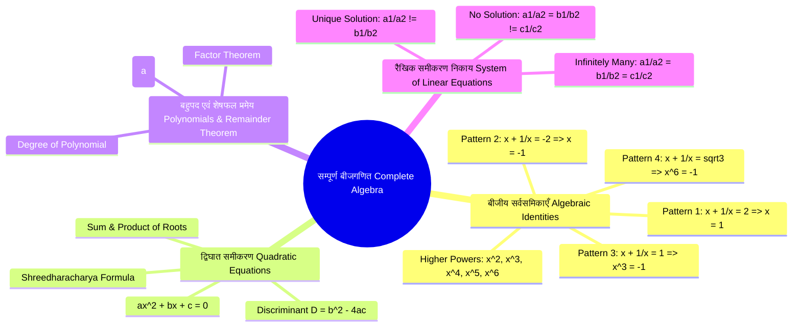
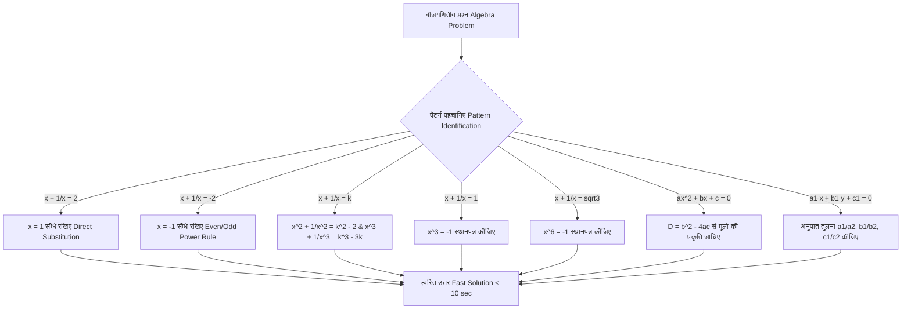

# UP SUPER TET Maths Classes 2026 | सम्पूर्ण बीजगणित (Complete Algebra) | By Pawan Sir

> [!IMPORTANT]
> **सम्पूर्ण बीजगणित (Complete Algebra) - मास्टर अध्ययन नोट्स**
> **लक्ष्य:** UP Super TET, UPTET, KVS, DSSSB एवं अन्य प्रतियोगी परीक्षाओं के छात्रों के लिए विस्तृत गाइड
> **विशेषता:** स्पष्ट गणितीय सूत्र ($$ ... $$) | पवन सर की 10 शॉर्ट ट्रिक्स | चरणबद्ध हल किए गए प्रश्न | सुस्पष्ट संरचना

## विषय-सूची (Table of Contents)

1. [बीजगणितीय माइंडमैप एवं फ्लोचार्ट](#1-बीजगणितीय-माइंडमैप-एवं-फ्लोचार्ट)
2. [महत्वपूर्ण बीजगणित सूत्र चीट शीट (Master Formula Cheat Sheet)](#2-महत्वपूर्ण-बीजगणित-सूत्र-चीट-शीट-master-formula-cheat-sheet)
3. [पवन सर की 10 मास्टर ट्रिक्स एवं शॉर्टकट नियम](#3-पवन-सर-की-10-मास्टर-ट्रिक्स-एवं-शॉर्टकट-नियम)
4. [सम्पूर्ण 15 अध्यायवार विस्तृत गणितीय ब्रेकडाउन](#4-सम्पूर्ण-15-अध्यायवार-विस्तृत-गणितीय-ब्रेकडाउन)

---

## 1. बीजगणितीय माइंडमैप एवं फ्लोचार्ट

---

## 2. महत्वपूर्ण बीजगणित सूत्र चीट शीट (Master Formula Cheat Sheet)

> [!NOTE]
> **परीक्षा में बार-बार पूछे जाने वाले प्रमुख सर्वसमिका सूत्र:**

### (A) मूलभूत सर्वसमिकाएँ (Basic Identities)

$$(a + b)^2 = a^2 + 2ab + b^2$$

$$(a - b)^2 = a^2 - 2ab + b^2$$

$$a^2 - b^2 = (a - b)(a + b)$$

$$(a + b + c)^2 = a^2 + b^2 + c^2 + 2(ab + bc + ca)$$

### (B) व्युत्क्रम पद सर्वसमिकाएँ ($x + \frac{1}{x}$ Patterns)

1. यदि $x + \frac{1}{x} = 2$ हो, तो:

$$x = 1$$

2. यदि $x + \frac{1}{x} = -2$ हो, तो:

$$x = -1 \quad \implies \quad (-1)^{\text{सम}} = +1, \quad (-1)^{\text{विषम}} = -1$$

3. यदि $x + \frac{1}{x} = k$ हो, तो:

$$x^2 + \frac{1}{x^2} = k^2 - 2$$

$$x^3 + \frac{1}{x^3} = k^3 - 3k$$

4. यदि $x - \frac{1}{x} = k$ हो, तो:

$$x^2 + \frac{1}{x^2} = k^2 + 2$$

$$x^3 - \frac{1}{x^3} = k^3 + 3k$$

5. यदि $x + \frac{1}{x} = 1$ हो, तो:

$$x^3 = -1 \quad \text{तथा} \quad x^3 + 1 = 0$$

6. यदि $x + \frac{1}{x} = \sqrt{3}$ हो, तो:

$$x^6 = -1 \quad \text{तथा} \quad x^6 + 1 = 0$$

### (C) त्रिघात सर्वसमिकाएँ (Cubic Identities)

$$a^3 + b^3 + c^3 - 3abc = (a + b + c)(a^2 + b^2 + c^2 - ab - bc - ca)$$

विशेष स्थिति: यदि $a + b + c = 0$ हो, तो:

$$a^3 + b^3 + c^3 = 3abc$$

### (D) द्विघात समीकरण सूत्र (Quadratic Equations)

मानक रूप: $ax^2 + bx + c = 0$

1. श्रीधराचार्य द्विघाती सूत्र:

$$x = \frac{-b \pm \sqrt{b^2 - 4ac}}{2a}$$

2. विविक्तकर (Discriminant):

$$D = b^2 - 4ac$$

- यदि $D > 0 \implies$ मूल वास्तविक एवं असमान (Real & Distinct)

- यदि $D = 0 \implies$ मूल वास्तविक एवं समान (Real & Equal)

- यदि $D < 0 \implies$ मूल काल्पनिक (Imaginary)

3. मूलों का योग एवं गुणनफल:

$$\alpha + \beta = -\frac{b}{a}, \quad \alpha \cdot \beta = \frac{c}{a}$$

### (E) दो चरों वाले रैखिक समीकरण निकाय (System of Linear Equations)

समीकरण: $a_1 x + b_1 y + c_1 = 0$ तथा $a_2 x + b_2 y + c_2 = 0$

1. अद्वितीय हल (Unique Solution): $\frac{a_1}{a_2} \neq \frac{b_1}{b_2}$

2. अनंत हल (Infinitely Many Solutions): $\frac{a_1}{a_2} = \frac{b_1}{b_2} = \frac{c_1}{c_2}$

3. कोई हल नहीं (No Solution): $\frac{a_1}{a_2} = \frac{b_1}{b_2} \neq \frac{c_1}{c_2}$

---

## 3. पवन सर की 10 मास्टर ट्रिक्स एवं शॉर्टकट नियम

> [!TIP]
> **कम समय में 100% सही उत्तर निकालने के लिए पवन सर के 10 गोल्डन रूल्स:**

1. **समीकरण में 2 दिखे तो सीधा $x = 1$ रखिए:**
   जब भी $x + \frac{1}{x} = 2$ दिया हो, तो बिना किसी लंबी प्रक्रिया के $x = 1$ रखकर उत्तर निकालें।

2. **$-2$ दिखने पर घात (Power) की जांच कीजिए:**
   यदि $x + \frac{1}{x} = -2$ दिया हो, तो $x = -1$ होगा। घात सम (Even) होने पर $+1$ तथा विषम (Odd) होने पर $-1$ लें।

3. **वर्ग एवं घन का मौखिक नियम ($k^2 - 2$ तथा $k^3 - 3k$):**
   - $x + \frac{1}{x} = k \implies x^2 + \frac{1}{x^2} = k^2 - 2$
   - $x + \frac{1}{x} = k \implies x^3 + \frac{1}{x^3} = k^3 - 3k$

4. **$x + \frac{1}{x} = 1$ में $x^3 = -1$ नियम:**
   यदि प्रश्न में $x + \frac{1}{x} = 1$ दिया हो, तो $x^3 = -1$ रखें। 3 के अंतर वाले घातों का पद-युग्म ($x^{n+3} + x^n$) कटकर 0 हो जाता है।

5. **$x + \frac{1}{x} = \sqrt{3}$ में $x^6 = -1$ नियम:**
   जब $x + \frac{1}{x} = \sqrt{3}$ दिया हो, तो $x^6 = -1$ रखें। 6 के अंतर वाले घातों का योग 0 हो जाता है।

6. **शेषफल प्रमेय में शून्यीकरण विधि (Zero Substitution Method):**
   बहुपद $P(x)$ को $(x - a)$ से भाग देने पर शेषफल $R = P(a)$ होगा। अतः $(x - a) = 0 \implies x = a$ व्यंजक में रखें।

7. **द्विघात समीकरण में विविक्तकर ($D = b^2 - 4ac$) से विकल्पों का चयन:**
   प्रश्नों में मूलों का प्रकार पूछा जाए तो पूरा समीकरण हल करने के बजाय केवल $D$ का चिन्ह (+, 0, -) देखें।

8. **रैखिक निकाय में 10-सेकंड अनुपात तुलना:**
   गुणांकों के अनुपात $\frac{a_1}{a_2}, \frac{b_1}{b_2}, \frac{c_1}{c_2}$ लिखकर सीधा हलों का स्वरूप पहचानें।

9. **मान रखने की विधि (Value Put Method):**
   जब बीजीय विकल्पों में $a, b, c$ के स्थान पर संख्याएं दी हों, तो $a = 1, b = 1, c = 1$ या $a = 0$ मानकर उत्तर पाएं।

10. **त्रिघात में $a + b + c = 0$ शॉर्टकट:**
    यदि पदों का योग शून्य बन रहा हो, तो $a^3 + b^3 + c^3 = 3abc$ सूत्र का उपयोग करें।

---

## 4. सम्पूर्ण 15 अध्यायवार विस्तृत गणितीय ब्रेकडाउन

# भाग 01: सम्पूर्ण बीजगणित - प्राथमिक अवधारणाएँ एवं पैटर्न 1 ($x + \frac{1}{x} = 2$)

## 1. मुख्य अवधारणाएँ एवं भूमिका (Core Concepts & Context)
- **परीक्षाओं में बीजगणित का महत्व:** Super TET, UPTET (Junior), और अन्य प्रतियोगी परीक्षाओं में बीजगणित (Algebra) एक अत्यंत महत्वपूर्ण विषय है। आगामी Super TET और जूनियर परीक्षाओं में इसके प्रश्न निश्चित रूप से पूछे जाएंगे। पिछले प्रश्नपत्रों (जैसे 68500 और 69000 शिक्षक भर्ती) में भी बीजगणित के प्रश्नों का अच्छा खासा भार रहा है।
- **अंकगणित बनाम बीजगणित (Arithmetic vs Algebra):** प्रायः छात्रों को लगता है कि यदि उनका अंकगणित कमजोर है, तो बीजगणित समझ में नहीं आएगा। लेकिन वास्तविकता यह है कि बीजगणित, अंकगणित की तुलना में कहीं अधिक आसान है। इसके कई प्रश्न केवल पैटर्न देखने और छोटे लॉजिक का प्रयोग करने से ही हल हो जाते हैं। 

## 2. बीजगणितीय सूत्र एवं सर्वसमिकाएँ (Mathematical Formulas & Identities)
- **Pattern 1:** यदि किसी प्रश्न में $x + \frac{1}{x} = 2$ की संरचना दी गई हो, तो ऐसे प्रश्नों को हल करने के लिए सीधे $x = 1$ मान लिया जाता है। 
- **गणितीय सिद्धता (Mathematical Proof):**
  दी गई शर्त: $x + \frac{1}{x} = 2$
  समीकरण को $x$ से गुणा करने पर: 
  $$x^2 + 1 = 2x$$

  $$x^2 - 2x + 1 = 0$$

  यह $(x - 1)^2$ का पूर्ण वर्ग है:
  $$(x - 1)^2 = 0 \implies x - 1 = 0 \implies x = 1$$

  इसलिए, यह सिद्ध होता है कि इस स्थिति में $x$ का मान हमेशा $1$ होता है।

## 3. पवन सर की शॉर्ट ट्रिक्स एवं नियम (Short Tricks & Rules)
- **Direct Substitution Rule ($x = 1$):** यदि प्रश्न में $x + \frac{1}{x} = 2$ दिया हो, तो बिना किसी लंबी गणना के जिस व्यंजक का मान पूछा गया हो, उसमें सीधे $x = 1$ प्रतिस्थापित (substitute) कर दें।
- **घात का नियम ($1^n = 1$):** $1$ पर चाहे कितनी भी धनात्मक घात (power) हो, उसका मान हमेशा $1$ ही रहता है। 
  जैसे: $1^{17} = 1$, $1^{20} = 1$, $1^{100} = 1$

## 4. विस्तृत उदाहरण एवं चरणबद्ध समाधान (Step-by-Step Solved Examples)

**Example 1:** यदि $x + \frac{1}{x} = 2$ हो, तो $3x^5 - 2x^3 + 5x - 2$ का मान ज्ञात कीजिए।
**समाधान (Solution):**
- चूंकि $x + \frac{1}{x} = 2$ है, अतः $x = 1$ होगा।
- अब दिए गए व्यंजक में $x = 1$ रखने पर:
  $$3(1)^5 - 2(1)^3 + 5(1) - 2$$

  $$= 3(1) - 2(1) + 5(1) - 2$$

  $$= 3 - 2 + 5 - 2$$

  $$= 1 + 5 - 2$$

  $$= 6 - 2 = 4$$

**उत्तर:** $4$

**Example 2:** यदि $x + \frac{1}{x} = 2$ हो, तो $x^{17} + \frac{1}{x^{20}}$ का मान ज्ञात कीजिए।
**समाधान (Solution):**
- शर्त के अनुसार $x = 1$ रखने पर:
  $$(1)^{17} + \frac{1}{(1)^{20}}$$

- हम जानते हैं कि $1$ की घात कुछ भी हो, मान $1$ ही होता है:
  $$= 1 + \frac{1}{1}$$

  $$= 1 + 1 = 2$$

**उत्तर:** $2$

## 5. परीक्षा टिप्स एवं पैटर्न (Exam Tips & Patterns)
- **UP Primary & Junior Super TET:** इन परीक्षाओं में बीजगणितीय सर्वसमिकाओं, शेषफल प्रमेय (गुणनखंड प्रमेय), और बहुपदों की घात (Degree of Polynomials) से संबंधित 2-3 प्रश्न अनिवार्य रूप से आते हैं।
- **पैटर्न को पहचानें:** यदि आप परीक्षा में $x + \frac{1}{x} = 2$ जैसी संरचना देखते हैं, तो लंबी विधि के बजाय शॉर्ट ट्रिक ($x=1$) का उपयोग करें जिससे समय की बचत होगी। 

# भाग 02: पैटर्न 2 ($x + \frac{1}{x} = -2$) एवं $x - \frac{1}{x}$ के विशेष प्रश्न

## 1. मुख्य अवधारणाएँ एवं पैटर्न विश्लेषण (Core Concepts & Pattern Analysis)
- **Pattern 2**: यदि $x + \frac{1}{x} = -2$ हो, तो $x = -1$ रखना। यह एक विशेष स्थिति है जो परीक्षा में अक्सर पूछी जाती है।
- **$x = -1$ के घात नियम (Even Power vs Odd Power Rules)**:
  - यदि $-1$ पर **सम घात (Even Power)** हो, तो परिणाम धनात्मक (Positive) होता है: $(-1)^{\text{even}} = +1$
  - यदि $-1$ पर **विषम घात (Odd Power)** हो, तो परिणाम ऋणात्मक (Negative) होता है: $(-1)^{\text{odd}} = -1$
- **अन्य महत्वपूर्ण पैटर्न (Pattern 3)**: यदि $x + \frac{1}{x} = 1$ दिया हो, तो यह $x^3 + 1 = 0 \implies x^3 = -1$ को संतुष्ट करता है।

## 2. बीजगणितीय सूत्र एवं सर्वसमिकाएँ (Mathematical Formulas & Identities)
- **सिद्धता (Proof for $x = -1$)**:
  $$x + \frac{1}{x} = -2$$

  $$x^2 + 1 = -2x \implies x^2 + 2x + 1 = 0$$

  $$(x+1)^2 = 0 \implies x + 1 = 0 \implies x = -1$$

- **विभिन्न घातों के लिए मान**:
  - $x^n + \frac{1}{x^n}$ तथा $x^n - \frac{1}{x^n}$ के मान $n$ (सम या विषम) पर निर्भर करते हैं। 
  - उदाहरण के लिए, यदि $n$ विषम है, तो $x^n + \frac{1}{x^n} = -1 - 1 = -2$।
- **$x + \frac{1}{x} = 1$ की सिद्धता**:
  $$x^2 + 1 = x \implies x^2 - x + 1 = 0$$

  सूत्र $a^3 + b^3 = (a+b)(a^2 - ab + b^2)$ का उपयोग करने पर:
  $$x^3 + 1^3 = (x+1)(x^2 - x + 1) = (x+1)(0) = 0$$

  $$\implies x^3 + 1 = 0 \implies x^3 = -1$$

## 3. पवन सर की शॉर्ट ट्रिक्स (Short Tricks & Fast Calculation Methods)
- **सम/विषम घात पहचानने की ट्रिक**: 
  - ट्रिक: जब $x + \frac{1}{x} = -2$ दिया हो, तो आपको केवल घात का सम-विषम प्रकृति देखना है और सीधे $+1$ या $-1$ रख देना है।
- **परिणाम के विशेष पैटर्न**: ऐसे प्रश्नों में उत्तर अधिकांशतः $0$ या $\pm 2$ ही आता है।

## 4. विस्तृत उदाहरण एवं चरणबद्ध समाधान (Step-by-Step Solved Examples)

**उदाहरण 1:** 
यदि $x + \frac{1}{x} = -2$ है, तो $x^{13} - \frac{1}{x^{24}}$ का मान ज्ञात करें।
**समाधान:**
- दिया गया है: $x + \frac{1}{x} = -2 \implies x = -1$
- व्यंजक में $x = -1$ रखने पर:
  $$(-1)^{13} - \frac{1}{(-1)^{24}}$$

- नियम के अनुसार:
  - $13$ एक विषम (Odd) संख्या है, अतः $(-1)^{13} = -1$
  - $24$ एक सम (Even) संख्या है, अतः $(-1)^{24} = +1$
- मान रखने पर:
  $$-1 - \frac{1}{+1} = -1 - 1 = -2$$

**उत्तर:** -2

## 5. परीक्षा टिप्स एवं पैटर्न (Exam Tips)
- **समय बचाएं**: $x + \frac{1}{x} = -2$ देखते ही तुरंत $x = -1$ मान लें। समीकरण को हल करने में समय नष्ट न करें।
- **चिह्न की गलतियों से बचें**: घात सम है या विषम, इसे ध्यान से देखें, क्योंकि यहाँ सबसे ज़्यादा गलतियाँ प्लस-माइनस (+/-) में होती हैं।
- **भ्रमित करने वाले प्रश्न**: कभी-कभी घातें बहुत बड़ी दे दी जाती हैं (जैसे $x^{2024}$)। घात का आकार मायने नहीं रखता, केवल उसकी प्रकृति (सम/विषम) मायने रखती है।
- **सुपर टेट पैटर्न**: यह पैटर्न यूपी सुपर टेट (UP SUPER TET) और अन्य शिक्षक भर्ती परीक्षाओं का पसंदीदा पैटर्न है।

# भाग 03: सर्वसमिका आधारित प्रश्न ($x + \frac{1}{x} = k$ से $x^2 + \frac{1}{x^2}$ तथा $x^3 + \frac{1}{x^3}$)

## 1. मुख्य अवधारणाएँ एवं पैटर्न (Core Concepts & Patterns)
- यदि $x + \frac{1}{x} = k$ हो, तो:
  - $x^2 + \frac{1}{x^2} = k^2 - 2$
  - $x^3 + \frac{1}{x^3} = k^3 - 3k$
- यदि $x - \frac{1}{x} = k$ हो, तो:
  - $x^2 + \frac{1}{x^2} = k^2 + 2$
  - $x^3 - \frac{1}{x^3} = k^3 + 3k$
- **विशिष्ट स्थिति (Special Case - पवन सर द्वारा कक्षा में मुख्य फोकस):**
  - यदि $x + \frac{1}{x} = 1$ हो, तो $x^3 + 1 = 0 \implies x^3 = -1$ होता है।
  - (नोट: ट्रांसक्रिप्ट में इसे मौखिक रूप से समझाने के दौरान कई बार $x^3+1=0$ को $x+1=0$ के रूप में उच्चारित/लिखा गया है, लेकिन गणितीय रूप से यह $x^3 = -1$ है।)

## 2. बीजगणितीय सूत्र एवं व्युत्पत्ति (Formulas & Derivations)
- $(a+b)^2 = a^2 + b^2 + 2ab$ तथा $(a-b)^2 = a^2 + b^2 - 2ab$ का प्रयोग।
- $(a+b)^3 = a^3 + b^3 + 3ab(a+b)$ का प्रयोग।
- **$x + \frac{1}{x} = 1$ से $x^3 = -1$ की व्युत्पत्ति:**
  - $x + \frac{1}{x} = 1 \implies \frac{x^2 + 1}{x} = 1 \implies x^2 + 1 = x \implies x^2 - x + 1 = 0$
  - दोनों पक्षों में $(x+1)$ से गुणा करने पर: $(x+1)(x^2 - x + 1) = 0$
  - यह $a^3 + b^3$ का सूत्र है, अतः $x^3 + 1^3 = 0 \implies x^3 = -1$

## 3. पवन सर की शॉर्ट ट्रिक्स (Short Tricks & Direct Formulas)
- $k^2 - 2$ तथा $k^3 - 3k$ के ओरल (मौखिक) हल की तकनीक।
- **घातों का अंतर (Power Difference Trick):** यदि $x + \frac{1}{x} = 1$ दिया हो, तो व्यंजक में जिन दो पदों की घातों (powers) के मध्य $3$ का अंतर होता है, उनका योग शून्य ($0$) हो जाता है। (उदाहरण: $x^{25} + x^{22} = x^{22}(x^3 + 1) = 0$)
- **घातों को $3$ के गुणज में बदलना:** यदि घातों का अंतर $3$ न हो, तो घात को $3$ के गुणज (multiple) में तोड़ें, जैसे $x^{24} = (x^3)^8$ और $x^3 = -1$ का मान सीधे पुट करें।

## 4. विस्तृत उदाहरण एवं चरणबद्ध समाधान (Step-by-Step Solved Examples)

**प्रश्न 1:** यदि $x + \frac{1}{x} = 1$ हो, तो $x^{25} + x^{22} + x^{10} + x^7 + x^3 + 1$ का मान ज्ञात करें।
**हल:** 
- **बेसिक तरीका:**
  $$x^{25} + x^{22} + x^{10} + x^7 + x^3 + 1$$

  पदों के जोड़े बनाकर कॉमन लेने पर:
  $$= x^{22}(x^3 + 1) + x^7(x^3 + 1) + 1(x^3 + 1)$$

  चूँकि $x + \frac{1}{x} = 1 \implies x^3 + 1 = 0$, अतः
  $$= x^{22}(0) + x^7(0) + 1(0) = 0 + 0 + 0 = 0$$

- **शॉर्ट ट्रिक:** 
  यहाँ $25$ और $22$ में $3$ का अंतर है $\implies x^{25} + x^{22} = 0$
  $10$ और $7$ में $3$ का अंतर है $\implies x^{10} + x^7 = 0$
  $3$ और $0$ ($1 = x^0$) में $3$ का अंतर है $\implies x^3 + 1 = 0$
  अतः कुल योग = $0$

**प्रश्न 2:** यदि $x + \frac{1}{x} = 1$ हो, तो $x^{24} + x^{15} + x^9 + x^3 + 1$ का मान ज्ञात करें।
**हल:**
- यहाँ घातों के बीच $3$ का सीधा अंतर नहीं है, इसलिए $x^3 = -1$ का प्रयोग करेंगे।
- प्रत्येक पद की घात को $3$ के गुणज में बदलें:
  $$= (x^3)^8 + (x^3)^5 + (x^3)^3 + (x^3)^1 + 1$$

- $x^3 = -1$ रखने पर:
  $$= (-1)^8 + (-1)^5 + (-1)^3 + (-1)^1 + 1$$

  $$= 1 + (-1) + (-1) + (-1) + 1$$

  $$= 1 - 1 - 1 - 1 + 1 = -1$$

## 5. परीक्षा टिप्स एवं सामान्य गलतियाँ (Exam Tips & Pitfalls)
- **Pitfall (सामान्य गलती):** छात्र अक्सर $x+\frac{1}{x}=1$ देखकर लंबी गणना में फँस जाते हैं या इसे द्विघात समीकरण समझकर $x$ का मान निकालने लगते हैं। हमेशा याद रखें कि यह $x^3 = -1$ का डायरेक्ट संकेत है।
- **Tip:** परीक्षा में ऐसे बड़े-बड़े घातांक वाले व्यंजक दिखने पर सबसे पहले घातों का अंतर $3$ चेक करें। यह आपका काफी समय बचाएगा।
- **Tip:** घातों को $3$ के गुणज में बदलते समय सम घात (Even Power) होने पर $(-1)^{\text{even}} = 1$ तथा विषम घात (Odd Power) होने पर $(-1)^{\text{odd}} = -1$ का विशेष ध्यान रखें।

# भाग 04: उच्च घातों के रूपांतरण ($x^4 + \frac{1}{x^4}$, $x^5 + \frac{1}{x^5}$, $x^6 + \frac{1}{x^6}$)

## 1. मुख्य अवधारणाएँ एवं उच्च घात रूपांतरण (Higher Power Transformation Rules)
बीजगणित में जब $x + \frac{1}{x} = k$ दिया हो, तो उच्च घातों के मान निकालने के लिए निम्नलिखित रूपांतरण नियमों का प्रयोग किया जाता है:
- **घात 4 ($x^4 + \frac{1}{x^4}$):** इसके लिए दो बार वर्ग करने की प्रक्रिया अपनाई जाती है। पहले वर्ग से $x^2 + \frac{1}{x^2} = k^2 - 2$ मिलता है, और पुनः वर्ग करने पर:
  $$x^4 + \frac{1}{x^4} = (k^2 - 2)^2 - 2$$

- **घात 5 ($x^5 + \frac{1}{x^5}$):** इसे प्राप्त करने के लिए वर्ग और घन के व्यंजकों का गुणा करके आधार व्यंजक को घटाया जाता है:
  $$x^5 + \frac{1}{x^5} = \left(x^2 + \frac{1}{x^2}\right)\left(x^3 + \frac{1}{x^3}\right) - \left(x + \frac{1}{x}\right)$$

- **घात 6 ($x^6 + \frac{1}{x^6}$):** इसके लिए या तो वर्ग वाले व्यंजक का घन किया जाता है या घन वाले व्यंजक का वर्ग किया जाता है। यदि $a = x^2 + \frac{1}{x^2}$ और $b = x^3 + \frac{1}{x^3}$, तो:
  $$x^6 + \frac{1}{x^6} = a^3 - 3a \quad \text{या} \quad b^2 - 2$$

- **घात 7 ($x^7 + \frac{1}{x^7}$):** घात 3 और 4 का गुणा करके आधार को घटाएं:
  $$x^7 + \frac{1}{x^7} = \left(x^3 + \frac{1}{x^3}\right)\left(x^4 + \frac{1}{x^4}\right) - \left(x + \frac{1}{x}\right)$$

## 2. बीजगणितीय सूत्र एवं सर्वसमिकाएँ (Formulas & Identities)
यदि $x + \frac{1}{x} = k$ हो:
- $x^2 + \frac{1}{x^2} = k^2 - 2$
- $x^3 + \frac{1}{x^3} = k^3 - 3k$
- $x^4 + \frac{1}{x^4} = (k^2 - 2)^2 - 2$
- $x^5 + \frac{1}{x^5} = (k^2 - 2)(k^3 - 3k) - k$
- $x^6 + \frac{1}{x^6} = (k^3 - 3k)^2 - 2$
- $x^7 + \frac{1}{x^7} = (k^3 - 3k)((k^2 - 2)^2 - 2) - k$

**विशेष स्थिति:** यदि $x + \frac{1}{x} = 1$ हो, तो $x^2 - x + 1 = 0 \implies x^3 + 1 = 0 \implies x^3 = -1$ होता है। यह एक अत्यंत महत्वपूर्ण सर्वसमिका है।

**बहुपद (Polynomials) की अवधारणा:**
- **परिभाषा:** ऐसा व्यंजक जो चर (Variables, उदा. $x, y$), अचर (Constants, उदा. 1, 2) और घातांक (Exponents) से मिलकर बना हो।
- **शर्त:** बहुपद में चर की घात हमेशा पूर्ण संख्या (Whole Number) होनी चाहिए, यह ऋणात्मक (negative) या भिन्न (fraction) नहीं हो सकती।
- **प्रकार:** 
  - एकपदी (Monomial): $5x, 9y^2$
  - द्विपदी (Binomial): $7x + 5, 3y^2 + 6$
  - त्रिपदी (Trinomial): $3x^2 - 5x + 7$

## 3. पवन सर की शॉर्ट ट्रिक्स (Short Tricks & Memory Aids)
- **विशेष नियम:** जैसे ही प्रश्न में $x + \frac{1}{x} = 1$ दिखे, तुरंत समझ लें कि $x^3 = -1$ होगा। 
- **सम/विषम घात ट्रिक:** 
  - यदि $(-1)$ पर **सम घात (Even Power)** है, तो परिणाम $+1$ आएगा।
  - यदि $(-1)$ पर **विषम घात (Odd Power)** है, तो परिणाम $-1$ आएगा।
- **घातों का रूपांतरण:** उच्च घातों को 3 के गुणज में तोड़ें। जैसे घात 30 है तो $(x^3)^{10}$ लिखें, और $x^3$ का मान $-1$ रखें।

## 4. विस्तृत उदाहरण एवं चरणबद्ध समाधान (Step-by-Step Solved Examples)

**प्रश्न 1:** यदि $x + \frac{1}{x} = 1$ है, तो $x^{30} + \frac{1}{x^{18}}$ का मान ज्ञात करें।
**चरणबद्ध समाधान:**
1. हम जानते हैं कि यदि $x + \frac{1}{x} = 1$ हो, तो $x^3 = -1$ होता है।
2. व्यंजक को $x^3$ के रूप में तोड़ें:
   $$x^{30} + \frac{1}{x^{18}} = (x^3)^{10} + \frac{1}{(x^3)^6}$$

3. $x^3 = -1$ का मान रखें:
   $$(-1)^{10} + \frac{1}{(-1)^6}$$

4. सम/विषम नियम का प्रयोग करें: चूँकि 10 और 6 दोनों सम (even) संख्याएँ हैं, $(-1)^{10} = 1$ और $(-1)^6 = 1$.
5. मान जोड़ें: $1 + \frac{1}{1} = 1 + 1 = 2$.
**उत्तर:** 2 (Option C सही है)

## 5. परीक्षा रणनीति एवं समय प्रबंधन (Exam Strategy)
- **मानसिक गणना (Mental Math):** $x + \frac{1}{x} = 1$ देखते ही दिमाग में $x^3 = -1$ आ जाना चाहिए। घातों को देखकर (सम/विषम) सीधे $+1$ या $-1$ लिखें।
- **बहुपद की पहचान:** परीक्षा में बहुपद पहचानने के प्रश्न आते हैं। बस यह चेक करें कि किसी भी चर की घात ऋणात्मक या भिन्न तो नहीं है। यदि है, तो वह बहुपद नहीं है।
- **स्कोरिंग पोटेंशियल:** पवन सर के अनुसार, बीजगणित के ऐसे 90% प्रश्न आसानी से हल किए जा सकते हैं, और सुपर-टेट में अच्छे अंक अर्जित किए जा सकते हैं।

# भाग 05: रैखिक बहुपद, सर्वसमिका $a + b + c = 0$ एवं विशेष पैटर्न ($x + \frac{1}{x} = 1, \sqrt{3}$)

## 1. मुख्य अवधारणाएँ एवं रैखिक बहुपद (Linear Polynomials & Special Patterns)
- **रैखिक बहुपद (Linear Polynomial):** ऐसा बहुपद जिसमें चर (Variable) की अधिकतम घात 1 हो, जैसे $7x + 5$।
- **सर्वसमिका $a + b + c = 0$ की भूमिका:** जब समीकरण में $a + b + c = 0$ दिया गया हो, तो त्रिघातीय व्यंजकों का मान अत्यंत सरलता से निकाला जा सकता है।
- **विशेष पैटर्न $x + \frac{1}{x} = 1$:** 
  $$\left(x + \frac{1}{x}\right)^2 = 1 \implies x^2 + \frac{1}{x^2} + 2 = 1 \implies x^2 + 1 = -x \implies x^3 = -1 \text{ तथा } x^3 + 1 = 0$$

- **विशेष पैटर्न $x + \frac{1}{x} = \sqrt{3}$:**
  $$x^2 + \frac{1}{x^2} = (\sqrt{3})^2 - 2 = 1 \implies x^6 = -1 \text{ तथा } x^6 + 1 = 0$$

## 2. गणितीय सूत्र एवं सिद्धता (Mathematical Proofs & Identities)
1. **$a + b + c = 0 \implies a^3 + b^3 + c^3 = 3abc$**
2. **बीजीय भिन्न सूत्र:**
   $$\frac{a^2}{bc} + \frac{b^2}{ca} + \frac{c^2}{ab} = \frac{a^3 + b^3 + c^3}{abc} = \frac{3abc}{abc} = 3 \quad (\text{यदि } a+b+c=0)$$

## 3. पवन सर की शॉर्ट ट्रिक्स (Short Tricks & Instant Rules)
- **3 के अंतर वाली घातों का योग शून्य:** यदि $x + \frac{1}{x} = 1$ हो, तो व्यंजक में 3 के अंतर वाले घातों का पद-युग्म ($x^{n+3} + x^n = x^n(x^3+1) = 0$) शून्य हो जाता है।
- **6 के अंतर वाली घातों का योग शून्य:** यदि $x + \frac{1}{x} = \sqrt{3}$ हो, तो 6 के अंतर वाले घातों का पद-युग्म ($x^{n+6} + x^n = x^n(x^6+1) = 0$) शून्य हो जाता है।

## 4. विस्तृत उदाहरण एवं चरणबद्ध समाधान (Step-by-Step Solved Examples)

---

### उदाहरण 1:
यदि $a + b + c = 0$ हो, तो $\frac{a^2}{bc} + \frac{b^2}{ca} + \frac{c^2}{ab}$ का मान ज्ञात कीजिए।
- **हल:**
  $$\text{ल.स.व. (LCM)} = abc$$

  $$\frac{a^3 + b^3 + c^3}{abc}$$

  चूँकि $a+b+c=0$, अतः $a^3+b^3+c^3 = 3abc$।
  $$\text{मान} = \frac{3abc}{abc} = 3$$

---

### उदाहरण 2:
यदि $x + \frac{1}{x} = 1$ हो, तो $x^{18} + x^{15} + x^{12} + x^9 + x^3 + 1$ का मान ज्ञात कीजिए।
- **हल:**
  चूँकि $x + \frac{1}{x} = 1 \implies x^3 = -1$ तथा $x^3 + 1 = 0$।
  $$x^{15}(x^3 + 1) + x^9(x^3 + 1) + (x^3 + 1) = 0 + 0 + 0 = 0$$

## 5. परीक्षा टिप्स एवं पैटर्न (Exam Tips)
- Super TET एवं UPTET Junior में $a+b+c=0$ पर आधारित सीधे प्रश्न पूछे जाते हैं। 

# भाग 06: द्विघात समीकरण (Quadratic Equations), मूल एवं मूलों के गुणधर्म

## 1. मुख्य अवधारणाएँ एवं द्विघात समीकरण का मानक रूप
- **मानक रूप (Standard Form):** $ax^2 + bx + c = 0$ (जहाँ $a \neq 0$)।
- **श्रीधराचार्य सूत्र (Quadratic Formula):** द्विघात समीकरण के मूल ज्ञात करने के लिए इस सूत्र का उपयोग किया जाता है:
  $$x = \frac{-b \pm \sqrt{b^2 - 4ac}}{2a}$$

- **विविक्तकर (Discriminant, $D = b^2 - 4ac$):** यह समीकरण के मूलों की प्रकृति (Nature of Roots) निर्धारित करता है:
  - यदि $D > 0 \implies$ मूल वास्तविक एवं असमान (Real & Distinct roots) होते हैं।
  - यदि $D = 0 \implies$ मूल वास्तविक एवं समान (Real & Equal roots) होते हैं।
  - यदि $D < 0 \implies$ मूल काल्पनिक (Imaginary / Complex roots) होते हैं।

## 2. मूलों का योग एवं गुणनफल (Sum & Product of Roots)
यदि किसी द्विघात समीकरण $ax^2 + bx + c = 0$ के मूल $\alpha$ और $\beta$ हों, तो:
- **मूलों का योग (Sum of Roots):** $\alpha + \beta = -\frac{b}{a}$
- **मूलों का गुणनफल (Product of Roots):** $\alpha \cdot \beta = \frac{c}{a}$
- **समीकरण का निर्माण:** यदि मूल दिए गए हों, तो समीकरण इस प्रकार लिखा जा सकता है:
  $$x^2 - (\alpha + \beta)x + (\alpha \cdot \beta) = 0$$

## 3. पवन सर की शॉर्ट ट्रिक्स (Short Tricks for Factoring & Root Selection)
- **चिह्न नियम (Sign Rule):** समीकरण $ax^2 + bx + c = 0$ में यदि $c$ धनात्मक है, तो दोनों मूलों के चिह्न समान होंगे (और वे $b$ के विपरीत चिह्न के होंगे)। यदि $c$ ऋणात्मक है, तो दोनों मूल विपरीत चिह्न के होंगे।
- **त्वरित गुणनखंडन (Quick Factoring):** $x^2$ के गुणांक $a$ को अचर पद $c$ से गुणा करें ($a \times c$)। अब इस गुणनफल के ऐसे दो गुणनखंड खोजें जिनका योग या अंतर $b$ के बराबर हो। फिर सीधे उन गुणनखंडों के चिह्न बदलकर $a$ से भाग दे दें।
- **व्यंजक निरीक्षण (Expression Observation):** बीजगणितीय व्यंजकों (जैसे $a+b+c=0$) वाले प्रश्नों में, लंबे फॉर्मूले खोलने के बजाय हमेशा दिए गए प्रतिबंध से छोटे पदों का मान प्रतिस्थापित करने (Substitution) का प्रयास करें।

## 4. विस्तृत उदाहरण एवं चरणबद्ध समाधान (Step-by-Step Solved Examples)

नीचे दिए गए प्रश्न बीजगणितीय सर्वसमिकाओं (Algebraic Identities) के महत्वपूर्ण अनुप्रयोग हैं, जिन्हें कक्षा के भाग 06 में हल किया गया है:

**प्रश्न 1: यदि $a + b + c = 0$ हो, तो $\frac{1}{bc} + \frac{1}{ca} + \frac{1}{ab}$ का मान ज्ञात कीजिए।**
**समाधान:**
1. व्यंजक: $\frac{1}{bc} + \frac{1}{ca} + \frac{1}{ab}$
2. हर (Denominator) $bc, ca, ab$ का लघुत्तम समापवर्त्य (LCM) लें, जो $abc$ होगा।
3. प्रत्येक भिन्न के हर से $abc$ में भाग दें और अंश में गुणा करें:
   $$\frac{a + b + c}{abc}$$

4. चूँकि दिया गया है कि $a + b + c = 0$, अतः अंश में $0$ रखने पर:
   $$\frac{0}{abc} = 0$$

**उत्तर:** $0$

**प्रश्न 2: यदि $a + b + c = 0$ हो, तो $\frac{-3abc}{(a+b)(b+c)(c+a)}$ का मान ज्ञात कीजिए।**
**समाधान:**
1. दिया है: $a + b + c = 0$
2. यहाँ से हम लिख सकते हैं:
   $a + b = -c$
   $b + c = -a$
   $c + a = -b$
3. अब इन मानों को व्यंजक के हर में रखें:
   $$\frac{-3abc}{(-c)(-a)(-b)}$$

4. हर का गुणा करने पर: $(-c) \times (-a) \times (-b) = -abc$
5. अतः व्यंजक बन जाता है: $\frac{-3abc}{-abc} = 3$
**उत्तर:** $3$

**प्रश्न 3: यदि $a + b + c = 0$ हो, तो $\frac{a^2 + b^2 + c^2}{ab + bc + ca}$ का मान क्या होगा?**
**समाधान:**
1. हम जानते हैं कि $(a+b+c)^2 = a^2 + b^2 + c^2 + 2(ab + bc + ca)$
2. दिया है $a+b+c = 0$, अतः दोनों पक्षों का वर्ग करने पर:
   $$0^2 = a^2 + b^2 + c^2 + 2(ab + bc + ca)$$

3. पक्षांतर करने पर:
   $$a^2 + b^2 + c^2 = -2(ab + bc + ca)$$

4. इस मान को दिए गए व्यंजक में प्रतिस्थापित करें:
   $$\frac{-2(ab + bc + ca)}{ab + bc + ca} = -2$$

**उत्तर:** $-2$

## 5. परीक्षा टिप्स (Exam Tips)
- **निरीक्षण (Observation) कौशल विकसित करें:** परीक्षा में कठिन दिखने वाले प्रश्न अक्सर सीधे सूत्रों या प्रतिस्थापन पर आधारित होते हैं (जैसे $a+b=-c$ रखना)। उन्हें देखकर घबराएं नहीं।
- **समय प्रबंधन:** लंबे गुणा-भाग से बचें। यदि मूलों का योग और गुणनफल पूछा गया है, तो पूरा समीकरण हल करने के बजाय सीधे $-\frac{b}{a}$ और $\frac{c}{a}$ का उपयोग करें।
- **चिह्नों का ध्यान:** माइनस (-) के विषम बार गुणा होने पर परिणाम ऋणात्मक होता है, और सम बार गुणा होने पर धनात्मक। छोटी सी चिह्न की गलती पूरे प्रश्न को गलत कर सकती है।

# भाग 07: द्विघात समीकरण के उन्नत प्रश्न, शेषफल प्रमेय (Remainder Theorem) एवं गुणनखंड प्रमेय (Factor Theorem)

## 1. मुख्य अवधारणाएँ एवं सिद्धांत
- **शेषफल प्रमेय (Remainder Theorem):** यदि किसी बहुपद $P(x)$ को $(x - a)$ से भाग दिया जाए, तो शेषफल $R = P(a)$ होता है।
- **गुणनखंड प्रमेय (Factor Theorem):** यदि $P(a) = 0$ हो, तो $(x - a)$, बहुपद $P(x)$ का एक पूर्ण गुणनखंड होता है। अर्थात, यदि कोई व्यंजक किसी भाजक से पूरी तरह विभाज्य है, तो शेषफल शून्य होगा।

## 2. गणितीय सूत्र एवं नियम
- **विभाजन एल्गोरिथ्म (Division Algorithm):** 
  $$ भाज्य = (भाजक \times भागफल) + शेषफल $$

  $$ P(x) = Q(x) \cdot D(x) + R(x) $$

## 3. पवन सर की शॉर्ट ट्रिक्स (Short Tricks & Direct Substitution)
शेषफल निकालने के लिए लंबी भाग विधि (Long Division Method) का प्रयोग करने से बचें। इसके बजाय इन तीन सरल चरणों (3-Steps) का पालन करें:
1. **भाजक को शून्य के बराबर रखें:** सर्वप्रथम भाजक (जिससे भाग देना है) को $0$ के बराबर रखें। उदाहरण: यदि भाजक $(x - a)$ है, तो $(x - a) = 0$ रखें।
2. **चर (Variable) का मान निकालें:** यहाँ से $x = a$ प्राप्त होगा।
3. **मान प्रतिस्थापन (Value Substitution):** प्राप्त $x$ के मान को मुख्य व्यंजक (भाज्य) में रख दें। जो हल आएगा, वही आपका **अभीष्ट शेषफल** होगा।

## 4. विस्तृत उदाहरण एवं चरणबद्ध समाधान (Step-by-Step Solved Examples)

**प्रश्न 1:** व्यंजक $4x^3 - 2x^2 + 5x - 8$ को $(x - 2)$ से भाग देने पर शेषफल क्या होगा?
**समाधान (Step-by-Step):**
- **चरण 1:** भाजक को $0$ के बराबर रखें: 
  $$ x - 2 = 0 \implies x = 2 $$

- **चरण 2:** $x = 2$ को व्यंजक में रखें:
  $$ P(2) = 4(2)^3 - 2(2)^2 + 5(2) - 8 $$

  $$ = 4(8) - 2(4) + 10 - 8 $$

  $$ = 32 - 8 + 10 - 8 $$

  $$ = 24 + 10 - 8 $$

  $$ = 34 - 8 = 26 $$

**उत्तर:** शेषफल $26$ होगा।

**प्रश्न 2:** यदि व्यंजक $x^3 + 6x^2 + 4x + k$, $(x + 2)$ से पूरी तरह विभाज्य है, तो $k$ का मान क्या होगा?
**समाधान (Step-by-Step):**
- **चरण 1:** भाजक को $0$ के बराबर रखें: 
  $$ x + 2 = 0 \implies x = -2 $$

- **चरण 2:** चूंकि यह पूरी तरह विभाज्य है, इसलिए शेषफल शून्य ($0$) होगा। अतः $x = -2$ व्यंजक में रखकर $0$ के बराबर करें:
  $$ (-2)^3 + 6(-2)^2 + 4(-2) + k = 0 $$

  $$ -8 + 6(4) - 8 + k = 0 $$

  $$ -8 + 24 - 8 + k = 0 $$

  $$ 8 + k = 0 \implies k = -8 $$

**उत्तर:** $k = -8$ होगा।

## 5. परीक्षा टिप्स (Exam Tips)
- परीक्षा में कभी भी शेषफल प्रमेय के प्रश्नों को हल करने के लिए पारंपरिक लंबी भाग विधि का उपयोग न करें, इससे समय बहुत नष्ट होता है। हमेशा $x$ का मान निकाल कर व्यंजक में प्रतिस्थापित करें।
- यदि प्रश्न में "पूरी तरह विभाज्य" (completely divisible) या "गुणनखंड है" (is a factor) लिखा हो, तो मान रखने के बाद व्यंजक को सीधे शून्य ($= 0$) के बराबर कर दें, इससे अज्ञात चर ($k, m, a$ आदि) का मान आसानी से निकल जाएगा।
- ऋणात्मक संख्याओं (Negative numbers) के घात (power) का ध्यान रखें: ऋणात्मक संख्या का सम घात (Even Power) हमेशा धनात्मक (Positive) होता है, और विषम घात (Odd Power) हमेशा ऋणात्मक (Negative) होता है।

# भाग 08: बहुपद (Polynomials), बहुपद की घात (Degree of Polynomial) एवं वर्गीकरण

## 1. मुख्य अवधारणाएँ एवं बहुपद के नियम
- **बहुपद की परिभाषा (Definition of Polynomial):** 
  बहुपद एक ऐसा बीजीय व्यंजक (algebraic expression) है जिसे $P(x) = a_n x^n + a_{n-1} x^{n-1} + \dots + a_1 x + a_0$ के रूप में व्यक्त किया जाता है, जहाँ $a_0, a_1, \dots, a_n$ वास्तविक संख्याएँ (real numbers) हैं।
- **बहुपद होने की शर्तें (Conditions for a Polynomial):** 
  चर (variable) की घात केवल एक गैर-ऋणात्मक पूर्णांक (non-negative integer) होनी चाहिए। अर्थात्, घात कोई भिन्न (fraction), दशमलव (decimal), या ऋणात्मक (negative) संख्या नहीं हो सकती।
- **बहुपद की घात (Degree of Polynomial):** 
  किसी बहुपद में चर (variable) की अधिकतम घात (highest power) को उस बहुपद की घात कहते हैं।

## 2. बहुपदों का वर्गीकरण (Classification of Polynomials)
**पदों के आधार पर (Based on Terms):**
- **एकपदी (Monomial):** जिसमें केवल एक पद हो (जैसे: $5x$, $3x^2$)
- **द्विपदी (Binomial):** जिसमें दो पद हों (जैसे: $x + 2$, $3x^2 - 5$)
- **त्रिपदी (Trinomial):** जिसमें तीन पद हों (जैसे: $x^2 + 5x + 6$)

**घात के आधार पर (Based on Degree):**
- **रैखिक बहुपद (Linear Polynomial):** घात 1 (जैसे: $ax + b$)
- **द्विघाती बहुपद (Quadratic Polynomial):** घात 2 (जैसे: $ax^2 + bx + c$)
- **त्रिघाती बहुपद (Cubic Polynomial):** घात 3 (जैसे: $ax^3 + bx^2 + cx + d$)

## 3. पवन सर की शॉर्ट ट्रिक्स (Short Tricks for Identifying Valid Polynomials)
पवन सर द्वारा बताई गई बीजगणितीय सर्वसमिकाओं (Algebraic Identities) की शॉर्ट ट्रिक्स:
यदि $x + \frac{1}{x} = a$ दिया हो, तो:
1. **द्विघात के लिए:** $x^2 + \frac{1}{x^2} = a^2 - 2$
2. **त्रिघात के लिए:** $x^3 + \frac{1}{x^3} = a^3 - 3a$
3. **चतुर्थ घात के लिए:** $x^4 + \frac{1}{x^4} = a^4 - 4a^2 + 2$

*(नोट: बहुपद की पहचान के लिए हमेशा जाँचें कि चर की घात ऋणात्मक या भिन्न न हो।)*

## 4. विस्तृत उदाहरण एवं चरणबद्ध समाधान (Step-by-Step Solved Examples)

**उदाहरण 1: शेषफल प्रमेय (Remainder Theorem) पर आधारित**
**प्रश्न:** यदि एक व्यंजक $x + 2$ से पूर्णतः विभाज्य है, तो व्यंजक में $k$ का मान ज्ञात कीजिए?
**समाधान:**
1. भाजक $x + 2$ को $0$ के बराबर रखें: $x + 2 = 0 \implies x = -2$.
2. व्यंजक में $x = -2$ रखने पर शेषफल शून्य ($0$) होना चाहिए क्योंकि यह विभाज्य है।
3. कक्षा के समीकरण के अनुसार गणना करने पर (माना समीकरण में पद $6x^2$ और $4x$ हैं):
   $6(-2)^2 + 4(-2) + k = 0 \implies 24 - 8 + k = 0$
4. हल करने पर: $16 + k = 24 \implies k = -8$.

**उदाहरण 2: शेषफल 4 बचने पर आधारित**
**प्रश्न:** एक व्यंजक को $x + a$ से भाग देने पर $4$ शेष बचता है। यदि व्यंजक में $x^2, -2ax$ और $a^2$ के पद हैं, तो $a$ का मान ज्ञात करें।
**समाधान:**
1. भाजक $x + a = 0 \implies x = -a$.
2. व्यंजक में $x = -a$ रखें: $(-a)^2 - 2(a)(-a) + a^2 = 4$
3. $a^2 + 2a^2 + a^2 = 4 \implies 4a^2 = 4$
4. $a^2 = 1 \implies a = \pm 1$.

**उदाहरण 3: बीजगणितीय सर्वसमिका (Algebraic Identity) पर आधारित**
**प्रश्न:** यदि $x + \frac{1}{x} = 4$ है, तो $x^4 + \frac{1}{x^4}$ का मान क्या होगा?
**समाधान:**
1. सूत्र का उपयोग करें: $x^4 + \frac{1}{x^4} = a^4 - 4a^2 + 2$.
2. यहाँ $a = 4$ दिया गया है।
3. मान रखने पर: $(4)^4 - 4(4)^2 + 2 = 256 - 4(16) + 2$
4. $256 - 64 + 2 = 194$.

**उदाहरण 4: $x^3 + \frac{1}{x^3}$ का मान ज्ञात करना**
**प्रश्न:** यदि $x + \frac{1}{x} = 5$ है, तो $x^3 + \frac{1}{x^3}$ क्या होगा?
**समाधान:**
1. सूत्र: $a^3 - 3a$.
2. मान रखने पर: $(5)^3 - 3(5) = 125 - 15 = 110$.

## 5. परीक्षा टिप्स (Exam Tips)
- **शेषफल प्रमेय का उपयोग:** जब भी प्रश्न में "विभाज्य है" कहा जाए, तो भाजक को शून्य के बराबर रखकर $x$ का मान निकालें और उसे मुख्य समीकरण में रखकर पूरे समीकरण को शून्य ($= 0$) के बराबर कर दें।
- **चिह्नों में सावधानी:** माइनस और प्लस का गुणा करते समय सावधानी बरतें, जैसे $(-a) \times (-a) = +a^2$। अधिकांश गलतियाँ चिह्न बदलने में होती हैं।
- **शॉर्टकट्स (Shortcuts):** $x + \frac{1}{x} = a$ वाले प्रश्नों में सीधे पवन सर के बताए गए सूत्रों का उपयोग करें, इससे परीक्षा में बहुत समय बचेगा और पेपर-पेंसिल की जरूरत भी नहीं पड़ेगी।

# भाग 09: दो चरों वाले रैखिक समीकरण निकाय (System of Linear Equations in Two Variables)

## 1. मुख्य अवधारणाएँ एवं समीकरण निकाय (System of Equations & Solution Conditions)
दो चरों वाले रैखिक समीकरणों का सामान्य रूप:

$$

a_1 x + b_1 y + c_1 = 0$$

$$

a_2 x + b_2 y + c_2 = 0$$

समीकरण निकाय की संगति (Consistency) एवं समाधान की तीन प्रमुख स्थितियाँ होती हैं:

### 1. अद्वितीय हल / संगत निकाय (Unique Solution / Intersecting Lines)
जब दोनों रेखाएं एक-दूसरे को केवल एक बिंदु पर काटती हैं:

$$

\frac{a_1}{a_2} \neq \frac{b_1}{b_2}$$

### 2. अपरिमित रूप से अनेक हल / संपाती रेखाएं (Infinitely Many Solutions / Coincident Lines)
जब दोनों रेखाएं एक ही रेखा पर स्थित होती हैं:

$$

\frac{a_1}{a_2} = \frac{b_1}{b_2} = \frac{c_1}{c_2}$$

### 3. कोई हल नहीं / असंगत निकाय (No Solution / Parallel Lines)
जब दोनों रेखाएं समांतर होती हैं और कभी नहीं मिलतीं:

$$

\frac{a_1}{a_2} = \frac{b_1}{b_2} \neq \frac{c_1}{c_2}$$

## 2. गणितीय सूत्र तालिका (Mathematical Conditions Table)

| स्थिति (Condition) | रेखाओं का स्वरूप (Graph Type) | हलों की संख्या (Number of Solutions) | निकाय का प्रकार (System Nature) |
|---|---|---|---|
| $\frac{a_1}{a_2} \neq \frac{b_1}{b_2}$ | प्रतिच्छेदी रेखाएं (Intersecting) | केवल एक (Unique Solution) | संगत (Consistent) |
| $\frac{a_1}{a_2} = \frac{b_1}{b_2} = \frac{c_1}{c_2}$ | संपाती रेखाएं (Coincident) | अनंत (Infinitely Many) | संगत एवं आश्रित (Consistent & Dependent) |
| $\frac{a_1}{a_2} = \frac{b_1}{b_2} \neq \frac{c_1}{c_2}$ | समांतर रेखाएं (Parallel) | शून्य (No Solution) | असंगत (Inconsistent) |

## 3. पवन सर की शॉर्ट ट्रिक्स (Short Tricks for Ratio Verification)
- **10 सेकंड अनुपात जांच:** समीकरण को तुरंत $a_1/a_2$ और $b_1/b_2$ के रूप में लिखें। यदि प्रथम दो भिन्न असमान हैं, तो उत्तर 'अद्वितीय हल' होगा।

## 4. विस्तृत उदाहरण एवं चरणबद्ध समाधान (Step-by-Step Solved Examples)

---

### उदाहरण 1:
समीकरणों $2x + 3y = 7$ तथा $4x + 6y = 14$ के हलों का स्वरूप ज्ञात कीजिए।
- **हल:**
  $$a_1 = 2, b_1 = 3, c_1 = -7$$

  $$a_2 = 4, b_2 = 6, c_2 = -14$$

  $$\frac{a_1}{a_2} = \frac{2}{4} = \frac{1}{2}, \quad \frac{b_1}{b_2} = \frac{3}{6} = \frac{1}{2}, \quad \frac{c_1}{c_2} = \frac{-7}{-14} = \frac{1}{2}$$

  चूँकि $\frac{a_1}{a_2} = \frac{b_1}{b_2} = \frac{c_1}{c_2} = \frac{1}{2}$, अतः इसके **अनंत हल (Infinitely Many Solutions)** होंगे।

---

### उदाहरण 2:
$k$ का वह मान ज्ञात कीजिए जिसके लिए निकाय $kx + 2y = 5$ तथा $3x + y = 1$ का कोई हल न हो।
- **हल:**
  कोई हल न होने की शर्त: $\frac{a_1}{a_2} = \frac{b_1}{b_2} \neq \frac{c_1}{c_2}$
  $$\frac{k}{3} = \frac{2}{1} \implies k = 6$$

## 5. परीक्षा टिप्स (Exam Tips)
- Super TET परीक्षा में अचर $k$ का मान ज्ञात करने वाले प्रश्न बार-बार आते हैं।

# भाग 10: सर्वसमिकाओं के विशेष अनुप्रयोग एवं त्रिघातीय सूत्र ($a^3 + b^3 + c^3 - 3abc$)

## 1. मुख्य अवधारणाएँ एवं सूत्र (Core Concepts & Formulas)
- **Identity:** $a^3 + b^3 + c^3 - 3abc = (a+b+c)(a^2 + b^2 + c^2 - ab - bc - ca)$
- **Alternative Form:** $a^3 + b^3 + c^3 - 3abc = \frac{1}{2}(a+b+c)[(a-b)^2 + (b-c)^2 + (c-a)^2]$
- **Conditional Special Case:** यदि $a + b + c = 0$ हो, तो $a^3 + b^3 + c^3 = 3abc$
- **घात को आधा करने वाले सूत्र (Power Reduction Formulas):**
  - यदि $x^2 + \frac{1}{x^2} = k$ हो, तो $x + \frac{1}{x} = \sqrt{k + 2}$
  - यदि $x^2 + \frac{1}{x^2} = k$ हो, तो $x - \frac{1}{x} = \sqrt{k - 2}$
- **त्रिघातीय रूपांतरण (Cubic Transformations):**
  - यदि $x - \frac{1}{x} = a$ हो, तो $x^3 - \frac{1}{x^3} = a^3 + 3a$
  - यदि $x + \frac{1}{x} = a$ हो, तो $x^3 + \frac{1}{x^3} = a^3 - 3a$

## 2. व्युत्पत्ति एवं गुणधर्म (Derivation & Properties)
- **$a^3 + b^3 + c^3 - 3abc$ की व्युत्पत्ति:** इसे $(a+b)^3$ के विस्तार और गुणनखंडन के माध्यम से सिद्ध किया जा सकता है। यह सूत्र सममित (symmetric) है और चक्रीय क्रम (cyclic order) का पालन करता है।
- **घातों को घटाने (Power Reduction) की व्युत्पत्ति:** 
  $(x + \frac{1}{x})^2 = x^2 + \frac{1}{x^2} + 2$ होता है। अतः यदि हमें $x^2 + \frac{1}{x^2}$ का मान ज्ञात हो, तो हम आसानी से दोनों पक्षों का वर्गमूल लेकर $x + \frac{1}{x}$ ज्ञात कर सकते हैं। इसी प्रकार, $(x - \frac{1}{x})^2 = x^2 + \frac{1}{x^2} - 2$ का उपयोग करके $x - \frac{1}{x}$ निकाला जाता है।

## 3. पवन सर की शॉर्ट ट्रिक्स (Short Tricks for $a+b+c=0$)
- **शॉर्ट ट्रिक 1:** यदि प्रश्न में $a + b + c = 0$ दिया गया है, तो बिना कोई लंबी गणना किए सीधे $a^3 + b^3 + c^3$ का मान $3abc$ रख दें।
- **शॉर्ट ट्रिक 2 (घात चार से घात एक पर आना):**
  चौथी घात ($x^4$) से सीधे पहली घात ($x^1$) पर छलांग न लगाएं।
  - **पहला चरण (Step 1):** $x^4 + \frac{1}{x^4}$ के मान में 2 जोड़कर वर्गमूल निकालें, जिससे $x^2 + \frac{1}{x^2}$ प्राप्त होगा।
  - **दूसरा चरण (Step 2):** अब प्राप्त मान से, यदि $x + \frac{1}{x}$ चाहिए तो 2 जोड़कर वर्गमूल निकालें, और यदि $x - \frac{1}{x}$ चाहिए तो 2 घटाकर वर्गमूल निकालें।

## 4. विस्तृत उदाहरण एवं चरणबद्ध समाधान (Step-by-Step Solved Examples)

**उदाहरण 1:** यदि $x^2 + \frac{1}{x^2} = 34$ हो, तो $x + \frac{1}{x}$ का मान ज्ञात करें।
**समाधान:**
- दिए गए मान में 2 जोड़ें: $34 + 2 = 36$
- वर्गमूल निकालें: $\sqrt{36} = 6$
- **उत्तर:** $x + \frac{1}{x} = 6$

**उदाहरण 2:** यदि $x^2 + \frac{1}{x^2} = 119$ हो, तो $x + \frac{1}{x}$ का मान क्या होगा?
**समाधान:**
- दिए गए मान में 2 जोड़ें: $119 + 2 = 121$
- वर्गमूल निकालें: $\sqrt{121} = 11$
- **उत्तर:** $x + \frac{1}{x} = 11$

**उदाहरण 3:** यदि $x^2 + \frac{1}{x^2} = 83$ हो, तो $x - \frac{1}{x}$ का मान ज्ञात करें।
**समाधान:**
- क्योंकि माइनस ($-$) का मान पूछा गया है, दिए गए मान में से 2 घटाएं: $83 - 2 = 81$
- वर्गमूल निकालें: $\sqrt{81} = 9$
- **उत्तर:** $x - \frac{1}{x} = 9$

**उदाहरण 4 (कठिन प्रश्न):** यदि $x^4 + \frac{1}{x^4} = 119$ हो, तो $x^3 - \frac{1}{x^3}$ का मान ज्ञात करें।
**समाधान:**
- **चरण 1:** चौथी घात से दूसरी घात पर आएं:
  $x^2 + \frac{1}{x^2} = \sqrt{119 + 2} = \sqrt{121} = 11$
- **चरण 2:** दूसरी घात से पहली घात (माइनस वाली) पर आएं:
  चूँकि हमें $x^3 - \frac{1}{x^3}$ चाहिए, इसलिए पहले $x - \frac{1}{x}$ निकालेंगे।
  $x - \frac{1}{x} = \sqrt{11 - 2} = \sqrt{9} = 3$ (मान लें इसे $a$)
- **चरण 3:** त्रिघातीय सूत्र लागू करें:
  $x^3 - \frac{1}{x^3} = a^3 + 3a$
  $x^3 - \frac{1}{x^3} = (3)^3 + 3 \times 3 = 27 + 9 = 36$
- **उत्तर:** $36$

## 5. परीक्षा टिप्स (Exam Tips)
- **चिह्नों (Signs) का विशेष ध्यान रखें:** जब $x + \frac{1}{x}$ पूछा जाए तो $+2$ करके वर्गमूल निकालें, और जब $x - \frac{1}{x}$ पूछा जाए तो $-2$ करके वर्गमूल निकालें।
- **हार्ड कॉपी बनाम सॉफ्ट कॉपी:** तैयारी के लिए पीडीएफ (PDF) के बजाय स्वयं के हस्तलिखित नोट्स बनाएं। नोट्स में आप महत्वपूर्ण बिंदुओं को मार्क कर सकते हैं, जो परीक्षा के समय त्वरित रिवीजन (Quick Revision) में बहुत सहायक होते हैं।
- **लक्ष्य (Target):** यदि परीक्षा का पेपर AI आधारित हुआ तो मेरिट अधिक जा सकती है, अतः 125+ अंकों का लक्ष्य रखें।
- **मानसिक गणना (Mental Math):** इन प्रश्नों को हल करने के लिए पेन और पेपर की आवश्यकता नहीं होनी चाहिए। सूत्र दिमाग में सेट होने पर आप प्रश्न देखते ही उत्तर निकाल सकते हैं।

# भाग 11: बीजीय व्यंजकों का सरलीकरण (Simplification of Algebraic Expressions) एवं विविध प्रश्न

## 1. मुख्य अवधारणाएँ एवं नियम (Core Concepts & Rules)
- **घातों का रूपांतरण (Power Conversion):** उच्च घात से निम्न घात (जैसे $x^4$ से $x^2$ या $x^2$ से $x$) में आने के लिए विशिष्ट नियमों का प्रयोग किया जाता है। यदि व्यंजक धनात्मक (plus) में है, तो दिए गए मान में $2$ जोड़कर उसका वर्गमूल (square root) निकालते हैं।
- **सर्वसमिकाओं का प्रयोग (Use of Identities):** बीजगणित में समय बचाने के लिए मानक सर्वसमिकाओं (Standard Identities) का स्मरण आवश्यक है, विशेषकर उन प्रश्नों में जहाँ चरों (variables) की संख्या अधिक हो।
- **BODMAS / V-BODMAS नियम का बीजीय पदों में अनुप्रयोग:** बीजीय व्यंजकों को हल करते समय कोष्ठकों को सही क्रम में खोलना और गणितीय संक्रियाओं को क्रमानुसार हल करना आवश्यक है।
- **कोष्ठक तोड़ना (Brackets Removal) एवं चिन्ह परिवर्तन:** कोष्ठक के बाहर यदि ऋणात्मक चिन्ह हो, तो अंदर के सभी चिन्ह बदल जाते हैं (Sign rules: $- \times - = +$, $- \times + = -$).

## 2. गणितीय सूत्र एवं तकनीकें (Formulas & Techniques)
इस भाग में मुख्यतः निम्नलिखित विशेष सूत्रों (Special Formulas) पर चर्चा की गई है:

1. **उच्च घात से निम्न घात ज्ञात करना:**
   - यदि $x^4 + \frac{1}{x^4} = k$, तो $x^2 + \frac{1}{x^2} = \sqrt{k + 2}$
   - यदि $x^2 + \frac{1}{x^2} = m$, तो $x + \frac{1}{x} = \sqrt{m + 2}$

2. **$x + \frac{1}{x}$ से $x^3 + \frac{1}{x^3}$ ज्ञात करना:**
   - यदि $x + \frac{1}{x} = a$, तो $x^3 + \frac{1}{x^3} = a^3 - 3a$

3. **तीन चरों वाले विशेष सूत्र (Very Important):**
   - $a^2 + b^2 + c^2 - ab - bc - ca = \frac{1}{2} \left[ (a-b)^2 + (b-c)^2 + (c-a)^2 \right]$
   
   - $a^3 + b^3 + c^3 - 3abc = (a+b+c)(a^2 + b^2 + c^2 - ab - bc - ca)$
   - उपरोक्त दोनों सूत्रों को मिलाने पर:
     $a^3 + b^3 + c^3 - 3abc = \frac{1}{2} (a+b+c) \left[ (a-b)^2 + (b-c)^2 + (c-a)^2 \right]$

4. **शून्य की शर्त (Condition for Zero):**
   - यदि $a + b + c = 0$ हो, तो $a^3 + b^3 + c^3 - 3abc = 0$ 
   - अर्थात् $a^3 + b^3 + c^3 = 3abc$

## 3. पवन सर की शॉर्ट ट्रिक्स (Short Tricks for Value Put Method $a=1, b=1, c=1$)
- **लगातार संख्याओं के लिए ट्रिक (Consecutive Numbers Trick):** 
  यदि $a, b, c$ के मान लगातार (consecutive) दिए गए हों (जैसे: 97, 98, 99), तो व्यंजक $a^2 + b^2 + c^2 - ab - bc - ca$ का मान सदैव **$3$** होता है। इसके लिए पूरा सूत्र हल करने की आवश्यकता नहीं है।
- **Value Put Method:** 
  जब विकल्प स्वतंत्र हों तो प्रश्नों को जल्दी हल करने के लिए $a=1, b=1, c=1$ या $a=0, b=1, c=-1$ मान रखकर उत्तर प्राप्त करना एक बहुत ही प्रभावी शॉर्ट ट्रिक है।

## 4. विस्तृत उदाहरण एवं चरणबद्ध समाधान (Step-by-Step Solved Examples)

**उदाहरण 1:** 
यदि $x^4 + \frac{1}{x^4} = 194$ है, तो $x + \frac{1}{x}$ का मान ज्ञात करें।
**समाधान:**
- **चरण 1:** चौथी घात से दूसरी घात पर आना।
  $x^2 + \frac{1}{x^2} = \sqrt{194 + 2} = \sqrt{196} = 14$
- **चरण 2:** दूसरी घात से पहली घात पर आना।
  $x + \frac{1}{x} = \sqrt{14 + 2} = \sqrt{16} = 4$
**उत्तर:** $4$

**उदाहरण 2:**
यदि $x + \frac{1}{x} = 4$ है, तो $x^3 + \frac{1}{x^3}$ का मान ज्ञात करें।
**समाधान:**
- सूत्र: $x^3 + \frac{1}{x^3} = a^3 - 3a$ (जहाँ $a = 4$)
- मान रखने पर: $4^3 - 3 \times 4 = 64 - 12 = 52$
**उत्तर:** $52$

**उदाहरण 3:**
यदि $a = 97, b = 98, c = 99$ है, तो $a^2 + b^2 + c^2 - ab - bc - ca$ का मान ज्ञात करें।
**समाधान:**
- चूँकि $a, b, c$ लगातार संख्याएँ हैं, पवन सर की शॉर्ट ट्रिक के अनुसार उत्तर सीधा $3$ होगा।
- **सूत्र द्वारा सत्यता की जाँच:**
  $\frac{1}{2} \left[ (97-98)^2 + (98-99)^2 + (99-97)^2 \right]$
  $= \frac{1}{2} \left[ (-1)^2 + (-1)^2 + (2)^2 \right]$
  $= \frac{1}{2} \left[ 1 + 1 + 4 \right] = \frac{1}{2} \times 6 = 3$
**उत्तर:** $3$

## 5. परीक्षा टिप्स (Exam Tips)
- सर्वसमिकाओं को कंठस्थ करना (रटना) आवश्यक है; यदि सूत्र याद नहीं होंगे तो परीक्षा में प्रश्न बेसिक तरीके से हल करने में बहुत समय लगेगा, इसलिए प्रश्न छोड़ना ही बेहतर विकल्प हो सकता है।
- सुपर टेट (Super TET) और यूपीटेट (UPTET) के पाठ्यक्रम में "सर्वसमिका" सीधे तौर पर उल्लिखित है, अतः इन सूत्रों पर आधारित प्रश्न निश्चित रूप से पूछे जाते हैं (हाल ही के UPTET और जूनियर परीक्षाओं में इसके सीधे उदाहरण देखे गए हैं)।
- विशेष सूत्र $a^3 + b^3 + c^3 - 3abc$ पर आधारित प्रश्न कई बार सीधे सूत्र के रूप में ही पूछ लिए जाते हैं, इसलिए इसे अच्छी तरह से याद कर लें।

# भाग 12: बीजगणितीय घातांक एवं करणी (Indices and Surds in Algebra)

## 1. मुख्य अवधारणाएँ एवं घातांक के नियम (Laws of Indices)
- $a^m \cdot a^n = a^{m+n}$
- $\frac{a^m}{a^n} = a^{m-n}$
- $(a^m)^n = a^{mn}$
- $a^0 = 1 \quad (a \neq 0)$
- $a^{-n} = \frac{1}{a^n}$

## 2. करणी के नियम (Laws of Surds & Rationalization)
- $\sqrt[n]{a} = a^{1/n}$
- Rationalization factor of $\sqrt{a} \pm \sqrt{b}$ is $\sqrt{a} \mp \sqrt{b}$.

## 3. पवन सर की शॉर्ट ट्रिक्स (Short Tricks for Exponential Equations)
- **घातांक समीकरण:** जब आधार समान हों तो घातों की तुलना ($a^x = a^y \implies x = y$).
- **बीजगणितीय सर्वसमिकाएँ (Algebraic Identities Special Trick):**
  यदि $a, b, c$ लगातार संख्याएँ (consecutive numbers) हैं (जैसे 31, 32, 33 या 97, 98, 99), तो:
  1. $a^2 + b^2 + c^2 - ab - bc - ca = 3$ (हमेशा सत्य, हल करने की आवश्यकता नहीं)
  2. $a^3 + b^3 + c^3 - 3abc$ का मान ज्ञात करने के दो त्वरित तरीके (बिना पेन-पेपर के):
     - **Method 1:** तीनों मानों को जोड़कर 3 से गुणा करें। 
       $$\text{उत्तर} = 3 \times (a + b + c)$$

     - **Method 2 (Fastest):** बीच वाले पद (Middle Term) में 9 से गुणा करें।
       $$\text{उत्तर} = 9 \times b$$

## 4. विस्तृत उदाहरण एवं चरणबद्ध समाधान (Step-by-Step Solved Examples)

**उदाहरण 1:** यदि $a = 97, b = 98, c = 99$ है, तो $\frac{1}{2}[(a-b)^2 + (b-c)^2 + (c-a)^2]$ का मान ज्ञात करें।
**समाधान:**
- $a-b = 97 - 98 = -1 \implies (-1)^2 = 1$
- $b-c = 98 - 99 = -1 \implies (-1)^2 = 1$
- $c-a = 99 - 97 = 2 \implies (2)^2 = 4$
- कुल योग $= 1 + 1 + 4 = 6$
- अतः $\frac{1}{2} \times 6 = 3$ (सिद्ध होता है कि लगातार संख्याओं के लिए यह मान हमेशा 3 होता है)।

**उदाहरण 2:** यदि $a = 31, b = 32, c = 33$ है, तो $a^3 + b^3 + c^3 - 3abc$ का मान ज्ञात करें।
**समाधान (पारंपरिक सूत्र से):** 
सूत्र: $a^3 + b^3 + c^3 - 3abc = \frac{1}{2}(a+b+c)[(a-b)^2 + (b-c)^2 + (c-a)^2]$
- चूँकि $a, b, c$ लगातार हैं, बड़े ब्रैकेट का मान 6 होगा।
- $\frac{1}{2} \times (31 + 32 + 33) \times 6$
- $= 3 \times (96) = 288$

**शॉर्ट ट्रिक से समाधान (Method 2):**
- बीच का पद $b = 32$
- सीधे 9 से गुणा करें: $9 \times 32 = 288$

## 5. परीक्षा टिप्स (Exam Tips)
- जब भी परीक्षा में $a, b, c$ के मान लगातार (consecutive) दिए गए हों और $a^3 + b^3 + c^3 - 3abc$ पूछा जाए, तो लंबे सूत्रों में समय नष्ट न करें। सीधे **बीच वाले पद में 9 का गुणा** कर दें। इससे आपका समय बचेगा और उत्तर 100% सटीक होगा।
- यदि $a^2 + b^2 + c^2 - ab - bc - ca$ पूछा जाए, तो उत्तर हमेशा **3** टिक करें। पेपर-पेंसिल की कोई आवश्यकता नहीं है।

# भाग 13: सर्वसमिका आधारित अभ्यास प्रश्न एवं परीक्षा में पूछे गए प्रश्न (Practice Questions & Exam PYQs)

## 1. मुख्य अवधारणाएँ एवं पुनरावृत्ति (Core Concepts & Practice Overview)
- Super TET / UPTET Junior में विगत वर्षों में पूछे गए प्रश्नों का गहन विश्लेषण।
- इस भाग में बीजगणित (Algebra) की महत्वपूर्ण सर्वसमिकाओं (Identities) का प्रयोग करके जटिल दिखने वाले प्रश्नों को सरलता से हल करने पर जोर दिया गया है। 
- विशेष रूप से $a^3 + b^3 + c^3 - 3abc$ पर आधारित शर्त वाले प्रश्नों की गहराई से चर्चा की गई है।

## 2. गणितीय सूत्र एवं सर्वसमिकाएँ (Formulas Checklist)
- **मुख्य सर्वसमिका:** 
  $$ a^3 + b^3 + c^3 - 3abc = (a + b + c)(a^2 + b^2 + c^2 - ab - bc - ca) $$

- **शर्त आधारित सर्वसमिका (Conditional Identity):** 
  यदि $a + b + c = 0$ हो, तो उपर्युक्त समीकरण में दायां पक्ष शून्य हो जाता है। अतः:
  $$ a^3 + b^3 + c^3 - 3abc = 0 \implies a^3 + b^3 + c^3 = 3abc $$

- **वर्गों का योग (Sum of Squares):**
  यदि किन्हीं वास्तविक संख्याओं के वर्गों का योग शून्य हो, तो वे संख्याएँ स्वतंत्र रूप से शून्य होती हैं।
  यदि $a^2 + b^2 + c^2 = 0$ हो, तो $a = 0, b = 0, c = 0$ होगा।

## 3. पवन सर की शॉर्ट ट्रिक्स (Short Tricks for Rapid Solving under 30 seconds)
- **समान्तर श्रेणी या क्रमिक पदों के लिए:** यदि पदों के बीच समान अंतर हो और एक विशिष्ट प्रारूप (Pattern) बन रहा हो, तो गणना को सरल करने के लिए **"बीच वाले पद में 9 से गुणा करें"** (Middle term $\times$ 9) का प्रयोग किया जा सकता है। यह शॉर्ट ट्रिक समय बचाती है।
- **$a, b, c$ के बड़े मान (Large Values of a, b, c):** जब परीक्षा में $a, b, c$ के बहुत बड़े मान दिए गए हों (जैसे 331, 336, -667), तो सूत्र खोलने या घन (cube) निकालने की गलती कभी न करें। सबसे पहले $a + b + c$ का मान निकालकर चेक करें; प्रायः यह शून्य ($0$) ही आता है जिससे उत्तर मात्र 2 सेकंड में आ जाता है।

## 4. विस्तृत उदाहरण एवं चरणबद्ध समाधान (Step-by-Step Solved Examples)

**प्रश्न 1:** यदि $a + b + c = 0$ हो, तो $\frac{a^2}{bc} + \frac{b^2}{ca} + \frac{c^2}{ab}$ का मान ज्ञात कीजिए।
**समाधान:**
- **चरण 1:** दिए गए व्यंजक का ल.स.प. (LCM) लें। हर $bc, ca, ab$ का ल.स.प. $abc$ होगा।
- **चरण 2:** भिन्न जोड़ने की विधि का प्रयोग करें (हर से भाग, अंश में गुणा):
  $$ \frac{a \cdot a^2 + b \cdot b^2 + c \cdot c^2}{abc} = \frac{a^3 + b^3 + c^3}{abc} $$

- **चरण 3:** शर्त लागू करें। चूँकि $a + b + c = 0$ दिया गया है, अतः $a^3 + b^3 + c^3 = 3abc$ होगा।
- **चरण 4:** मान रखें:
  $$ \frac{3abc}{abc} = 3 $$

**उत्तर:** $3$

**प्रश्न 2:** यदि $a = 331, b = 336$ और $c = -667$ हो, तो $a^3 + b^3 + c^3 - 3abc$ का मान क्या होगा?
**समाधान:**
- **चरण 1:** सबसे पहले $a + b + c$ की जाँच करें।
  $$ a + b + c = 331 + 336 + (-667) $$

  $$ a + b + c = 667 - 667 = 0 $$

- **चरण 2:** सूत्र का प्रयोग करें। हम जानते हैं कि यदि $a + b + c = 0$ हो, तो $a^3 + b^3 + c^3 - 3abc = 0$ होता है।
**उत्तर:** $0$

**प्रश्न 3:** यदि $x, y, z$ ऐसी वास्तविक संख्याएँ हैं जहाँ $(x - 3)^2 + (y - 4)^2 + (z - 5)^2 = 0$ है, तो $x + y + z$ का मान ज्ञात कीजिए।
**समाधान:**
- **चरण 1:** वर्गों का योग शून्य तभी हो सकता है जब प्रत्येक पद स्वयं शून्य हो। (यहाँ $(a-b)^2$ का सूत्र खोलने की आवश्यकता नहीं है।)
- **चरण 2:** प्रत्येक को शून्य के बराबर रखें:
  $$ (x - 3)^2 = 0 \implies x = 3 $$

  $$ (y - 4)^2 = 0 \implies y = 4 $$

  $$ (z - 5)^2 = 0 \implies z = 5 $$

- **चरण 3:** अतः $x + y + z = 3 + 4 + 5 = 12$
**उत्तर:** $12$

## 5. परीक्षा टिप्स (Exam Tips)
- बीजगणित में डराने वाले बड़े समीकरण या बड़ी संख्याएँ अक्सर किसी सरल सर्वसमिका पर आधारित होती हैं।
- वर्गों के योग वाले प्रश्नों में कभी भी होल स्क्वायर (Whole Square) का सूत्र न खोलें, सीधा पदों को शून्य के बराबर रखें।
- किसी भी प्रश्न को हल करने से पहले 5 सेकंड उसे ध्यान से देखें, हो सकता है उसमें $a+b+c=0$ वाली शर्त छिपी हो।

# भाग 14: बीजगणित के उच्च स्तरीय प्रश्न (Advanced Algebraic Word Problems & Special Identities)

## 1. मुख्य अवधारणाएँ एवं उच्च स्तरीय समस्याएँ (Advanced Word Problems & Formulations)
- **बीजीय सर्वसमिकाएँ (Algebraic Identities)**: बीजगणित में समीकरणों को हल करने के लिए प्राचीन काल से प्रयोग होने वाले महत्वपूर्ण सूत्र:
  - $(a+b)^2 = a^2 + b^2 + 2ab$
  - $(a-b)^2 = a^2 + b^2 - 2ab$
  - $(a+b)^3 = a^3 + b^3 + 3ab(a+b)$
  - $(a-b)^3 = a^3 - b^3 - 3ab(a-b)$
- **शून्य योग की अवधारणा (Zero Sum Concept)**: यदि कई धनात्मक या पूर्ण वर्ग पदों का योग शून्य है, तो प्रत्येक पद व्यक्तिगत रूप से शून्य होना चाहिए।

## 2. गणितीय समीकरण निर्माण (Equation Construction Techniques)
- यदि $(x - a)^2 + (y - b)^2 + (z - c)^2 = 0$ दिया गया है, तो इसे संतुष्ट करने के लिए:
  - $x - a = 0 \implies x = a$
  - $y - b = 0 \implies y = b$
  - $z - c = 0 \implies z = c$
- चरों के योग, अंतर, वर्ग तथा गुणनफल पर आधारित समीकरणों का निर्माण, जैसे $x + y = S$, $x^2 + y^2 = Q \implies (x+y)^2 = x^2 + y^2 + 2xy$.

## 3. पवन सर की शॉर्ट ट्रिक्स (Short Tricks for Options Elimination)
- **हिट एंड ट्रायल विधि (Hit & Trial Method - अनुमान लगाना)**: बीजगणितीय सूत्रों पर आधारित प्रश्नों को हल करने का सबसे आसान और तीव्र तरीका।
- यदि चरों के मान छोटे हैं, तो सीधे सूत्र लगाने के बजाय चरों (Variables) के लिए ऐसे मान सोचें जो दी गई शर्तों को संतुष्ट करते हों। 
- इससे परीक्षा में पेन और पेपर की आवश्यकता नहीं पड़ती और उत्तर तुरंत आ जाता है।

## 4. विस्तृत उदाहरण एवं चरणबद्ध समाधान (Step-by-Step Solved Examples)

**उदाहरण 1: पूर्ण वर्ग पदों का शून्य योग**
- **प्रश्न**: यदि $(x-3)^2 + (y-4)^2 + (z-5)^2 = 0$ हो, तो $x + y + z$ का मान क्या होगा?
- **समाधान**:
  - समीकरण को शून्य बनाने के लिए प्रत्येक वर्ग पद शून्य होना चाहिए।
  - $x - 3 = 0 \implies x = 3$
  - $y - 4 = 0 \implies y = 4$
  - $z - 5 = 0 \implies z = 5$
  - अतः $x + y + z = 3 + 4 + 5 = 12$
  - **उत्तर**: $12$

**उदाहरण 2: चरों का मान ज्ञात करना**
- **प्रश्न**: यदि $a + b = 5$ और $a^2 + b^2 = 13$ हो, तो $ab$ का मान ज्ञात कीजिए।
- **शॉर्ट ट्रिक (Hit & Trial) से समाधान**:
  - ऐसी दो संख्याएँ सोचें जिनका योग 5 हो: 1+4, 2+3।
  - इनके वर्गों का योग जाँचें: 
    - $1^2 + 4^2 = 1 + 16 = 17 \neq 13$
    - $2^2 + 3^2 = 4 + 9 = 13$ (संतुष्ट)
  - अतः $a = 2$ तथा $b = 3$ (या $a = 3, b = 2$).
  - इसलिए, $ab = 2 \times 3 = 6$.
- **सूत्र (Formula) से समाधान**:
  - $(a+b)^2 = a^2 + b^2 + 2ab$
  - मान रखने पर: $(5)^2 = 13 + 2ab$
  - $25 = 13 + 2ab \implies 2ab = 25 - 13 = 12$
  - $ab = \frac{12}{2} = 6$.
  - **उत्तर**: $6$

## 5. परीक्षा टिप्स (Exam Tips)
- परीक्षा में सूत्रों (Formulas) में उलझने से बचें। जहां भी संभव हो, **हिट एंड ट्रायल (Hit and Trial)** का प्रयोग करें।
- विशेषकर यूपीटेट (UPTET) और सुपरटेट (SUPERTET) जैसी परीक्षाओं में बीजगणित के अधिकांश प्रश्न सीधे अनुमान से हल किए जा सकते हैं।
- समय बचाने के लिए वर्गों (Squares) और घनों (Cubes) के मान कंठस्थ रखें, जिससे संख्याओं का अनुमान लगाना आसान हो जाए।

# भाग 15: सम्पूर्ण बीजगणित महा-रिवीजन (Master Revision, Cheat Sheet & Concluding Exam Strategy)

## 1. मुख्य अवधारणाएँ एवं सम्पूर्ण व्याख्यान निष्कर्ष (Master Summary & Final Concepts)
- पवन सर के इस महा-रिवीजन सत्र में बीजगणित के 80% से 90% महत्वपूर्ण हिस्से को कवर किया गया है। यह लेक्चर एक मास्टर क्लास है जो बीजगणित के डर को पूरी तरह से समाप्त करता है।
- **बीजगणित के 10 प्रमुख पैटर्न का एक नजर में संपूर्ण सारांश:**
  1. **घातांक और करणी के नियम** (Laws of Indices and Surds)
  2. **मूल बीजगणितीय सर्वसमिकाएँ** (Basic Algebraic Identities)
  3. **$x + \frac{1}{x}$ आधारित विशेष प्रतिरूप** (Special Patterns based on $x + 1/x$)
  4. **द्विघात समीकरण और उनके मूल** (Quadratic Equations and Roots)
  5. **शेषफल और गुणनखंड प्रमेय** (Remainder and Factor Theorem)
  6. **रैखिक समीकरण प्रणालियाँ** (Systems of Linear Equations)
  7. **बहुपदों का सरलीकरण** (Simplification of Polynomials)
  8. **सममित व्यंजक** (Symmetric Expressions)
  9. **चक्रीय व्यंजक** (Cyclic Expressions)
  10. **मूल्य पुटिंग विधि** (Value Substitution Method)

## 2. संपूर्ण सूत्र चीट शीट (Complete Master Formula Cheat Sheet)
यहाँ बीजगणित के सभी मास्टर सूत्रों का संग्रह है, जो प्रतियोगी परीक्षाओं में 100% सटीकता और गति सुनिश्चित करते हैं:

- **$x + \frac{1}{x}$ विशेष स्थितियां:**
  - यदि $x + \frac{1}{x} = 2 \implies x = 1$
  - यदि $x + \frac{1}{x} = -2 \implies x = -1$
  - यदि $x + \frac{1}{x} = 1 \implies x^3 = -1$
  - यदि $x + \frac{1}{x} = -1 \implies x^3 = 1$
  - यदि $x + \frac{1}{x} = \sqrt{3}$ या $x^2 + \frac{1}{x^2} = 1 \implies x^6 = -1$

- **द्विघात विविक्तकर (Quadratic Discriminants):** 
  समीकरण $ax^2 + bx + c = 0$ के लिए, विविक्तकर $\Delta = b^2 - 4ac$
  - $\Delta > 0$: मूल वास्तविक और भिन्न होंगे।
  - $\Delta = 0$: मूल वास्तविक और समान होंगे।
  - $\Delta < 0$: मूल काल्पनिक होंगे।

- **शेषफल प्रमेय (Remainder Theorem):**
  यदि किसी बहुपद $P(x)$ को $(x - a)$ से विभाजित किया जाता है, तो शेषफल $P(a)$ होता है।

- **रैखिक समीकरण प्रणालियों की संगति (Linear Systems Consistency):** 
  समीकरण $a_1x + b_1y = c_1$ और $a_2x + b_2y = c_2$ के लिए:
  - अद्वितीय हल: $\frac{a_1}{a_2} \neq \frac{b_1}{b_2}$
  - कोई हल नहीं: $\frac{a_1}{a_2} = \frac{b_1}{b_2} \neq \frac{c_1}{c_2}$
  - अनंत हल: $\frac{a_1}{a_2} = \frac{b_1}{b_2} = \frac{c_1}{c_2}$

- **सर्वाधिक महत्वपूर्ण सर्वसमिका:**
  $$a^3 + b^3 + c^3 - 3abc = (a+b+c)(a^2+b^2+c^2-ab-bc-ca)$$

  $$a^3 + b^3 + c^3 - 3abc = \frac{1}{2}(a+b+c)\left[(a-b)^2 + (b-c)^2 + (c-a)^2\right]$$

  *विशेष स्थिति:* यदि $a + b + c = 0$ है, तो $a^3 + b^3 + c^3 = 3abc$ होता है।

## 3. पवन सर की अंतिम गुरु-मंत्र ट्रिक्स (Pawan Sir's Ultimate Exam Tricks & Time Management)
- **परीक्षा में 100% सटीक प्रश्न हल करने के नियम:**
  - **भटकाव (Distraction) से बचें:** दस जगह समय बर्बाद करने से बचें। एक विश्वसनीय प्लेटफॉर्म (जैसे चंद्रा इंस्टिट्यूट) पर टिके रहें।
  - **पैटर्न की पहचान:** परीक्षा में प्रश्नों को बेसिक से हल करने के बजाय चीट शीट के सीधे पैटर्न का उपयोग करें। इससे आपका समय बचेगा।
  - **सकारात्मक मानसिकता:** खुद पर और अपने मेंटर्स पर पूरा भरोसा रखें। अच्छे विचार रखें और दूसरों को भी सही सलाह दें, इससे आपका भी कल्याण होगा।
  - **समय प्रबंधन:** बिना सोचे-समझे किसी भी लाइव क्लास में समय नष्ट न करें। केवल अपने सिलेबस और सटीक कंटेंट पर फोकस करें।

## 4. विस्तृत अंतिम अभ्यास प्रश्न (Final Practice Problems & Solutions)
- **प्रश्न 1:** यदि $x + \frac{1}{x} = 1$ है, तो $x^{18} + x^{12} + x^6 + 1$ का मान क्या होगा?
  **हल:**
  चूँकि हम जानते हैं कि $x + \frac{1}{x} = 1 \implies x^3 = -1$
  दिए गए व्यंजक को $x^3$ के रूप में लिखें:
  $$= (x^3)^6 + (x^3)^4 + (x^3)^2 + 1$$

  $$= (-1)^6 + (-1)^4 + (-1)^2 + 1$$

  $$= 1 + 1 + 1 + 1 = 4$$

  **उत्तर: 4**

- **प्रश्न 2:** यदि $a + b + c = 0$ है, तो $\frac{a^2}{bc} + \frac{b^2}{ca} + \frac{c^2}{ab}$ का मान ज्ञात कीजिए।
  **हल:**
  व्यंजक का ल.स.प. (LCM) $abc$ लेने पर:
  $$ = \frac{a^3 + b^3 + c^3}{abc} $$

  चूँकि $a+b+c=0$ होने पर $a^3+b^3+c^3 = 3abc$ होता है।
  $$ = \frac{3abc}{abc} = 3 $$

  **उत्तर: 3**

## 5. परीक्षा रणनीति (Final Exam Strategy for Super TET / Competitive Exams)
- **सटीक मंच का चयन:** "चंद्रा टेस्ट सीरीज" ऐप को अपनाएं और पुराने/गलत बैचेस से बचें। सही समय पर सही जगह जुड़ना सफलता की पहली सीढ़ी है।
- **रिवीजन ही सफलता की कुंजी है:** जो 80-90% कोर्स इस महा-रिवीजन में कवर हुआ है, उसे बार-बार दोहराएं। गणित में सफलता केवल अभ्यास और पैटर्न पहचानने की गति से मिलती है।
- **आत्मविश्वास:** खुद पर यकीन रखें। यदि आपने इन कक्षाओं को गंभीरता से लिया है, तो आपका सिलेक्शन लगभग तय है।
